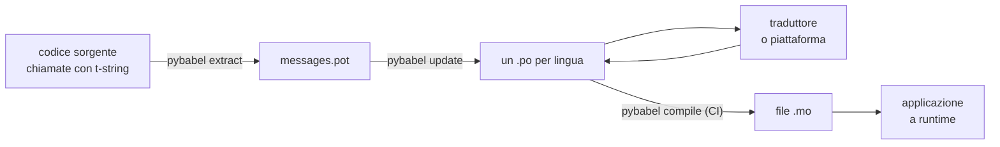

# In produzione

Il [tutorial](tutorial.md) esegue il ciclo una volta, da soli, su un
programma con un messaggio. Su un progetto reale il ciclo continua a girare:
i messaggi cambiano dopo essere stati tradotti, il traduttore lavora altrove
e con i propri tempi, e un catalogo compilato viene distribuito con ogni
release. Questa pagina è quella pratica — che cosa resta nel repository, che
cosa viaggia, che cosa la CI deve controllare e dove il runtime lega una
lingua.

Il totale sono sei controlli, quindi eccoli subito; ciascuna sezione più sotto
ne imposta uno.

- `pybabel update --check` passa — nessun messaggio è cambiato senza che i
  cataloghi ne siano stati informati.
- `pybabel compile` fa dipendere la build dal proprio stato di uscita.
- Le voci `fuzzy` rimaste sono volute — ognuna si rende come testo sorgente
  finché un traduttore non la conferma.
- La suite di test rende ogni lingua distribuita una volta con `strict=True`.
- L'artefatto di produzione contiene i file `.mo` e nessun Babel.
- Il logger `gettext_tstrings` è instradato al monitoraggio.

## La forma di un progetto { #the-shape-of-a-project }

```text
myapp/
├── babel.cfg
├── pyproject.toml
├── src/
│   └── myapp/
└── locales/
    ├── messages.pot
    ├── ja/LC_MESSAGES/messages.po
    └── de/LC_MESSAGES/messages.po
```

Committa `babel.cfg`, il template `.pot` e ogni `.po` — sono le sorgenti
della build di traduzione, e i loro diff sono il modo in cui revisioni i
cambiamenti delle traduzioni. I file `.mo` compilati sono artefatti di build:
producili in CI o al momento del packaging invece di committarli, così un
`.po` e il suo `.mo` non potranno mai essere in disaccordo su ciò che viene
distribuito.

Un file ha un ruolo in ciascuna direzione: il `.pot` porta i tuoi messaggi
*fuori* verso i traduttori, i file `.po` riportano le traduzioni *indietro*.
Il resto di questa pagina è ciò che si muove tra i due.



## Il ciclo dopo la prima traduzione { #the-cycle-after-the-first-translation }

Il `pybabel init` del tutorial normalmente si esegue una volta sola, quando si
aggiunge una lingua. Da lì in poi il ciclo di lavoro è **estrai → aggiorna →
traduci → compila**, e il suo centro è `pybabel update`, che fonde un template
fresco nei cataloghi esistenti senza scartare le traduzioni che già
contengono.

Supponi che il saluto `Hello {name}` — già tradotto come
`こんにちは {name}` — venga riformulato nel codice in `Welcome back, {name}`.
Estrai e aggiorna:

```console
$ pybabel extract -F babel.cfg -c "Translators:" -o locales/messages.pot .
extracting messages from app.py (encoding="utf-8")
writing PO template file to locales/messages.pot
$ pybabel update -i locales/messages.pot -d locales
updating catalog locales/ja/LC_MESSAGES/messages.po based on locales/messages.pot
```

Il catalogo giapponese ora contiene:

```po
#. gettext-tstrings
#: app.py:4
#, fuzzy, python-brace-format
msgid "Welcome back, {name}"
msgstr "こんにちは {name}"
```

Babel ha notato che il nuovo msgid somiglia a uno rimosso e lo ha accoppiato
con la vecchia traduzione — ma ha marcato la coppia **fuzzy**: l'ipotesi di
una macchina in attesa di un umano. Il flag cambia ciò che si compila.
`pybabel compile`
**esclude le voci fuzzy dal `.mo`**, quindi finché un traduttore non conferma
la coppia, l'applicazione rende il nuovo testo inglese anziché un giapponese
ormai stantio:

```console
$ pybabel compile -d locales
compiling catalog locales/ja/LC_MESSAGES/messages.po to locales/ja/LC_MESSAGES/messages.mo
$ python app.py
Welcome back, Ada
```

Un messaggio cambiato degrada quindi nello stesso modo di uno danneggiato —
verso la lingua sorgente, mai verso una traduzione superata. La parte del
traduttore nel ciclo è rivedere il `msgstr` e cancellare il flag `fuzzy`; la
compilazione successiva raccoglie la voce.

!!! note "I nomi dei segnaposto fanno parte dell'identità del messaggio"

    Il msgid è la chiave del catalogo, e il *nome* del segnaposto è al suo
    interno — quindi rinominare una variabile nel codice (`name` →
    `user_name`) cambia il msgid e rimanda la traduzione di ogni lingua nel
    ciclo fuzzy. Dai alle variabili interpolate nomi che un traduttore possa
    capire, e rinominale solo per una ragione.

    La formattazione è l'immagine speculare: `!r` e `:.2f` [non fanno parte
    del msgid](internals.md#from-template-to-msgid), quindi stringere
    `{amount:,.2f}` in `{amount:,.0f}` non cambia nulla in nessun catalogo.
    Riformulare la *frase*, ovviamente, è un cambiamento vero — quello è il
    ciclo qui sopra.

## Che cosa controlla la CI { #what-ci-gates }

Tre fallimenti valgono una build rossa: i cataloghi sono rimasti indietro
rispetto al codice, una traduzione ha rotto un segnaposto, o una voce
danneggiata è arrivata fino al runtime. Un passo per fallimento:

```yaml
- run: pybabel extract -F babel.cfg -c "Translators:" -o locales/messages.pot .
- run: pybabel update -i locales/messages.pot -d locales --check
- run: pybabel compile -d locales
- run: pytest
```

`pybabel update --check` non riscrive nulla ed esce con codice diverso da
zero quando un catalogo non è aggiornato rispetto al template appena
estratto — la protezione contro il merge di codice i cui messaggi nessuno ha
riestratto. `pybabel compile` esegue i controlli sui segnaposto sia di Babel
sia del [checker registrato](extraction.md#your-existing-toolchain-validates-these-catalogs)
di questo pacchetto.

!!! bug "Babel 2.18.0: `--check` non può controllare un catalogo che usa i contesti"

    Su Babel 2.18.0, `pybabel update --check` segnala come non aggiornato
    **ogni** catalogo che contiene un `msgctxt`, a ogni esecuzione, per quanto
    aggiornato sia. Una barriera che fallisce sempre è peggio di nessuna
    barriera, perché una squadra la disattiva — quindi, se usi `pgettext` o
    `npgettext` anche solo una volta, sostituisci questo passo invece di
    conviverci. Leggere il template e ogni catalogo con
    `babel.messages.pofile.read_po` e confrontare
    `{(m.context, m.id) for m in catalog if m.id}` è tutto il controllo, ed è
    ciò che fa [la build di questo sito stesso](index.md). La causa è
    [spiegata in Insidie](pitfalls.md#your-tools-have-bugs-too).

!!! danger "Controlla lo stato di uscita, non il log"

    `pybabel compile` riporta ogni errore di segnaposto, esce con codice
    diverso da zero — **e scrive comunque il `.mo`**. Una pipeline che
    compila e poi copia `locales/` in un'immagine distribuisce il catalogo
    danneggiato, a meno che quell'uscita diversa da zero non la fermi
    davvero. Lasciare che il passo faccia fallire la build, come sopra, è
    l'intera soluzione.

L'ultima riga è la tua normale suite di test, con un'abitudine in più: da
qualche parte al suo interno, rendi almeno un messaggio per ogni lingua
distribuita attraverso un traduttore strict —

```python
import gettext

from gettext_tstrings import Translator


def test_catalogs_render(language: str) -> None:
    translations = gettext.translation("messages", localedir="locales", languages=[language])
    _ = Translator(translations, strict=True)
    name = "Ada"
    assert _(t"Welcome back, {name}")
```

— perché `strict=True` [solleva dove la produzione ripiegherebbe in silenzio](guide.md#what-happens-when-a-catalog-is-wrong),
e un rendering a runtime è l'unico controllo che vede il catalogo esattamente
come lo vedrà l'applicazione, `.mo` incluso.

## Lavorare con traduttori e piattaforme { #working-with-translators-and-platforms }

Il file `.po` è il formato di interscambio di tutto il mondo gettext, ed è la
ragione per cui questa libreria lo riutilizza: affidare la traduzione
significa consegnare un file, che il destinatario sia un collega con un
editor PO o una piattaforma come Weblate o Crowdin. Tre cose fanno funzionare
bene la consegna:

**Di' a che cosa serve il messaggio.** Un commento nel codice viaggia con il
messaggio — è ciò che il flag `-c "Translators:"` raccoglie:

```python
from gettext_tstrings import tr

name = "Ada"
# Translators: shown on the dashboard right after sign-in
print(tr(t"Welcome back, {name}"))
```

```po
#. Translators: shown on the dashboard right after sign-in
#. gettext-tstrings
#: app.py:5
#, python-brace-format
msgid "Welcome back, {name}"
msgstr ""
```

Un traduttore vede quel commento nel suo editor, accanto al messaggio,
dall'altra parte del mondo. È la leva di qualità più economica dell'intero
flusso di lavoro. Per una parola che è omonima di sé stessa — "Open" il
pulsante contro "Open" lo stato — dai al messaggio un
[contesto](guide.md#binding-a-catalog) con `pgettext`, che diventa un
`msgctxt` visibile nel catalogo.

**Lascia che la piattaforma validi i segnaposto.** Ogni messaggio estratto da
una t-string porta il flag `python-brace-format`, e quella singola riga è ciò
che accende la QA sui segnaposto in strumenti che non controlli — Weblate
documenta il controllo, le piattaforme commerciali agganciano il proprio allo
stesso flag e `msgfmt --check-format` lo impone in qualunque pipeline GNU. I
dettagli, e ciò che il checker incluso coglie oltre a essi, sono nella
[pagina sull'estrazione](extraction.md#your-existing-toolchain-validates-these-catalogs).

**Fidati della rete di sicurezza esattamente fin dove arriva.** Qualunque
cosa torni da una piattaforma è pur sempre un dato che entra nella tua build;
i controlli CI qui sopra sono ciò che trasforma "la piattaforma
probabilmente lo ha verificato" in "questo non può essere distribuito rotto".

## Legare una lingua a runtime { #binding-a-language-at-runtime }

Tutto ciò che precede produce cataloghi. La decisione rimanente è dove
l'applicazione ne seleziona uno. Lega una volta per *ambito di una lingua* —
il processo per una CLI, la richiesta per un servizio web.

=== "Un processo, una lingua"

    Uno strumento a riga di comando o un'applicazione desktop legge
    l'ambiente dell'utente una volta, all'avvio. Non passare `languages=`
    lascia che la libreria standard negozi tra `LANGUAGE`, `LC_ALL`,
    `LC_MESSAGES` e `LANG`; `fallback=True` restituisce un catalogo nullo —
    testo sorgente — invece di sollevare un'eccezione quando nessuna di esse
    corrisponde a un catalogo che distribuisci.

    ```python
    import gettext

    from gettext_tstrings import Translator

    _ = Translator(gettext.translation("messages", localedir="locales", fallback=True))

    name = "Ada"
    print(_(t"Welcome back, {name}"))
    ```

=== "Flask"

    Un'applicazione web decide per ogni richiesta. Carica ogni catalogo una
    volta all'import, poi lega quello negoziato al contesto prima che la view
    venga eseguita — [`set_translations`](guide.md#per-request-language) è
    locale al contesto, quindi richieste concorrenti in lingue diverse non
    vedono mai il binding l'una dell'altra.

    ```python
    import gettext

    from flask import Flask, request

    from gettext_tstrings import set_translations, tr

    LANGUAGES = ("en", "ja", "de")
    CATALOGS = {
        language: gettext.translation(
            "messages", localedir="locales", languages=[language], fallback=True
        )
        for language in LANGUAGES
    }

    app = Flask(__name__)


    @app.before_request
    def bind_language() -> None:
        language = request.accept_languages.best_match(LANGUAGES) or "en"
        set_translations(CATALOGS[language])


    @app.get("/")
    def home() -> str:
        name = "Ada"
        return tr(t"Welcome back, {name}")
    ```

=== "Middleware ASGI"

    Sotto i framework async — FastAPI, Starlette e qualunque altra cosa
    ASGI — avvolgi la richiesta in
    [`use_translations`](guide.md#per-request-language): il binding vive in
    una `ContextVar`, che lo scambio di task async preserva per ogni
    richiesta.

    ```python
    import gettext

    from fastapi import FastAPI, Request

    from gettext_tstrings import tr, use_translations

    LANGUAGES = ("en", "ja", "de")
    CATALOGS = {
        language: gettext.translation(
            "messages", localedir="locales", languages=[language], fallback=True
        )
        for language in LANGUAGES
    }

    app = FastAPI()


    @app.middleware("http")
    async def bind_language(request: Request, call_next):
        language = negotiate_language(request.headers.get("accept-language"), LANGUAGES)
        with use_translations(CATALOGS[language]):
            return await call_next(request)
    ```

    `negotiate_language` sta per il tuo parsing di Accept-Language — la
    maggior parte dei framework o dei loro ecosistemi ne fornisce uno; ciò
    che conta qui è il binding attorno a `call_next`.

Due abitudini a runtime completano il quadro. Le stringhe create al momento
dell'import — l'etichetta di un form, il nome visualizzato di un enum — non
devono catturare qualunque lingua fosse attiva durante l'import; definiscile
con [`lazy_gettext`](guide.md#deferred-translation) e verranno rese nella
lingua attiva all'*uso*. E instrada il logger `gettext_tstrings` da qualche
parte dove un umano guardi: i suoi avvisi sono la modalità permissiva che
segnala una traduzione sfuggita a ogni controllo, una riga per messaggio
danneggiato invece di una per rendering.

## Distribuzione { #shipping }

La produzione ha bisogno del pacchetto, dei file `.mo` e di nient'altro.
Babel è una dipendenza di sviluppo e CI — tieni `gettext-tstrings[babel]`
fuori dall'immagine di produzione e installa lì il pacchetto puro; il
rendering gira sulla sola libreria standard. Compila i cataloghi nella stessa
build che produce l'artefatto che distribuisci, così i file `.mo` al suo
interno sono esattamente i file `.po` revisionati, e niente compilato sul
laptop di qualcuno arriva mai in produzione.

Come viaggiano dipende da che cosa distribuisci. Una wheel li trasporta come
dati del pacchetto, il che significa che i cataloghi devono stare *dentro* la
directory del pacchetto — `src/myapp/locales/`, non un `locales/` di primo
livello — e al backend di build va detto di includere file che `.gitignore`
normalmente nasconde:

=== "Hatchling"

    ```toml
    [tool.hatch.build]
    # .mo files are build output, so they are gitignored; name them or the
    # wheel ships without a single translation.
    artifacts = ["src/myapp/locales/**/*.mo"]
    ```

=== "setuptools"

    ```toml
    [tool.setuptools.package-data]
    myapp = ["locales/*/LC_MESSAGES/*.mo"]
    ```

Rileggili attraverso il pacchetto invece che attraverso un percorso relativo
all'albero dei sorgenti, che smette di esistere nel momento in cui la wheel
viene installata:

```python
import gettext
from importlib.resources import as_file, files

with as_file(files("myapp") / "locales") as localedir:
    translations = gettext.translation("messages", localedir=localedir, languages=["ja"])
```

Un'immagine container ha il compito più facile: compila durante lo stage di
build e copia il risultato, lasciando Babel in quello stage.

```dockerfile
FROM python:3.14-slim AS build
COPY . /src
RUN cd /src && python -m pip install ".[babel]" \
    && pybabel compile -d src/myapp/locales

FROM python:3.14-slim
COPY --from=build /src /src
RUN python -m pip install /src   # no [babel]: rendering needs the stdlib only
```


Prima di una release, la checklist a cui questa pagina si riduce:

- `pybabel update --check` passa — nessun messaggio è cambiato senza che i
  cataloghi ne sapessero.
- `pybabel compile` condiziona la build al suo stato di uscita.
- Le voci `fuzzy` rimaste sono intenzionali — ognuna viene resa come testo
  sorgente finché un traduttore non la conferma.
- La suite di test rende ogni lingua distribuita una volta con
  `strict=True`.
- L'artefatto di produzione contiene i file `.mo` e nessun Babel.
- Il logger `gettext_tstrings` è instradato verso il monitoraggio.

## Dove proseguire { #where-next }

- [Estrazione](extraction.md) — il riferimento per la metà strumentale di
  questa pagina: opzioni di mappatura, nomi di funzione personalizzati,
  modalità strict e ogni checker.
- [Guida](guide.md) — la metà runtime: plurali, contesti, stringhe differite
  e le modalità di fallimento in dettaglio.
- [Come funziona](internals.md) — perché il msgid ha l'aspetto che ha, e che
  cosa la validazione verifica davvero.
