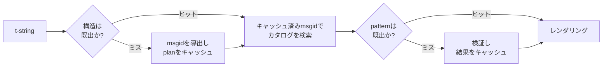

# 動作原理

このページの内容は、ライブラリを使うために必須ではありません。使い方は
[チュートリアル](tutorial.md)と[ガイド](guide.md)で説明しています。このページは
その代わりに、ライブラリを第一原理から組み立て直します。t-stringが実際には
何であるか、msgidがそこからどう導かれるか、翻訳を有効にする条件は何か、そして
実装がその検査すべてのコストを1マイクロ秒の何分の一かに抑える方法です。
興味がある場合、コントリビュートしたい場合、
[この規約を自分で実装する](#reimplementing-it)予定がある場合にお読みください。

## t-stringの正体 { #what-a-t-string-actually-is }

f-stringは`str`を生成し、しかも即座に生成します。関数が受け取る時点で値は
補間済みで、文は固まっています。t-string（[PEP 750]）は同じ構文と、式の同じ
即時評価を持ちますが、生成する型が異なります。

```pycon
>>> name = "Ada"
>>> f"Hello {name}!"
'Hello Ada!'
>>> t"Hello {name}!"
Template(strings=('Hello ', '!'), interpolations=(Interpolation('Ada', 'name', None, ''),))
```

この`Template`オブジェクトは、カタログpipelineが必要とする部品を、分離した
まま保持しています。

```pycon
>>> template = t"Total: {amount:,.2f}"
>>> template.strings
('Total: ', '')
>>> template.interpolations[0].expression
'amount'
>>> template.interpolations[0].value
1234.5
>>> template.interpolations[0].format_spec
',.2f'
```

- `strings` — 補間の周囲にあるリテラルテキスト。ソース順です。
- 各補間について：ソーステキストとしての**式**（`'amount'`）、評価済みの
  **値**（`1234.5`）、そして**変換指定**（`!r`）と**フォーマット指定**
  （`,.2f`）。適用されるのではなく、別々に運ばれます。

このライブラリが行うすべては、この構造の規律ある消費です。i18nが必要とする
唯一の分離 — 静的テキストと値の分離 — は言語がすでに行っています。だから
このライブラリは、あなたのソースコードを解析することも、文の中のどこに値が
あるかを推測することもありません。残るのは3つの決定です。この構造がどう
カタログkeyになるか、そのkeyの翻訳は何を言ってよいか、そして両者がどう
再び合成されるか。

## templateからmsgidへ { #from-template-to-msgid }

msgid — カタログの索引となるkey — は、templateの*静的*な部分だけから導出
されます。`strings`と`interpolations`をソース順に辿り、各リテラル部分の
波括弧をエスケープし（`{`は`{{`になります）、各補間について`{name}`トークンを
1つ出力します。`name`は、前後の空白を取り除いた式のテキストです。
`t"Total: {amount:,.2f}"`からは次のようになります。

```text
strings         ('Total: ', '')
interpolations  expression 'amount'   conversion None   format_spec ',.2f'
msgid           'Total: {amount}'
```

このルールの各部分には理由があります。

- **式は単純な名前でなければなりません** — `str.isidentifier()`が真で、
  Pythonキーワードではないこと。`t"Hello {user.name}"`は呼び出し箇所で拒否
  されます。msgidは*key*です。どの実行でも、どの抽出でも同一でなければ
  ならず、翻訳者が読むものでもあります。だからプレースホルダーは安定した
  意味のある語であるべきで、カタログを式言語へ誘うコード片であっては
  なりません。
- **変換指定とフォーマット指定は決してmsgidに入りません。** 翻訳者が
  `:,.2f`を読まされるべきではなく、どの翻訳もそれを変更できるべきでは
  ありません。知っておく価値のある系があります。コード内の`:,.2f`を
  `:,.0f`へ絞ってもmsgidは1つも変わらないため、どの言語の翻訳も無効に
  なりません。カタログのkeyが追跡するのは*文が何を言っているか*であり、
  値がどう書式化されるかではありません。
- **繰り返される名前は、その書式も厳密に繰り返さなければなりません。**
  `t"{x:.2f} vs {x:.3f}"`は拒否されます。両方の出現が同じ`{x}`トークンへ
  畳まれるため、レンダリングがどちらの書式を使うべきかを、msgidがもはや
  語れなくなるからです。
- **空のmsgidは決して検索されません。** gettextが空のmsgidをカタログ自身の
  メタデータヘッダーに予約しているためです。`t""`は、カタログに触れずに
  `""`としてレンダリングされます。

このページが省略したエッジケースを含む完全なルールは、
[SPEC §2](https://github.com/yhay81/gettext-tstrings/blob/main/SPEC.md)に
あります。

## 翻訳が言ってよいこと { #what-a-translation-may-say }

カタログから返ってきたpatternは、`string.Formatter` — `str.format`が使うのと
同じparser — で解析されます。この文法は発明ではなく、意図的な借用です。
このライブラリが受け付けるpatternは、より広いecosystemがすでに理解している
patternです。その上で、2つの検査が適用されます。

**形：** すべてのfieldは素の`{name}`でなければなりません。変換指定や
フォーマット指定 — 明示的に空の`{name:}`を含む — は拒否され、位置field
（`{0}`、`{}`）や空白で囲まれた名前（`{ name }`）も拒否されます。最後のものは
見かけ以上に重要です。`str.format`もGNUの`msgfmt`も`{ name }`を拒否するため、
ここで受け付ければ、chain内の他のどのツールも検証できないカタログが生まれて
しまいます。

**名前：** patternのプレースホルダー集合が、ソースのそれと比較されます。
単数のメッセージでは、ソースのすべての名前が*必須*であり、それ以外は何も
*許可*されません。複数形のメッセージでは、2つの枝がマージされます。

- **許可** = 両方の枝の名前の和集合
- **必須** = 両方の枝の名前の積集合

したがって`t"One file"` / `t"{n} files"`に対しては、名前`n`はどちらの形の
翻訳でも許可されますが、どちらでも必須ではありません。この非対称性こそが、
対象言語の複数形体系がソース言語と異なることを許します。日本語は両方の枝を、
おそらく`{n}`を使う1つの形で翻訳します。英語より形の多い言語は、英語に`{n}`が
ない形でも`{n}`を必要とするかもしれません。

これは仮定の話ではありません。このサイト自身のchromeカタログは複数形メッセージ
`Built {n} localized page` / `Built {n} localized pages` — 英語の2つの枝 —
を持っており、サイトの各言語版はこの1つのメッセージを、1つの形から6つの形まで
さまざまに翻訳しています。

| カタログ | 形の数 | 翻訳（形の順） |
| --- | --- | --- |
| 日本語 | 1 | `ローカライズ済みページを{n}件ビルドしました` |
| トルコ語 | 2 | `{n} yerelleştirilmiş sayfa oluşturuldu` — 2回、まったく同一：トルコ語の名詞は数詞の後でも単数のままです |
| イタリア語 | 2 | `Generata {n} pagina localizzata` · `Generate {n} pagine localizzate` — 分詞が性と数に一致します |
| ロシア語 | 3 | `Собрана {n} локализованная страница` · `Собраны {n} локализованные страницы` · `Собрано {n} локализованных страниц` |
| ポーランド語 | 3 | `Zbudowano {n} zlokalizowaną stronę` · `Zbudowano {n} zlokalizowane strony` · `Zbudowano {n} zlokalizowanych stron` |
| アラビア語 | 6 | 中でも、ちょうど1件を表す`تم إنشاء صفحة مترجمة واحدة ({n})`と、少数を表す`تم إنشاء {n} صفحات مترجمة` |

各行は、このリポジトリの`i18n/*/LC_MESSAGES/site.po`に実在するエントリであり、
リリースのたびに[多言語ビルド](index.md)で描画されます。さらに、テストが
この表をそれらのカタログに固定しているため、両者が乖離することはありません。

この範囲の内側では、並べ替えと繰り返しは意図的に制約されていません。どちらも
実在する言語で文法的に必要であり、出現回数を制限すれば、安全上の利点なしに
正しい翻訳を拒否することになります。翻訳は依然として何も*評価*できません。
評価経路が存在しないからです。プレースホルダーは、templateの計算済みの値から
名前で検索されるだけで、`eval`、`getattr`、`str.format`自体に渡されることは
決してありません。

## レンダリング { #rendering }

検証済みのpatternをレンダリングするのは、そのchunkを辿る歩みです。各リテラル
部分を出力し、各プレースホルダーについては、補間が捕捉した値に*ソース側*の
変換指定とフォーマット指定を適用します — `format(convert(value,
conversion), format_spec)`。その際、2つの保証が守られます。

- **それぞれの値は、1回のレンダリングにつき最大1回だけ書式化されます。**
  翻訳がプレースホルダーを繰り返す場合でも同様です。繰り返しが変えるのは
  結果が挿入される回数であり、あなたの`__format__`が実行される回数では
  ありません。
- **複数形では、プレースホルダーは自分を定義した枝を読みます。** 両方の枝に
  存在する名前は、*ソース*言語が選択する枝（`n == 1`なら`singular`、それ
  以外は`plural`）が捕捉した値を読みます。枝に固有の名前は常に自分の枝を
  読みます。対象言語の複数形規則によって別の形で使えるようになった場合でも
  同じです。

レンダリング時に検証が失敗した場合、応答はpatternの提供者によって分かれます。
*カタログ*から出てきたpatternは劣化します。警告を1件ログに残してソース
テキストをレンダリングし、壊れたカタログがアプリケーションを停止させないと
いうgettextの契約を守ります（[ガイドが両方のモードを示します](guide.md#what-happens-when-a-catalog-is-wrong)）。
呼び出し側が直接渡したpattern — `CompiledTemplate.render` — は常に例外を
送出します。劣化の*戻り先*となるソーステキストが存在しないからです。lenientさ
はカタログ検索のためにあり、引数のためにはありません。

## 診断も設計の一部 { #diagnostics-are-part-of-the-design }

プレースホルダーのエラーは、多くの場合programmerではなく翻訳者の前に現れ、
しかも問題が目に見えないファイルの中でのことがよくあります。エディタでまさに
その文字が見えている人に`{name} is missing`と言っても行き止まりです。そこで
メッセージは3つのルールで組み立てられます。

- **目に見えない文字**を含む名前 — 入力メソッドが生成したno-break spaceや
  zero-width space — は、その文字をcode pointへ置き換えて、その位置のまま
  表示します：`{<U+00A0>name}`。読者に必要なのは*どこか*を見ることです。
- 文字が**文字体系を混在させる**名前、つまりhomoglyphの場合は、2回表示
  します。1回は読める形で、1回はescapeして。Cyrillicの`а`を含む`{nаme}`は
  印刷上`{name}`と区別できず、escapeした形`(nаme)`だけが両者を見分けられる
  綴りだからです。
- それ以外はすべて**書かれたとおり**に表示します。`{名前}`や`{café}`は
  普通の名前です。escapeすれば、読者は何が意図されたのかを見つけられなく
  なります。

同じ原理で、存在する*ように見える*「欠落した」プレースホルダーは、その不在の
理由まで説明されます。East Asianの入力メソッドによる全角の波括弧、エスケープ
の往復で生じた`{{name}}`の二重化、波括弧の外にある名前。
[ガイドの失敗一覧表](guide.md#reading-a-failure-message)が、これらの
メッセージをそのまま示しています。

## ホットパス { #the-hot-path }

上記のすべては、アプリケーションがレンダリングする翻訳済み文字列1つごとに
起こります。そのため実装は1つの考えを軸に組まれています。**検証は決して
スキップされない。だからキャッシュすべきは検証である。**



キャッシュは3つ、段階ごとに1つです。

- **呼び出し箇所の構造ごとのplan。** templateの`strings` tuple —
  interpreterがすでに構築したオブジェクト — がキャッシュのkeyなので、検索は
  何も割り当てません。ヒット時にも、各補間の式・変換指定・フォーマット指定は
  記録済みのものと比較されます。リテラルテキストは同じでも書式が異なる2つの
  呼び出し箇所（`t"{x:.2f}"`と`t"{x:.3f}"`）が衝突してはならず、その比較が、
  interpreterが無償で渡してくれるkeyを使う対価です。
- **patternごとの判定。** カタログがあるpatternで初めて答えたとき、それは
  解析・検証され、結果 — コンパイル済みのrender plan、または無効という
  記録 — がplan上に保持されます。以降、そのメッセージのレンダリングは
  dictionary検索1回でそこへ到達します。無効なpatternも記憶されます。壊れた
  カタログエントリがレンダリングごとではなく一度だけ警告する理由です。
- **複数形ペアごとのマージ済みplan。** 和集合・積集合を保持し、枝の計算が
  呼び出しごとではなくメッセージごとに1回で済むようにします。

すべてのキャッシュは有界で、補間された*値*を保持するものはありません。静的な
構造とpatternのテキストだけです。
[`benchmarks/runtime.py`](https://github.com/yhay81/gettext-tstrings/blob/main/benchmarks/runtime.py)
による計測結果は、1 fieldのメッセージで、t-string自体の構築を含めておよそ
0.4 µs。何も検査しない素の`gettext(...).format(...)`の約2.5倍です。
[`core.py`](https://github.com/yhay81/gettext-tstrings/blob/main/src/gettext_tstrings/core.py)
冒頭の解説に、この結果の背後にある個々の計測が記録されています。

## 再実装する { #reimplementing-it }

上記のどれも秘伝ではありません。規約は[仕様v1](spec.md)として文書化されており、
その機械可読な[適合性テストスイート](spec.md#conformance)を使えば、抽出器、
IDEのplugin、別言語での実装が、このページで説明したすべての規則に対して自身を
検証できます。この実装自身も自分のテストでこのスイートを実行しており、それが
このページ、仕様、コードが静かに乖離しないことを保っています。

  [PEP 750]: https://peps.python.org/pep-0750/
