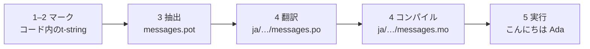

# チュートリアル

このページでは、空のディレクトリから日本語で挨拶するプログラムまでを作ります。
5つのステップで進め、gettextの経験は前提とせず、すべてのコマンドを実際の
出力付きで示します。各ステップで、正しく進んでいるかを確認できます。

Python 3.14以降が必要です。t-stringは3.14で導入された新しい構文だからです。
このページでは例の対象言語として日本語を使いますが、この選択に依存するものは
何もありません。別の言語を使うなら、ステップ4の`ja`を置き換えてください。
そのロケールコードが、日本語を指名する唯一の箇所です。

## 1. インストール { #1-install }

```console
python -m pip install "gettext-tstrings[babel]"
```

`[babel]` extraは[Babel]をインストールします。ステップ3でメッセージを
カタログファイルへ集めるツールです。これは開発時のツールであり、本番コードの
レンダリングは標準ライブラリだけで動きます。

## 2. コード内のメッセージをマークする { #2-mark-a-message-in-your-code }

`app.py`を作成します。

```python
from gettext_tstrings import tr

name = "Ada"
print(tr(t"Hello {name}"))
```

`t"Hello {name}"`はf-stringに見えますが、`t` prefixはテキストと値をその場で
合成せず、分離したまま保持します。この分離があるからこそ、`tr()`は
`Hello {name}`という文全体の翻訳を検索し、その後で値を挿入できます。

今すぐ実行してみましょう。

```console
$ python app.py
Hello Ada
```

翻訳はまだインストールされていないため、ソーステキストがそのまま表示されます。
このライブラリを使うプログラムの実行に、カタログが*必須*になることはありません。
英語（あるいはあなたのソース言語）が組み込みのfallbackです。

## 3. メッセージを抽出する { #3-extract-the-messages }

翻訳者は多くの場合、ソースコードではなくカタログを見て作業します。そのため、
**カタログ**と呼ばれる小さなファイルがあなたと翻訳者の間を行き来します。その
第一歩は、マークされたすべてのメッセージをコードから集めることです。

`babel.cfg`を作成して、Babelにメッセージの探し方を教えます。

```ini
[gettext_tstrings: **.py]
encoding = utf-8
```

次に、templateファイル（`.pot`）へ抽出します。

```console
$ mkdir -p locales
$ pybabel extract -F babel.cfg -c "Translators:" -o locales/messages.pot .
extracting messages from app.py (encoding="utf-8")
writing PO template file to locales/messages.pot
```

`locales/messages.pot`には、メッセージごとに1つのエントリが入ります。

```po
#. gettext-tstrings
#: app.py:4
#, python-brace-format
msgid "Hello {name}"
msgstr ""
```

`msgid`は、コードが検索に使うkeyです。空の`msgstr`は翻訳を書き込む場所ですが、
このファイルには書き込みません。`.pot`は*template*であり、次のステップで
言語ごとにコピーします。

## 4. 翻訳してコンパイルする { #4-translate-and-compile }

templateから日本語カタログを作成します。

```console
$ pybabel init -i locales/messages.pot -d locales -l ja
creating catalog locales/ja/LC_MESSAGES/messages.po based on locales/messages.pot
```

`locales/ja/LC_MESSAGES/messages.po`を開き、`msgstr`を埋めます。

```po
msgid "Hello {name}"
msgstr "こんにちは {name}"
```

`{name}`はそのままにしてください。プレースホルダーは、翻訳された文の中で値が
自分の位置を見つけるための目印であり、翻訳では対象言語が必要とする位置へ自由に
動かせます。実際のプロジェクトでは、この`.po`ファイルを翻訳者へ渡すか、
翻訳プラットフォームへアップロードします。どちらでもフォーマットは同じです。

カタログはテキストとして編集されますが、読み込みはバイナリ形式（`.mo`）なので、
コンパイルします。

```console
$ pybabel compile -d locales
compiling catalog locales/ja/LC_MESSAGES/messages.po to locales/ja/LC_MESSAGES/messages.mo
```

このコマンドは安全網でもあります。翻訳がプレースホルダーを壊していた場合、
たとえば`{name}`が`{nome}`になっていた場合は、通過を拒否します。

```console
$ pybabel compile -d locales
error: locales/ja/LC_MESSAGES/messages.po:24: translation does not match the
source placeholders: {name} is missing; {nome} is not in the source message
1 errors encountered.
```

ここで知っておく価値のある注意が1つあります。エラーを報告して非ゼロで終了
しますが、`.mo`はそれでも書き出されます。実際のプロジェクトでは、その終了
statusを見て止めなければならないのはCIです —
[実運用](workflow.md#what-ci-gates)でその設定を組み立てます。

## 5. 実行する { #5-run-it }

ステップ2〜4で使った`tr()`はカタログを探しに行きますが、見つかりませんでした。
カタログができたので、読み込んで一度だけ束縛します。`Translator`がカタログを
保持するため、呼び出し箇所でカタログを指名する必要はありません。そして`_`は、
その結果に付けるgettextの慣習的な名前です。

`app.py`をコンパイル済みカタログへ向けます。各行が何をしているかは、
マーカーをクリックすると確認できます。

```python
import gettext

from gettext_tstrings import Translator

_ = Translator(gettext.translation("messages", localedir="locales", languages=["ja"]))  # (1)!

name = "Ada"
print(_(t"Hello {name}"))  # (2)!
```

1. 標準ライブラリがコンパイル済みの`.mo`を読み込み、`Translator`がそれを
   呼び出し可能な関数へ束縛します。`_`は「これを翻訳する」を表すgettextの
   慣習的な名前です。ユーザー向けのすべての文字列に付くため、短くなって
   います。`tr`と同じ翻訳を、1つのカタログへ束縛して行います。
2. 呼び出しの時点で：t-stringのテキストが検索key `Hello {name}`になり、
   カタログが`こんにちは {name}`と答え、その答えがソースのプレースホルダーに
   対して検査され、そのあとで初めて値が挿入されます。

```console
$ python app.py
こんにちは Ada
```

これがループの全体であり、1枚の絵として見ておく価値があります。



**マーク → 抽出 → 翻訳 → コンパイル → 実行。** このサイトの他のページは
すべて、この5ステップのいずれかを掘り下げたものです。

## 次に読むページ { #where-next }

- [t-stringを選ぶ理由](comparison.md) — この設計が何から守ってくれるのかを、
  `%(name)s`、`.format()`、`$`文字列と比較します。
- [ガイド](guide.md) — 複数形、リクエストごとの言語、遅延文字列、それでも
  カタログが不正だったときに実行時に何が起こるかを説明します。
- [実運用](workflow.md) — この同じループを、チームが毎週回し続ける形で
  説明します。カタログの更新、CIゲート、翻訳プラットフォーム。
- [抽出](extraction.md) — `pybabel`の完全なリファレンス。独自の関数名、
  CI向けのstrictモード、カタログを守る検証を説明します。
- [移行](migration.md) — 実際にこれを導入したいプロジェクトに、すでにgettext
  カタログがある場合はこちらです。
- [翻訳者向け](translators.md) — その`msgstr`行を埋める人へ、そのまま渡せる
  1ページです。

  [Babel]: https://babel.pocoo.org/
