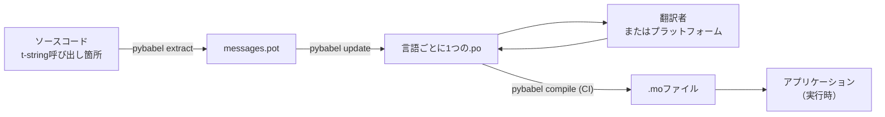

# 実運用

[チュートリアル](tutorial.md)では、メッセージが1つのプログラムを対象に、1人で
ループを一度だけ回しました。実際のプロジェクトではループは回り続けます。
翻訳済みのメッセージが後から変更され、翻訳者は別の場所で自分のスケジュールで
作業し、コンパイル済みカタログはリリースごとに出荷されます。このページは
その実践を説明します。リポジトリに残すもの、行き来するもの、CIが防ぐべきもの、
そしてランタイムが言語を束縛する場所です。

まとめると6つの検査になります。先にその一覧を挙げておきます。以下の各節が、
そのうちの1つずつを組み立てていきます。

- `pybabel update --check`が通る — カタログの知らないメッセージ変更はない。
- `pybabel compile`の終了statusでビルドをゲートしている。
- 残っている`fuzzy`エントリは意図的なもの — 各エントリは翻訳者が確認する
  までソーステキストで表示される。
- テストスイートが、出荷する各言語を`strict=True`で一度レンダリングしている。
- 本番成果物には`.mo`ファイルが含まれ、Babelは含まれない。
- `gettext_tstrings` loggerがmonitoringへルーティングされている。

## プロジェクトの形 { #the-shape-of-a-project }

```text
myapp/
├── babel.cfg
├── pyproject.toml
├── src/
│   └── myapp/
└── locales/
    ├── messages.pot
    ├── ja/LC_MESSAGES/messages.po
    └── de/LC_MESSAGES/messages.po
```

`babel.cfg`、`.pot` template、そしてすべての`.po`をcommitします。これらは
翻訳ビルドのソースであり、そのdiffが翻訳の変更をレビューする手段です。
コンパイル済みの`.mo`ファイルはビルド成果物です。commitせず、CIまたは
パッケージング時に生成してください。そうすれば、`.po`とその`.mo`が出荷内容に
ついて食い違うことはあり得ません。

1つのファイル形式が、それぞれの方向で役割を持ちます。`.pot`はあなたの
メッセージを翻訳者へ*運び出し*、`.po`ファイルは翻訳を*持ち帰り*ます。
このページの残りは、その2つの間を動くものについての説明です。



## 最初の翻訳の後のサイクル { #the-cycle-after-the-first-translation }

チュートリアルの`pybabel init`は通常、言語を追加するときに一度だけ実行します。
それ以降の作業サイクルは**抽出 → 更新 → 翻訳 → コンパイル**であり、その中心は
`pybabel update`です。新しいtemplateを既存のカタログへ折り込みながら、すでに
入っている翻訳を破棄しません。

挨拶`Hello {name}` — すでに`こんにちは {name}`と翻訳済み — が、コード上で
`Welcome back, {name}`へ書き換えられたとします。抽出して更新します。

```console
$ pybabel extract -F babel.cfg -c "Translators:" -o locales/messages.pot .
extracting messages from app.py (encoding="utf-8")
writing PO template file to locales/messages.pot
$ pybabel update -i locales/messages.pot -d locales
updating catalog locales/ja/LC_MESSAGES/messages.po based on locales/messages.pot
```

日本語カタログは次のようになります。

```po
#. gettext-tstrings
#: app.py:4
#, fuzzy, python-brace-format
msgid "Welcome back, {name}"
msgstr "こんにちは {name}"
```

Babelは、新しいmsgidが削除されたmsgidに似ていることに気付き、古い翻訳と
組にしました。ただし、その組に**fuzzy**フラグを付けています。人間の確認を待つ
機械の推測という意味です。このフラグはコンパイルされる内容を変えます。
`pybabel compile`は**fuzzyエントリを`.mo`から除外する**ため、翻訳者が組を
確認するまで、アプリケーションは古い日本語ではなく新しい英語テキストを
表示します。

```console
$ pybabel compile -d locales
compiling catalog locales/ja/LC_MESSAGES/messages.po to locales/ja/LC_MESSAGES/messages.mo
$ python app.py
Welcome back, Ada
```

つまり、変更されたメッセージは壊れたメッセージと同じ形で劣化します。ソース
言語へフォールバックし、決して古い翻訳を表示しません。サイクルにおける翻訳者の
役割は、`msgstr`を修正して`fuzzy`フラグを削除することです。次のコンパイルが
そのエントリを拾います。

!!! note "プレースホルダー名はメッセージの同一性の一部"

    msgidはカタログのkeyであり、プレースホルダーの*名前*はその内側にあります。
    そのため、コード内の変数名の変更（`name` → `user_name`）はmsgidを変え、
    そのメッセージのすべての言語の翻訳をfuzzyサイクルへ送り返します。補間する
    変数には翻訳者が理解できる語を名前として付け、変更するのは理由がある
    ときだけにしてください。

    書式指定はその鏡像です。`!r`や`:.2f`は[msgidに含まれない](internals.md#from-template-to-msgid)
    ため、`{amount:,.2f}`を`{amount:,.0f}`へ絞っても、どのカタログも
    変わりません。もちろん、*文*そのものの書き換えは実際の変更です。それが
    上で説明したサイクルです。

## CIで防ぐこと { #what-ci-gates }

ビルドを赤にする価値のある失敗は3つです。カタログがコードから遅れた、翻訳が
プレースホルダーを壊した、壊れたエントリがランタイムまですり抜けた。失敗ごとに
1ステップを置きます。

```yaml
- run: pybabel extract -F babel.cfg -c "Translators:" -o locales/messages.pot .
- run: pybabel update -i locales/messages.pot -d locales --check
- run: pybabel compile -d locales
- run: pytest
```

`pybabel update --check`は何も書き換えず、抽出したてのtemplateに対して
カタログが古い場合に非ゼロで終了します。誰もメッセージを再抽出していない
コードのmergeを防ぐガードです。`pybabel compile`は、Babelとこのパッケージの
[登録済みchecker](extraction.md#your-existing-toolchain-validates-these-catalogs)
の両方のプレースホルダー検査を実行します。

!!! bug "Babel 2.18.0：`--check`はコンテキストを使うカタログのガードにならない"

    Babel 2.18.0では、`pybabel update --check`は`msgctxt`を含むカタログを
    **すべて**、どれだけ最新であっても、実行のたびに古いと報告します。常に赤い
    ゲートは、ゲートが無いより悪いのです。チームがそれを切ってしまうからです。
    そのため、`pgettext`や`npgettext`を少しでも使うなら、このステップは我慢して
    使うのではなく置き換えてください。templateと各カタログを
    `babel.messages.pofile.read_po`で読み、
    `{(m.context, m.id) for m in catalog if m.id}`を比較する — これが検査の
    すべてであり、[このサイト自身のビルド](index.md)がしていることです。原因は
    [落とし穴のページに詳しく書いてあります](pitfalls.md#your-tools-have-bugs-too)。

!!! danger "ログではなく終了statusを確認する"

    `pybabel compile`は各プレースホルダーエラーを報告し、非ゼロで終了し、
    **それでも`.mo`を書き出します**。コンパイル後に`locales/`をイメージへ
    コピーするpipelineは、非ゼロ終了が実際にそれを止めない限り、壊れた
    カタログを出荷します。上のように、このステップでビルドを失敗させることが
    修正のすべてです。

最後の行は普段のテストスイートですが、習慣を1つ加えます。どこかで、出荷する
言語ごとに少なくとも1つのメッセージを、strictなtranslatorでレンダリングして
ください —

```python
import gettext

from gettext_tstrings import Translator


def test_catalogs_render(language: str) -> None:
    translations = gettext.translation("messages", localedir="locales", languages=[language])
    _ = Translator(translations, strict=True)
    name = "Ada"
    assert _(t"Welcome back, {name}")
```

— `strict=True`は[本番なら黙ってフォールバックする場面で例外を送出し](guide.md#what-happens-when-a-catalog-is-wrong)、
実行時のレンダリングだけが、`.mo`まで含めて、アプリケーションが見るのと
まったく同じ姿でカタログを見る検査だからです。

## 翻訳者・プラットフォームとの協働 { #working-with-translators-and-platforms }

`.po`ファイルはgettextの世界全体の交換フォーマットであり、それこそがこの
ライブラリがこの形式を再利用する理由です。翻訳を引き渡すとはファイルを
引き渡すことであり、相手がPOエディタを使う同僚でも、WeblateやCrowdinのような
プラットフォームでも変わりません。この引き渡しをうまく機能させるのは
3つのことです。

**メッセージの用途を伝える。** コード内のコメントはメッセージと一緒に旅を
します。`-c "Translators:"`フラグが収集するのはそれです。

```python
from gettext_tstrings import tr

name = "Ada"
# Translators: shown on the dashboard right after sign-in
print(tr(t"Welcome back, {name}"))
```

```po
#. Translators: shown on the dashboard right after sign-in
#. gettext-tstrings
#: app.py:5
#, python-brace-format
msgid "Welcome back, {name}"
msgstr ""
```

翻訳者はそのコメントを、地球の反対側で、自分のエディタの中で、メッセージの
すぐ隣に見ます。ワークフロー全体で最も安価な品質向上の手段です。単語自体が
同音異義語になる場合 — ボタンの「Open」と状態の「Open」 — は、`pgettext`で
メッセージに[コンテキスト](guide.md#binding-a-catalog)を与えてください。
カタログでは目に見える`msgctxt`になります。

**プレースホルダー検証はプラットフォームに任せる。** t-stringから抽出された
すべてのメッセージには`python-brace-format`フラグが付き、この1行こそが、
あなたの管理下にないツールでプレースホルダーQAを有効にするスイッチです。
Weblateはこの検査を文書化しており、商用プラットフォームも同じフラグに自らの
検査を紐付け、`msgfmt --check-format`はあらゆるGNU pipelineでそれを強制します。
詳細と、同梱checkerがそれを超えて捕捉する内容は
[抽出のページ](extraction.md#your-existing-toolchain-validates-these-catalogs)に
あります。

**安全網は、その及ぶ範囲までしか信頼しない。** プラットフォームから返って
くるものも、ビルドへ入るデータであることに変わりはありません。上のCIゲート
こそが、「プラットフォームがおそらく検査した」を「壊れたまま出荷されることは
あり得ない」へ変えるものです。

## 実行時に言語を束縛する { #binding-a-language-at-runtime }

ここまでのすべてはカタログを生み出します。残る決定はアプリケーションが
どこでカタログを選択するかです。*言語のスコープ*ごとに一度束縛します。
CLIならプロセス、Webサービスならリクエストです。

=== "1プロセス1言語"

    コマンドラインツールやデスクトップアプリケーションは、起動時に一度だけ
    ユーザーの環境を読みます。`languages=`を渡さなければ、標準ライブラリが
    `LANGUAGE`、`LC_ALL`、`LC_MESSAGES`、`LANG`からネゴシエーションします。
    `fallback=True`は、どれも出荷するカタログに一致しない場合に、例外では
    なくnullカタログ — ソーステキスト — を返します。

    ```python
    import gettext

    from gettext_tstrings import Translator

    _ = Translator(gettext.translation("messages", localedir="locales", fallback=True))

    name = "Ada"
    print(_(t"Welcome back, {name}"))
    ```

=== "Flask"

    Webアプリケーションはリクエストごとに決定します。各カタログをimport時に
    一度読み込み、viewが実行される前に、ネゴシエーションで選ばれたカタログを
    コンテキストへ束縛します。[`set_translations`](guide.md#per-request-language)
    はコンテキストローカルなので、異なる言語の並行リクエストが互いの束縛を
    見ることはありません。

    ```python
    import gettext

    from flask import Flask, request

    from gettext_tstrings import set_translations, tr

    LANGUAGES = ("en", "ja", "de")
    CATALOGS = {
        language: gettext.translation(
            "messages", localedir="locales", languages=[language], fallback=True
        )
        for language in LANGUAGES
    }

    app = Flask(__name__)


    @app.before_request
    def bind_language() -> None:
        language = request.accept_languages.best_match(LANGUAGES) or "en"
        set_translations(CATALOGS[language])


    @app.get("/")
    def home() -> str:
        name = "Ada"
        return tr(t"Welcome back, {name}")
    ```

=== "ASGIミドルウェア"

    非同期framework — FastAPI、Starlette、その他あらゆるASGI — では、
    リクエストを[`use_translations`](guide.md#per-request-language)で包みます。
    束縛は`ContextVar`に置かれ、非同期のタスク切替はそれをリクエストごとに
    保持します。

    ```python
    import gettext

    from fastapi import FastAPI, Request

    from gettext_tstrings import tr, use_translations

    LANGUAGES = ("en", "ja", "de")
    CATALOGS = {
        language: gettext.translation(
            "messages", localedir="locales", languages=[language], fallback=True
        )
        for language in LANGUAGES
    }

    app = FastAPI()


    @app.middleware("http")
    async def bind_language(request: Request, call_next):
        language = negotiate_language(request.headers.get("accept-language"), LANGUAGES)
        with use_translations(CATALOGS[language]):
            return await call_next(request)
    ```

    `negotiate_language`はAccept-Language解析の代役です。多くのframeworkや
    そのecosystemが提供しています。ここで重要なのは、`call_next`を囲む
    束縛です。

ランタイムの習慣を2つ加えれば全体像が完成します。import時に作られる文字列 —
フォームラベルやenumの表示名 — は、import中に有効だった言語を捕捉しては
なりません。[`lazy_gettext`](guide.md#deferred-translation)で定義すれば、
*使用*時に有効な言語でレンダリングされます。そして、`gettext_tstrings`
loggerは人間が目にする場所へルーティングしてください。その警告は、lenient
モードが、すべてのゲートをすり抜けた翻訳を報告するものです。レンダリング
ごとに1行ではなく、壊れたメッセージごとに1行です。

## 出荷 { #shipping }

本番に必要なのはパッケージと`.mo`ファイルだけで、他には何も要りません。
Babelは開発とCIの依存です。`gettext-tstrings[babel]`を本番イメージへ入れず、
そこには素のパッケージをインストールしてください。レンダリングは標準
ライブラリだけで動きます。カタログのコンパイルは、デプロイする成果物を
生成するのと同じビルドで行います。そうすれば、成果物内の`.mo`ファイルは
レビュー済みの`.po`ファイルと厳密に一致し、誰かのラップトップでコンパイル
されたものが出荷されることはありません。

どうやって運ぶかは、何をデプロイするかで決まります。wheelはカタログを
パッケージデータとして運ぶので、カタログはパッケージディレクトリの*内側* —
トップレベルの`locales/`ではなく`src/myapp/locales/`— に置く必要があり、
さらに`.gitignore`が通常は隠すファイルを含めるよう、ビルドバックエンドに
指示しなければなりません。

=== "Hatchling"

    ```toml
    [tool.hatch.build]
    # .mo files are build output, so they are gitignored; name them or the
    # wheel ships without a single translation.
    artifacts = ["src/myapp/locales/**/*.mo"]
    ```

=== "setuptools"

    ```toml
    [tool.setuptools.package-data]
    myapp = ["locales/*/LC_MESSAGES/*.mo"]
    ```

読み込むときは、ソースツリーからの相対パスではなくパッケージ経由にします。
相対パスはwheelがインストールされた瞬間に存在しなくなります。

```python
import gettext
from importlib.resources import as_file, files

with as_file(files("myapp") / "locales") as localedir:
    translations = gettext.translation("messages", localedir=localedir, languages=["ja"])
```

コンテナイメージはもっと簡単です。ビルドステージでコンパイルし、その結果だけを
コピーして、Babelはそのステージに置き去りにします。

```dockerfile
FROM python:3.14-slim AS build
COPY . /src
RUN cd /src && python -m pip install ".[babel]" \
    && pybabel compile -d src/myapp/locales

FROM python:3.14-slim
COPY --from=build /src /src
RUN python -m pip install /src   # no [babel]: rendering needs the stdlib only
```

リリース前に確認する、このページの要約となるチェックリストです。

- `pybabel update --check`が通る — カタログの知らないメッセージ変更はない。
- `pybabel compile`の終了statusでビルドをゲートしている。
- 残っている`fuzzy`エントリは意図的なもの — 各エントリは翻訳者が確認する
  までソーステキストで表示される。
- テストスイートが、出荷する各言語を`strict=True`で一度レンダリングしている。
- 本番成果物には`.mo`ファイルが含まれ、Babelは含まれない。
- `gettext_tstrings` loggerがmonitoringへルーティングされている。

## 次に読むページ { #where-next }

- [抽出](extraction.md) — このページのツール側のリファレンス。mapping
  オプション、独自の関数名、strictモード、すべてのcheckerを説明します。
- [ガイド](guide.md) — ランタイム側。複数形、コンテキスト、遅延文字列、
  失敗モードの詳細を説明します。
- [動作原理](internals.md) — msgidがなぜその形なのか、検証が実際に何を
  検査するのかを説明します。
