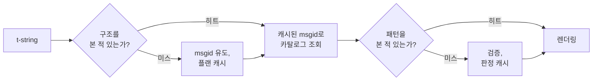

# 동작 원리

이 페이지의 내용은 라이브러리를 사용하는 데 필요하지 않습니다 — 사용법은
[튜토리얼](tutorial.md)과 [가이드](guide.md)가 다룹니다. 이 페이지는
대신 라이브러리를 제1원리에서 다시 쌓아 올립니다. t-string이 실제로
무엇인지, msgid가 어떻게 거기서 떨어져 나오는지, 무엇이 번역을 유효하게
만드는지, 그리고 구현이 그 모든 검사의 비용을 어떻게 1마이크로초의 몇
분의 일로 만드는지. 궁금하다면, 기여하고 싶다면, 또는
[규약을 직접 구현할](#reimplementing-it) 계획이라면 읽어 보세요.

## t-string은 실제로 무엇인가 { #what-a-t-string-actually-is }

f-string은 `str`을 만들고, 즉시 만듭니다 — 어떤 함수가 그것을 받을
때쯤에는 값이 이미 보간되어 문장이 봉인된 상태입니다. t-string([PEP
750])은 같은 문법과 같은 즉시 식 평가를 가지지만, 다른 타입을 만듭니다.

```pycon
>>> name = "Ada"
>>> f"Hello {name}!"
'Hello Ada!'
>>> t"Hello {name}!"
Template(strings=('Hello ', '!'), interpolations=(Interpolation('Ada', 'name', None, ''),))
```

그 `Template` 객체는 카탈로그 파이프라인에 필요한 부분들을 분리된 채로
보존합니다.

```pycon
>>> template = t"Total: {amount:,.2f}"
>>> template.strings
('Total: ', '')
>>> template.interpolations[0].expression
'amount'
>>> template.interpolations[0].value
1234.5
>>> template.interpolations[0].format_spec
',.2f'
```

- `strings` — 보간 주변의 리터럴 텍스트, 순서대로.
- 각 보간마다: 소스 텍스트 그대로의 **식**(`'amount'`), 평가된
  **값**(`1234.5`), 그리고 **변환**(`!r`)과 **포맷 명세**(`,.2f`) —
  적용되는 대신 따로 보관됩니다.

이 라이브러리가 하는 모든 일은 그 구조를 규율 있게 소비하는 것입니다.
i18n에 필요한 단 하나의 분리 — 정적 텍스트와 값의 분리 — 를 언어가 이미
해 두었으므로, 라이브러리는 여러분의 소스 코드를 파싱하지 않고 값이
문장 어디에 있는지 추측하지도 않습니다. 남은 것은 세 가지 결정입니다.
구조가 어떻게 카탈로그 키가 되는가, 그 키의 번역은 무엇을 말할 수
있는가, 그리고 둘이 어떻게 다시 합쳐져 렌더링되는가.

## 템플릿에서 msgid로 { #from-template-to-msgid }

msgid — 카탈로그를 색인하는 키 — 는 템플릿의 *정적* 부분만으로
유도됩니다. `strings`와 `interpolations`를 소스 순서로 걷고, 각 리터럴
조각을 중괄호 이스케이프하고(`{`는 `{{`가 됨), 각 보간마다 `{name}`
토큰 하나를 내놓습니다. 여기서 `name`은 앞뒤 공백을 제거한 식
텍스트입니다. `t"Total: {amount:,.2f}"`에서는 이렇게 됩니다.

```text
strings         ('Total: ', '')
interpolations  expression 'amount'   conversion None   format_spec ',.2f'
msgid           'Total: {amount}'
```

이 규칙의 각 부분에는 이유가 있습니다.

- **식은 단순 이름이어야 합니다** — `str.isidentifier()`가 참이고 Python
  키워드가 아니어야 합니다. `t"Hello {user.name}"`은 호출 지점에서
  거부됩니다. msgid는 *키*입니다. 매 실행과 매 추출에서 동일하게 나와야
  하고 번역자가 읽는 것이므로, 플레이스홀더는 안정적이고 의미 있는
  단어여야 합니다 — 카탈로그를 식 언어로 만들도록 부추기는 코드 조각이
  아니라.
- **변환과 포맷 명세는 msgid에 절대 들어가지 않습니다.** 번역자가
  `:,.2f`를 읽어야 할 이유가 없고, 어떤 번역도 그것을 바꿀 수 없어야
  합니다. 그 따름정리는 알아 둘 가치가 있습니다. 코드에서 `:,.2f`를
  `:,.0f`로 조여도 어떤 msgid도 바뀌지 않으므로, 어느 언어의 번역도
  무효화되지 않습니다. 카탈로그 키는 값이 어떻게 포매팅되는지가 아니라
  *문장이 무엇을 말하는지*를 추적합니다.
- **반복되는 이름은 포매팅도 정확히 반복해야 합니다.**
  `t"{x:.2f} vs {x:.3f}"`는 거부됩니다. 두 등장이 같은 `{x}` 토큰으로
  합쳐지면, 렌더링이 어느 포매팅을 써야 하는지 msgid가 더는 말해 줄 수
  없기 때문입니다.
- **빈 msgid는 결코 조회되지 않습니다.** gettext가 카탈로그 자체의
  메타데이터 헤더용으로 예약해 두었기 때문입니다. `t""`는 카탈로그를
  건드리지 않고 `""`로 렌더링됩니다.

이 페이지가 생략한 경계 사례까지 포함한 전체 규칙은
[SPEC §2](https://github.com/yhay81/gettext-tstrings/blob/main/SPEC.md)에
있습니다.

## 번역이 말할 수 있는 것 { #what-a-translation-may-say }

카탈로그에서 돌아온 패턴은 `string.Formatter` — `str.format`이 쓰는
바로 그 파서 — 로 파싱됩니다. 문법은 발명하는 대신 의도적으로
차용했습니다. 이 라이브러리가 받아들이는 패턴은 더 넓은 생태계가 이미
이해하는 패턴입니다. 그다음 두 가지 검사가 적용됩니다.

**형태:** 모든 필드는 순수한 `{name}`이어야 합니다. 변환이나 포맷 명세
— 명시적으로 비어 있는 `{name:}`까지 — 는 거부되며, 위치 필드(`{0}`,
`{}`)와 공백이 낀 이름(`{ name }`)도 마찬가지입니다. 마지막 항목은
보기보다 중요합니다. `str.format`과 GNU `msgfmt`는 둘 다 `{ name }`을
거부하므로, 여기서 이를 받아들이면 체인의 다른 어떤 도구도 검증할 수
없는 카탈로그가 만들어집니다.

**이름:** 패턴의 플레이스홀더 집합을 원본의 것과 비교합니다. 단수
메시지에서는 원본의 모든 이름이 *필수*이고 그 밖의 것은 아무것도
*허용*되지 않습니다. 복수형 메시지에서는 두 분기가 병합됩니다.

- **허용** = 두 분기 이름의 합집합
- **필수** = 두 분기 이름의 교집합

따라서 `t"One file"` / `t"{n} files"`에 대해 이름 `n`은 어느 형태의
번역에서도 허용되지만 어느 쪽에서도 필수는 아닙니다. 이 비대칭이 대상
언어의 복수형 체계가 원본과 다를 수 있게 합니다 — 일본어는 두 분기를
아마 `{n}`을 쓸 하나의 형태로 번역하고, 영어보다 형태가 많은 언어는
영어에 없는 형태에서 `{n}`이 필요할 수 있습니다.

이 중 어느 것도 가정이 아닙니다. 이 사이트 자체의 공통 UI(chrome)
카탈로그에는 복수형 메시지 `Built {n} localized page` / `Built {n}
localized pages` — 영어의 두 분기 — 가 들어 있고, 사이트의 각 언어판은
이 한 메시지를 적게는 한 형태에서 많게는 여섯 형태까지로 번역합니다.

| 카탈로그 | 형태 수 | 형태 순서대로 나열한 번역 |
| --- | --- | --- |
| 일본어 | 1 | `ローカライズ済みページを{n}件ビルドしました` |
| 터키어 | 2 | `{n} yerelleştirilmiş sayfa oluşturuldu` — 두 번 동일하게: 터키어 명사는 수사 뒤에서 단수형을 유지합니다 |
| 이탈리아어 | 2 | `Generata {n} pagina localizzata` · `Generate {n} pagine localizzate` — 분사가 성과 수에 일치합니다 |
| 러시아어 | 3 | `Собрана {n} локализованная страница` · `Собраны {n} локализованные страницы` · `Собрано {n} локализованных страниц` |
| 폴란드어 | 3 | `Zbudowano {n} zlokalizowaną stronę` · `Zbudowano {n} zlokalizowane strony` · `Zbudowano {n} zlokalizowanych stron` |
| 아랍어 | 6 | 그중 정확히 하나를 뜻하는 `تم إنشاء صفحة مترجمة واحدة ({n})`와 몇 개(소수)를 뜻하는 `تم إنشاء {n} صفحات مترجمة` |

모든 행은 이 저장소의 `i18n/*/LC_MESSAGES/site.po`에 실제로 존재하는
항목으로, 릴리스마다 [다국어 빌드](index.md)가 렌더링합니다 — 그리고
테스트가 이 표를 그 카탈로그들에 고정하므로 둘은 서로 어긋날 수
없습니다.

그 경계 안에서 순서 변경과 반복은 의도적으로 제약하지 않습니다. 둘 다
실제 언어에서 문법적으로 필요하며, 등장 횟수를 제한하는 것은 아무 보안
이득 없이 올바른 번역을 거부할 뿐입니다. 번역은 여전히 아무것도
*평가*할 수 없습니다. 평가 경로 자체가 존재하지 않기 때문입니다 —
플레이스홀더는 템플릿이 이미 계산해 둔 값에서 이름으로 조회될 뿐,
`eval`, `getattr`, `str.format` 자체에 넘겨지지 않습니다.

## 렌더링 { #rendering }

검증된 패턴의 렌더링은 그 조각들을 걷는 일입니다. 각 리터럴 부분을
내놓고, 각 플레이스홀더마다 보간이 캡처해 둔 값을 가져와 *원본 쪽*
변환과 포맷 명세를 적용합니다 — `format(convert(value, conversion),
format_spec)`. 그 과정에서 두 가지 보장이 지켜집니다.

- **각기 다른 값은 렌더링당 최대 한 번만 포매팅됩니다.** 번역이
  플레이스홀더를 반복하더라도요. 반복은 결과가 삽입되는 횟수를 바꾸지,
  여러분의 `__format__`이 실행되는 횟수를 바꾸지 않습니다.
- **복수형에서 플레이스홀더는 자신을 정의한 분기를 읽습니다.** 두
  분기에 모두 있는 이름은 *원본* 언어가 선택하는 분기(`n == 1`이면
  `singular`, 아니면 `plural`)가 캡처한 값을 읽고, 한 분기에만 있는
  이름은 대상 언어의 복수형 규칙이 다른 형태에서 그 이름을 쓸 수 있게
  했더라도 항상 자기 분기를 읽습니다.

렌더링 시점에 검증이 실패하면, 대응은 패턴을 누가 제공했는지에 따라
갈립니다. *카탈로그*에서 나온 패턴은 우아하게 물러납니다. 경고를 하나
로그하고 원본 텍스트를 렌더링하여, 깨진 카탈로그가 애플리케이션을
멈추게 하지 않는다는 gettext의 계약을
지킵니다([가이드가 두 모드를 모두 보여줍니다](guide.md#what-happens-when-a-catalog-is-wrong)).
호출자가 직접 넘긴 패턴 — `CompiledTemplate.render` — 은 항상 예외를
던집니다. 물러날 원본 텍스트가 없기 때문입니다. 관대함은 카탈로그
조회를 위한 것이지 인수를 위한 것이 아닙니다.

## 진단은 설계의 일부 { #diagnostics-are-part-of-the-design }

플레이스홀더 오류는 대개 프로그래머가 아니라 번역자 앞에, 그것도 문제가
눈에 보이지 않는 파일 안에서 나타납니다. 편집기에서 바로 그 글자들이
보이는 사람에게 `{name} is missing`이라고 말하는 것은 막다른 길이므로,
메시지는 세 가지 규칙으로 계산됩니다.

- **보이지 않는 문자** — 입력기가 만들어 낸 no-break space, zero-width
  space — 를 포함한 이름은 그 문자를 코드 포인트로 치환해 제자리에
  표시합니다: `{<U+00A0>name}`. 읽는 사람은 *어디인지* 봐야 합니다.
- 글자가 **문자 체계를 섞는** 이름 — 호모글리프 사례 — 은 두 번
  표시합니다. 한 번은 읽기 좋게, 한 번은 이스케이프해서. 키릴 문자
  `а`가 든 `{nаme}`은 인쇄된 모습으로는 `{name}`과 구별할 수 없고,
  이스케이프된 형태 `(nаme)`만이 둘을 구별해 주기 때문입니다.
- 그 밖의 모든 것은 **쓰인 그대로** 표시합니다. `{名前}`와 `{café}`는
  평범한 이름입니다. 이들을 이스케이프하면 읽는 사람이 무엇을 뜻했는지
  찾을 수 없게 됩니다.

같은 원리로, *있는 것처럼 보이는데* "빠진" 플레이스홀더는 그 부재의
이유를 설명받습니다 — 동아시아 입력기의 전각 중괄호, 이스케이프 왕복이
만든 `{{name}}` 겹침, 중괄호 밖에 놓인 이름.
[가이드의 실패 메시지 표](guide.md#reading-a-failure-message)가 이
메시지들을 그대로 보여줍니다.

## 핫 패스 { #the-hot-path }

위의 모든 일은 애플리케이션이 렌더링하는 번역된 문자열마다 일어나므로,
구현은 한 가지 아이디어를 중심으로 만들어졌습니다. **검증은 결코
생략되지 않으므로, 캐시되어야 하는 것이 바로 검증이다.**



단계마다 하나씩, 세 개의 캐시가 있습니다.

- **호출 지점 구조마다 플랜 하나.** 템플릿의 `strings` 튜플 —
  인터프리터가 이미 만들어 둔 객체 — 이 캐시 키이므로 조회는 아무것도
  할당하지 않습니다. 히트일 때도 각 보간의 식, 변환, 포맷 명세는 기록된
  것과 비교합니다. 리터럴 텍스트는 같지만 포매팅이 다른 두 호출
  지점(`t"{x:.2f}"`와 `t"{x:.3f}"`)이 충돌해서는 안 되며, 그 비교가
  인터프리터가 공짜로 건네주는 키를 쓰는 대가입니다.
- **패턴마다 판정 하나.** 카탈로그가 어떤 패턴으로 처음 응답하면 그
  패턴을 파싱하고 검증합니다. 결과 — 컴파일된 렌더 플랜, 또는 무효라는
  기록 — 는 플랜에 보관됩니다. 이후 그 메시지의 모든 렌더링은 딕셔너리
  조회 한 번으로 거기에 도달합니다. 무효한 패턴도 기억되므로, 깨진
  카탈로그 항목은 렌더링마다가 아니라 한 번만 경고합니다.
- **복수형 쌍마다 병합 플랜 하나.** 합집합/교집합 집합을 보관해 분기
  산술이 호출마다가 아니라 메시지마다 한 번만 일어납니다.

모든 캐시는 크기가 제한되며, 어느 것도 보간된 *값*을 보관하지 않습니다
— 정적 구조와 패턴 텍스트뿐입니다.
[`benchmarks/runtime.py`](https://github.com/yhay81/gettext-tstrings/blob/main/benchmarks/runtime.py)로
측정한 결과는 이렇습니다. 필드 하나짜리 메시지에 t-string 생성 자체를
포함해 약 0.4µs로, 아무것도 검사하지 않는 순수
`gettext(...).format(...)`의 약 2.5배입니다.
[`core.py`](https://github.com/yhay81/gettext-tstrings/blob/main/src/gettext_tstrings/core.py)
상단의 주석이 그 형태 뒤에 있는 개별 측정값을 기록합니다.

## 직접 구현하기 { #reimplementing-it }

위의 어느 것도 비밀 지식이 아닙니다. 규약은 [명세 v1](spec.md)로 적혀
있고, 기계 판독 가능한 [적합성 테스트 모음](spec.md#conformance)을
사용하면 추출기든 IDE 플러그인이든 다른 언어의 구현이든 이 페이지가
설명한 모든 규칙에 대해 스스로를 검사할 수 있습니다. 이 구현도 자체
테스트에서 이 모음을 실행하며, 그것이 이 페이지와 명세와 코드가 소리
없이 어긋나는 것을 막아 줍니다.

  [PEP 750]: https://peps.python.org/pep-0750/
