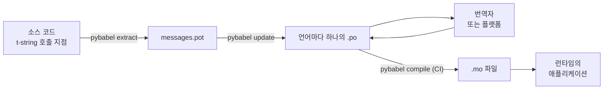

# 프로덕션에서

[튜토리얼](tutorial.md)은 메시지가 하나뿐인 프로그램에서 루프를 혼자 한
번 돌립니다. 실제 프로젝트에서 루프는 계속 돕니다. 이미 번역된 메시지가
바뀌고, 번역자는 다른 곳에서 자신의 일정대로 일하며, 컴파일된 카탈로그는
릴리스마다 함께 배포됩니다. 이 페이지는 그 실무를 다룹니다 — 무엇이
저장소에 남고, 무엇이 오가며, CI가 무엇을 막아야 하고, 런타임이 어디서
언어를 바인딩하는지.

이것을 다 합치면 여섯 가지 검사가 되므로, 먼저 여기에 적어 둡니다. 아래의
각 절이 그중 하나씩을 설정합니다.

- `pybabel update --check`가 통과한다 — 카탈로그가 모르는 사이에 바뀐
  메시지가 없다.
- `pybabel compile`의 종료 상태로 빌드를 막는다.
- 남아 있는 `fuzzy` 항목은 의도한 것이다 — 번역자가 확인할 때까지 각각
  원본 텍스트로 렌더링된다.
- 테스트 스위트가 배포하는 언어마다 한 번씩 `strict=True`로 렌더링한다.
- 프로덕션 산출물에는 `.mo` 파일이 들어 있고 Babel은 들어 있지 않다.
- `gettext_tstrings` 로거가 모니터링으로 연결되어 있다.

## 프로젝트의 형태 { #the-shape-of-a-project }

```text
myapp/
├── babel.cfg
├── pyproject.toml
├── src/
│   └── myapp/
└── locales/
    ├── messages.pot
    ├── ja/LC_MESSAGES/messages.po
    └── de/LC_MESSAGES/messages.po
```

`babel.cfg`, `.pot` 템플릿, 모든 `.po`를 커밋하세요. 이들은 번역 빌드의
소스이며, 그 diff가 번역 변경을 리뷰하는 수단입니다. 컴파일된 `.mo`
파일은 빌드 산출물입니다. 커밋하는 대신 CI나 패키징 시점에 생성하면
`.po`와 그 `.mo`가 배포 내용에 대해 결코 어긋날 수 없습니다.

한 파일씩 서로 반대 방향의 역할을 맡습니다. `.pot`은 여러분의 메시지를
번역자에게 *내보내고*, `.po` 파일은 번역을 *돌려받습니다*. 이 페이지의
나머지는 그 둘 사이를 오가는 것에 대한 이야기입니다.



## 첫 번역 이후의 주기 { #the-cycle-after-the-first-translation }

튜토리얼의 `pybabel init`은 보통 언어를 추가할 때 한 번만 실행합니다. 그 뒤의 작업
주기는 **추출 → 업데이트 → 번역 → 컴파일**이며, 그 중심에는 기존
카탈로그에 이미 들어 있는 번역을 버리지 않고 새 템플릿을 접어 넣는
`pybabel update`가 있습니다.

이미 `こんにちは {name}`으로 번역된 인사말 `Hello {name}`이 코드에서
`Welcome back, {name}`으로 바뀌었다고 합시다. 추출하고 업데이트합니다.

```console
$ pybabel extract -F babel.cfg -c "Translators:" -o locales/messages.pot .
extracting messages from app.py (encoding="utf-8")
writing PO template file to locales/messages.pot
$ pybabel update -i locales/messages.pot -d locales
updating catalog locales/ja/LC_MESSAGES/messages.po based on locales/messages.pot
```

일본어 카탈로그에는 이제 다음이 들어 있습니다.

```po
#. gettext-tstrings
#: app.py:4
#, fuzzy, python-brace-format
msgid "Welcome back, {name}"
msgstr "こんにちは {name}"
```

Babel은 새 msgid가 제거된 msgid와 닮았다는 것을 알아채고 옛 번역과
짝지었지만, 그 짝을 **fuzzy**로 표시했습니다. 사람의 확인을 기다리는
기계의 추측이라는 뜻입니다. 이 플래그는 컴파일되는 내용을 바꿉니다.
`pybabel compile`은 **fuzzy 항목을 `.mo`에서 제외**하므로, 번역자가 짝을
확인할 때까지 애플리케이션은 낡은 일본어 텍스트가 아니라 새 영어
텍스트를 렌더링합니다.

```console
$ pybabel compile -d locales
compiling catalog locales/ja/LC_MESSAGES/messages.po to locales/ja/LC_MESSAGES/messages.mo
$ python app.py
Welcome back, Ada
```

따라서 바뀐 메시지는 깨진 메시지와 같은 방식으로 물러납니다 — 원본
언어로, 결코 낡은 번역으로는 아닙니다. 주기에서 번역자의 몫은 `msgstr`을
고치고 `fuzzy` 플래그를 지우는 것입니다. 다음 컴파일이 그 항목을 다시
집어 듭니다.

!!! note "플레이스홀더 이름은 메시지 정체성의 일부"

    msgid는 카탈로그의 키이고, 플레이스홀더의 *이름*이 그 안에 들어
    있습니다. 따라서 코드에서 변수 이름을 바꾸면(`name` → `user_name`)
    msgid가 바뀌고, 모든 언어에서 그 메시지의 번역이 fuzzy 주기를 다시
    거칩니다. 보간되는 변수는 번역자가 이해할 단어로 이름 짓고, 이유가
    있을 때만 바꾸세요.

    포매팅은 그 거울상입니다. `!r`과 `:.2f`는 [msgid에 포함되지
    않으므로](internals.md#from-template-to-msgid) `{amount:,.2f}`를
    `{amount:,.0f}`로 조여도 어느 카탈로그도 바뀌지 않습니다. 물론
    *문장*을 고쳐 쓰는 것은 진짜 변경입니다 — 그것이 위의 주기입니다.

## CI가 막는 것 { #what-ci-gates }

빌드를 빨갛게 만들 가치가 있는 실패는 셋입니다. 카탈로그가 코드에
뒤처졌거나, 번역이 플레이스홀더를 깨뜨렸거나, 깨진 항목이 런타임까지
흘러들었거나. 실패마다 한 단계씩입니다.

```yaml
- run: pybabel extract -F babel.cfg -c "Translators:" -o locales/messages.pot .
- run: pybabel update -i locales/messages.pot -d locales --check
- run: pybabel compile -d locales
- run: pytest
```

`pybabel update --check`는 아무것도 다시 쓰지 않고, 갓 추출한 템플릿에
비해 카탈로그가 뒤처져 있으면 0이 아닌 코드로 종료합니다 — 아무도 다시
추출하지 않은 메시지를 가진 코드가 병합되는 것을 막는 보호막입니다.
`pybabel compile`은 Babel과 이 패키지의
[등록된 검사기](extraction.md#your-existing-toolchain-validates-these-catalogs)의
플레이스홀더 검사를 모두 실행합니다.

!!! bug "Babel 2.18.0: `--check`는 컨텍스트를 쓰는 카탈로그를 막지 못합니다"

    Babel 2.18.0에서 `pybabel update --check`는 `msgctxt`가 들어 있는
    카탈로그를 얼마나 최신이든 상관없이, 실행할 때마다 **전부** 뒤처졌다고
    보고합니다. 영구히 실패하는 게이트는 게이트가 없는 것보다 나쁩니다.
    팀이 꺼 버리기 때문입니다 — 그러니 `pgettext`나 `npgettext`를 조금이라도
    쓴다면, 이 단계를 안고 가지 말고 대체하세요. 템플릿과 각 카탈로그를
    `babel.messages.pofile.read_po`로 읽어
    `{(m.context, m.id) for m in catalog if m.id}`를 비교하는 것이 검사의
    전부이며, [이 사이트의 자체 빌드](index.md)가 바로 그렇게 합니다. 원인은
    [함정 페이지에 정리](pitfalls.md#your-tools-have-bugs-too)되어 있습니다.

!!! danger "로그가 아니라 종료 상태를 확인하세요"

    `pybabel compile`은 플레이스홀더 오류를 하나씩 보고하고 0이 아닌
    코드로 종료하지만 — **`.mo`는 어쨌든 씁니다**. 컴파일한 다음
    `locales/`를 이미지로 복사하는 파이프라인은 그 0이 아닌 종료가
    실제로 파이프라인을 멈추지 않는 한 깨진 카탈로그를 배포합니다.
    위처럼 이 단계가 빌드를 실패시키게 두는 것이 해결책의 전부입니다.

마지막 줄은 평범한 테스트 스위트에 습관 하나를 더한 것입니다. 그
어딘가에서 배포하는 언어마다 최소 한 메시지를 strict 번역기로
렌더링하세요 —

```python
import gettext

from gettext_tstrings import Translator


def test_catalogs_render(language: str) -> None:
    translations = gettext.translation("messages", localedir="locales", languages=[language])
    _ = Translator(translations, strict=True)
    name = "Ada"
    assert _(t"Welcome back, {name}")
```

— `strict=True`는 [프로덕션이라면 조용히 fallback할 곳에서 예외를
던지고](guide.md#what-happens-when-a-catalog-is-wrong), 런타임 렌더링은
`.mo`까지 포함해 애플리케이션이 볼 그대로 카탈로그를 보는 유일한
검사이기 때문입니다.

## 번역자·플랫폼과 일하기 { #working-with-translators-and-platforms }

`.po` 파일은 gettext 세계 전체의 교환 형식이며, 이 라이브러리가 그것을
재사용하는 이유이기도 합니다. 번역을 넘긴다는 것은 파일 하나를 넘기는
일입니다. 받는 쪽이 PO 편집기를 쓰는 동료든 Weblate나 Crowdin 같은
플랫폼이든 마찬가지입니다. 이 전달이 잘 되게 하는 세 가지가 있습니다.

**메시지의 용도를 말하세요.** 코드에 적은 주석은 메시지와 함께
이동합니다 — `-c "Translators:"` 플래그가 모으는 것이 바로 그것입니다.

```python
from gettext_tstrings import tr

name = "Ada"
# Translators: shown on the dashboard right after sign-in
print(tr(t"Welcome back, {name}"))
```

```po
#. Translators: shown on the dashboard right after sign-in
#. gettext-tstrings
#: app.py:5
#, python-brace-format
msgid "Welcome back, {name}"
msgstr ""
```

번역자는 지구 반대편에서, 자신의 편집기 안 메시지 바로 옆에서 그 주석을
봅니다. 전체 워크플로에서 가장 값싼 품질 지렛대입니다. 동음이의어가 되는
단어 — 버튼의 "Open"과 상태의 "Open" — 에는 `pgettext`로 메시지에
[컨텍스트](guide.md#binding-a-catalog)를 부여하세요. 카탈로그에 눈에
보이는 `msgctxt`가 됩니다.

**플랫폼이 플레이스홀더를 검증하게 하세요.** t-string에서 추출된 모든
메시지는 `python-brace-format` 플래그를 지니며, 그 한 줄이 여러분이
제어하지 않는 도구의 플레이스홀더 QA를 켭니다 — Weblate는 이 검사를
문서화하고, 상용 플랫폼도 같은 플래그에 자체 검사를 걸며,
`msgfmt --check-format`은 어떤 GNU 파이프라인에서든 이를 강제합니다.
세부 사항과 번들 검사기가 그 이상으로 잡아내는 것은
[추출 페이지](extraction.md#your-existing-toolchain-validates-these-catalogs)에
있습니다.

**안전망은 딱 그만큼만 믿으세요.** 플랫폼에서 돌아온 것도 여전히 빌드에
들어오는 데이터입니다. 위의 CI 게이트가 "플랫폼이 아마 검사했을 것"을
"깨진 채로는 배포될 수 없음"으로 바꿔 줍니다.

## 런타임에 언어 바인딩 { #binding-a-language-at-runtime }

지금까지의 모든 것은 카탈로그를 만듭니다. 남은 결정은 애플리케이션이
카탈로그를 어디서 고르느냐입니다. *언어의 스코프*마다 한 번
바인딩하세요 — CLI라면 프로세스, 웹 서비스라면 요청입니다.

=== "프로세스 하나, 언어 하나"

    명령줄 도구나 데스크톱 애플리케이션은 시작할 때 한 번 사용자의
    환경을 읽습니다. `languages=`를 넘기지 않으면 표준 라이브러리가
    `LANGUAGE`, `LC_ALL`, `LC_MESSAGES`, `LANG`에서 협상하며,
    `fallback=True`는 그중 무엇도 배포한 카탈로그와 맞지 않을 때 예외
    대신 null 카탈로그 — 원본 텍스트 — 를 돌려줍니다.

    ```python
    import gettext

    from gettext_tstrings import Translator

    _ = Translator(gettext.translation("messages", localedir="locales", fallback=True))

    name = "Ada"
    print(_(t"Welcome back, {name}"))
    ```

=== "Flask"

    웹 애플리케이션은 요청마다 결정합니다. 각 카탈로그를 import 시점에 한
    번 로드하고, 뷰가 실행되기 전에 협상된 카탈로그를 컨텍스트에
    바인딩하세요 — [`set_translations`](guide.md#per-request-language)는
    컨텍스트 로컬이므로, 서로 다른 언어의 동시 요청이 서로의 바인딩을
    보는 일은 없습니다.

    ```python
    import gettext

    from flask import Flask, request

    from gettext_tstrings import set_translations, tr

    LANGUAGES = ("en", "ja", "de")
    CATALOGS = {
        language: gettext.translation(
            "messages", localedir="locales", languages=[language], fallback=True
        )
        for language in LANGUAGES
    }

    app = Flask(__name__)


    @app.before_request
    def bind_language() -> None:
        language = request.accept_languages.best_match(LANGUAGES) or "en"
        set_translations(CATALOGS[language])


    @app.get("/")
    def home() -> str:
        name = "Ada"
        return tr(t"Welcome back, {name}")
    ```

=== "ASGI 미들웨어"

    비동기 프레임워크 — FastAPI, Starlette, 그 밖의 모든 ASGI — 에서는
    요청을 [`use_translations`](guide.md#per-request-language)로 감싸세요.
    바인딩은 `ContextVar`에 살고, 비동기 태스크 전환이 이를 요청별로
    보존합니다.

    ```python
    import gettext

    from fastapi import FastAPI, Request

    from gettext_tstrings import tr, use_translations

    LANGUAGES = ("en", "ja", "de")
    CATALOGS = {
        language: gettext.translation(
            "messages", localedir="locales", languages=[language], fallback=True
        )
        for language in LANGUAGES
    }

    app = FastAPI()


    @app.middleware("http")
    async def bind_language(request: Request, call_next):
        language = negotiate_language(request.headers.get("accept-language"), LANGUAGES)
        with use_translations(CATALOGS[language]):
            return await call_next(request)
    ```

    `negotiate_language`는 여러분의 Accept-Language 파싱을 대신하는
    자리입니다 — 대부분의 프레임워크나 그 생태계가 하나쯤 제공합니다.
    여기서 중요한 것은 `call_next`를 감싸는 바인딩입니다.

런타임 습관 둘이 그림을 완성합니다. import 시점에 만들어지는 문자열 —
폼 레이블, enum의 표시 이름 — 은 import 중에 활성이던 언어를 캡처해서는
안 됩니다. [`lazy_gettext`](guide.md#deferred-translation)로 정의하면
실제 *사용* 시점에 활성인 언어로 렌더링됩니다. 그리고
`gettext_tstrings` 로거를 사람이 보는 곳으로 라우팅하세요. 그 경고는
모든 게이트를 빠져나간 번역을 관대 모드가 보고하는 것으로, 렌더링마다가
아니라 깨진 메시지마다 한 줄입니다.

## 배포 { #shipping }

프로덕션에 필요한 것은 패키지와 `.mo` 파일, 그뿐입니다. Babel은
개발·CI 의존성입니다 — `gettext-tstrings[babel]`은 프로덕션 이미지에서
빼고 거기에는 순수 패키지만 설치하세요. 렌더링은 표준 라이브러리만으로
동작합니다. 배포할 산출물을 만드는 바로 그 빌드에서 카탈로그를
컴파일하면, 그 안의 `.mo` 파일은 정확히 리뷰된 `.po` 파일이며, 누군가의
노트북에서 컴파일된 것이 배포되는 일은 결코 없습니다.

카탈로그가 어떻게 실려 가는지는 무엇을 배포하느냐에 달려 있습니다.
휠은 카탈로그를 패키지 데이터로 나릅니다. 즉 카탈로그가 패키지 디렉터리
*안에* 있어야 하며 — 최상위 `locales/`가 아니라 `src/myapp/locales/` —
`.gitignore`가 평소에 감추는 파일을 포함하도록 빌드 백엔드에 일러
주어야 합니다.

=== "Hatchling"

    ```toml
    [tool.hatch.build]
    # .mo files are build output, so they are gitignored; name them or the
    # wheel ships without a single translation.
    artifacts = ["src/myapp/locales/**/*.mo"]
    ```

=== "setuptools"

    ```toml
    [tool.setuptools.package-data]
    myapp = ["locales/*/LC_MESSAGES/*.mo"]
    ```

읽어 들일 때는 소스 트리 기준 상대 경로가 아니라 패키지를 통해 읽으세요.
그 경로는 휠이 설치되는 순간 존재하지 않게 됩니다.

```python
import gettext
from importlib.resources import as_file, files

with as_file(files("myapp") / "locales") as localedir:
    translations = gettext.translation("messages", localedir=localedir, languages=["ja"])
```

컨테이너 이미지는 더 쉽습니다. 빌드 스테이지에서 컴파일하고 결과만
복사하여, Babel은 그 스테이지에 남겨 두세요.

```dockerfile
FROM python:3.14-slim AS build
COPY . /src
RUN cd /src && python -m pip install ".[babel]" \
    && pybabel compile -d src/myapp/locales

FROM python:3.14-slim
COPY --from=build /src /src
RUN python -m pip install /src   # no [babel]: rendering needs the stdlib only
```

릴리스 전에, 이 페이지를 요약한 체크리스트입니다.

- `pybabel update --check`가 통과 — 카탈로그 모르게 바뀐 메시지가 없음.
- `pybabel compile`의 종료 상태가 빌드를 게이트함.
- 남은 `fuzzy` 항목은 의도된 것 — 각각은 번역자가 확인할 때까지 원본
  텍스트로 렌더링됨.
- 테스트 스위트가 배포하는 언어마다 한 번씩 `strict=True`로 렌더링함.
- 프로덕션 산출물에는 `.mo` 파일이 있고 Babel은 없음.
- `gettext_tstrings` 로거가 모니터링으로 라우팅됨.

## 다음 단계 { #where-next }

- [추출](extraction.md) — 이 페이지의 도구 절반에 대한 레퍼런스: 매핑
  옵션, 사용자 정의 함수 이름, strict 모드, 모든 검사기.
- [가이드](guide.md) — 런타임 절반: 복수형, 컨텍스트, 지연 문자열,
  그리고 실패 모드의 세부 사항.
- [동작 원리](internals.md) — msgid가 왜 그런 모양인지, 검증이 실제로
  무엇을 검사하는지.
