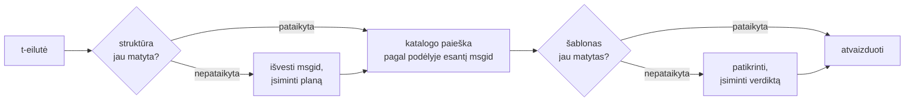

# Kaip tai veikia

Niekas šiame puslapyje nėra būtina bibliotekai naudoti — tam skirti
[pamoka](tutorial.md) ir [vadovas](guide.md). Šis puslapis biblioteką atstato
nuo pirmųjų principų: kas iš tikrųjų yra t-eilutė, kaip iš jos iškrenta msgid,
kas daro vertimą galiojantį ir kaip realizacija pasiekia, kad visas tas
tikrinimas kainuotų mikrosekundės dalis. Skaitykite jį, jei jums smalsu, jei
norite prisidėti arba jei planuojate
[susitarimą įgyvendinti patys](#reimplementing-it).

## Kas iš tikrųjų yra t-eilutė { #what-a-t-string-actually-is }

F-eilutė pagamina `str`, ir pagamina jį iškart — kol funkcija ją gauna,
reikšmė jau interpoliuota, o sakinys užantspauduotas. T-eilutė ([PEP 750]) turi
tą pačią sintaksę ir tokį patį nedelsiamą savo reiškinių apskaičiavimą, bet
pagamina kitą tipą:

```pycon
>>> name = "Ada"
>>> f"Hello {name}!"
'Hello Ada!'
>>> t"Hello {name}!"
Template(strings=('Hello ', '!'), interpolations=(Interpolation('Ada', 'name', None, ''),))
```

Tas `Template` objektas išlaiko atskirtas tas dalis, kurių reikia katalogo
konvejeriui:

```pycon
>>> template = t"Total: {amount:,.2f}"
>>> template.strings
('Total: ', '')
>>> template.interpolations[0].expression
'amount'
>>> template.interpolations[0].value
1234.5
>>> template.interpolations[0].format_spec
',.2f'
```

- `strings` — literalus tekstas aplink interpoliacijas, iš eilės.
- Kiekvienai interpoliacijai: **reiškinys** kaip pirminis tekstas (`'amount'`),
  jo apskaičiuota **reikšmė** (`1234.5`) ir bet kokia **konversija** (`!r`) bei
  **formato specifikacija** (`,.2f`) — nešamos atskirai, o ne pritaikytos.

Viskas, ką ši biblioteka daro, yra drausmingas tos struktūros vartojimas. Kalba
jau padarė tą vienintelį atskyrimą, kurio reikia i18n — statinis tekstas atskirai
nuo reikšmių — todėl biblioteka niekada neanalizuoja jūsų pirminio kodo ir
niekada nespėlioja, kur sakinyje sėdi reikšmė. Lieka trys sprendimai: kaip
struktūra tampa katalogo raktu, ką to rakto vertimui leidžiama pasakyti ir kaip
juodu atvaizduojami atgal drauge.

## Nuo šablono iki msgid { #from-template-to-msgid }

Msgid — raktas, pagal kurį indeksuojamas katalogas — išvedamas tik iš šablono
*statinių* dalių. Pereikite `strings` ir `interpolations` pirminio kodo tvarka;
kiekvieną literalų segmentą ekranuokite skliaustais (`{` tampa `{{`);
kiekvienai interpoliacijai išleiskite po vieną `{name}` leksemą, kur `name` yra
reiškinio tekstas be aplinkinių tarpų. Iš `t"Total: {amount:,.2f}"`:

```text
strings         ('Total: ', '')
interpolations  expression 'amount'   conversion None   format_spec ',.2f'
msgid           'Total: {amount}'
```

Kiekviena tos taisyklės dalis turi savo priežastį:

- **Reiškinys privalo būti paprastas vardas** — `str.isidentifier()` yra
  teisingas ir tai nėra Python raktažodis. `t"Hello {user.name}"` atmetamas
  iškvietimo vietoje. Msgid yra *raktas*: jis privalo išeiti identiškas
  kiekvieną paleidimą ir kiekvieną ištraukimą, o jį skaito vertėjai, todėl
  vietaženklis turi būti stabilus, prasmingas žodis — o ne kodo nuotrupa,
  kviečianti katalogą tapti reiškinių kalba.
- **Konversija ir formato specifikacija į msgid nepatenka niekada.** Vertėjams
  neturėtų tekti skaityti `:,.2f`, ir joks vertimas neturėtų galėti to
  pakeisti. Verta žinoti ir išvadą: `:,.2f` sugriežtinimas iki `:,.0f` jūsų
  kode nepakeičia jokio msgid, tad nepanaikina jokio vertimo jokia kalba.
  Katalogo raktas seka tai, *ką sakinys sako*, o ne kaip reikšmė formatuojama.
- **Pasikartojantis vardas privalo tiksliai pakartoti savo formatavimą.**
  `t"{x:.2f} vs {x:.3f}"` atmetamas, nes abu pasitaikymai suplaukia į tą pačią
  `{x}` leksemą ir msgid nebegalėtų pasakyti, kurį formatavimą turėtų naudoti
  atvaizdavimas.
- **Tuščio msgid niekada neieškoma**, nes gettext jį rezervavo katalogo
  metaduomenų antraštei. `t""` atvaizduojamas kaip `""`, katalogo net
  nepaliečiant.

Visas taisyklių rinkinys, įskaitant kraštinius atvejus, kuriuos šis puslapis
praleidžia, yra
[SPEC §2](https://github.com/yhay81/gettext-tstrings/blob/main/SPEC.md).

## Ką vertimui leidžiama pasakyti { #what-a-translation-may-say }

Iš katalogo grįžtantis šablonas analizuojamas su `string.Formatter` — tuo pačiu
analizatoriumi, kurį naudoja `str.format`. Gramatika tyčia pasiskolinta, o ne
išgalvota: šablonas, kurį ši biblioteka priima, yra toks, kurį platesnė
ekosistema jau supranta. Tada taikomos dvi patikros.

**Forma:** kiekvienas laukas privalo būti plikas `{name}`. Konversija ar
formato specifikacija — įskaitant aiškiai tuščią `{name:}` — atmetama, kaip ir
poziciniai laukai (`{0}`, `{}`) bei tarpais išskirti vardai (`{ name }`).
Paskutinis atvejis svarbesnis, nei atrodo: ir `str.format`, ir GNU `msgfmt`
`{ name }` atmeta, tad priimant jį čia atsirastų katalogai, kurių joks kitas
grandinės įrankis nemokėtų patikrinti.

**Vardai:** šablono vietaženklių aibė lyginama su pirminio pranešimo aibe.
Vienaskaitos pranešimui kiekvienas pirminis vardas yra *privalomas*, o niekas
kita nėra *leidžiama*. Daugiskaitos pranešimui abi šakos sujungiamos:

- **leidžiama** = abiejų šakų vardų sąjunga
- **privaloma** = jų sankirta

Taigi prieš `t"One file"` / `t"{n} files"` vardas `n` yra leidžiamas abiejų
formų vertime, bet neprivalomas nė vienoje. Būtent ta asimetrija leidžia
tikslinės kalbos daugiskaitos sistemai skirtis nuo pirminės — japonų kalba abi
šakas verčia viena forma, kuri tikriausiai naudoja `{n}`; kalbai, turinčiai
daugiau formų nei anglų, `{n}` gali prireikti formoje, kurios anglų kalba
neturi.

Nieko hipotetiško čia nėra: šios svetainės apvalkalo katalogas neša
daugiskaitos pranešimą `Built {n} localized page` / `Built {n} localized pages`
— dvi angliškas šakas — o svetainės leidimai tą vieną pranešimą verčia į nuo
vienos iki šešių formų:

| Katalogas | Formos | Vertimai formų tvarka |
| --- | --- | --- |
| Japonų | 1 | `ローカライズ済みページを{n}件ビルドしました` |
| Turkų | 2 | `{n} yerelleştirilmiş sayfa oluşturuldu` — du kartus, identiškai: turkiški daiktavardžiai po skaitvardžio lieka vienaskaitos |
| Italų | 2 | `Generata {n} pagina localizzata` · `Generate {n} pagine localizzate` — dalyvis derinamas gimine ir skaičiumi |
| Latvių | 3 | `Izveidota {n} lokalizēta lapa` · `Izveidotas {n} lokalizētas lapas` · `Izveidots {n} lokalizētu lapu` — trečioji forma skirta **vien tik nuliui** |
| Rusų | 3 | `Собрана {n} локализованная страница` · `Собраны {n} локализованные страницы` · `Собрано {n} локализованных страниц` |
| Lenkų | 3 | `Zbudowano {n} zlokalizowaną stronę` · `Zbudowano {n} zlokalizowane strony` · `Zbudowano {n} zlokalizowanych stron` |
| Slovėnų | 4 | `Zgrajena {n} lokalizirana stran` · `Zgrajeni {n} lokalizirani strani` · `Zgrajene {n} lokalizirane strani` · `Zgrajenih {n} lokaliziranih strani` — antroji yra **dviskaita**, lygiai dviem |
| Airių | 5 | `Tógadh {n} leathanach logánaithe` · `Tógadh {n} leathanaigh logánaithe` — vienam, dviem, 3–6, 7–10 ir likusiems; kamienas kaitaliojasi, bet *leathanach* prasideda `l`, kurios jokia airiška mutacija nerašo, tad kelios formos sutampa |
| Arabų | 6 | tarp jų `تم إنشاء صفحة مترجمة واحدة ({n})` lygiai vienam ir `تم إنشاء {n} صفحات مترجمة` keliems |

Kiekviena eilutė yra gyvas įrašas šios saugyklos
`i18n/*/LC_MESSAGES/site.po` faile, atvaizduojamas
[daugiakalbio kūrimo](index.md) kiekvieno leidimo metu — o testas šią lentelę
prisega prie tų katalogų, tad juodu negali išsiskirti.

Šiose ribose perstatymas ir kartojimas tyčia neribojami. Abu tikrose kalbose
gramatiškai būtini, o pasitaikymų skaičiaus ribojimas atmestų teisingus
vertimus be jokios saugumo naudos: vertimas vis tiek nieko negali
*apskaičiuoti*, nes apskaičiavimo kelio paprasčiausiai nėra — vietaženkliai
ieškomi pagal vardą tarp šablono jau apskaičiuotų reikšmių, o niekada
neperduodami nei `eval`, nei `getattr`, nei pačiam `str.format`.

## Atvaizdavimas { #rendering }

Patikrinto šablono atvaizdavimas yra pasivaikščiojimas per jo gabalus:
išleisti kiekvieną literalią dalį, o kiekvienam vietaženkliui paimti
interpoliacijos pagautą reikšmę ir pritaikyti *pirminio kodo* konversiją bei
formato specifikaciją — `format(convert(value, conversion), format_spec)`. Tai
darant išlaikomos dvi garantijos:

- **Kiekviena skirtinga reikšmė per vieną atvaizdavimą formatuojama daugiausia
  kartą**, net kai vertimas vietaženklį kartoja. Kartojimas keičia tai, kaip
  dažnai rezultatas įterpiamas, o ne tai, kaip dažnai paleidžiamas jūsų
  `__format__`.
- **Daugiskaitoje vietaženklis skaito tą šaką, kuri jį apibrėžė.** Vardas,
  esantis abiejose šakose, skaito reikšmę, pagautą tos šakos, kurią parenka
  *pirminė* kalba (`singular`, kai `n == 1`, kitu atveju `plural`); šakai
  būdingas vardas visada skaito savo paties šaką — net kai tikslinės kalbos
  daugiskaitos taisyklės padarė jį prieinamą kitoje formoje.

Kai tikrinimas nepavyksta atvaizdavimo metu, atsakas priklauso nuo to, kas
šabloną pateikė. Šablonas, atėjęs iš *katalogo*, nusileidžia: užrašomas vienas
įspėjimas ir atvaizduojamas pirminis tekstas, išlaikant gettext kontraktą, kad
sugadintas katalogas niekada nepargriauna programos
([vadovas parodo abu režimus](guide.md#what-happens-when-a-catalog-is-wrong)).
Šablonas, kurį kviečiantysis perdavė tiesiogiai —
`CompiledTemplate.render` — visada kelia klaidą, nes nėra pirminio teksto,
*nuo* kurio būtų galima nusileisti; nuolaidumas egzistuoja katalogo paieškoms,
o ne argumentams.

## Diagnostika yra sprendimo dalis { #diagnostics-are-part-of-the-design }

Vietaženklio klaida paprastai atsiduria prieš vertėją, o ne prieš
programuotoją, ir dažnai faile, kuriame problema nematoma. Pasakyti
`{name} is missing` tam, kas mato būtent tuos simbolius savo redaktoriuje, yra
aklavietė, todėl pranešimai apskaičiuojami pagal tris taisykles:

- Vardas, turintis **nematomą simbolį** — nedalų tarpą, pagamintą įvesties
  metodo, nulinio pločio tarpą — spausdinamas su tuo simboliu, pakeistu jo kodo
  pozicija, toje pačioje vietoje: `{<U+00A0>name}`. Skaitytojui reikia pamatyti
  *kur*.
- Vardas, kurio raidės **maišo rašto sistemas**, homoglifų atvejis, parodomas
  dukart — kartą skaitomai, kartą su kaitos sekomis — nes `{nаme}` su kirilicos
  `а` atspaude neatskiriamas nuo `{name}`, o ekranuota forma `(nаme)` yra
  vienintelis užrašymas, kuris juos atskiria.
- Visa kita rodoma **taip, kaip parašyta**. `{名前}` ir `{café}` yra įprasti
  vardai; jų ekranavimas paliktų skaitytoją nebegalintį rasti, kas turėta
  omenyje.

Tuo pačiu principu „trūkstamas“ vietaženklis, kuris *atrodo* esantis, gauna
savo nebuvimo paaiškinimą — viso pločio skliaustai iš Rytų Azijos įvesties
metodo, `{{name}}` padvigubinimas po ekranavimo kelionės pirmyn atgal, vardas
už bet kokių skliaustų. [Vadovo klaidų skaitymo
lentelė](guide.md#reading-a-failure-message) parodo kiekvieną iš šių pranešimų
pažodžiui.

## Karštasis kelias { #the-hot-path }

Visa tai, kas aukščiau, nutinka su kiekviena programos atvaizduojama išversta
eilute, todėl realizacija sudėta aplink vieną mintį: **tikrinimas niekada
nepraleidžiamas, todėl kešuoti reikia būtent tikrinimą.**



Trys podėliai, po vieną kiekvienam etapui:

- **Planas kiekvienai iškvietimo vietos struktūrai.** Šablono `strings`
  kortežas — objektas, kurį interpretatorius jau sukūrė — yra podėlio raktas,
  todėl paieška nieko nealokuoja. Pataikius vis tiek palyginama kiekvienos
  interpoliacijos reiškinys, konversija ir formato specifikacija su
  užrašytosiomis: dvi iškvietimo vietos, dalijančiosi literaliu tekstu, bet
  besiskiriančios formatavimu (`t"{x:.2f}"` prieš `t"{x:.3f}"`), negali
  susidurti, o tas palyginimas yra kaina už raktą, kurį interpretatorius atiduoda
  nemokamai.
- **Verdiktas kiekvienam šablonui.** Pirmą kartą, kai katalogas atsako tam
  tikru šablonu, jis išanalizuojamas ir patikrinamas; rezultatas —
  sukompiliuotas atvaizdavimo planas arba negaliojimo įrašas — laikomas prie
  plano. Kiekvienas vėlesnis to pranešimo atvaizdavimas jį pasiekia vienu
  žodyno kreipiniu. Negaliojantys šablonai taip pat įsimenami, todėl sugadintas
  katalogo įrašas įspėja kartą, o ne kiekvieno atvaizdavimo metu.
- **Sujungtas planas kiekvienai daugiskaitos porai**, laikantis sąjungos ir
  sankirtos aibes, kad šakų aritmetika įvyktų kartą kiekvienam pranešimui, o ne
  kartą kiekvienam iškvietimui.

Kiekvienas podėlis yra ribotas, ir nė vienas nesaugo interpoliuotų *reikšmių* —
tik statinę struktūrą ir šablonų tekstą. Rezultatas, išmatuotas
[`benchmarks/runtime.py`](https://github.com/yhay81/gettext-tstrings/blob/main/benchmarks/runtime.py):
maždaug 0,4 µs vieno lauko pranešimui, įskaitant pačios t-eilutės sukūrimą,
apie 2,5 karto daugiau nei paprastas, nieko netikrinantis
`gettext(...).format(...)`. Komentarai
[`core.py`](https://github.com/yhay81/gettext-tstrings/blob/main/src/gettext_tstrings/core.py)
viršuje užrašo pavienius matavimus, iš kurių ta forma susideda.

## Įgyvendinant iš naujo { #reimplementing-it }

Niekas iš to, kas aukščiau, nėra slapta išmintis: susitarimas surašytas kaip
[spec v1](spec.md), o jo mašininiu būdu skaitomas
[atitikties rinkinys](spec.md#conformance) leidžia ištraukikliui, IDE įskiepiui
ar realizacijai kita kalba pačiam pasitikrinti pagal kiekvieną šio puslapio
paaiškintą taisyklę. Ši realizacija tą rinkinį paleidžia savo pačios testuose,
ir būtent tai neleidžia šiam puslapiui, specifikacijai ir kodui tyliai
išsiskirti.

  [PEP 750]: https://peps.python.org/pep-0750/
