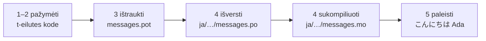

# Pamoka

Šis puslapis veda nuo tuščio katalogo iki programos, kuri pasisveikina
japoniškai. Penki žingsniai, gettext patirties nereikia, ir kiekviena komanda
parodyta su ta išvestimi, kurią ji iš tikrųjų pateikia — kad kiekviename
žingsnyje žinotumėte, ar einate teisingu keliu.

Jums reikia Python 3.14 arba naujesnės versijos, nes t-eilutės yra nauja 3.14
sintaksė. Japonų kalba yra šio puslapio pavyzdinė tikslinė kalba, tačiau niekas
nuo to pasirinkimo nepriklauso. Norėdami naudoti kitą kalbą, 4 žingsnyje
pakeiskite `ja` — tas lokalės kodas yra vienintelis dalykas, kuris ją įvardija.

## 1. Įdiekite { #1-install }

```console
python -m pip install "gettext-tstrings[babel]"
```

Priedas `[babel]` atsineša [Babel] — įrankį, kuris 3 žingsnyje surinks jūsų
pranešimus į katalogo failus. Tai kūrimo meto įrankis: produkcinis kodas
atvaizduoja vien standartine biblioteka.

## 2. Pažymėkite pranešimą savo kode { #2-mark-a-message-in-your-code }

Sukurkite `app.py`:

```python
from gettext_tstrings import tr

name = "Ada"
print(tr(t"Hello {name}"))
```

`t"Hello {name}"` atrodo kaip f-eilutė, bet priešdėlis `t` palieka tekstą ir
reikšmę atskirai, užuot juos vietoje sulieję. Būtent tas atskyrimas ir leidžia
`tr()` ieškoti viso sakinio `Hello {name}` vertimo, o reikšmę įterpti vėliau.

Paleiskite dabar:

```console
$ python app.py
Hello Ada
```

Jokių vertimų dar neįdiegta, todėl pirminis tekstas atvaizduojamas toks, koks
yra. Šią biblioteką naudojanti programa niekada *nereikalauja* katalogo, kad
veiktų — anglų kalba (arba kokia bebūtų jūsų pirminė kalba) yra įgimtas
atsarginis variantas.

## 3. Ištraukite pranešimus { #3-extract-the-messages }

Vertėjai paprastai dirba su katalogais, o ne su pirminiu kodu, tad tarp jūsų ir
jų keliauja nedidelis failas, vadinamas **katalogu**. Pirmas žingsnis link jo —
surinkti iš kodo kiekvieną pažymėtą pranešimą.

Nurodykite Babel, kaip rasti jūsų pranešimus, sukurdami `babel.cfg`:

```ini
[gettext_tstrings: **.py]
encoding = utf-8
```

Tada ištraukite į šablono failą (`.pot`):

```console
$ mkdir -p locales
$ pybabel extract -F babel.cfg -c "Translators:" -o locales/messages.pot .
extracting messages from app.py (encoding="utf-8")
writing PO template file to locales/messages.pot
```

`locales/messages.pot` dabar turi po vieną įrašą kiekvienam pranešimui:

```po
#. gettext-tstrings
#: app.py:4
#, python-brace-format
msgid "Hello {name}"
msgstr ""
```

`msgid` yra raktas, kurio ieškos jūsų kodas. Tuščias `msgstr` yra vieta
vertimui — bet ne šiame faile: `.pot` yra *šablonas*, o kitas žingsnis jį
nukopijuoja po kartą kiekvienai kalbai.

## 4. Išverskite ir sukompiliuokite { #4-translate-and-compile }

Sukurkite japonišką katalogą iš šablono:

```console
$ pybabel init -i locales/messages.pot -d locales -l ja
creating catalog locales/ja/LC_MESSAGES/messages.po based on locales/messages.pot
```

Atverkite `locales/ja/LC_MESSAGES/messages.po` ir užpildykite `msgstr`:

```po
msgid "Hello {name}"
msgstr "こんにちは {name}"
```

Palikite `{name}` lygiai tokį, koks jis yra — vietaženklis yra tas būdas,
kuriuo reikšmė randa savo vietą išverstame sakinyje, o vertimas gali laisvai
perkelti jį ten, kur reikia tikslinei kalbai. Tikrame projekte būtent šį `.po`
failą jūs perduodate vertėjui arba įkeliate į vertimo platformą; formatas abiem
atvejais tas pats.

Katalogai redaguojami kaip tekstas, bet įkeliami dvejetaine forma (`.mo`),
todėl sukompiliuokite:

```console
$ pybabel compile -d locales
compiling catalog locales/ja/LC_MESSAGES/messages.po to locales/ja/LC_MESSAGES/messages.mo
```

Ši komanda taip pat yra apsauginis tinklas. Jei vertimas būtų sugadinęs
vietaženklį — tarkim, `{nome}` vietoj `{name}` — ji atsisakytų jį praleisti:

```console
$ pybabel compile -d locales
error: locales/ja/LC_MESSAGES/messages.po:24: translation does not match the
source placeholders: {name} is missing; {nome} is not in the source message
1 errors encountered.
```

Vieną išlygą verta žinoti jau dabar: klaida pranešama ir išeities kodas
grąžinamas nenulinis, tačiau `.mo` vis tiek įrašomas. Realiame projekte būtent
CI turi sustoti dėl to išeities kodo — [Realioje
aplinkoje](workflow.md#what-ci-gates) tai sutvarko.

## 5. Paleiskite { #5-run-it }

2–4 žingsniuose naudota `tr()`, kuri ieško katalogo ir jo neranda. Dabar, kai
katalogas yra, įkelkite jį ir susiekite vieną kartą: `Translator` laiko
katalogą, tad iškvietimo vietoms jo įvardyti nebereikia, o `_` yra įprastas
gettext pavadinimas rezultatui.

Nukreipkite `app.py` į sukompiliuotą katalogą. Spustelėkite žymeklius, kad
pamatytumėte, ką daro kiekviena eilutė:

```python
import gettext

from gettext_tstrings import Translator

_ = Translator(gettext.translation("messages", localedir="locales", languages=["ja"]))  # (1)!

name = "Ada"
print(_(t"Hello {name}"))  # (2)!
```

1. Standartinė biblioteka įkelia sukompiliuotą `.mo`, o `Translator` susieja jį
   su iškviečiamu objektu. `_` yra įprastas gettext pavadinimas reikšme
   „išversk tai“ — trumpas, nes pasitaiko prie kiekvienos naudotojui matomos
   eilutės. Ji atlieka tą patį vertimą kaip `tr`, tik susieta su vienu katalogu.
2. Iškvietimo metu: t-eilutės tekstas tampa paieškos raktu `Hello {name}`,
   katalogas atsako `こんにちは {name}`, atsakymas patikrinamas pagal pirminius
   vietaženklius, ir tik tada įdedama reikšmė.

```console
$ python app.py
こんにちは Ada
```

Tai ir yra visas ciklas, o jį verta pamatyti kaip vieną paveikslą:



**Pažymėti → ištraukti → išversti → sukompiliuoti → paleisti.** Visa kita šioje
svetainėje yra vieno iš tų penkių žingsnių patikslinimas.

## Kur toliau { #where-next }

- [Kodėl t-eilutės](comparison.md) — nuo ko šis sprendimas jus apsaugo,
  palyginti su `%(name)s`, `.format()` ir `$` eilutėmis.
- [Vadovas](guide.md) — daugiskaita, kalbos pagal užklausą, atidėtos eilutės ir
  tai, kas vis dėlto nutinka veikimo metu, kai katalogas klaidingas.
- [Realioje aplinkoje](workflow.md) — tas pats ciklas taip, kaip jį sukioja
  komanda, savaitė po savaitės: katalogų atnaujinimas, CI vartai ir vertimo
  platformos.
- [Ištraukimas](extraction.md) — pilnas `pybabel` žinynas: savi funkcijų
  vardai, griežtas CI režimas ir patikros, saugančios jūsų katalogus.
- [Migracija](migration.md) — jeigu projektas, kuriame iš tikrųjų norite tai
  daryti, jau turi gettext katalogus.
- [Vertėjams](translators.md) — vienintelis puslapis, kurį verta perduoti tam,
  kas pildo tas `msgstr` eilutes.

  [Babel]: https://babel.pocoo.org/
