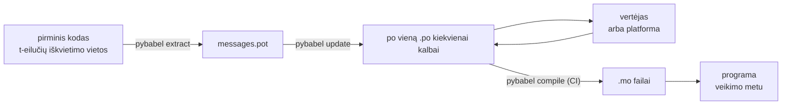

# Realioje aplinkoje

[Pamoka](tutorial.md) ciklą pravaro vieną kartą, vienui vienam, su viena
pranešimą turinčia programa. Tikrame projekte ciklas sukasi be paliovos:
pranešimai keičiasi jau po to, kai buvo išversti, vertėjas dirba kitur ir savo
grafiku, o sukompiliuotas katalogas iškeliauja su kiekvienu leidimu. Šis
puslapis yra ta praktika — kas lieka saugykloje, kas keliauja, ką privalo
tikrinti CI ir kur veikimo metu susiejama kalba.

Susumavus, tai yra šešios patikros, tad štai jos pirmiausia; kiekvienas žemiau
esantis skyrius parengia po vieną iš jų.

- `pybabel update --check` praeina — nė vienas pranešimas nepasikeitė
  katalogams apie tai neišgirdus.
- `pybabel compile` pagal savo išėjimo būseną sustabdo kūrimą.
- Likę `fuzzy` įrašai yra sąmoningi — kiekvienas iš jų atvaizduojamas kaip
  pirminis tekstas, kol vertėjas jo nepatvirtina.
- Testų rinkinys po kartą atvaizduoja kiekvieną siunčiamą kalbą su
  `strict=True`.
- Produkcinis artefaktas turi `.mo` failus ir neturi Babel.
- `gettext_tstrings` žurnalintuvas nukreiptas į stebėseną.

## Projekto forma { #the-shape-of-a-project }

```text
myapp/
├── babel.cfg
├── pyproject.toml
├── src/
│   └── myapp/
└── locales/
    ├── messages.pot
    ├── ja/LC_MESSAGES/messages.po
    └── de/LC_MESSAGES/messages.po
```

Įtraukite į saugyklą `babel.cfg`, `.pot` šabloną ir kiekvieną `.po` — jie yra
vertimo kūrimo šaltiniai, o jų skirtumai yra tai, kaip peržiūrite vertimų
pakeitimus. Sukompiliuoti `.mo` failai yra kūrimo artefaktai: gaminkite juos CI
arba pakavimo metu, o ne dėkite į saugyklą, kad `.po` ir jo `.mo` niekada
negalėtų nesutarti dėl to, kas iškeliauja.

Vienas failas turi vaidmenį kiekviena kryptimi: `.pot` neša jūsų pranešimus
*lauk* vertėjams, `.po` failai neša vertimus *atgal*. Likusi šio puslapio dalis
yra tai, kas juda tarp jų.



## Ciklas po pirmojo vertimo { #the-cycle-after-the-first-translation }

Pamokos `pybabel init` paprastai paleidžiama vieną kartą — kai pridedama kalba.
Nuo tol darbinis ciklas yra **ištraukti → atnaujinti → išversti → sukompiliuoti**, o jo
centre yra `pybabel update`, įpinanti šviežią šabloną į esamus katalogus
neišmetant jau juose esančių vertimų.

Tarkime, pasisveikinimas `Hello {name}` — jau išverstas kaip
`こんにちは {name}` — kode perrašomas į `Welcome back, {name}`. Ištraukiame ir
atnaujiname:

```console
$ pybabel extract -F babel.cfg -c "Translators:" -o locales/messages.pot .
extracting messages from app.py (encoding="utf-8")
writing PO template file to locales/messages.pot
$ pybabel update -i locales/messages.pot -d locales
updating catalog locales/ja/LC_MESSAGES/messages.po based on locales/messages.pot
```

Japoniškame kataloge dabar yra:

```po
#. gettext-tstrings
#: app.py:4
#, fuzzy, python-brace-format
msgid "Welcome back, {name}"
msgstr "こんにちは {name}"
```

Babel pastebėjo, kad naujasis msgid panašus į pašalintą, ir suporavo jį su senu
vertimu — bet porą pažymėjo **fuzzy**: mašinos spėjimu, laukiančiu žmogaus. Ta
žyma keičia tai, kas sukompiliuojama. `pybabel compile` **fuzzy įrašų į `.mo`
neįtraukia**, todėl,
kol vertėjas poros nepatvirtina, programa atvaizduoja naują anglišką tekstą, o
ne pasenusį japonišką:

```console
$ pybabel compile -d locales
compiling catalog locales/ja/LC_MESSAGES/messages.po to locales/ja/LC_MESSAGES/messages.mo
$ python app.py
Welcome back, Ada
```

Vadinasi, pakeistas pranešimas nusileidžia lygiai taip pat kaip sugadintas — iki
pirminės kalbos, niekada iki pasenusio vertimo. Vertėjo dalis šiame cikle yra
pataisyti `msgstr` ir ištrinti `fuzzy` žymą; kitas kompiliavimas įrašą pasiima.

!!! note "Vietaženklių vardai yra pranešimo tapatybės dalis"

    Msgid yra katalogo raktas, o vietaženklio *vardas* yra jo viduje — todėl
    kintamojo pervadinimas kode (`name` → `user_name`) pakeičia msgid ir
    išsiunčia kiekvienos kalbos jo vertimą atgal per fuzzy ciklą. Interpoliuotus
    kintamuosius vadinkite žodžiais, kuriuos vertėjas supras, ir pervadinkite
    juos tik turėdami priežastį.

    Formatavimas yra veidrodinis atvejis: `!r` ir `:.2f` [nėra msgid
    dalis](internals.md#from-template-to-msgid), todėl `{amount:,.2f}`
    sugriežtinimas iki `{amount:,.0f}` jokiame kataloge nieko nekeičia. Žinoma,
    paties *sakinio* perrašymas yra tikras pakeitimas — tai ir yra aukščiau
    aprašytas ciklas.

## Ką tikrina CI { #what-ci-gates }

Trys gedimai verti raudono kūrimo: katalogai atsiliko nuo kodo, vertimas
sulaužė vietaženklį arba sugadintas įrašas prasprūdo iki veikimo aplinkos. Po
vieną žingsnį kiekvienam gedimui:

```yaml
- run: pybabel extract -F babel.cfg -c "Translators:" -o locales/messages.pot .
- run: pybabel update -i locales/messages.pot -d locales --check
- run: pybabel compile -d locales
- run: pytest
```

`pybabel update --check` nieko neperrašo ir baigia darbą su nenuliniu kodu, kai
katalogas atsilikęs nuo ką tik ištraukto šablono — tai apsauga nuo kodo, kurio
pranešimų niekas iš naujo neištraukė, sujungimo. `pybabel compile` paleidžia ir
Babel, ir šio paketo
[užregistruoto tikrintuvo](extraction.md#your-existing-toolchain-validates-these-catalogs)
vietaženklių patikras.

!!! bug "Babel 2.18.0: `--check` negali tikrinti katalogo, naudojančio kontekstus"

    Su Babel 2.18.0 `pybabel update --check` praneša, kad **kiekvienas**
    katalogas, turintis `msgctxt`, yra pasenęs — kiekvieną kartą, kad ir koks
    šviežias jis būtų. Nuolat krintantys vartai yra blogiau nei jokių vartų,
    nes komanda juos išjungia — tad jei apskritai naudojate `pgettext` ar
    `npgettext`, šį žingsnį geriau pakeisti, o ne su juo gyventi. Perskaityti
    šabloną ir kiekvieną katalogą su `babel.messages.pofile.read_po` bei
    palyginti `{(m.context, m.id) for m in catalog if m.id}` yra visa patikra,
    ir būtent tai daro [šios svetainės kūrimas](index.md). Priežastis
    [aprašyta Spąstų puslapyje](pitfalls.md#your-tools-have-bugs-too).

!!! danger "Tikrinkite išėjimo būseną, o ne žurnalą"

    `pybabel compile` praneša apie kiekvieną vietaženklio klaidą, baigia darbą
    su nenuliniu kodu — **ir vis tiek įrašo `.mo`**. Konvejeris, kuris
    sukompiliuoja ir tada nukopijuoja `locales/` į atvaizdį, išsiunčia
    sugadintą katalogą, nebent nenulinė išėjimo būsena jį iš tikrųjų sustabdo.
    Leisti žingsniui sužlugdyti kūrimą, kaip aukščiau, ir yra visas taisymas.

Paskutinė eilutė yra jūsų įprastas testų rinkinys su vienu papildomu įpročiu:
kažkur jame atvaizduokite bent po vieną pranešimą kiekviena išsiunčiama kalba
per griežtą vertėją —

```python
import gettext

from gettext_tstrings import Translator


def test_catalogs_render(language: str) -> None:
    translations = gettext.translation("messages", localedir="locales", languages=[language])
    _ = Translator(translations, strict=True)
    name = "Ada"
    assert _(t"Welcome back, {name}")
```

— nes `strict=True` [kelia klaidą ten, kur produkcija tyliai nusileistų](guide.md#what-happens-when-a-catalog-is-wrong),
o atvaizdavimas veikimo metu yra ta vienintelė patikra, kuri mato katalogą
lygiai taip, kaip jį matys programa — kartu su `.mo` ir viskuo.

## Darbas su vertėjais ir platformomis { #working-with-translators-and-platforms }

`.po` failas yra viso gettext pasaulio mainų formatas, ir būtent todėl ši
biblioteka jį naudoja pakartotinai: perduoti vertimą reiškia perduoti failą,
nesvarbu, ar gavėjas yra kolega su PO redaktoriumi, ar platforma, tokia kaip
Weblate ar Crowdin. Perdavimą gerai veikti verčia trys dalykai:

**Pasakykite, kam pranešimas skirtas.** Komentaras kode keliauja kartu su
pranešimu — būtent jį surenka `-c "Translators:"` vėliavėlė:

```python
from gettext_tstrings import tr

name = "Ada"
# Translators: shown on the dashboard right after sign-in
print(tr(t"Welcome back, {name}"))
```

```po
#. Translators: shown on the dashboard right after sign-in
#. gettext-tstrings
#: app.py:5
#, python-brace-format
msgid "Welcome back, {name}"
msgstr ""
```

Vertėjas tą komentarą mato savo redaktoriuje, šalia pranešimo, kitame pasaulio
gale. Tai pigiausia kokybės svirtis visoje darbo eigoje. Žodžiui, kuris yra
savo paties homonimas — „Open“ mygtukas prieš „Open“ būseną — suteikite
pranešimui [kontekstą](guide.md#binding-a-catalog) su `pgettext`, ir jis
kataloge taps matomu `msgctxt`.

**Leiskite platformai tikrinti vietaženklius.** Kiekvienas iš t-eilutės
ištrauktas pranešimas neša `python-brace-format` žymą, ir būtent ta viena
eilutė įjungia vietaženklių kokybės kontrolę įrankiuose, kurių jūs nevaldote —
Weblate tą patikrą dokumentuoja, komercinės platformos savąsias remia ta pačia
žyma, o `msgfmt --check-format` ją įgyvendina bet kuriame GNU konvejeryje.
Smulkmenos ir tai, ką pridedamas tikrintuvas pagauna be jų, yra
[ištraukimo puslapyje](extraction.md#your-existing-toolchain-validates-these-catalogs).

**Pasitikėkite apsauginiu tinklu lygiai tiek, kiek jis siekia.** Kad ir kas
grįžtų iš platformos, tai vis tiek yra į jūsų kūrimą įeinantys duomenys;
aukščiau aprašyti CI vartai yra tai, kas frazę „platforma tikriausiai tai
patikrino“ paverčia fraze „tai negali iškeliauti sugedę“.

## Kalbos susiejimas veikimo metu { #binding-a-language-at-runtime }

Viskas iki šiol gamina katalogus. Lieka nuspręsti, kur programa vieną iš jų
pasirenka. Susiekite po kartą kiekvienai *kalbos galiojimo sričiai* —
procesui, kai tai komandinės eilutės įrankis, užklausai, kai tai žiniatinklio
paslauga.

=== "Vienas procesas, viena kalba"

    Komandinės eilutės įrankis ar darbalaukio programa naudotojo aplinką
    perskaito vieną kartą, paleidimo metu. Nenurodžius `languages=`,
    standartinė biblioteka derasi pagal `LANGUAGE`, `LC_ALL`, `LC_MESSAGES` ir
    `LANG`; `fallback=True` grąžina tuščią katalogą — pirminį tekstą — užuot
    kėlusi klaidą, kai nė vienas iš jų neatitinka jūsų tiekiamo katalogo.

    ```python
    import gettext

    from gettext_tstrings import Translator

    _ = Translator(gettext.translation("messages", localedir="locales", fallback=True))

    name = "Ada"
    print(_(t"Welcome back, {name}"))
    ```

=== "Flask"

    Žiniatinklio programa sprendžia kiekvienai užklausai. Įkelkite kiekvieną
    katalogą vieną kartą importuojant, o tada prieš vaizdo funkciją susiekite
    išderėtąjį su kontekstu —
    [`set_translations`](guide.md#per-request-language) yra kontekstui vietinė,
    todėl lygiagrečios skirtingų kalbų užklausos niekada nemato viena kitos
    susiejimo.

    ```python
    import gettext

    from flask import Flask, request

    from gettext_tstrings import set_translations, tr

    LANGUAGES = ("en", "ja", "de")
    CATALOGS = {
        language: gettext.translation(
            "messages", localedir="locales", languages=[language], fallback=True
        )
        for language in LANGUAGES
    }

    app = Flask(__name__)


    @app.before_request
    def bind_language() -> None:
        language = request.accept_languages.best_match(LANGUAGES) or "en"
        set_translations(CATALOGS[language])


    @app.get("/")
    def home() -> str:
        name = "Ada"
        return tr(t"Welcome back, {name}")
    ```

=== "ASGI tarpinė programinė įranga"

    Su asinchroniniais karkasais — FastAPI, Starlette ir bet kuo kitu, kas yra
    ASGI — apgaubkite užklausą
    [`use_translations`](guide.md#per-request-language): susiejimas gyvena
    `ContextVar` kintamajame, kurį asinchroninis užduočių perjungimas išlaiko
    kiekvienai užklausai atskirai.

    ```python
    import gettext

    from fastapi import FastAPI, Request

    from gettext_tstrings import tr, use_translations

    LANGUAGES = ("en", "ja", "de")
    CATALOGS = {
        language: gettext.translation(
            "messages", localedir="locales", languages=[language], fallback=True
        )
        for language in LANGUAGES
    }

    app = FastAPI()


    @app.middleware("http")
    async def bind_language(request: Request, call_next):
        language = negotiate_language(request.headers.get("accept-language"), LANGUAGES)
        with use_translations(CATALOGS[language]):
            return await call_next(request)
    ```

    `negotiate_language` čia atstoja jūsų Accept-Language analizę — dauguma
    karkasų ar jų ekosistemų tokią pateikia; čia svarbu susiejimas aplink
    `call_next`.

Paveikslą užbaigia du veikimo meto įpročiai. Eilutės, sukurtos importavimo
metu — formos etiketė, išvardijimo rodomas vardas — neturi pagauti tos kalbos,
kuri buvo aktyvi importuojant; apibrėžkite jas su
[`lazy_gettext`](guide.md#deferred-translation), ir jos bus atvaizduotos ta
kalba, kuri aktyvi *panaudojimo* metu. Ir nukreipkite `gettext_tstrings`
žurnalą ten, kur žmogus žiūri: jo įspėjimai yra nuolaidusis režimas,
pranešantis apie vertimą, prasprūdusį pro visus vartus — po vieną eilutę
sugadintam pranešimui, o ne po vieną kiekvienam atvaizdavimui.

## Išsiuntimas { #shipping }

Produkcijai reikia paketo, `.mo` failų ir nieko daugiau. Babel yra kūrimo ir CI
priklausomybė — laikykite `gettext-tstrings[babel]` už produkcinio atvaizdžio
ribų ir ten diekite plikąjį paketą; atvaizdavimas veikia vien standartine
biblioteka. Kompiliuokite katalogus tame pačiame kūrime, kuris pagamina jūsų
diegiamą artefaktą, kad jame esantys `.mo` failai būtų būtent tie peržiūrėti
`.po` failai ir kad niekas, sukompiliuota kieno nors nešiojamajame, niekada
neiškeliautų.

Kaip jie keliauja, priklauso nuo to, ką diegiate. Wheel neša juos kaip paketo
duomenis, o tai reiškia, kad katalogai turi gyventi *paketo* kataloge —
`src/myapp/locales/`, o ne viršutinio lygio `locales/` — ir kūrimo posistemei
reikia nurodyti įtraukti failus, kuriuos `.gitignore` paprastai slepia:

=== "Hatchling"

    ```toml
    [tool.hatch.build]
    # .mo files are build output, so they are gitignored; name them or the
    # wheel ships without a single translation.
    artifacts = ["src/myapp/locales/**/*.mo"]
    ```

=== "setuptools"

    ```toml
    [tool.setuptools.package-data]
    myapp = ["locales/*/LC_MESSAGES/*.mo"]
    ```

Skaitykite juos atgal per paketą, o ne per kelią, atskaitomą nuo pirminio
medžio, kuris nustoja egzistuoti tą akimirką, kai wheel įdiegiamas:

```python
import gettext
from importlib.resources import as_file, files

with as_file(files("myapp") / "locales") as localedir:
    translations = gettext.translation("messages", localedir=localedir, languages=["ja"])
```

Konteinerio atvaizdžio užduotis lengvesnė: sukompiliuokite kūrimo etape ir
nukopijuokite rezultatą, palikdami Babel tame etape.

```dockerfile
FROM python:3.14-slim AS build
COPY . /src
RUN cd /src && python -m pip install ".[babel]" \
    && pybabel compile -d src/myapp/locales

FROM python:3.14-slim
COPY --from=build /src /src
RUN python -m pip install /src   # no [babel]: rendering needs the stdlib only
```

Prieš leidimą — kontrolinis sąrašas, į kurį susitraukia šis puslapis:

- `pybabel update --check` praeina — nė vienas pranešimas nepasikeitė be to,
  kad katalogai apie tai išgirstų.
- `pybabel compile` tikrina kūrimą pagal savo išėjimo būseną.
- Likę `fuzzy` įrašai yra sąmoningi — kiekvienas atvaizduojamas kaip pirminis
  tekstas, kol vertėjas jį patvirtins.
- Testų rinkinys kiekvieną išsiunčiamą kalbą po kartą atvaizduoja su
  `strict=True`.
- Produkciniame artefakte yra `.mo` failai ir nėra Babel.
- `gettext_tstrings` žurnalas nukreiptas į stebėseną.

## Kur toliau { #where-next }

- [Ištraukimas](extraction.md) — šio puslapio įrankių pusės žinynas: atvaizdžio
  parinktys, savi funkcijų vardai, griežtas režimas ir kiekvienas tikrintuvas.
- [Vadovas](guide.md) — veikimo meto pusė: daugiskaita, kontekstai, atidėtos
  eilutės ir gedimų atvejai smulkiai.
- [Kaip tai veikia](internals.md) — kodėl msgid atrodo būtent taip ir ką
  tikrinimas iš tikrųjų tikrina.
