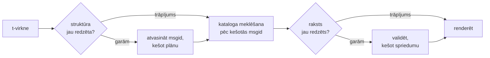

# Kā tas darbojas

Nekas šajā lapā nav vajadzīgs, lai bibliotēku lietotu — to sedz
[pamācība](tutorial.md) un [ceļvedis](guide.md). Šī lapa tā vietā pārbūvē
bibliotēku no pamatprincipiem: kas t-virkne patiesībā ir, kā no tās izkrīt
msgid, kas tulkojumu padara derīgu un kā implementācija panāk, ka visa šī
pārbaudīšana maksā mikrosekundes desmitdaļas. Lasiet to, ja jums ir zinātkāre,
ja vēlaties dot ieguldījumu vai ja plānojat
[implementēt konvenciju paši](#reimplementing-it).

## Kas t-virkne patiesībā ir { #what-a-t-string-actually-is }

F-virkne rada `str`, un rada to nekavējoties — brīdī, kad to saņem jebkura
funkcija, vērtība jau ir interpolēta un teikums ir aizzīmogots. T-virknei
([PEP 750]) ir tā pati sintakse un tāda pati nekavējoša izteiksmju izvērtēšana,
bet tā rada citu tipu:

```pycon
>>> name = "Ada"
>>> f"Hello {name}!"
'Hello Ada!'
>>> t"Hello {name}!"
Template(strings=('Hello ', '!'), interpolations=(Interpolation('Ada', 'name', None, ''),))
```

Šis `Template` objekts patur kataloga konveijeram vajadzīgās daļas, joprojām
nodalītas:

```pycon
>>> template = t"Total: {amount:,.2f}"
>>> template.strings
('Total: ', '')
>>> template.interpolations[0].expression
'amount'
>>> template.interpolations[0].value
1234.5
>>> template.interpolations[0].format_spec
',.2f'
```

- `strings` — literālais teksts ap interpolācijām, secībā.
- Katrai interpolācijai: **izteiksme** kā avota teksts (`'amount'`), tās
  izvērtētā **vērtība** (`1234.5`) un jebkura **konversija** (`!r`) un
  **formāta specifikācija** (`,.2f`) — nesta atsevišķi, nevis pielietota.

Viss, ko šī bibliotēka dara, ir disciplinēta šīs struktūras patērēšana. Valoda
jau ir izdarījusi to vienīgo nodalījumu, kas i18n vajadzīgs — statiskais teksts
atsevišķi no vērtībām —, tāpēc bibliotēka nekad neparsē jūsu pirmkodu un nekad
nemin, kur teikumā atrodas vērtība. Paliek trīs lēmumi: kā struktūra kļūst par
kataloga atslēgu, ko šīs atslēgas tulkojums drīkst teikt un kā abi renderējas
atpakaļ kopā.

## No šablona līdz msgid { #from-template-to-msgid }

Msgid — atslēga, pēc kuras katalogs ir indeksēts — tiek atvasināta tikai no
šablona *statiskajām* daļām. Izejiet cauri `strings` un `interpolations` avota
secībā; katrā literālajā segmentā atsoļojiet figūriekavas (`{` kļūst par `{{`);
katrai interpolācijai izdodiet vienu `{name}` tokenu, kur `name` ir izteiksmes
teksts ar nogrieztām apkārtējām atstarpēm. No `t"Total: {amount:,.2f}"`:

```text
strings         ('Total: ', '')
interpolations  expression 'amount'   conversion None   format_spec ',.2f'
msgid           'Total: {amount}'
```

Katrai šī likuma daļai ir savs iemesls:

- **Izteiksmei jābūt kailam nosaukumam** — `str.isidentifier()` ir patiess, un
  tas nav Python atslēgvārds. `t"Hello {user.name}"` tiek noraidīts izsaukuma
  vietā. Msgid ir *atslēga*: tai jāiznāk identiskai katrā izpildē un katrā
  ekstrakcijā, un to lasa tulkotāji, tāpēc vietturim jābūt stabilam,
  jēgpilnam vārdam — nevis koda fragmentam, kas aicina katalogu kļūt par
  izteiksmju valodu.
- **Konversija un formāta specifikācija nekad nenonāk msgid.** Tulkotājiem
  nevajadzētu lasīt `:,.2f`, un nevienam tulkojumam nevajadzētu spēt to
  mainīt. Ir vērts zināt secinājumu: `:,.2f` savilkšana par `:,.0f` jūsu kodā
  nemaina nevienu msgid, tāpēc tā neanulē nevienu tulkojumu nevienā valodā.
  Kataloga atslēga izseko *to, ko teikums saka*, nevis to, kā vērtība tiek
  formatēta.
- **Atkārtotam nosaukumam jāatkārto arī savs formatējums precīzi.**
  `t"{x:.2f} vs {x:.3f}"` tiek noraidīts, jo abi parādīšanās gadījumi
  sabrūk vienā un tajā pašā `{x}` tokenā un msgid vairs nespētu pateikt, kurš
  formatējums renderēšanā jālieto.
- **Tukša msgid nekad netiek meklēta**, jo gettext to rezervē paša kataloga
  metadatu galvenei. `t""` renderējas kā `""`, katalogam nemaz nepieskaroties.

Pilns likumu kopums, ieskaitot robežgadījumus, ko šī lapa izlaiž, ir
[SPEC §2](https://github.com/yhay81/gettext-tstrings/blob/main/SPEC.md).

## Ko tulkojums drīkst teikt { #what-a-translation-may-say }

Raksts, kas atnāk no kataloga, tiek parsēts ar `string.Formatter` — to pašu
parsētāju, ko lieto `str.format`. Gramatika ir apzināti aizgūta, nevis
izgudrota: rakstu, ko šī bibliotēka pieņem, plašākā ekosistēma jau saprot. Tad
tiek piemērotas divas pārbaudes.

**Forma:** katram laukam jābūt kailam `{name}`. Konversija vai formāta
specifikācija — arī skaidri tukšā `{name:}` — tiek noraidīta, tāpat kā
pozicionāli lauki (`{0}`, `{}`) un ar atstarpēm papildināti nosaukumi
(`{ name }`). Pēdējais ir svarīgāks, nekā izskatās: gan `str.format`, gan GNU
`msgfmt` noraida `{ name }`, tāpēc tā pieņemšana šeit radītu katalogus, ko
neviens cits ķēdes rīks nespēj validēt.

**Nosaukumi:** raksta vietturu kopa tiek salīdzināta ar avota kopu.
Vienskaitļa ziņojumam katrs avota nosaukums ir *obligāts*, un nekas cits nav
*atļauts*. Daudzskaitļa ziņojumam abi zari tiek sapludināti:

- **atļauts** = abu zaru nosaukumu apvienojums
- **obligāts** = to šķēlums

Tātad pret `t"One file"` / `t"{n} files"` nosaukums `n` ir atļauts jebkuras
formas tulkojumā, bet nav obligāts nevienā. Tieši šī asimetrija ļauj mērķa
valodas daudzskaitļa sistēmai atšķirties no avota valodas sistēmas — japāņu
valoda tulko abus zarus ar vienu formu, kurā, visticamāk, ir `{n}`; valodai ar
vairāk formām nekā angļu valodā `{n}` var būt vajadzīgs formā, kurai angļu
valodā nav nekādas.

Nekas no tā nav hipotētisks: šīs vietnes pašas apdares katalogs nes
daudzskaitļa ziņojumu `Built {n} localized page` / `Built {n} localized pages`
— divus angļu zarus —, un vietnes izdevumi tulko šo vienu ziņojumu jebkurā
skaitā formu no vienas līdz sešām.

??? example "Deviņi no šiem izdevumiem formu secībā"

    | Katalogs | Formas | Tulkojumi formu secībā |
    | --- | --- | --- |
    | Japāņu | 1 | `ローカライズ済みページを{n}件ビルドしました` |
    | Turku | 2 | `{n} yerelleştirilmiş sayfa oluşturuldu` — divreiz, identiski: turku valodā lietvārds aiz skaitļa vārda paliek vienskaitlī |
    | Itāļu | 2 | `Generata {n} pagina localizzata` · `Generate {n} pagine localizzate` — divdabis saskaņojas dzimtē un skaitlī |
    | Latviešu | 3 | `Izveidota {n} lokalizēta lapa` · `Izveidotas {n} lokalizētas lapas` · `Izveidots {n} lokalizētu lapu` — trešā forma ir paredzēta **tikai nullei** |
    | Krievu | 3 | `Собрана {n} локализованная страница` · `Собраны {n} локализованные страницы` · `Собрано {n} локализованных страниц` |
    | Poļu | 3 | `Zbudowano {n} zlokalizowaną stronę` · `Zbudowano {n} zlokalizowane strony` · `Zbudowano {n} zlokalizowanych stron` |
    | Slovēņu | 4 | `Zgrajena {n} lokalizirana stran` · `Zgrajeni {n} lokalizirani strani` · `Zgrajene {n} lokalizirane strani` · `Zgrajenih {n} lokaliziranih strani` — otrā ir **duālis**, tieši diviem |
    | Īru | 5 | `Tógadh {n} leathanach logánaithe` · `Tógadh {n} leathanaigh logánaithe` — vienam, diviem, 3–6, 7–10 un pārējiem; celms mijas, bet *leathanach* sākas ar `l`, uz kura neviena īru mutācija netiek rakstīta, tāpēc vairākas formas sakrīt |
    | Arābu | 6 | starp tām `تم إنشاء صفحة مترجمة واحدة ({n})` tieši vienai un `تم إنشاء {n} صفحات مترجمة` dažām |

    Katra rinda ir dzīvs ieraksts šī repozitorija failos
    `i18n/*/LC_MESSAGES/site.po`, ko [daudzvalodu būvējums](index.md) renderē pie
    katra laidiena — un tests piesprauž šo tabulu tiem katalogiem, tāpēc abi nevar
    aizvirzīties viens no otra.

Šajās robežās pārkārtošana un atkārtošana ir apzināti neierobežota. Abas īstās
valodās ir gramatiski nepieciešamas, un parādīšanās reižu skaita ierobežošana
noraidītu pareizus tulkojumus bez jebkāda drošības ieguvuma: tulkojums
joprojām nespēj neko *izvērtēt*, jo izvērtēšanas ceļa nav — vietturi tiek
meklēti pēc nosaukuma šablona jau aprēķinātajās vērtībās un nekad netiek
padoti ne `eval`, ne `getattr`, ne pašam `str.format`.

## Renderēšana { #rendering }

Validēta raksta renderēšana ir gājiens pa tā gabaliem: izdot katru literālo
daļu un katram vietturim paņemt interpolācijas notverto vērtību un piemērot
*avota puses* konversiju un formāta specifikāciju — `format(convert(value,
conversion), format_spec)`. To darot, tiek ievērotas divas garantijas:

- **Katra atšķirīgā vērtība vienā renderēšanā tiek formatēta ne vairāk kā
  vienu reizi**, pat ja tulkojums vietturi atkārto. Atkārtošana maina to, cik
  bieži rezultāts tiek ielikts, nevis to, cik bieži izpildās jūsu
  `__format__`.
- **Daudzskaitļos vietturis lasa to zaru, kas to definēja.** Nosaukums, kas ir
  abos zaros, lasa vērtību, ko notvēris zars, kuru izvēlas *avota* valoda
  (`singular`, kad `n == 1`, citādi `plural`); zaram specifisks nosaukums
  vienmēr lasa savu zaru, pat ja mērķa valodas daudzskaitļa likumi to padarīja
  pieejamu citā formā.

Kad validācija renderēšanas brīdī neizdodas, atbilde dalās pēc tā, kas rakstu
piegādāja. Raksts, kas atnācis no *kataloga*, degradējas: tiek ierakstīts viens
brīdinājums un renderēts avota teksts, ievērojot gettext kontraktu, ka
sabojāts katalogs nekad nenogāž lietotni
([ceļvedis parāda abus režīmus](guide.md#what-happens-when-a-catalog-is-wrong)).
Raksts, ko izsaucējs padevis tieši — `CompiledTemplate.render` —, vienmēr
izraisa kļūdu, jo nav avota teksta, uz ko degradēties; iecietība pastāv
kataloga meklējumiem, nevis argumentiem.

## Diagnostika ir daļa no dizaina { #diagnostics-are-part-of-the-design }

Viettura kļūda parasti nonāk tulkotāja, nevis programmētāja priekšā, un bieži
failā, kur problēma nav redzama. Teikt `{name} is missing` kādam, kurš savā
redaktorā redz tieši šīs rakstzīmes, ir strupceļš, tāpēc ziņojumi tiek
aprēķināti pēc trim likumiem:

- Nosaukums, kurā ir **neredzama rakstzīme** — nedalāmā atstarpe, ko radījusi
  ievades metode, nulles platuma atstarpe —, tiek izdrukāts, šo rakstzīmi tās
  vietā aizstājot ar koda punktu: `{<U+00A0>name}`. Lasītājam ir jāredz
  *kur*.
- Nosaukums, kura burti **sajauc rakstības sistēmas** — homoglifu gadījums —,
  tiek parādīts divreiz: vienreiz lasāmi, vienreiz atsoļots —, jo `{nаme}` ar
  kirilicas `а` drukā nav atšķirams no `{name}`, un atsoļotā forma
  `(nаme)` ir vienīgais pieraksts, kas abus izšķir.
- Viss pārējais tiek parādīts **tā, kā uzrakstīts**. `{名前}` un `{café}` ir
  parasti nosaukumi; to atsoļošana atņemtu lasītājam iespēju atrast domāto.

Pēc tā paša principa “trūkstošs” vietturis, kas *izskatās* klāt esošs, saņem
sava trūkuma paskaidrojumu — pilnplatuma figūriekavas no Austrumāzijas ievades
metodes, `{{name}}` dubultojums no atsoļošanas turp-atpakaļ gājiena,
nosaukums ārpus jebkādām figūriekavām.
Tulkotājiem rakstītā [kļūmju lasīšanas tabula](translators.md#reading-a-failure-message)
parāda katru no šiem ziņojumiem burtiski.

## Karstais ceļš { #the-hot-path }

Viss augšminētais notiek ar katru iztulkoto virkni, ko lietotne renderē, tāpēc
implementācija ir uzbūvēta ap vienu domu: **validācija nekad netiek izlaista,
tāpēc kešatmiņā jāliek tieši validācija.**



Trīs kešatmiņas, pa vienai katrai stadijai:

- **Plāns katrai izsaukuma vietas struktūrai.** Šablona `strings` kortežs —
  objekts, ko interpretators jau ir uzbūvējis — ir kešatmiņas atslēga, tāpēc
  meklēšana neko nealocē. Trāpījuma gadījumā katras interpolācijas izteiksme,
  konversija un formāta specifikācija joprojām tiek salīdzināta ar
  pierakstītajām: divas izsaukuma vietas, kurām literālais teksts sakrīt, bet
  formatējums atšķiras (`t"{x:.2f}"` pret `t"{x:.3f}"`), nedrīkst sadurties, un
  šis salīdzinājums ir cena par atslēgas lietošanu, ko interpretators pasniedz
  bez maksas.
- **Spriedums katram rakstam.** Pirmoreiz, kad katalogs atbild ar kādu rakstu,
  tas tiek noparsēts un validēts; rezultāts — kompilēts renderēšanas plāns vai
  ieraksts par nederīgumu — tiek paturēts plānā. Katra vēlāka šī ziņojuma
  renderēšana to sasniedz ar vienu vārdnīcas meklējumu. Arī nederīgie raksti
  tiek atcerēti, un tieši tāpēc sabojāts kataloga ieraksts brīdina vienreiz,
  nevis katrā renderēšanā.
- **Sapludināts plāns katram daudzskaitļa pārim**, kas tur apvienojuma un
  šķēluma kopas, lai zaru aritmētika notiktu vienreiz uz ziņojumu, nevis
  vienreiz uz izsaukumu.

Katra kešatmiņa ir ierobežota, un neviena nepatur interpolētās *vērtības* —
tikai statisko struktūru un raksta tekstu. Rezultāts, ko mēra
[`benchmarks/runtime.py`](https://github.com/yhay81/gettext-tstrings/blob/main/benchmarks/runtime.py)
uz CPython 3.14.6, macOS 26 arm64 klēpjdatorā: aptuveni 0,4 µs viena lauka
ziņojumam, ieskaitot pašas t-virknes izveidi, kas ir apmēram 2,7× vairāk nekā
vienkāršs `gettext(...).format(...)`, kurš nepārbauda neko. Tie ir vienas
mašīnas skaitļi — skripts savā galvenē izdrukā savu interpretatoru un
platformu, tāpēc palaidiet to uz tās aparatūras, uz kuras patiešām izvietojat,
pirms uzskatāt kādu attiecību par savējo. Komentārs faila
[`core.py`](https://github.com/yhay81/gettext-tstrings/blob/main/src/gettext_tstrings/core.py)
augšpusē pieraksta atsevišķos mērījumus aiz šīs ainas.

## Implementēt to no jauna { #reimplementing-it }

Nekas no augšminētā nav raksturīgs tieši šai implementācijai: konvencija ir pierakstīta kā
[spec. v1](spec.md), un tās mašīnlasāmais
[atbilstības komplekts](spec.md#conformance) ļauj ekstraktoram, IDE
spraudnim vai implementācijai citā valodā pārbaudīt sevi pret katru likumu, ko
šī lapa izskaidroja. Šī implementācija palaiž komplektu savos testos, un tieši
tas neļauj šai lapai, specifikācijai un kodam klusējot aizvirzīties vienam no
otra.

  [PEP 750]: https://peps.python.org/pep-0750/
