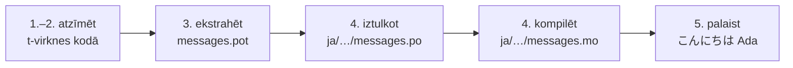

# Pamācība

Šī lapa ved no tukša direktorija līdz programmai, kas sveicina japāņu valodā.
Pieci soļi, pieredze ar gettext netiek prasīta, un katra komanda ir parādīta
kopā ar izvadi, ko tā patiešām rada — tā ikvienā solī jūs zināt, vai esat uz
pareizā ceļa.

Vajadzīgs Python 3.14 vai jaunāks, jo t-virknes ir jauna sintakse 3.14
versijā. Japāņu valoda ir šīs lapas piemēra mērķis, taču nekas no šīs izvēles
nav atkarīgs — 4. solī ielieciet jebkuru citu valodu; lokāles kods `ja` ir
vienīgais, kas to nosauc.

## 1. Instalēšana { #1-install }

```console
python -m pip install "gettext-tstrings[babel]"
```

Papildinājums `[babel]` atnes [Babel] — rīku, kas 3. solī savāc jūsu ziņojumus
kataloga failos. Tas ir izstrādes laika rīks: produkcijas kods renderē ar
standarta bibliotēku vien.

## 2. Atzīmējiet ziņojumu savā kodā { #2-mark-a-message-in-your-code }

Izveidojiet `app.py`:

```python
from gettext_tstrings import tr

name = "Ada"
print(tr(t"Hello {name}"))
```

`t"Hello {name}"` izskatās pēc f-virknes, bet prefikss `t` tur tekstu un
vērtību atsevišķi, nevis saplūdina tos uz vietas. Tieši šis dalījums ļauj
`tr()` atrast tulkojumu visam teikumam `Hello {name}` un ielikt vērtību pēc
tam.

Palaidiet to tagad:

```console
$ python app.py
Hello Ada
```

Tulkojumi vēl nav uzstādīti, tāpēc avota teksts tiek renderēts tāds, kāds tas
ir. Programmai, kas lieto šo bibliotēku, katalogs nekad nav *obligāts*, lai tā
darbotos — angļu valoda (vai kāda cita ir jūsu avota valoda) ir iebūvētā
atkāpšanās.

## 3. Ekstrahējiet ziņojumus { #3-extract-the-messages }

Tulkotāji nelasa jūsu pirmkodu; starp jums un viņiem ceļo neliels fails, ko
sauc par **katalogu**. Pirmais solis ceļā uz to ir savākt no koda katru
atzīmēto ziņojumu.

Pastāstiet Babel, kur meklēt jūsu ziņojumus, izveidojot `babel.cfg`:

```ini
[gettext_tstrings: **.py]
encoding = utf-8
```

Tad ekstrahējiet tos veidnes failā (`.pot`):

```console
$ mkdir -p locales
$ pybabel extract -F babel.cfg -c "Translators:" -o locales/messages.pot .
extracting messages from app.py (encoding="utf-8")
writing PO template file to locales/messages.pot
```

`locales/messages.pot` tagad satur vienu ierakstu katram ziņojumam:

```po
#. gettext-tstrings
#: app.py:4
#, python-brace-format
msgid "Hello {name}"
msgstr ""
```

`msgid` ir atslēga, ko jūsu kods meklēs. Tukšais `msgstr` ir vieta, kur nonāk
tulkojums — bet ne šajā failā: `.pot` ir *veidne*, un nākamais solis to
nokopē pa vienai reizei katrai valodai.

## 4. Iztulkojiet un kompilējiet { #4-translate-and-compile }

Izveidojiet japāņu katalogu no veidnes:

```console
$ pybabel init -i locales/messages.pot -d locales -l ja
creating catalog locales/ja/LC_MESSAGES/messages.po based on locales/messages.pot
```

Atveriet `locales/ja/LC_MESSAGES/messages.po` un aizpildiet `msgstr`:

```po
msgid "Hello {name}"
msgstr "こんにちは {name}"
```

Paturiet `{name}` tieši tādu, kāds tas ir — vietturis ir veids, kā vērtība
atrod savu vietu iztulkotajā teikumā, un tulkojums to drīkst pārvietot turp,
kur to prasa mērķa valoda. Īstā projektā tieši šo `.po` failu jūs nododat
tulkotājam vai augšupielādējat tulkošanas platformā; formāts abos gadījumos ir
viens un tas pats.

Katalogus rediģē kā tekstu, bet ielādē binārā formā (`.mo`), tāpēc
kompilējiet:

```console
$ pybabel compile -d locales
compiling catalog locales/ja/LC_MESSAGES/messages.po to locales/ja/LC_MESSAGES/messages.mo
```

Šī komanda ir arī drošības tīkls. Ja tulkojums būtu sabojājis vietturi —
teiksim, `{nome}`, nevis `{name}` —, tā atteiktos to izlaist cauri:

```console
$ pybabel compile -d locales
error: locales/ja/LC_MESSAGES/messages.po:24: translation does not match the
source placeholders: {name} is missing; {nome} is not in the source message
1 errors encountered.
```

## 5. Palaidiet to { #5-run-it }

Pavērsiet `app.py` uz kompilēto katalogu. Uzklikšķiniet uz marķieriem, lai
redzētu, ko dara katra rinda:

```python
import gettext

from gettext_tstrings import Translator

_ = Translator(gettext.translation("messages", localedir="locales", languages=["ja"]))  # (1)!

name = "Ada"
print(_(t"Hello {name}"))  # (2)!
```

1. Standarta bibliotēka ielādē kompilēto `.mo`, un `Translator` piesaista to
   izsaucamam objektam. `_` ir ierastais gettext nosaukums nozīmei “iztulko
   šo” — īss tāpēc, ka tas parādās pie katras lietotājam redzamās virknes. Tā
   ir tā pati funkcija, kas `tr`, piesaistīta vienam katalogam.
2. Izsaukuma brīdī: t-virknes teksts kļūst par meklēšanas atslēgu
   `Hello {name}`, katalogs atbild `こんにちは {name}`, atbilde tiek pārbaudīta
   pret avota vietturiem, un tikai tad tiek ielikta vērtība.

```console
$ python app.py
こんにちは Ada
```

Tāds ir viss cikls, un to ir vērts ieraudzīt kā vienu attēlu:



**Atzīmēt → ekstrahēt → iztulkot → kompilēt → palaist.** Viss pārējais šajā
vietnē ir kāda no šiem pieciem soļiem pilnveidojums.

## Kurp tālāk { #where-next }

- [Kāpēc t-virknes](comparison.md) — no kā šis dizains jūs pasargā,
  salīdzinot ar `%(name)s`, `.format()` un `$`-virknēm.
- [Ceļvedis](guide.md) — daudzskaitļi, valodas katram pieprasījumam, atliktās
  virknes un tas, kas izpildlaikā notiek, ja katalogs tomēr ir kļūdains.
- [Produkcijā](workflow.md) — tas pats cikls tā, kā to nedēļu pēc nedēļas
  izpilda komanda: katalogu atjaunināšana, CI vārti un tulkošanas platformas.
- [Ekstrakcija](extraction.md) — pilnā `pybabel` uzziņa: pielāgoti funkciju
  nosaukumi, stingrais CI režīms un pārbaudes, kas sargā jūsu katalogus.

  [Babel]: https://babel.pocoo.org/
