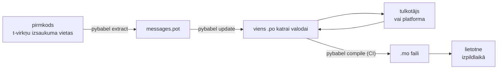

# Produkcijā

[Pamācība](tutorial.md) izpilda ciklu vienreiz, vienatnē, programmai ar vienu
ziņojumu. Īstā projektā cikls turpina griezties: ziņojumi mainās pēc tam, kad
tie jau iztulkoti, tulkotājs strādā citur un pēc sava grafika, un kompilēts
katalogs tiek piegādāts ar katru laidienu. Šī lapa ir tieši šī prakse — kas
paliek repozitorijā, kas ceļo, ko CI ir jāaiztur un kur izpildlaiks piesaista
valodu.

Kopsummā tas ir sešas pārbaudes, tāpēc vispirms tās; katra zemāk esošā sadaļa
iestata vienu no tām.

- `pybabel update --check` iziet cauri — neviens ziņojums nav mainījies, par to
  nedzirdot katalogiem.
- `pybabel compile` aiztur būvējumu pēc tā izejas statusa.
- Atlikušie `fuzzy` ieraksti ir apzināti — katrs no tiem renderējas kā avota
  teksts, līdz tulkotājs to apstiprina.
- Testu kopa katru piegādāto valodu vienreiz renderē ar `strict=True`.
- Produkcijas artefaktā ir `.mo` faili un nav Babel.
- Žurnalizētājs `gettext_tstrings` ir novirzīts uz uzraudzību.

## Kāda izskatās projekta forma { #the-shape-of-a-project }

```text
myapp/
├── babel.cfg
├── pyproject.toml
├── src/
│   └── myapp/
└── locales/
    ├── messages.pot
    ├── ja/LC_MESSAGES/messages.po
    └── de/LC_MESSAGES/messages.po
```

Iekļaujiet versiju kontrolē `babel.cfg`, `.pot` veidni un katru `.po` — tie ir
tulkojuma būvējuma avoti, un to diff ir veids, kā jūs pārskatāt tulkojumu
izmaiņas. Kompilētie `.mo` faili ir būvējuma artefakti: radiet tos CI vidē vai
pakošanas laikā, nevis iekļaujiet versiju kontrolē, lai `.po` un tā `.mo`
nekad nevarētu nesaskanēt par to, kas tiek piegādāts.

Vienam failam ir loma katrā virzienā: `.pot` nes jūsu ziņojumus *ārā* pie
tulkotājiem, `.po` faili nes tulkojumus *atpakaļ*. Pārējā lapas daļa ir tas,
kas pārvietojas starp tiem.



## Cikls pēc pirmā tulkojuma { #the-cycle-after-the-first-translation }

Pamācības `pybabel init` parasti tiek palaists vienreiz, kad valoda tiek
pievienota. No tā brīža darba cikls ir **ekstrahēt → atjaunināt → iztulkot → kompilēt**, un
tā centrs ir `pybabel update`, kas ielok svaigo veidni esošajos katalogos, bet
neizmet tajos jau esošos tulkojumus.

Pieņemsim, ka sveiciens `Hello {name}` — jau iztulkots kā `こんにちは {name}` —
kodā tiek pārformulēts par `Welcome back, {name}`. Ekstrahējiet un
atjauniniet:

```console
$ pybabel extract -F babel.cfg -c "Translators:" -o locales/messages.pot .
extracting messages from app.py (encoding="utf-8")
writing PO template file to locales/messages.pot
$ pybabel update -i locales/messages.pot -d locales
updating catalog locales/ja/LC_MESSAGES/messages.po based on locales/messages.pot
```

Japāņu katalogs tagad satur:

```po
#. gettext-tstrings
#: app.py:4
#, fuzzy, python-brace-format
msgid "Welcome back, {name}"
msgstr "こんにちは {name}"
```

Babel pamanīja, ka jaunais msgid atgādina kādu noņemtu, un sapāroja to ar veco
tulkojumu — bet atzīmēja pāri kā **fuzzy**: mašīnas minējumu, kas gaida
cilvēku. Šis karogs maina to, kas tiek kompilēts. `pybabel compile` **fuzzy
ierakstus `.mo` failā neiekļauj**, tāpēc, kamēr tulkotājs pāri neapstiprina, lietotne renderē jauno
angļu tekstu, nevis novecojušo japāņu:

```console
$ pybabel compile -d locales
compiling catalog locales/ja/LC_MESSAGES/messages.po to locales/ja/LC_MESSAGES/messages.mo
$ python app.py
Welcome back, Ada
```

Mainīts ziņojums tātad degradējas tieši tāpat kā sabojāts — uz avota valodu,
nekad uz novecojušu tulkojumu. Tulkotāja daļa ciklā ir pārstrādāt `msgstr` un
nodzēst `fuzzy` karogu; nākamā kompilēšana ierakstu paņem.

!!! note "Vietturu nosaukumi ir daļa no ziņojuma identitātes"

    Msgid ir kataloga atslēga, un viettura *nosaukums* ir tās iekšienē —
    tāpēc mainīga pārdēvēšana kodā (`name` → `user_name`) maina msgid un
    sūta katras valodas tulkojumu atpakaļ cauri fuzzy ciklam. Nosauciet
    interpolētos mainīgos ar vārdiem, ko tulkotājs sapratīs, un pārdēvējiet
    tos tikai ar iemeslu.

    Formatējums ir spoguļattēls: `!r` un `:.2f` [nav msgid
    daļa](internals.md#from-template-to-msgid), tāpēc `{amount:,.2f}`
    savilkšana par `{amount:,.0f}` nemaina neko nevienā katalogā. Paša
    *teikuma* pārformulēšana, protams, ir īsta izmaiņa — un tas ir augšminētais
    cikls.

## Ko CI aiztur { #what-ci-gates }

Trīs kļūmes ir sarkana būvējuma vērtas: katalogi ir atpalikuši no koda,
tulkojums ir salauzis vietturi vai sabojāts ieraksts ir paslīdējis līdz
izpildlaikam. Viens solis katrai kļūmei:

```yaml
- run: pybabel extract -F babel.cfg -c "Translators:" -o locales/messages.pot .
- run: pybabel update -i locales/messages.pot -d locales --check
- run: pybabel compile -d locales
- run: pytest
```

`pybabel update --check` neko nepārraksta un iziet ar statusu, kas nav nulle,
kad katalogs ir novecojis attiecībā pret svaigi ekstrahēto veidni — sargs pret
tāda koda sapludināšanu, kura ziņojumus neviens nav no jauna ekstrahējis.
`pybabel compile` palaiž gan Babel, gan šīs pakotnes
[reģistrētā pārbaudītāja](extraction.md#your-existing-toolchain-validates-these-catalogs)
vietturu pārbaudes.

!!! bug "Babel 2.18.0: `--check` nespēj aizturēt katalogu, kas lieto kontekstus"

    Babel 2.18.0 versijā `pybabel update --check` ziņo, ka **katrs** katalogs,
    kas satur `msgctxt`, ir novecojis — katrā izpildē, lai cik svaigs tas arī
    būtu. Pastāvīgi krītoši vārti ir sliktāki nekā nekādi vārti, jo komanda tos
    izslēdz — tāpēc, ja jūs vispār lietojat `pgettext` vai `npgettext`,
    aizstājiet šo soli, nevis samierinieties ar to. Veidnes un katra kataloga
    nolasīšana ar `babel.messages.pofile.read_po` un
    `{(m.context, m.id) for m in catalog if m.id}` salīdzināšana ir visa
    pārbaude, un tieši to dara [šīs vietnes pašas būvējums](index.md). Cēlonis
    ir [aprakstīts lapā Kļūmes](pitfalls.md#your-tools-have-bugs-too).

!!! danger "Pārbaudiet izejas statusu, nevis žurnālu"

    `pybabel compile` ziņo par katru vietturu kļūdu, iziet ar statusu, kas nav
    nulle, — **un `.mo` failu tik un tā ieraksta**. Konveijers, kas kompilē un
    tad iekopē `locales/` attēlā, piegādā sabojāto katalogu, ja vien izeja ar
    nenulles statusu to patiešām neaptur. Ļaut solim nogāzt būvējumu, kā
    augstāk, ir viss risinājums.

Pēdējā rinda ir jūsu parastā testu kopa, ar vienu pievienotu ieradumu: kaut kur
tajā izrenderējiet vismaz vienu ziņojumu katrai piegādātajai valodai caur
stingru tulkotāju —

```python
import gettext

from gettext_tstrings import Translator


def test_catalogs_render(language: str) -> None:
    translations = gettext.translation("messages", localedir="locales", languages=[language])
    _ = Translator(translations, strict=True)
    name = "Ada"
    assert _(t"Welcome back, {name}")
```

— jo `strict=True` [izraisa kļūdu tur, kur produkcija klusējot atkāptos](guide.md#what-happens-when-a-catalog-is-wrong),
un renderēšana izpildlaikā ir vienīgā pārbaude, kas redz katalogu tieši tādu,
kādu to redzēs lietotne, ar `.mo` un visu pārējo.

## Darbs ar tulkotājiem un platformām { #working-with-translators-and-platforms }

`.po` fails ir visas gettext pasaules apmaiņas formāts, un tieši tāpēc šī
bibliotēka to izmanto atkārtoti: nodot tulkošanu tālāk nozīmē nodot failu —
vienalga, vai saņēmējs ir kolēģis ar PO redaktoru vai platforma, tāda kā
Weblate vai Crowdin. Trīs lietas liek šai nodošanai izdoties labi:

**Pasakiet, kam ziņojums domāts.** Komentārs kodā ceļo līdzi ziņojumam — tieši
to savāc karogs `-c "Translators:"`:

```python
from gettext_tstrings import tr

name = "Ada"
# Translators: shown on the dashboard right after sign-in
print(tr(t"Welcome back, {name}"))
```

```po
#. Translators: shown on the dashboard right after sign-in
#. gettext-tstrings
#: app.py:5
#, python-brace-format
msgid "Welcome back, {name}"
msgstr ""
```

Tulkotājs redz šo komentāru savā redaktorā, blakus ziņojumam, otrā pasaules
malā. Tas ir lētākais kvalitātes svira visā darbplūsmā. Vārdam, kas ir pats sev
homonīms — “Open” kā poga pret “Open” kā stāvoklis —, iedodiet ziņojumam
[kontekstu](guide.md#binding-a-catalog) ar `pgettext`, kas katalogā kļūst par
redzamu `msgctxt`.

**Ļaujiet platformai validēt vietturus.** Katrs no t-virknes ekstrahētais
ziņojums nes `python-brace-format` karogu, un tieši šī viena rinda ieslēdz
vietturu kvalitātes kontroli rīkos, ko jūs nekontrolējat — Weblate šo pārbaudi
dokumentē, komerciālās platformas savu balsta uz to pašu karogu, un
`msgfmt --check-format` to piemēro jebkurā GNU konveijerā. Detaļas un tas, ko
komplektā iekļautais pārbaudītājs noķer papildus tām, ir
[ekstrakcijas lapā](extraction.md#your-existing-toolchain-validates-these-catalogs).

**Uzticieties drošības tīklam tieši tik tālu, cik tas sniedzas.** Viss, kas
atnāk atpakaļ no platformas, joprojām ir dati, kas ienāk jūsu būvējumā;
augstāk aprakstītie CI vārti ir tas, kas pārvērš “platforma to laikam
pārbaudīja” par “tas nevar tikt piegādāts sabojāts”.

## Valodas piesaiste izpildlaikā { #binding-a-language-at-runtime }

Viss līdz šim rada katalogus. Atlikušais lēmums ir par to, kur lietotne kādu
no tiem izvēlas. Piesaistiet vienreiz katrā *valodas tvērumā* — procesā CLI
gadījumā, pieprasījumā tīmekļa servisa gadījumā.

=== "Viens process, viena valoda"

    Komandrindas rīks vai darbvirsmas lietotne nolasa lietotāja vidi vienreiz,
    startējot. Ja `languages=` netiek padots, standarta bibliotēka veic sarunas
    no `LANGUAGE`, `LC_ALL`, `LC_MESSAGES` un `LANG`; `fallback=True` atgriež
    tukšu katalogu — avota tekstu —, nevis izraisa kļūdu, kad neviens no tiem
    neatbilst jūsu piegādātajam katalogam.

    ```python
    import gettext

    from gettext_tstrings import Translator

    _ = Translator(gettext.translation("messages", localedir="locales", fallback=True))

    name = "Ada"
    print(_(t"Welcome back, {name}"))
    ```

=== "Flask"

    Tīmekļa lietotne izlemj katram pieprasījumam. Ielādējiet katru katalogu
    vienreiz importa laikā, tad pirms skata izpildes piesaistiet izrunāto
    katalogu kontekstam —
    [`set_translations`](guide.md#per-request-language) ir kontekstlokāla,
    tāpēc vienlaicīgi pieprasījumi dažādās valodās nekad neredz cits cita
    piesaisti.

    ```python
    import gettext

    from flask import Flask, request

    from gettext_tstrings import set_translations, tr

    LANGUAGES = ("en", "ja", "de")
    CATALOGS = {
        language: gettext.translation(
            "messages", localedir="locales", languages=[language], fallback=True
        )
        for language in LANGUAGES
    }

    app = Flask(__name__)


    @app.before_request
    def bind_language() -> None:
        language = request.accept_languages.best_match(LANGUAGES) or "en"
        set_translations(CATALOGS[language])


    @app.get("/")
    def home() -> str:
        name = "Ada"
        return tr(t"Welcome back, {name}")
    ```

=== "ASGI starpprogramma"

    Asinhronos ietvaros — FastAPI, Starlette un jebkurā citā ASGI ietvarā —
    ietiniet pieprasījumu
    [`use_translations`](guide.md#per-request-language) iekšienē: piesaiste
    dzīvo `ContextVar` mainīgajā, ko asinhrono uzdevumu pārslēgšana saglabā
    katram pieprasījumam atsevišķi.

    ```python
    import gettext

    from fastapi import FastAPI, Request

    from gettext_tstrings import tr, use_translations

    LANGUAGES = ("en", "ja", "de")
    CATALOGS = {
        language: gettext.translation(
            "messages", localedir="locales", languages=[language], fallback=True
        )
        for language in LANGUAGES
    }

    app = FastAPI()


    @app.middleware("http")
    async def bind_language(request: Request, call_next):
        language = negotiate_language(request.headers.get("accept-language"), LANGUAGES)
        with use_translations(CATALOGS[language]):
            return await call_next(request)
    ```

    `negotiate_language` apzīmē jūsu Accept-Language parsēšanu — lielākā daļa
    ietvaru vai to ekosistēmu tādu piedāvā; šeit svarīgā ir piesaiste ap
    `call_next`.

Divi izpildlaika ieradumi pabeidz ainu. Virknes, kas radītas importa laikā —
formas uzraksts, enum attēlojamais nosaukums —, nedrīkst notvert to valodu,
kura gadījās aktīva importa brīdī; definējiet tās ar
[`lazy_gettext`](guide.md#deferred-translation), un tās renderēsies tajā
valodā, kas ir aktīva *lietošanas* brīdī. Un novirziet `gettext_tstrings`
žurnalizētāju kaut kur, kur cilvēks skatās: tā brīdinājumi ir iecietīgais
režīms, kas ziņo par tulkojumu, kurš izslīdējis cauri visiem vārtiem, — pa
vienai rindai uz sabojātu ziņojumu, nevis pa vienai uz renderēšanu.

## Piegāde { #shipping }

Produkcijai vajadzīga pakotne, `.mo` faili un nekas cits. Babel ir izstrādes un
CI atkarība — turiet `gettext-tstrings[babel]` ārpus produkcijas attēla un
instalējiet tur kailo pakotni; renderēšana darbojas ar standarta bibliotēku
vien. Kompilējiet katalogus tajā pašā būvējumā, kas rada izvietojamo artefaktu,
lai `.mo` faili tajā būtu tieši tie pārskatītie `.po` faili un lai nekas
kompilēts uz kāda klēpjdatora nekad netiktu piegādāts.

Kā tie ceļo, ir atkarīgs no tā, ko jūs izvietojat. Wheel tos nes kā pakotnes
datus, kas nozīmē, ka katalogiem jādzīvo pakotnes direktorijas *iekšienē* —
`src/myapp/locales/`, nevis augšējā līmeņa `locales/` —, un būvējuma
aizmugursistēmai jāpasaka, ka jāiekļauj faili, kurus `.gitignore` parasti
noslēpj:

=== "Hatchling"

    ```toml
    [tool.hatch.build]
    # .mo files are build output, so they are gitignored; name them or the
    # wheel ships without a single translation.
    artifacts = ["src/myapp/locales/**/*.mo"]
    ```

=== "setuptools"

    ```toml
    [tool.setuptools.package-data]
    myapp = ["locales/*/LC_MESSAGES/*.mo"]
    ```

Lasiet tos atpakaļ caur pakotni, nevis caur ceļu attiecībā pret avota koku, kas
beidz pastāvēt brīdī, kad wheel ir uzinstalēts:

```python
import gettext
from importlib.resources import as_file, files

with as_file(files("myapp") / "locales") as localedir:
    translations = gettext.translation("messages", localedir=localedir, languages=["ja"])
```

Konteinera attēlam uzdevums ir vieglāks: kompilējiet būvējuma stadijā un
nokopējiet rezultātu, atstājot Babel tajā stadijā.

```dockerfile
FROM python:3.14-slim AS build
COPY . /src
RUN cd /src && python -m pip install ".[babel]" \
    && pybabel compile -d src/myapp/locales

FROM python:3.14-slim
COPY --from=build /src /src
RUN python -m pip install /src   # no [babel]: rendering needs the stdlib only
```

Pirms laidiena kontrolsaraksts, uz ko šī lapa sarūk:

- `pybabel update --check` iziet cauri — neviens ziņojums nav mainījies, katalogiem
  par to nedzirdot.
- `pybabel compile` aiztur būvējumu pēc sava izejas statusa.
- Atlikušie `fuzzy` ieraksti ir apzināti — katrs no tiem renderējas kā avota
  teksts, līdz tulkotājs to apstiprina.
- Testu kopa vienreiz izrenderē katru piegādāto valodu ar `strict=True`.
- Produkcijas artefakts satur `.mo` failus un nekādu Babel.
- `gettext_tstrings` žurnalizētājs ir novirzīts uz uzraudzību.

## Kurp tālāk { #where-next }

- [Ekstrakcija](extraction.md) — uzziņa par šīs lapas rīku pusi: attēlojuma
  opcijas, pielāgoti funkciju nosaukumi, stingrais režīms un katrs
  pārbaudītājs.
- [Ceļvedis](guide.md) — izpildlaika puse: daudzskaitļi, konteksti, atliktās
  virknes un kļūmju režīmi sīkumos.
- [Kā tas darbojas](internals.md) — kāpēc msgid izskatās tieši tā un ko
  validācija patiesībā pārbauda.
