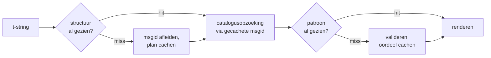

# Hoe het werkt

Niets op deze pagina is nodig om de bibliotheek te gebruiken — de
[tutorial](tutorial.md) en [handleiding](guide.md) dekken dat. Deze pagina
herbouwt de bibliotheek in plaats daarvan vanaf de eerste principes: wat een
t-string werkelijk is, hoe een msgid eruit voortvloeit, wat een vertaling
geldig maakt, en hoe de implementatie al dat controleren tienden van een
microseconde laat kosten. Lees haar als je nieuwsgierig bent, als je wilt
bijdragen, of als je van plan bent
[de conventie zelf te implementeren](#reimplementing-it).

## Wat een t-string werkelijk is { #what-a-t-string-actually-is }

Een f-string produceert een `str`, en produceert die onmiddellijk — tegen de
tijd dat een functie hem ontvangt, is de waarde geïnterpoleerd en is de zin
verzegeld. Een t-string ([PEP 750]) heeft dezelfde syntaxis en dezelfde
gretige evaluatie van zijn expressies, maar produceert een ander type:

```pycon
>>> name = "Ada"
>>> f"Hello {name}!"
'Hello Ada!'
>>> t"Hello {name}!"
Template(strings=('Hello ', '!'), interpolations=(Interpolation('Ada', 'name', None, ''),))
```

Dat `Template`-object bewaart de delen die een cataloguspipeline nodig
heeft, nog steeds gescheiden:

```pycon
>>> template = t"Total: {amount:,.2f}"
>>> template.strings
('Total: ', '')
>>> template.interpolations[0].expression
'amount'
>>> template.interpolations[0].value
1234.5
>>> template.interpolations[0].format_spec
',.2f'
```

- `strings` — de letterlijke tekst rond de interpolaties, op volgorde.
- Voor elke interpolatie: de **expressie** als brontekst (`'amount'`), zijn
  geëvalueerde **waarde** (`1234.5`), en elke **conversie** (`!r`) en
  **format-spec** (`,.2f`) — apart meegedragen in plaats van toegepast.

Alles wat deze bibliotheek doet is een gedisciplineerde consumptie van die
structuur. De taal maakte al de ene scheiding die i18n nodig heeft —
statische tekst los van waarden — dus de bibliotheek parseert nooit je
broncode en raadt nooit waar een waarde in een zin zit. Wat overblijft zijn
drie beslissingen: hoe de structuur een catalogussleutel wordt, wat een
vertaling van die sleutel mag zeggen, en hoe de twee samen terug renderen.

## Van template naar msgid { #from-template-to-msgid }

Een msgid — de sleutel waarop een catalogus geïndexeerd is — wordt afgeleid
uit alleen de *statische* delen van het template. Loop `strings` en
`interpolations` in bronvolgorde af; escape de accolades van elk letterlijk
segment (`{` wordt `{{`); zend voor elke interpolatie één `{name}`-token
uit, waarbij `name` de expressietekst is met de omringende witruimte
weggehaald. Uit `t"Total: {amount:,.2f}"`:

```text
strings         ('Total: ', '')
interpolations  expression 'amount'   conversion None   format_spec ',.2f'
msgid           'Total: {amount}'
```

Elk deel van die regel heeft een reden:

- **De expressie moet een gewone naam zijn** — `str.isidentifier()` is waar
  en het is geen Python-keyword. `t"Hello {user.name}"` wordt op de
  aanroepplek afgewezen. Een msgid is een *sleutel*: hij moet er bij elke
  run en elke extractie identiek uitkomen, en hij wordt door vertalers
  gelezen, dus de placeholder moet een stabiel, betekenisvol woord zijn —
  geen codefragment dat de catalogus uitnodigt een expressietaal te worden.
- **De conversie en de format-spec komen nooit in de msgid.** Vertalers
  zouden `:,.2f` niet moeten hoeven lezen, en geen vertaling zou het moeten
  kunnen veranderen. Het gevolg is het weten waard: `:,.2f` aanscherpen tot
  `:,.0f` in je code verandert geen msgid, dus het maakt in geen enkele taal
  een vertaling ongeldig. De catalogussleutel volgt *wat de zin zegt*, niet
  hoe de waarde wordt opgemaakt.
- **Een herhaalde naam moet zijn opmaak exact herhalen.**
  `t"{x:.2f} vs {x:.3f}"` wordt afgewezen, omdat beide voorkomens
  samenvallen in hetzelfde `{x}`-token en de msgid niet meer zou kunnen
  zeggen welke opmaak een render moet gebruiken.
- **De lege msgid wordt nooit opgezocht**, omdat gettext hem reserveert voor
  de metadata-header van de catalogus zelf. `t""` rendert als `""` zonder de
  catalogus aan te raken.

De volledige regelset, inclusief randgevallen die deze pagina overslaat, is
[SPEC §2](https://github.com/yhay81/gettext-tstrings/blob/main/SPEC.md).

## Wat een vertaling mag zeggen { #what-a-translation-may-say }

Een patroon dat uit een catalogus terugkomt wordt geparseerd met
`string.Formatter` — dezelfde parser die `str.format` gebruikt. De
grammatica is bewust geleend in plaats van uitgevonden: een patroon dat deze
bibliotheek accepteert, is er een dat het bredere ecosysteem al begrijpt.
Daarna gelden twee controles.

**Vorm:** elk veld moet een kale `{name}` zijn. Een conversie of format-spec
— inclusief de expliciet lege `{name:}` — wordt afgewezen, net als
positionele velden (`{0}`, `{}`) en namen met witruimte eromheen
(`{ name }`). Die laatste doet er meer toe dan hij lijkt: `str.format` en
GNU `msgfmt` wijzen `{ name }` allebei af, dus hem hier accepteren zou
catalogi opleveren die geen enkele andere tool in de keten kan valideren.

**Namen:** de placeholderset van het patroon wordt vergeleken met die van de
bron. Voor een enkelvoudig bericht is elke bronnaam *vereist* en is niets
anders *toegestaan*. Voor een meervoudsbericht worden de twee takken
samengevoegd:

- **toegestaan** = de unie van de namen van beide takken
- **vereist** = hun doorsnede

Dus tegen `t"One file"` / `t"{n} files"` is de naam `n` toegestaan in een
vertaling van elk van beide vormen maar in geen van beide vereist. Die
asymmetrie is wat het meervoudssysteem van een doeltaal laat afwijken van
dat van de bron — Japans vertaalt beide takken met één vorm die
waarschijnlijk `{n}` gebruikt; een taal met meer vormen dan Engels kan
`{n}` nodig hebben in een vorm waar Engels er geen heeft.

Niets daarvan is hypothetisch: de eigen chrome-catalogus van deze site
draagt het meervoudsbericht `Built {n} localized page` /
`Built {n} localized pages` — twee Engelse takken — en de edities van de
site vertalen dat ene bericht in één tot wel zes vormen:

| Catalogus | Vormen | De vertalingen, in vormvolgorde |
| --- | --- | --- |
| Japans | 1 | `ローカライズ済みページを{n}件ビルドしました` |
| Turks | 2 | `{n} yerelleştirilmiş sayfa oluşturuldu` — twee keer, identiek: Turkse zelfstandige naamwoorden blijven enkelvoud na een telwoord |
| Italiaans | 2 | `Generata {n} pagina localizzata` · `Generate {n} pagine localizzate` — het deelwoord congrueert in geslacht en getal |
| Russisch | 3 | `Собрана {n} локализованная страница` · `Собраны {n} локализованные страницы` · `Собрано {n} локализованных страниц` |
| Pools | 3 | `Zbudowano {n} zlokalizowaną stronę` · `Zbudowano {n} zlokalizowane strony` · `Zbudowano {n} zlokalizowanych stron` |
| Arabisch | 6 | waaronder `تم إنشاء صفحة مترجمة واحدة ({n})` voor precies één en `تم إنشاء {n} صفحات مترجمة` voor enkele |

Elke rij is een levende entry in `i18n/*/LC_MESSAGES/site.po` van deze
repository, gerenderd door de [meertalige build](index.md) bij elke release
— en een test pint deze tabel vast aan die catalogi, zodat de twee niet uit
elkaar kunnen drijven.

Binnen die grenzen zijn herordening en herhaling bewust onbeperkt. Beide
zijn in echte talen grammaticaal noodzakelijk, en het beperken van het
aantal voorkomens zou correcte vertalingen afwijzen zonder enig
veiligheidsvoordeel: een vertaling kan nog steeds niets *evalueren*, omdat
er geen evaluatiepad bestaat — placeholders worden op naam opgezocht in de
al berekende waarden van het template, en nooit aan `eval`, `getattr` of
`str.format` zelf gevoerd.

## Renderen { #rendering }

Een gevalideerd patroon renderen is een wandeling over zijn stukken: zend
elk letterlijk deel uit, en pas voor elke placeholder op de vastgelegde
waarde van de interpolatie de conversie en format-spec *van de bronkant*
toe — `format(convert(value, conversion), format_spec)`. Twee garanties
worden daarbij bewaard:

- **Elke afzonderlijke waarde wordt hoogstens één keer per render
  opgemaakt**, ook wanneer de vertaling een placeholder herhaalt. Herhaling
  verandert hoe vaak het resultaat wordt ingevoegd, niet hoe vaak jouw
  `__format__` draait.
- **Bij meervouden leest een placeholder de tak die hem definieerde.** Een
  naam die in beide takken voorkomt, leest de waarde die is vastgelegd door
  de tak die de *bron*-taal selecteert (`singular` wanneer `n == 1`, anders
  `plural`); een takspecifieke naam leest altijd zijn eigen tak, ook wanneer
  de meervoudsregels van de doeltaal hem in een andere vorm beschikbaar
  maakten.

Wanneer validatie bij het renderen faalt, wordt de reactie gesplitst naar
wie het patroon aanleverde. Een patroon dat uit een *catalogus* kwam,
degradeert: log één waarschuwing en render de brontekst, in lijn met
gettexts contract dat een kapotte catalogus de applicatie nooit neerhaalt
([de handleiding toont beide modi](guide.md#what-happens-when-a-catalog-is-wrong)).
Een patroon dat de aanroeper rechtstreeks doorgaf —
`CompiledTemplate.render` — raist altijd, omdat er geen brontekst is om
*vanaf* te degraderen; mildheid bestaat voor catalogusopzoekingen, niet voor
argumenten.

## Diagnostiek is deel van het ontwerp { #diagnostics-are-part-of-the-design }

Een placeholderfout belandt meestal voor de neus van een vertaler, niet van
een programmeur, en vaak in een bestand waarin het probleem onzichtbaar is.
`{name} is missing` zeggen tegen iemand die exact die tekens in zijn editor
kan zien is een doodlopende weg, dus de meldingen worden berekend met drie
regels:

- Een naam met een **onzichtbaar teken** — een harde spatie die een
  invoermethode produceerde, een zero-width space — wordt afgedrukt met dat
  teken vervangen door zijn codepunt, op zijn plek: `{<U+00A0>name}`. De
  lezer moet zien *waar*.
- Een naam waarvan de letters **schriftsystemen mengen**, het
  homoglief-geval, wordt twee keer getoond — één keer leesbaar, één keer
  geëscaped — omdat `{nаme}` met een Cyrillische `а` in druk niet te
  onderscheiden is van `{name}`, en de geëscapete vorm `(nаme)` de enige
  spelling is die ze uit elkaar houdt.
- Al het andere wordt getoond **zoals geschreven**. `{名前}` en `{café}`
  zijn gewone namen; ze escapen zou de lezer niet meer laten vinden wat er
  bedoeld werd.

Volgens hetzelfde principe krijgt een "ontbrekende" placeholder die
aanwezig *lijkt*, zijn afwezigheid uitgelegd — accolades op volle breedte
uit een Oost-Aziatische invoermethode, `{{name}}`-verdubbeling uit een
escaping-rondreis, de naam buiten enige accolades. De
[foutleestabel van de handleiding](guide.md#reading-a-failure-message) toont
elk van deze meldingen woordelijk.

## Het hete pad { #the-hot-path }

Alles hierboven gebeurt bij elke vertaalde string die een applicatie
rendert, dus de implementatie is gebouwd rond één idee: **validatie wordt
nooit overgeslagen, dus validatie moet zijn wat gecachet wordt.**



Drie caches, één per fase:

- **Een plan per aanroepplek-structuur.** De `strings`-tuple van het
  template — een object dat de interpreter al bouwde — is de cachesleutel,
  dus een opzoeking allokeert niets. Bij een hit wordt de expressie,
  conversie en format-spec van elke interpolatie nog steeds vergeleken met
  de vastgelegde: twee aanroepplekken die letterlijke tekst delen maar in
  opmaak verschillen (`t"{x:.2f}"` tegenover `t"{x:.3f}"`) mogen niet
  botsen, en die vergelijking is de prijs van een sleutel die de interpreter
  gratis overhandigt.
- **Een oordeel per patroon.** De eerste keer dat een catalogus met een
  gegeven patroon antwoordt, wordt het geparseerd en gevalideerd; het
  resultaat — een gecompileerd renderplan, of een registratie van
  ongeldigheid — wordt op het plan bewaard. Elke latere render van dat
  bericht bereikt het in één dictionary-opzoeking. Ongeldige patronen
  worden ook onthouden, en daarom waarschuwt een kapotte catalogusentry één
  keer in plaats van bij elke render.
- **Een samengevoegd plan per meervoudspaar**, dat de unie/doorsnede-sets
  vasthoudt zodat de takberekening één keer per bericht gebeurt, niet één
  keer per aanroep.

Elke cache is begrensd, en geen enkele bewaart geïnterpoleerde *waarden* —
alleen statische structuur en patroontekst. Het resultaat, gemeten door
[`benchmarks/runtime.py`](https://github.com/yhay81/gettext-tstrings/blob/main/benchmarks/runtime.py):
ruwweg 0,4 µs voor een bericht met één veld, inclusief de constructie van de
t-string zelf, ongeveer 2,5× een kale `gettext(...).format(...)` die niets
controleert. Het commentaar bovenaan
[`core.py`](https://github.com/yhay81/gettext-tstrings/blob/main/src/gettext_tstrings/core.py)
legt de afzonderlijke metingen achter die vorm vast.

## Het zelf herimplementeren { #reimplementing-it }

Niets van het bovenstaande is geheime kennis: de conventie is vastgelegd als
[spec v1](spec.md), en zijn machineleesbare
[conformiteitssuite](spec.md#conformance) laat een extractor, een
IDE-plugin of een implementatie in een andere taal zichzelf controleren
tegen elke regel die deze pagina uitlegde. Deze implementatie draait de
suite in haar eigen tests, en dat is wat deze pagina, de spec en de code
ervan weerhoudt in stilte uit elkaar te drijven.

  [PEP 750]: https://peps.python.org/pep-0750/
