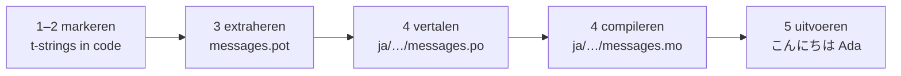

# Tutorial

Deze pagina gaat van een lege map naar een programma dat in het Japans groet.
Vijf stappen, geen gettext-ervaring verondersteld, en elk commando wordt
getoond met de uitvoer die het werkelijk produceert — zodat je bij elke stap
weet of je op koers ligt.

Je hebt Python 3.14 of nieuwer nodig, omdat t-strings nieuwe syntaxis zijn in
3.14. Japans is het voorbeelddoel van deze pagina, maar niets hangt van die
keuze af — vervang het door elke taal in stap 4, waar de locale-code `ja` het
enige is dat haar benoemt.

## 1. Installeren { #1-install }

```console
python -m pip install "gettext-tstrings[babel]"
```

De `[babel]`-extra haalt [Babel] binnen, de tool die in stap 3 je berichten in
catalogusbestanden verzamelt. Het is een tool voor ontwikkeltijd:
productiecode rendert met alleen de standaardbibliotheek.

## 2. Markeer een bericht in je code { #2-mark-a-message-in-your-code }

Maak `app.py` aan:

```python
from gettext_tstrings import tr

name = "Ada"
print(tr(t"Hello {name}"))
```

`t"Hello {name}"` ziet eruit als een f-string, maar het voorvoegsel `t` houdt
de tekst en de waarde gescheiden in plaats van ze ter plekke samen te voegen.
Die scheiding is wat `tr()` in staat stelt een vertaling op te zoeken voor de
hele zin `Hello {name}` en de waarde er daarna in te voegen.

Voer het nu uit:

```console
$ python app.py
Hello Ada
```

Er zijn nog geen vertalingen geïnstalleerd, dus de brontekst wordt ongewijzigd
gerenderd. Een programma dat deze bibliotheek gebruikt *vereist* nooit een
catalogus om te draaien — Engels (of wat je brontaal ook is) is de ingebouwde
fallback.

## 3. Extraheer de berichten { #3-extract-the-messages }

Vertalers lezen je broncode niet; een klein bestand dat een **catalogus**
heet, reist tussen jou en hen. De eerste stap ernaartoe is elk gemarkeerd
bericht uit de code verzamelen.

Vertel Babel hoe het je berichten vindt door `babel.cfg` aan te maken:

```ini
[gettext_tstrings: **.py]
encoding = utf-8
```

Extraheer vervolgens naar een sjabloonbestand (`.pot`):

```console
$ mkdir -p locales
$ pybabel extract -F babel.cfg -c "Translators:" -o locales/messages.pot .
extracting messages from app.py (encoding="utf-8")
writing PO template file to locales/messages.pot
```

`locales/messages.pot` bevat nu één entry per bericht:

```po
#. gettext-tstrings
#: app.py:4
#, python-brace-format
msgid "Hello {name}"
msgstr ""
```

`msgid` is de sleutel die je code zal opzoeken. De lege `msgstr` is waar een
vertaling komt te staan — maar niet in dit bestand: een `.pot` is een
*sjabloon*, en de volgende stap kopieert het één keer per taal.

## 4. Vertaal en compileer { #4-translate-and-compile }

Maak de Japanse catalogus aan vanuit het sjabloon:

```console
$ pybabel init -i locales/messages.pot -d locales -l ja
creating catalog locales/ja/LC_MESSAGES/messages.po based on locales/messages.pot
```

Open `locales/ja/LC_MESSAGES/messages.po` en vul de `msgstr` in:

```po
msgid "Hello {name}"
msgstr "こんにちは {name}"
```

Houd `{name}` exact zoals hij is — de placeholder is hoe de waarde zijn plek
vindt in de vertaalde zin, en de vertaling mag hem vrij verplaatsen naar waar
de doeltaal hem nodig heeft. In een echt project is dit `.po`-bestand wat je
aan een vertaler overhandigt of naar een vertaalplatform uploadt; het formaat
is in beide gevallen hetzelfde.

Catalogi worden als tekst bewerkt maar in binaire vorm (`.mo`) geladen, dus
compileer:

```console
$ pybabel compile -d locales
compiling catalog locales/ja/LC_MESSAGES/messages.po to locales/ja/LC_MESSAGES/messages.mo
```

Dit commando is ook een vangnet. Had de vertaling de placeholder beschadigd —
bijvoorbeeld `{nome}` in plaats van `{name}` — dan zou het weigeren door te
laten:

```console
$ pybabel compile -d locales
error: locales/ja/LC_MESSAGES/messages.po:24: translation does not match the
source placeholders: {name} is missing; {nome} is not in the source message
1 errors encountered.
```

## 5. Voer het uit { #5-run-it }

Richt `app.py` op de gecompileerde catalogus. Klik op de markeringen om te
zien wat elke regel doet:

```python
import gettext

from gettext_tstrings import Translator

_ = Translator(gettext.translation("messages", localedir="locales", languages=["ja"]))  # (1)!

name = "Ada"
print(_(t"Hello {name}"))  # (2)!
```

1. De standaardbibliotheek laadt de gecompileerde `.mo`, en `Translator`
   bindt hem aan een aanroepbaar object. `_` is de conventionele gettext-naam
   voor "vertaal dit" — kort omdat hij bij elke gebruikersgerichte string
   voorkomt. Het is dezelfde functie als `tr`, gebonden aan één catalogus.
2. Bij de aanroep: de tekst van de t-string wordt de opzoeksleutel
   `Hello {name}`, de catalogus antwoordt `こんにちは {name}`, het antwoord
   wordt gecontroleerd tegen de bron-placeholders, en pas dan wordt de waarde
   ingevoegd.

```console
$ python app.py
こんにちは Ada
```

Dat is de hele lus, en het is de moeite waard hem als één plaatje te zien:



**Markeren → extraheren → vertalen → compileren → uitvoeren.** Al het andere
op deze site is een verfijning van een van die vijf stappen.

## Waar nu heen { #where-next }

- [Waarom t-strings](comparison.md) — waar dit ontwerp je tegen beschermt,
  vergeleken met `%(name)s`, `.format()` en `$`-strings.
- [Handleiding](guide.md) — meervouden, talen per request, uitgestelde
  strings, en wat er tijdens runtime gebeurt als een catalogus toch fout is.
- [In productie](workflow.md) — dezelfde lus zoals een team hem draait, week
  na week: catalogi bijwerken, CI-poorten en vertaalplatforms.
- [Extractie](extraction.md) — de volledige `pybabel`-referentie: eigen
  functienamen, strikte CI-modus, en de controles die je catalogi bewaken.

  [Babel]: https://babel.pocoo.org/
