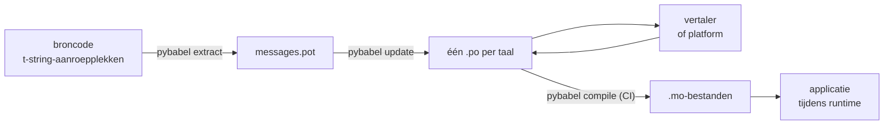

# In productie

De [tutorial](tutorial.md) draait de lus één keer, alleen, op een programma
met één bericht. In een echt project blijft de lus draaien: berichten
veranderen nadat ze vertaald zijn, de vertaler werkt elders en volgens een
eigen schema, en met elke release wordt een gecompileerde catalogus
uitgeleverd. Deze pagina is die praktijk — wat in de repository blijft, wat
reist, wat CI moet bewaken, en waar de runtime een taal bindt.

Waar het op neerkomt zijn zes controles, dus die staan hier eerst; elke
sectie hieronder zet er één van op.

- `pybabel update --check` slaagt — geen bericht is veranderd zonder dat de
  catalogi ervan gehoord hebben.
- `pybabel compile` laat de build afhangen van zijn exitstatus.
- Overgebleven `fuzzy`-entries zijn bedoeld — elk daarvan rendert als
  brontekst tot een vertaler hem bevestigt.
- De testsuite rendert elke uitgeleverde taal één keer met `strict=True`.
- Het productieartefact bevat `.mo`-bestanden en geen Babel.
- De `gettext_tstrings`-logger is naar monitoring geleid.

## De vorm van een project { #the-shape-of-a-project }

```text
myapp/
├── babel.cfg
├── pyproject.toml
├── src/
│   └── myapp/
└── locales/
    ├── messages.pot
    ├── ja/LC_MESSAGES/messages.po
    └── de/LC_MESSAGES/messages.po
```

Commit `babel.cfg`, het `.pot`-sjabloon en elke `.po` — zij zijn de bronnen
van de vertaalbuild, en hun diffs zijn hoe je vertaalwijzigingen reviewt. De
gecompileerde `.mo`-bestanden zijn build-artefacten: produceer ze in CI of
bij het inpakken in plaats van ze te committen, zodat een `.po` en zijn
`.mo` het nooit oneens kunnen zijn over wat er uitgeleverd wordt.

Eén bestand heeft in elke richting een rol: de `.pot` draagt je berichten
*naar buiten*, naar vertalers, de `.po`-bestanden dragen vertalingen *terug*.
De rest van deze pagina is wat er tussen die twee beweegt.



## De cyclus na de eerste vertaling { #the-cycle-after-the-first-translation }

De `pybabel init` uit de tutorial draait normaal gesproken één keer, wanneer
een taal wordt toegevoegd. Vanaf dan is de werkcyclus **extraheren → updaten → vertalen → compileren**, en het
middelpunt ervan is `pybabel update`, dat een vers sjabloon in de bestaande
catalogi vouwt zonder de vertalingen die er al in staan weg te gooien.

Stel dat de begroeting `Hello {name}` — al vertaald als
`こんにちは {name}` — in code wordt herschreven tot `Welcome back, {name}`.
Extraheer en update:

```console
$ pybabel extract -F babel.cfg -c "Translators:" -o locales/messages.pot .
extracting messages from app.py (encoding="utf-8")
writing PO template file to locales/messages.pot
$ pybabel update -i locales/messages.pot -d locales
updating catalog locales/ja/LC_MESSAGES/messages.po based on locales/messages.pot
```

De Japanse catalogus bevat nu:

```po
#. gettext-tstrings
#: app.py:4
#, fuzzy, python-brace-format
msgid "Welcome back, {name}"
msgstr "こんにちは {name}"
```

Babel merkte op dat de nieuwe msgid lijkt op een verwijderde en paarde hem
met de oude vertaling — maar markeerde het paar **fuzzy**: de gok van een
machine in afwachting van een mens. De vlag verandert wat er compileert.
`pybabel compile`
**sluit fuzzy-entries uit van de `.mo`**, zodat de applicatie, totdat een
vertaler het paar bevestigt, de nieuwe Engelse tekst rendert in plaats van
een verouderde Japanse:

```console
$ pybabel compile -d locales
compiling catalog locales/ja/LC_MESSAGES/messages.po to locales/ja/LC_MESSAGES/messages.mo
$ python app.py
Welcome back, Ada
```

Een gewijzigd bericht degradeert dus op dezelfde manier als een kapot — naar
de brontaal, nooit naar een verouderde vertaling. Het deel van de cyclus dat
van de vertaler is: de `msgstr` herzien en de `fuzzy`-vlag verwijderen; de
volgende compile pikt de entry op.

!!! note "Placeholdernamen zijn deel van de identiteit van het bericht"

    De msgid is de catalogussleutel, en de *naam* van de placeholder zit
    erin — dus een variabele hernoemen in code (`name` → `user_name`)
    verandert de msgid en stuurt de vertaling ervan in elke taal terug door
    de fuzzy-cyclus. Geef geïnterpoleerde variabelen namen die een vertaler
    zal begrijpen, en hernoem ze alleen met een reden.

    Opmaak is het spiegelbeeld: `!r` en `:.2f` zijn [geen deel van de
    msgid](internals.md#from-template-to-msgid), dus `{amount:,.2f}`
    aanscherpen tot `{amount:,.0f}` verandert niets in welke catalogus dan
    ook. De *zin* herformuleren is natuurlijk wél een echte wijziging — dat
    is de cyclus hierboven.

## Wat CI bewaakt { #what-ci-gates }

Drie mislukkingen zijn een rode build waard: de catalogi raakten achter op
de code, een vertaling brak een placeholder, of een kapotte entry glipte
door naar de runtime. Eén stap per mislukking:

```yaml
- run: pybabel extract -F babel.cfg -c "Translators:" -o locales/messages.pot .
- run: pybabel update -i locales/messages.pot -d locales --check
- run: pybabel compile -d locales
- run: pytest
```

`pybabel update --check` herschrijft niets en eindigt met een niet-nul
status wanneer een catalogus verouderd is ten opzichte van het vers
geëxtraheerde sjabloon — de bewaking tegen het mergen van code waarvan
niemand de berichten opnieuw extraheerde. `pybabel compile` draait de
placeholdercontroles van zowel Babel als de
[geregistreerde checker](extraction.md#your-existing-toolchain-validates-these-catalogs)
van dit pakket.

!!! bug "Babel 2.18.0: `--check` kan geen catalogus bewaken die contexten gebruikt"

    Op Babel 2.18.0 rapporteert `pybabel update --check` **elke** catalogus
    die een `msgctxt` bevat als verouderd, bij elke run, hoe actueel hij ook
    is. Een permanent falende poort is erger dan geen poort, want een team
    zet hem uit — dus als je `pgettext` of `npgettext` überhaupt gebruikt,
    vervang deze stap dan liever dan ermee te leven. Het sjabloon en elke
    catalogus lezen met `babel.messages.pofile.read_po` en
    `{(m.context, m.id) for m in catalog if m.id}` vergelijken is de hele
    controle, en het is wat [de eigen build van deze site](index.md) doet.
    De oorzaak is
    [uitgeschreven op Valkuilen](pitfalls.md#your-tools-have-bugs-too).

!!! danger "Controleer de exitstatus, niet het log"

    `pybabel compile` rapporteert elke placeholderfout, eindigt niet-nul —
    **en schrijft de `.mo` evengoed**. Een pipeline die compileert en dan
    `locales/` in een image kopieert, levert de kapotte catalogus uit,
    tenzij die niet-nul-exit hem daadwerkelijk stopt. De stap de build laten
    breken, zoals hierboven, is de hele oplossing.

De laatste regel is je gewone testsuite, met één gewoonte erbij: render
ergens daarin ten minste één bericht per uitgeleverde taal via een strikte
translator —

```python
import gettext

from gettext_tstrings import Translator


def test_catalogs_render(language: str) -> None:
    translations = gettext.translation("messages", localedir="locales", languages=[language])
    _ = Translator(translations, strict=True)
    name = "Ada"
    assert _(t"Welcome back, {name}")
```

— want `strict=True`
[raist waar productie stilletjes zou terugvallen](guide.md#what-happens-when-a-catalog-is-wrong),
en een runtime-render is de ene controle die de catalogus precies zo ziet
als de applicatie hem zal zien, `.mo` en al.

## Werken met vertalers en platforms { #working-with-translators-and-platforms }

Het `.po`-bestand is het uitwisselingsformaat van de hele gettext-wereld,
en dat is de reden dat deze bibliotheek het hergebruikt: vertaling uit
handen geven betekent een bestand overhandigen, of de ontvanger nu een
collega met een PO-editor is of een platform als Weblate of Crowdin. Drie
dingen laten de overdracht goed werken:

**Zeg waar het bericht voor dient.** Een commentaar in de code reist mee met
het bericht — dat is wat de vlag `-c "Translators:"` verzamelt:

```python
from gettext_tstrings import tr

name = "Ada"
# Translators: shown on the dashboard right after sign-in
print(tr(t"Welcome back, {name}"))
```

```po
#. Translators: shown on the dashboard right after sign-in
#. gettext-tstrings
#: app.py:5
#, python-brace-format
msgid "Welcome back, {name}"
msgstr ""
```

Een vertaler ziet dat commentaar in zijn editor, naast het bericht, aan de
andere kant van de wereld. Het is de goedkoopste kwaliteitshendel in de hele
workflow. Voor een woord dat zijn eigen homoniem is — "Open" de knop
tegenover "Open" de toestand — geef het bericht een
[context](guide.md#binding-a-catalog) met `pgettext`, die een zichtbare
`msgctxt` in de catalogus wordt.

**Laat het platform placeholders valideren.** Elk bericht dat uit een
t-string geëxtraheerd is, draagt de vlag `python-brace-format`, en die ene
regel is wat placeholder-QA inschakelt in tools die jij niet beheert —
Weblate documenteert de controle, commerciële platforms koppelen hun eigen
aan dezelfde vlag, en `msgfmt --check-format` dwingt haar af in elke
GNU-pipeline. De details, en wat de meegeleverde checker daarbovenop vangt,
staan op de
[extractiepagina](extraction.md#your-existing-toolchain-validates-these-catalogs).

**Vertrouw het vangnet precies zo ver als het reikt.** Wat er ook van een
platform terugkomt, het is nog steeds data die je build binnenkomt; de
CI-poorten hierboven zijn wat "het platform heeft dit waarschijnlijk
gecontroleerd" verandert in "dit kan niet kapot uitgeleverd worden".

## Een taal binden tijdens runtime { #binding-a-language-at-runtime }

Alles tot nu toe produceert catalogi. De resterende beslissing is waar de
applicatie er een selecteert. Bind één keer per *reikwijdte van een taal* —
het proces voor een CLI, het request voor een webservice.

=== "Eén proces, één taal"

    Een commandoregeltool of desktopapplicatie leest de omgeving van de
    gebruiker één keer, bij het opstarten. Geen `languages=` doorgeven laat
    de standaardbibliotheek onderhandelen op basis van `LANGUAGE`, `LC_ALL`,
    `LC_MESSAGES` en `LANG`; `fallback=True` geeft een null-catalogus terug
    — brontekst — in plaats van te raisen wanneer geen ervan overeenkomt met
    een catalogus die je uitlevert.

    ```python
    import gettext

    from gettext_tstrings import Translator

    _ = Translator(gettext.translation("messages", localedir="locales", fallback=True))

    name = "Ada"
    print(_(t"Welcome back, {name}"))
    ```

=== "Flask"

    Een webapplicatie beslist per request. Laad elke catalogus één keer bij
    import, en bind dan de onderhandelde aan de context voordat de view
    draait — [`set_translations`](guide.md#per-request-language) is
    context-lokaal, dus gelijktijdige requests in verschillende talen zien
    elkaars binding nooit.

    ```python
    import gettext

    from flask import Flask, request

    from gettext_tstrings import set_translations, tr

    LANGUAGES = ("en", "ja", "de")
    CATALOGS = {
        language: gettext.translation(
            "messages", localedir="locales", languages=[language], fallback=True
        )
        for language in LANGUAGES
    }

    app = Flask(__name__)


    @app.before_request
    def bind_language() -> None:
        language = request.accept_languages.best_match(LANGUAGES) or "en"
        set_translations(CATALOGS[language])


    @app.get("/")
    def home() -> str:
        name = "Ada"
        return tr(t"Welcome back, {name}")
    ```

=== "ASGI-middleware"

    Onder async frameworks — FastAPI, Starlette en al het andere dat ASGI
    is — wikkel het request in
    [`use_translations`](guide.md#per-request-language): de binding leeft in
    een `ContextVar`, die async taakwisseling per request bewaart.

    ```python
    import gettext

    from fastapi import FastAPI, Request

    from gettext_tstrings import tr, use_translations

    LANGUAGES = ("en", "ja", "de")
    CATALOGS = {
        language: gettext.translation(
            "messages", localedir="locales", languages=[language], fallback=True
        )
        for language in LANGUAGES
    }

    app = FastAPI()


    @app.middleware("http")
    async def bind_language(request: Request, call_next):
        language = negotiate_language(request.headers.get("accept-language"), LANGUAGES)
        with use_translations(CATALOGS[language]):
            return await call_next(request)
    ```

    `negotiate_language` staat voor jouw Accept-Language-parsing — de meeste
    frameworks of hun ecosystemen leveren er een; wat hier telt is de
    binding rond `call_next`.

Twee runtimegewoonten maken het plaatje compleet. Strings die bij importtijd
worden aangemaakt — een formulierlabel, de weergavenaam van een enum — mogen
niet vastleggen welke taal er tijdens de import toevallig actief was;
definieer ze met [`lazy_gettext`](guide.md#deferred-translation) en ze
renderen in de taal die actief is bij *gebruik*. En leid de
`gettext_tstrings`-logger naar een plek waar een mens kijkt: zijn
waarschuwingen zijn de milde modus die een vertaling rapporteert die langs
elke poort glipte, één regel per kapot bericht in plaats van één per render.

## Uitleveren { #shipping }

Productie heeft het pakket, de `.mo`-bestanden en verder niets nodig. Babel
is een ontwikkel- en CI-dependency — houd `gettext-tstrings[babel]` buiten
het productie-image en installeer daar het kale pakket; renderen draait op
de standaardbibliotheek alleen. Compileer catalogi in dezelfde build die het
artefact produceert dat je deployt, zodat de `.mo`-bestanden erin exact de
gereviewde `.po`-bestanden zijn, en er nooit iets uitgeleverd wordt dat op
iemands laptop gecompileerd is.

Hoe ze meereizen hangt af van wat je deployt. Een wheel draagt ze als
package-data, wat betekent dat de catalogi *binnen* de packagemap moeten
staan — `src/myapp/locales/`, niet een `locales/` op het hoogste niveau — en
dat de build-backend verteld moet worden om bestanden op te nemen die
`.gitignore` normaal verbergt:

=== "Hatchling"

    ```toml
    [tool.hatch.build]
    # .mo files are build output, so they are gitignored; name them or the
    # wheel ships without a single translation.
    artifacts = ["src/myapp/locales/**/*.mo"]
    ```

=== "setuptools"

    ```toml
    [tool.setuptools.package-data]
    myapp = ["locales/*/LC_MESSAGES/*.mo"]
    ```

Lees ze terug via het package in plaats van via een pad relatief aan de
broncode-boom, dat ophoudt te bestaan zodra het wheel geïnstalleerd is:

```python
import gettext
from importlib.resources import as_file, files

with as_file(files("myapp") / "locales") as localedir:
    translations = gettext.translation("messages", localedir=localedir, languages=["ja"])
```

Een container-image heeft het makkelijker: compileer tijdens de buildfase en
kopieer het resultaat, en laat Babel in die fase achter.

```dockerfile
FROM python:3.14-slim AS build
COPY . /src
RUN cd /src && python -m pip install ".[babel]" \
    && pybabel compile -d src/myapp/locales

FROM python:3.14-slim
COPY --from=build /src /src
RUN python -m pip install /src   # no [babel]: rendering needs the stdlib only
```

Vóór een release, de checklist waartoe deze pagina zich laat samenvatten:

- `pybabel update --check` slaagt — geen bericht veranderde zonder dat de
  catalogi ervan hoorden.
- `pybabel compile` bewaakt de build via zijn exitstatus.
- Overgebleven `fuzzy`-entries zijn opzettelijk — elk ervan rendert als
  brontekst totdat een vertaler het bevestigt.
- De testsuite rendert elke uitgeleverde taal één keer met `strict=True`.
- Het productieartefact bevat `.mo`-bestanden en geen Babel.
- De `gettext_tstrings`-logger is naar monitoring geleid.

## Waar nu heen { #where-next }

- [Extractie](extraction.md) — de referentie voor de tooling-helft van deze
  pagina: mapping-opties, eigen functienamen, strikte modus en elke checker.
- [Handleiding](guide.md) — de runtime-helft: meervouden, contexten,
  uitgestelde strings en de faalmodi in detail.
- [Hoe het werkt](internals.md) — waarom de msgid eruitziet zoals hij
  eruitziet, en wat validatie werkelijk controleert.
