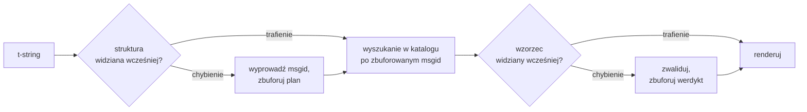

# Jak to działa

Nic na tej stronie nie jest potrzebne, żeby używać biblioteki — pokrywają to
[samouczek](tutorial.md) i [przewodnik](guide.md). Ta strona zamiast tego
odbudowuje bibliotekę od pierwszych zasad: czym t-string naprawdę jest, jak
wynika z niego msgid, co czyni tłumaczenie poprawnym i jak implementacja
sprawia, że całe to sprawdzanie kosztuje dziesiąte części mikrosekundy.
Przeczytaj ją, jeśli jesteś ciekaw, chcesz współtworzyć albo planujesz
[zaimplementować konwencję samodzielnie](#reimplementing-it).

## Czym t-string naprawdę jest { #what-a-t-string-actually-is }

F-string produkuje `str` i produkuje go natychmiast — zanim jakakolwiek
funkcja go otrzyma, wartość jest zinterpolowana, a zdanie zapieczętowane.
T-string ([PEP 750]) ma tę samą składnię i to samo zachłanne obliczanie
swoich wyrażeń, ale produkuje inny typ:

```pycon
>>> name = "Ada"
>>> f"Hello {name}!"
'Hello Ada!'
>>> t"Hello {name}!"
Template(strings=('Hello ', '!'), interpolations=(Interpolation('Ada', 'name', None, ''),))
```

Ten obiekt `Template` przechowuje części, których potrzebuje potok
katalogowy, wciąż rozdzielone:

```pycon
>>> template = t"Total: {amount:,.2f}"
>>> template.strings
('Total: ', '')
>>> template.interpolations[0].expression
'amount'
>>> template.interpolations[0].value
1234.5
>>> template.interpolations[0].format_spec
',.2f'
```

- `strings` — tekst literalny wokół interpolacji, po kolei.
- Dla każdej interpolacji: **wyrażenie** jako tekst źródłowy (`'amount'`),
  jego obliczona **wartość** (`1234.5`) oraz ewentualna **konwersja** (`!r`)
  i **specyfikacja formatu** (`,.2f`) — niesione osobno zamiast
  zastosowane.

Wszystko, co robi ta biblioteka, jest zdyscyplinowaną konsumpcją tej
struktury. Język już dokonał tego jednego rozdzielenia, którego potrzebuje
i18n — tekst statyczny osobno od wartości — więc biblioteka nigdy nie
parsuje Twojego kodu źródłowego i nigdy nie zgaduje, gdzie w zdaniu siedzi
wartość. Pozostają trzy decyzje: jak struktura staje się kluczem katalogu,
co tłumaczenie tego klucza może powiedzieć i jak oba renderują się z
powrotem razem.

## Od szablonu do msgid { #from-template-to-msgid }

Msgid — klucz, którym indeksowany jest katalog — jest wyprowadzany wyłącznie
ze *statycznych* części szablonu. Przejdź `strings` i `interpolations` w
kolejności źródłowej; escapuj nawiasy klamrowe w każdym segmencie literalnym
(`{` staje się `{{`); dla każdej interpolacji wyemituj jeden token `{name}`,
gdzie `name` to tekst wyrażenia z obciętymi otaczającymi białymi znakami.
Z `t"Total: {amount:,.2f}"`:

```text
strings         ('Total: ', '')
interpolations  expression 'amount'   conversion None   format_spec ',.2f'
msgid           'Total: {amount}'
```

Każda część tej reguły ma swój powód:

- **Wyrażenie musi być prostą nazwą** — `str.isidentifier()` zwraca prawdę
  i nie jest to słowo kluczowe Pythona. `t"Hello {user.name}"` jest
  odrzucane w miejscu wywołania. Msgid to *klucz*: musi wychodzić identyczny
  przy każdym uruchomieniu i każdej ekstrakcji, a czytają go tłumacze, więc
  symbol zastępczy musi być stabilnym, znaczącym słowem — nie fragmentem
  kodu zapraszającym katalog do stania się językiem wyrażeń.
- **Konwersja i specyfikacja formatu nigdy nie wchodzą do msgid.** Tłumacze
  nie powinni musieć czytać `:,.2f` i żadne tłumaczenie nie powinno móc
  tego zmienić. Warto znać konsekwencję: zaostrzenie `:,.2f` do `:,.0f` w
  Twoim kodzie nie zmienia żadnego msgid, więc nie unieważnia tłumaczenia w
  żadnym języku. Klucz katalogu śledzi to, *co zdanie mówi*, nie sposób
  formatowania wartości.
- **Powtórzona nazwa musi dokładnie powtórzyć swoje formatowanie.**
  `t"{x:.2f} vs {x:.3f}"` jest odrzucane, bo oba wystąpienia zapadają się w
  ten sam token `{x}`, a msgid nie mógłby już powiedzieć, którego
  formatowania powinno użyć renderowanie.
- **Pusty msgid nigdy nie jest wyszukiwany**, bo gettext rezerwuje go dla
  nagłówka metadanych samego katalogu. `t""` renderuje się jako `""` bez
  dotykania katalogu.

Pełny zestaw reguł, łącznie z przypadkami brzegowymi pomijanymi na tej
stronie, to
[SPEC §2](https://github.com/yhay81/gettext-tstrings/blob/main/SPEC.md).

## Co tłumaczenie może powiedzieć { #what-a-translation-may-say }

Wzorzec wracający z katalogu jest parsowany przez `string.Formatter` — ten
sam parser, którego używa `str.format`. Gramatyka jest celowo pożyczona, a
nie wymyślona: wzorzec, który ta biblioteka akceptuje, to taki, który
szerszy ekosystem już rozumie. Potem stosowane są dwie kontrole.

**Kształt:** każde pole musi być gołym `{name}`. Konwersja lub specyfikacja
formatu — łącznie z jawnie pustym `{name:}` — jest odrzucana, podobnie jak
pola pozycyjne (`{0}`, `{}`) i nazwy dopełnione białymi znakami
(`{ name }`). To ostatnie znaczy więcej, niż wygląda: `str.format` i GNU
`msgfmt` oba odrzucają `{ name }`, więc zaakceptowanie go tutaj
produkowałoby katalogi, których żadne inne narzędzie w łańcuchu nie umie
zwalidować.

**Nazwy:** zbiór symboli zastępczych wzorca jest porównywany ze źródłowym.
Dla komunikatu w liczbie pojedynczej każda nazwa źródłowa jest *wymagana* i
nic poza tym nie jest *dozwolone*. Dla komunikatu w liczbie mnogiej obie
gałęzie są scalane:

- **dozwolone** = suma nazw obu gałęzi
- **wymagane** = ich część wspólna

Więc względem `t"One file"` / `t"{n} files"` nazwa `n` jest dozwolona w
tłumaczeniu obu form, ale wymagana w żadnej. Ta asymetria jest tym, co
pozwala systemowi liczby mnogiej języka docelowego różnić się od
źródłowego — japoński tłumaczy obie gałęzie jedną formą, która pewnie używa
`{n}`; język z większą liczbą form niż angielski może potrzebować `{n}` w
formie, której angielski nie ma.

Nic z tego nie jest hipotetyczne: katalog interfejsu tej strony niesie
komunikat w liczbie mnogiej `Built {n} localized page` / `Built {n} localized
pages` — dwie angielskie gałęzie — a wydania językowe strony tłumaczą ten
jeden komunikat na od jednej formy aż do sześciu:

| Katalog | Formy | Tłumaczenia w kolejności form |
| --- | --- | --- |
| Japoński | 1 | `ローカライズ済みページを{n}件ビルドしました` |
| Turecki | 2 | `{n} yerelleştirilmiş sayfa oluşturuldu` — dwa razy, identycznie: tureckie rzeczowniki pozostają w liczbie pojedynczej po liczebniku |
| Włoski | 2 | `Generata {n} pagina localizzata` · `Generate {n} pagine localizzate` — imiesłów uzgadnia się w rodzaju i liczbie |
| Łotewski | 3 | `Izveidota {n} lokalizēta lapa` · `Izveidotas {n} lokalizētas lapas` · `Izveidots {n} lokalizētu lapu` — trzecia forma jest **wyłącznie dla zera** |
| Rosyjski | 3 | `Собрана {n} локализованная страница` · `Собраны {n} локализованные страницы` · `Собрано {n} локализованных страниц` |
| Polski | 3 | `Zbudowano {n} zlokalizowaną stronę` · `Zbudowano {n} zlokalizowane strony` · `Zbudowano {n} zlokalizowanych stron` |
| Słoweński | 4 | `Zgrajena {n} lokalizirana stran` · `Zgrajeni {n} lokalizirani strani` · `Zgrajene {n} lokalizirane strani` · `Zgrajenih {n} lokaliziranih strani` — druga to **liczba podwójna**, dla dokładnie dwóch |
| Irlandzki | 5 | `Tógadh {n} leathanach logánaithe` · `Tógadh {n} leathanaigh logánaithe` — jeden, dwa, 3–6, 7–10 i reszta; temat się wymienia, ale *leathanach* zaczyna się na `l`, na którym żadna irlandzka mutacja nie jest zapisywana, więc kilka form się pokrywa |
| Arabski | 6 | wśród nich `تم إنشاء صفحة مترجمة واحدة ({n})` dla dokładnie jednego i `تم إنشاء {n} صفحات مترجمة` dla kilku |

Każdy wiersz to żywy wpis w `i18n/*/LC_MESSAGES/site.po` tego repozytorium,
renderowany przez [wielojęzyczny build](index.md) przy każdym wydaniu — a
test przypina tę tabelę do tych katalogów, więc nie mogą się od siebie
rozjechać.

W tych granicach zmiana kolejności i powtarzanie są celowo nieograniczone.
Oba bywają gramatycznie konieczne w prawdziwych językach, a ograniczanie
liczby wystąpień odrzucałoby poprawne tłumaczenia bez żadnego zysku dla
bezpieczeństwa: tłumaczenie i tak nie może niczego *obliczyć*, bo nie
istnieje żadna ścieżka wykonania — symbole zastępcze są wyszukiwane po
nazwie w już obliczonych wartościach szablonu, nigdy nie trafiają do
`eval`, `getattr` ani samego `str.format`.

## Renderowanie { #rendering }

Renderowanie zwalidowanego wzorca to przejście po jego kawałkach: wyemituj
każdą część literalną, a dla każdego symbolu zastępczego weź przechwyconą
wartość interpolacji i zastosuj konwersję i specyfikację formatu *ze strony
źródła* — `format(convert(value, conversion), format_spec)`. Przy tym
dotrzymywane są dwie gwarancje:

- **Każda odrębna wartość jest formatowana najwyżej raz na renderowanie**,
  nawet gdy tłumaczenie powtarza symbol zastępczy. Powtórzenie zmienia to,
  jak często wynik jest wstawiany, nie to, jak często działa Twój
  `__format__`.
- **W liczbie mnogiej symbol zastępczy czyta gałąź, która go
  zdefiniowała.** Nazwa obecna w obu gałęziach czyta wartość przechwyconą
  przez gałąź wybraną przez język *źródłowy* (`singular` gdy `n == 1`, w
  przeciwnym razie `plural`); nazwa specyficzna dla gałęzi zawsze czyta
  własną gałąź, nawet gdy reguły liczby mnogiej języka docelowego
  udostępniły ją w innej formie.

Gdy walidacja zawodzi w czasie renderowania, odpowiedź zależy od tego, kto
dostarczył wzorzec. Wzorzec, który wyszedł z *katalogu*, degraduje się:
zaloguj jedno ostrzeżenie i wyrenderuj tekst źródłowy, dotrzymując
kontraktu gettext, że uszkodzony katalog nigdy nie kładzie aplikacji
([przewodnik pokazuje oba tryby](guide.md#what-happens-when-a-catalog-is-wrong)).
Wzorzec przekazany bezpośrednio przez wywołującego —
`CompiledTemplate.render` — zawsze zgłasza wyjątek, bo nie ma tekstu
źródłowego, do którego można by się zdegradować; łagodność istnieje dla
wyszukiwań w katalogu, nie dla argumentów.

## Diagnostyka jest częścią projektu { #diagnostics-are-part-of-the-design }

Błąd symbolu zastępczego zwykle ląduje przed tłumaczem, nie programistą, i
często w pliku, w którym problem jest niewidoczny. Powiedzenie
`{name} is missing` komuś, kto widzi dokładnie te znaki w swoim edytorze,
jest ślepą uliczką, więc komunikaty są obliczane według trzech reguł:

- Nazwa zawierająca **niewidoczny znak** — twardą spację wyprodukowaną
  przez metodę wprowadzania, spację zerowej szerokości — jest wypisywana z
  tym znakiem zastąpionym jego punktem kodowym, na miejscu:
  `{<U+00A0>name}`. Czytelnik musi zobaczyć *gdzie*.
- Nazwa, której litery **mieszają systemy pisma**, przypadek homoglifów,
  jest pokazywana dwa razy — raz czytelnie, raz z sekwencją ucieczki — bo
  `{nаme}` z cyrylickim `а` jest w druku nieodróżnialne od `{name}`, a
  forma z ucieczką `(nаme)` jest jedynym zapisem, który je rozróżnia.
- Wszystko inne jest pokazywane **tak, jak zapisano**. `{名前}` i `{café}`
  to zwykłe nazwy; escapowanie ich zostawiłoby czytelnika bez możliwości
  znalezienia tego, o co chodziło.

Na tej samej zasadzie „brakujący" symbol zastępczy, który *wygląda* na
obecny, dostaje wyjaśnienie swojej nieobecności — pełnej szerokości nawiasy
klamrowe z metody wprowadzania wschodnioazjatyckiej, podwojenie `{{name}}`
z rundy escapowania, nazwa poza jakimikolwiek nawiasami.
[Tabela czytania błędów](translators.md#reading-a-failure-message) napisana
z myślą o tłumaczach pokazuje każdy z tych komunikatów dosłownie.

## Gorąca ścieżka { #the-hot-path }

Wszystko powyższe dzieje się przy każdym przetłumaczonym łańcuchu, który
renderuje aplikacja, więc implementacja jest zbudowana wokół jednej idei:
**walidacja nigdy nie jest pomijana, więc to walidacja musi być tym, co się
buforuje.**



Trzy pamięci podręczne, po jednej na etap:

- **Plan na strukturę miejsca wywołania.** Krotka `strings` szablonu —
  obiekt, który interpreter i tak już zbudował — jest kluczem pamięci
  podręcznej, więc wyszukanie niczego nie alokuje. Przy trafieniu
  wyrażenie, konwersja i specyfikacja formatu każdej interpolacji są nadal
  porównywane z zapisanymi: dwa miejsca wywołania dzielące tekst literalny,
  ale różniące się formatowaniem (`t"{x:.2f}"` kontra `t"{x:.3f}"`), nie
  mogą się zderzyć, a to porównanie jest ceną używania klucza, który
  interpreter oddaje za darmo.
- **Werdykt na wzorzec.** Za pierwszym razem, gdy katalog odpowiada danym
  wzorcem, jest on parsowany i walidowany; wynik — skompilowany plan
  renderowania albo zapis niepoprawności — jest trzymany na planie. Każde
  późniejsze renderowanie tego komunikatu dociera do niego jednym
  wyszukaniem w słowniku. Niepoprawne wzorce też są zapamiętywane — dlatego
  uszkodzony wpis katalogu ostrzega raz, a nie przy każdym renderowaniu.
- **Scalony plan na parę liczby mnogiej**, trzymający zbiory sumy i części
  wspólnej, żeby arytmetyka gałęzi działa się raz na komunikat, nie raz na
  wywołanie.

Każda pamięć podręczna jest ograniczona i żadna nie zatrzymuje
interpolowanych *wartości* — tylko statyczną strukturę i tekst wzorców.
Wynik, zmierzony przez
[`benchmarks/runtime.py`](https://github.com/yhay81/gettext-tstrings/blob/main/benchmarks/runtime.py):
około 0,4 µs dla komunikatu z jednym polem, wliczając konstrukcję samego
t-stringa, czyli około 2,5× więcej niż zwykły
`gettext(...).format(...)`, który niczego nie sprawdza. Komentarz na górze
[`core.py`](https://github.com/yhay81/gettext-tstrings/blob/main/src/gettext_tstrings/core.py)
odnotowuje poszczególne pomiary stojące za tym kształtem.

## Reimplementacja { #reimplementing-it }

Nic z powyższego nie jest prywatną wiedzą tajemną: konwencja jest spisana
jako [spec v1](spec.md), a jej maszynowo czytelny
[zestaw testów zgodności](spec.md#conformance) pozwala ekstraktorowi,
wtyczce IDE albo implementacji w innym języku sprawdzić się względem każdej
reguły objaśnionej na tej stronie. Ta implementacja uruchamia zestaw we
własnych testach — to właśnie powstrzymuje tę stronę, specyfikację i kod
przed cichym rozjechaniem się.

  [PEP 750]: https://peps.python.org/pep-0750/
