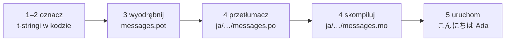

# Samouczek

Ta strona prowadzi od pustego katalogu do programu, który wita po japońsku.
Pięć kroków, żadnego zakładanego doświadczenia z gettext, a każde polecenie
jest pokazane z wynikiem, który naprawdę wypisuje — więc na każdym kroku
wiesz, czy jesteś na dobrej drodze.

Potrzebujesz Pythona 3.14 lub nowszego, bo t-stringi to nowa składnia w 3.14.
Japoński jest przykładowym językiem docelowym tej strony, ale nic nie zależy
od tego wyboru — podstaw dowolny język w kroku 4, gdzie kod locale `ja` jest
jedynym miejscem, które go wskazuje.

## 1. Zainstaluj { #1-install }

```console
python -m pip install "gettext-tstrings[babel]"
```

Rozszerzenie `[babel]` dostarcza [Babel], narzędzie, które w kroku 3 zbiera
Twoje komunikaty do plików katalogu. To narzędzie czasu deweloperskiego: kod
produkcyjny renderuje wyłącznie z pomocą biblioteki standardowej.

## 2. Oznacz komunikat w kodzie { #2-mark-a-message-in-your-code }

Utwórz `app.py`:

```python
from gettext_tstrings import tr

name = "Ada"
print(tr(t"Hello {name}"))
```

`t"Hello {name}"` wygląda jak f-string, ale przedrostek `t` trzyma tekst i
wartość osobno, zamiast scalać je na miejscu. To rozdzielenie pozwala funkcji
`tr()` wyszukać tłumaczenie całego zdania `Hello {name}` i wstawić wartość
dopiero potem.

Uruchom to teraz:

```console
$ python app.py
Hello Ada
```

Żadne tłumaczenia nie są jeszcze zainstalowane, więc tekst źródłowy renderuje
się bez zmian. Program używający tej biblioteki nigdy nie *wymaga* katalogu,
żeby działać — angielski (lub jakikolwiek jest Twój język źródłowy) jest
wbudowanym zabezpieczeniem.

## 3. Wyodrębnij komunikaty { #3-extract-the-messages }

Tłumacze nie czytają Twojego kodu źródłowego; między Wami krąży mały plik
zwany **katalogiem**. Pierwszym krokiem w jego stronę jest zebranie z kodu
każdego oznaczonego komunikatu.

Powiedz Babel, jak znaleźć Twoje komunikaty, tworząc `babel.cfg`:

```ini
[gettext_tstrings: **.py]
encoding = utf-8
```

Następnie wyodrębnij je do pliku szablonu (`.pot`):

```console
$ mkdir -p locales
$ pybabel extract -F babel.cfg -c "Translators:" -o locales/messages.pot .
extracting messages from app.py (encoding="utf-8")
writing PO template file to locales/messages.pot
```

`locales/messages.pot` zawiera teraz jeden wpis na komunikat:

```po
#. gettext-tstrings
#: app.py:4
#, python-brace-format
msgid "Hello {name}"
msgstr ""
```

`msgid` to klucz, po którym Twój kod będzie szukał. Pusty `msgstr` to miejsce
na tłumaczenie — ale nie w tym pliku: `.pot` to *szablon*, a następny krok
kopiuje go raz na każdy język.

## 4. Przetłumacz i skompiluj { #4-translate-and-compile }

Utwórz japoński katalog z szablonu:

```console
$ pybabel init -i locales/messages.pot -d locales -l ja
creating catalog locales/ja/LC_MESSAGES/messages.po based on locales/messages.pot
```

Otwórz `locales/ja/LC_MESSAGES/messages.po` i wypełnij `msgstr`:

```po
msgid "Hello {name}"
msgstr "こんにちは {name}"
```

Zachowaj `{name}` dokładnie tak, jak jest — symbol zastępczy jest tym, dzięki
czemu wartość znajduje swoje miejsce w przetłumaczonym zdaniu, a tłumaczenie
może przesunąć go tam, gdzie potrzebuje tego język docelowy. W prawdziwym
projekcie ten plik `.po` to właśnie to, co przekazujesz tłumaczowi lub
wysyłasz na platformę tłumaczeniową; format jest w obu przypadkach ten sam.

Katalogi edytuje się jako tekst, ale wczytuje w postaci binarnej (`.mo`),
więc skompiluj:

```console
$ pybabel compile -d locales
compiling catalog locales/ja/LC_MESSAGES/messages.po to locales/ja/LC_MESSAGES/messages.mo
```

To polecenie jest też siatką bezpieczeństwa. Gdyby tłumaczenie uszkodziło
symbol zastępczy — powiedzmy `{nome}` zamiast `{name}` — odmówiłoby przejścia:

```console
$ pybabel compile -d locales
error: locales/ja/LC_MESSAGES/messages.po:24: translation does not match the
source placeholders: {name} is missing; {nome} is not in the source message
1 errors encountered.
```

## 5. Uruchom { #5-run-it }

Skieruj `app.py` na skompilowany katalog. Kliknij znaczniki, żeby zobaczyć,
co robi każda linia:

```python
import gettext

from gettext_tstrings import Translator

_ = Translator(gettext.translation("messages", localedir="locales", languages=["ja"]))  # (1)!

name = "Ada"
print(_(t"Hello {name}"))  # (2)!
```

1. Biblioteka standardowa wczytuje skompilowany `.mo`, a `Translator` wiąże
   go z obiektem wywoływalnym. `_` to konwencjonalna gettextowa nazwa dla
   „przetłumacz to" — krótka, bo pojawia się przy każdym łańcuchu widocznym
   dla użytkownika. To ta sama funkcja co `tr`, związana z jednym katalogiem.
2. W miejscu wywołania: tekst t-stringa staje się kluczem wyszukiwania
   `Hello {name}`, katalog odpowiada `こんにちは {name}`, odpowiedź jest
   sprawdzana względem źródłowych symboli zastępczych i dopiero wtedy
   wstawiana jest wartość.

```console
$ python app.py
こんにちは Ada
```

To cała pętla i warto zobaczyć ją jako jeden obraz:



**Oznacz → wyodrębnij → przetłumacz → skompiluj → uruchom.** Wszystko inne na
tej stronie jest doprecyzowaniem jednego z tych pięciu kroków.

## Co dalej { #where-next }

- [Dlaczego t-stringi](comparison.md) — przed czym ten projekt Cię chroni, w
  porównaniu z `%(name)s`, `.format()` i `$`-stringami.
- [Przewodnik](guide.md) — liczba mnoga, języki na żądanie, odroczone
  łańcuchy i to, co dzieje się w czasie działania, gdy katalog mimo wszystko
  jest błędny.
- [W produkcji](workflow.md) — ta sama pętla tak, jak prowadzi ją zespół,
  tydzień po tygodniu: aktualizowanie katalogów, bramki CI i platformy
  tłumaczeniowe.
- [Ekstrakcja](extraction.md) — pełna dokumentacja `pybabel`: własne nazwy
  funkcji, ścisły tryb CI i kontrole, które strzegą Twoich katalogów.

  [Babel]: https://babel.pocoo.org/
