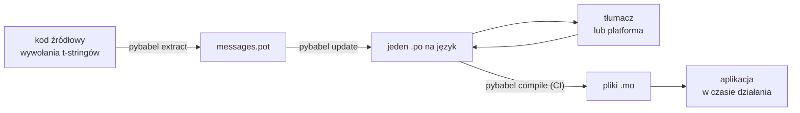

# W produkcji

[Samouczek](tutorial.md) przechodzi pętlę raz, w pojedynkę, na programie z
jednym komunikatem. W prawdziwym projekcie pętla kręci się dalej: komunikaty
zmieniają się po tym, jak zostały przetłumaczone, tłumacz pracuje gdzie
indziej i według własnego harmonogramu, a skompilowany katalog wychodzi z
każdym wydaniem. Ta strona jest tą praktyką — co zostaje w repozytorium, co
podróżuje, co musi bramkować CI i gdzie środowisko uruchomieniowe wiąże
język.

## Kształt projektu { #the-shape-of-a-project }

```text
myapp/
├── babel.cfg
├── pyproject.toml
├── src/
│   └── myapp/
└── locales/
    ├── messages.pot
    ├── ja/LC_MESSAGES/messages.po
    └── de/LC_MESSAGES/messages.po
```

Commituj `babel.cfg`, szablon `.pot` i każdy `.po` — to źródła builda
tłumaczeń, a ich diffy są sposobem przeglądania zmian w tłumaczeniach.
Skompilowane pliki `.mo` to artefakty builda: wytwarzaj je w CI albo przy
pakowaniu, zamiast je commitować, żeby `.po` i jego `.mo` nigdy nie mogły
się różnić co do tego, co wychodzi.

Jeden plik ma rolę w każdą stronę: `.pot` niesie Twoje komunikaty *do*
tłumaczy, pliki `.po` niosą tłumaczenia *z powrotem*. Wszystko poniżej to
ruch między tymi dwoma.



## Cykl po pierwszym tłumaczeniu { #the-cycle-after-the-first-translation }

Samouczkowy `pybabel init` uruchamia się raz na język — na zawsze. Od tej
pory roboczy cykl to **ekstrakcja → aktualizacja → tłumaczenie →
kompilacja**, a jego środkiem jest `pybabel update`, który wtapia świeży
szablon w istniejące katalogi bez odrzucania tłumaczeń już w nich obecnych.

Załóżmy, że powitanie `Hello {name}` — przetłumaczone już jako
`こんにちは {name}` — zostaje w kodzie przeredagowane na
`Welcome back, {name}`. Wyodrębnij i zaktualizuj:

```console
$ pybabel extract -F babel.cfg -c "Translators:" -o locales/messages.pot .
extracting messages from app.py (encoding="utf-8")
writing PO template file to locales/messages.pot
$ pybabel update -i locales/messages.pot -d locales
updating catalog locales/ja/LC_MESSAGES/messages.po based on locales/messages.pot
```

Japoński katalog zawiera teraz:

```po
#. gettext-tstrings
#: app.py:4
#, fuzzy, python-brace-format
msgid "Welcome back, {name}"
msgstr "こんにちは {name}"
```

Babel zauważył, że nowy msgid przypomina usunięty, i sparował go ze starym
tłumaczeniem — ale oznaczył parę jako **fuzzy**: maszynowe przypuszczenie
czekające na człowieka. Ta flaga ma zęby. `pybabel compile` **wyklucza wpisy
fuzzy z `.mo`**, więc dopóki tłumacz nie potwierdzi pary, aplikacja
renderuje nowy angielski tekst, a nie przeterminowany japoński:

```console
$ pybabel compile -d locales
compiling catalog locales/ja/LC_MESSAGES/messages.po to locales/ja/LC_MESSAGES/messages.mo
$ python app.py
Welcome back, Ada
```

Zmieniony komunikat degraduje się więc tak samo jak uszkodzony — do języka
źródłowego, nigdy do nieaktualnego tłumaczenia. Rolą tłumacza w cyklu jest
poprawić `msgstr` i usunąć flagę `fuzzy`; następna kompilacja podejmie wpis.

!!! note "Nazwy symboli zastępczych są częścią tożsamości komunikatu"

    Msgid jest kluczem katalogu, a *nazwa* symbolu zastępczego jest w jego
    środku — więc zmiana nazwy zmiennej w kodzie (`name` → `user_name`)
    zmienia msgid i wysyła tłumaczenia we wszystkich językach z powrotem
    przez cykl fuzzy. Nazywaj interpolowane zmienne słowami, które tłumacz
    zrozumie, i zmieniaj ich nazwy tylko z powodu.

    Formatowanie jest lustrzanym odbiciem: `!r` i `:.2f` [nie są częścią
    msgid](internals.md#from-template-to-msgid), więc zaostrzenie
    `{amount:,.2f}` do `{amount:,.0f}` nie zmienia niczego w żadnym
    katalogu. Przeredagowanie *zdania* to oczywiście prawdziwa zmiana — to
    cykl powyżej.

## Co bramkuje CI { #what-ci-gates }

Trzy niepowodzenia są warte czerwonego builda: katalogi zostały w tyle za
kodem, tłumaczenie zepsuło symbol zastępczy albo uszkodzony wpis
prześlizgnął się do środowiska uruchomieniowego. Jeden krok na
niepowodzenie:

```yaml
- run: pybabel extract -F babel.cfg -c "Translators:" -o locales/messages.pot .
- run: pybabel update -i locales/messages.pot -d locales --check
- run: pybabel compile -d locales
- run: pytest
```

`pybabel update --check` niczego nie przepisuje i wychodzi z niezerowym
kodem, gdy katalog jest nieaktualny względem świeżo wyodrębnionego szablonu
— to strażnik przed scaleniem kodu, którego komunikatów nikt ponownie nie
wyodrębnił. `pybabel compile` uruchamia kontrole symboli zastępczych
zarówno Babel, jak i
[zarejestrowanego checkera](extraction.md#your-existing-toolchain-validates-these-catalogs)
tego pakietu.

!!! bug "`--check` nie potrafi bramkować katalogu używającego kontekstów"

    W Babel 2.18.0 `pybabel update --check` raportuje **każdy** katalog
    zawierający `msgctxt` jako nieaktualny, przy każdym uruchomieniu,
    niezależnie od tego, jak bardzo jest aktualny. Porównanie przebiega
    przez `Catalog.is_identical`, które wyszukuje każdy komunikat po kluczu,
    pod którym jest przechowywany — a dla komunikatu z kontekstem tym
    kluczem jest para `(id, context)`, której `Catalog.get` nie przyjmuje.
    Wyszukiwanie nie zwraca nic, więc katalogi nigdy nie okazują się równe:

    ```pycon
    >>> from babel.messages.catalog import Catalog
    >>> c = Catalog(locale="ja")
    >>> c.add("Guide", "ガイド", context="navigation")
    <Message 'Guide' (flags: [])>
    >>> c.is_identical(c)
    False
    ```

    Więc jeśli w ogóle używasz `pgettext` albo `npgettext` — a
    ujednoznacznianie homonimu jest powodem, dla którego one istnieją — ten
    krok zawodzi otwarcie w najgorszy możliwy sposób: zawsze na czerwono,
    więc zespół go wyłącza, więc nic nie bramkuje nieaktualności. Dopóki nie
    zostanie to naprawione u źródła, porównuj zbiory komunikatów
    samodzielnie. Wczytanie szablonu i każdego katalogu za pomocą
    `babel.messages.pofile.read_po` oraz porównanie
    `{(m.context, m.id) for m in catalog if m.id}` to cała kontrola — i
    dokładnie to robi [własny build tej strony](index.md).

!!! danger "Sprawdzaj status wyjścia, nie log"

    `pybabel compile` raportuje każdy błąd symboli zastępczych, wychodzi z
    niezerowym kodem — **i mimo to zapisuje `.mo`**. Potok, który kompiluje,
    a potem kopiuje `locales/` do obrazu, wysyła uszkodzony katalog, chyba
    że niezerowy kod wyjścia faktycznie go zatrzyma. Pozwolenie temu
    krokowi oblać build, jak powyżej, jest całą poprawką.

Ostatnia linia to Twój zwykły zestaw testów, z jednym dodanym nawykiem:
gdzieś w nim wyrenderuj co najmniej jeden komunikat na każdy wysyłany język
przez ścisły translator —

```python
import gettext

from gettext_tstrings import Translator

def test_catalogs_render(language: str) -> None:
    translations = gettext.translation("messages", localedir="locales", languages=[language])
    _ = Translator(translations, strict=True)
    name = "Ada"
    assert _(t"Welcome back, {name}")
```

— bo `strict=True` [zgłasza wyjątek tam, gdzie produkcja po cichu by się
wycofała](guide.md#what-happens-when-a-catalog-is-wrong), a renderowanie w
czasie działania to jedyna kontrola, która widzi katalog dokładnie tak, jak
zobaczy go aplikacja, razem z `.mo`.

## Praca z tłumaczami i platformami { #working-with-translators-and-platforms }

Plik `.po` jest formatem wymiany całego świata gettext i to jest powód, dla
którego ta biblioteka go używa: przekazanie tłumaczenia oznacza przekazanie
pliku, niezależnie od tego, czy odbiorcą jest współpracownik z edytorem PO,
czy platforma jak Weblate lub Crowdin. Trzy rzeczy sprawiają, że to
przekazanie działa dobrze:

**Powiedz, do czego służy komunikat.** Komentarz w kodzie podróżuje z
komunikatem — to właśnie zbiera flaga `-c "Translators:"`:

```python
from gettext_tstrings import tr

name = "Ada"
# Translators: shown on the dashboard right after sign-in
print(tr(t"Welcome back, {name}"))
```

```po
#. Translators: shown on the dashboard right after sign-in
#. gettext-tstrings
#: app.py:5
#, python-brace-format
msgid "Welcome back, {name}"
msgstr ""
```

Tłumacz widzi ten komentarz w swoim edytorze, obok komunikatu, po drugiej
stronie świata. To najtańsza dźwignia jakości w całym przepływie pracy. Dla
słowa będącego swoim własnym homonimem — „Open" jako przycisk kontra
„Open" jako stan — nadaj komunikatowi [kontekst](guide.md#binding-a-catalog)
przez `pgettext`, który staje się widocznym `msgctxt` w katalogu.

**Pozwól platformie walidować symbole zastępcze.** Każdy komunikat
wyodrębniony z t-stringa niesie flagę `python-brace-format` i ta jedna
linia włącza QA symboli zastępczych w narzędziach, których nie
kontrolujesz — Weblate dokumentuje tę kontrolę, platformy komercyjne
opierają na tej samej fladze swoje własne, a `msgfmt --check-format`
wymusza ją w każdym potoku GNU. Szczegóły — i to, co dostarczony checker
wychwytuje ponad nie — są na
[stronie ekstrakcji](extraction.md#your-existing-toolchain-validates-these-catalogs).

**Ufaj siatce bezpieczeństwa dokładnie na tyle, na ile sięga.** Cokolwiek
wraca z platformy, wciąż jest danymi wchodzącymi do Twojego builda; bramki
CI powyżej są tym, co zamienia „platforma to pewnie sprawdziła" w „to nie
może wyjść zepsute".

## Wiązanie języka w czasie działania { #binding-a-language-at-runtime }

Wszystko dotąd produkuje katalogi. Pozostała decyzja to gdzie aplikacja
jeden z nich wybiera, i ma ona jedną uczciwą odpowiedź: zwiąż raz na
*zakres języka* — proces dla CLI, żądanie dla usługi webowej.

=== "Jeden proces, jeden język"

    Narzędzie wiersza poleceń lub aplikacja desktopowa czyta środowisko
    użytkownika raz, przy starcie. Pominięcie `languages=` pozwala
    bibliotece standardowej negocjować z `LANGUAGE`, `LC_ALL`,
    `LC_MESSAGES` i `LANG`; `fallback=True` zwraca pusty katalog — tekst
    źródłowy — zamiast zgłaszać wyjątek, gdy żadna z nich nie pasuje do
    katalogu, który wysyłasz.

    ```python
    import gettext

    from gettext_tstrings import Translator

    _ = Translator(gettext.translation("messages", localedir="locales", fallback=True))

    name = "Ada"
    print(_(t"Welcome back, {name}"))
    ```

=== "Flask"

    Aplikacja webowa decyduje per żądanie. Wczytaj każdy katalog raz przy
    imporcie, a potem zwiąż wynegocjowany z kontekstem, zanim uruchomi się
    widok — [`set_translations`](guide.md#per-request-language) jest
    lokalny dla kontekstu, więc współbieżne żądania w różnych językach
    nigdy nie widzą nawzajem swoich wiązań.

    ```python
    import gettext

    from flask import Flask, request

    from gettext_tstrings import set_translations, tr

    LANGUAGES = ("en", "ja", "de")
    CATALOGS = {
        language: gettext.translation(
            "messages", localedir="locales", languages=[language], fallback=True
        )
        for language in LANGUAGES
    }

    app = Flask(__name__)

    @app.before_request
    def bind_language() -> None:
        language = request.accept_languages.best_match(LANGUAGES) or "en"
        set_translations(CATALOGS[language])

    @app.get("/")
    def home() -> str:
        name = "Ada"
        return tr(t"Welcome back, {name}")
    ```

=== "Middleware ASGI"

    W frameworkach asynchronicznych — FastAPI, Starlette i wszystkim innym
    na ASGI — opakuj żądanie w
    [`use_translations`](guide.md#per-request-language): wiązanie żyje w
    `ContextVar`, który przełączanie zadań async zachowuje per żądanie.

    ```python
    import gettext

    from fastapi import FastAPI, Request

    from gettext_tstrings import tr, use_translations

    LANGUAGES = ("en", "ja", "de")
    CATALOGS = {
        language: gettext.translation(
            "messages", localedir="locales", languages=[language], fallback=True
        )
        for language in LANGUAGES
    }

    app = FastAPI()

    @app.middleware("http")
    async def bind_language(request: Request, call_next):
        language = negotiate_language(request.headers.get("accept-language"), LANGUAGES)
        with use_translations(CATALOGS[language]):
            return await call_next(request)
    ```

    `negotiate_language` reprezentuje Twoje parsowanie Accept-Language —
    większość frameworków lub ich ekosystemów jakieś dostarcza; tym, co się
    tu liczy, jest wiązanie wokół `call_next`.

Dwa nawyki czasu działania dopełniają obraz. Łańcuchy tworzone w czasie
importu — etykieta formularza, wyświetlana nazwa enuma — nie mogą
przechwycić języka, który akurat był aktywny podczas importu; definiuj je
przez [`lazy_gettext`](guide.md#deferred-translation), a wyrenderują się w
języku aktywnym przy *użyciu*. I kieruj logger `gettext_tstrings` tam,
gdzie patrzy człowiek: jego ostrzeżenia to tryb łagodny raportujący
tłumaczenie, które prześlizgnęło się przez każdą bramkę — jedna linia na
uszkodzony komunikat, a nie jedna na renderowanie.

## Wysyłka { #shipping }

Produkcja potrzebuje pakietu, plików `.mo` i niczego więcej. Babel jest
zależnością deweloperską i CI — trzymaj `gettext-tstrings[babel]` poza
obrazem produkcyjnym i instaluj tam goły pakiet; renderowanie działa na
samej bibliotece standardowej. Kompiluj katalogi w tym samym buildzie,
który produkuje wdrażany artefakt, żeby pliki `.mo` w jego środku były
dokładnie zrecenzowanymi plikami `.po` i żeby nic skompilowanego na czyimś
laptopie nigdy nie wyszło.

Przed wydaniem — lista kontrolna, do której sprowadza się ta strona:

- `pybabel update --check` przechodzi — żaden komunikat nie zmienił się bez
  wiedzy katalogów.
- `pybabel compile` bramkuje build swoim statusem wyjścia.
- Pozostałe wpisy `fuzzy` są zamierzone — każdy renderuje się jako tekst
  źródłowy, dopóki tłumacz go nie potwierdzi.
- Zestaw testów renderuje każdy wysyłany język raz ze `strict=True`.
- Artefakt produkcyjny zawiera pliki `.mo` i żadnego Babel.
- Logger `gettext_tstrings` jest podpięty do monitoringu.

## Co dalej { #where-next }

- [Ekstrakcja](extraction.md) — dokumentacja narzędziowej połowy tej
  strony: opcje mapowań, własne nazwy funkcji, tryb ścisły i każdy checker.
- [Przewodnik](guide.md) — połowa czasu działania: liczba mnoga, konteksty,
  odroczone łańcuchy i tryby awarii w szczegółach.
- [Jak to działa](internals.md) — dlaczego msgid wygląda tak, jak wygląda,
  i co naprawdę sprawdza walidacja.
