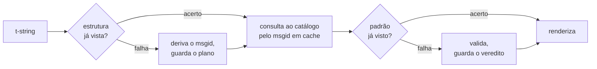

# Como funciona

Nada nesta página é necessário para usar a biblioteca — o
[tutorial](tutorial.md) e o [guia](guide.md) cobrem isso. Esta página, em vez
disso, reconstrói a biblioteca a partir dos primeiros princípios: o que uma
t-string realmente é, como um msgid decorre dela, o que torna uma tradução
válida e como a implementação faz toda essa verificação custar décimos de
microssegundo. Leia-a se estiver com curiosidade, se quiser contribuir ou se
planeja [implementar a convenção por conta própria](#reimplementing-it).

## O que uma t-string realmente é { #what-a-t-string-actually-is }

Uma f-string produz uma `str`, e a produz imediatamente — quando qualquer
função a recebe, o valor já foi interpolado e a frase está selada. Uma
t-string ([PEP 750]) tem a mesma sintaxe e a mesma avaliação imediata de suas
expressões, mas produz um tipo diferente:

```pycon
>>> name = "Ada"
>>> f"Hello {name}!"
'Hello Ada!'
>>> t"Hello {name}!"
Template(strings=('Hello ', '!'), interpolations=(Interpolation('Ada', 'name', None, ''),))
```

Esse objeto `Template` guarda as partes de que um pipeline de catálogo
precisa, ainda separadas:

```pycon
>>> template = t"Total: {amount:,.2f}"
>>> template.strings
('Total: ', '')
>>> template.interpolations[0].expression
'amount'
>>> template.interpolations[0].value
1234.5
>>> template.interpolations[0].format_spec
',.2f'
```

- `strings` — o texto literal ao redor das interpolações, em ordem.
- Para cada interpolação: a **expressão** como texto-fonte (`'amount'`), seu
  **valor** avaliado (`1234.5`) e qualquer **conversão** (`!r`) e
  **especificação de formato** (`,.2f`) — carregadas separadamente em vez de
  aplicadas.

Tudo o que esta biblioteca faz é um consumo disciplinado dessa estrutura. A
linguagem já fez a única separação de que a i18n precisa — texto estático à
parte dos valores —, então a biblioteca nunca analisa o seu código-fonte e
nunca adivinha onde um valor está dentro de uma frase. O que resta são três
decisões: como a estrutura vira uma chave de catálogo, o que uma tradução
dessa chave pode dizer e como as duas renderizam juntas de volta.

## Do template ao msgid { #from-template-to-msgid }

Um msgid — a chave pela qual um catálogo é indexado — é derivado apenas das
partes *estáticas* do template. Percorra `strings` e `interpolations` na
ordem da origem; escape as chaves de cada segmento literal (`{` vira `{{`);
para cada interpolação, emita um token `{name}`, em que `name` é o texto da
expressão sem os espaços em volta. De `t"Total: {amount:,.2f}"`:

```text
strings         ('Total: ', '')
interpolations  expression 'amount'   conversion None   format_spec ',.2f'
msgid           'Total: {amount}'
```

Cada parte dessa regra tem um motivo:

- **A expressão deve ser um nome simples** — `str.isidentifier()` é
  verdadeiro e não é uma palavra reservada do Python. `t"Hello {user.name}"`
  é rejeitada no ponto da chamada. Um msgid é uma *chave*: precisa sair
  idêntico em toda execução e toda extração, e é lido por quem traduz, então
  o marcador deve ser uma palavra estável e com significado — não um
  fragmento de código que convide o catálogo a virar uma linguagem de
  expressões.
- **A conversão e a especificação de formato nunca entram no msgid.** Quem
  traduz não deveria ter de ler `:,.2f`, e nenhuma tradução deve poder
  alterá-la. O corolário vale a pena conhecer: apertar `:,.2f` para `:,.0f`
  no seu código não muda msgid nenhum, então não invalida tradução alguma em
  idioma algum. A chave do catálogo acompanha *o que a frase diz*, não como o
  valor é formatado.
- **Um nome repetido deve repetir sua formatação exatamente.**
  `t"{x:.2f} vs {x:.3f}"` é rejeitada, porque as duas ocorrências colapsam no
  mesmo token `{x}` e o msgid não conseguiria mais dizer qual formatação uma
  renderização deve usar.
- **O msgid vazio nunca é consultado**, porque o gettext o reserva para o
  cabeçalho de metadados do próprio catálogo. `t""` renderiza como `""` sem
  tocar no catálogo.

O conjunto completo de regras, incluindo casos extremos que esta página pula,
está na
[SPEC §2](https://github.com/yhay81/gettext-tstrings/blob/main/SPEC.md).

## O que uma tradução pode dizer { #what-a-translation-may-say }

Um padrão que volta de um catálogo é analisado com `string.Formatter` — o
mesmo parser que `str.format` usa. A gramática é deliberadamente emprestada,
não inventada: um padrão que esta biblioteca aceita é um padrão que o
ecossistema mais amplo já entende. Em seguida, duas verificações se aplicam.

**Forma:** todo campo deve ser um `{name}` puro. Uma conversão ou
especificação de formato — incluindo a explicitamente vazia `{name:}` — é
rejeitada, assim como campos posicionais (`{0}`, `{}`) e nomes com espaços
dentro das chaves (`{ name }`). O último caso importa mais do que parece:
tanto `str.format` quanto o `msgfmt` do GNU rejeitam `{ name }`, então
aceitá-lo aqui produziria catálogos que nenhuma outra ferramenta da cadeia
consegue validar.

**Nomes:** o conjunto de marcadores do padrão é comparado com o da origem.
Para uma mensagem singular, todo nome da origem é *obrigatório* e nada além é
*permitido*. Para uma mensagem plural, os dois ramos são mesclados:

- **permitido** = a união dos nomes dos dois ramos
- **obrigatório** = a interseção deles

Assim, diante de `t"One file"` / `t"{n} files"`, o nome `n` é permitido em
uma tradução de qualquer das formas, mas não é obrigatório em nenhuma. Essa
assimetria é o que permite ao sistema de plural do idioma de destino diferir
do da origem — o japonês traduz os dois ramos com uma única forma que
provavelmente usa `{n}`; um idioma com mais formas que o inglês pode precisar
de `{n}` em uma forma na qual o inglês não tem nenhuma.

Nada disso é hipotético: o catálogo do próprio chrome deste site carrega a
mensagem plural `Built {n} localized page` / `Built {n} localized pages` —
dois ramos em inglês — e as edições do site traduzem essa única mensagem em
de uma a seis formas:

| Catálogo | Formas | As traduções, na ordem das formas |
| --- | --- | --- |
| Japonês | 1 | `ローカライズ済みページを{n}件ビルドしました` |
| Turco | 2 | `{n} yerelleştirilmiş sayfa oluşturuldu` — duas vezes, de forma idêntica: os substantivos turcos permanecem no singular depois de um numeral |
| Italiano | 2 | `Generata {n} pagina localizzata` · `Generate {n} pagine localizzate` — o particípio concorda em gênero e número |
| Letão | 3 | `Izveidota {n} lokalizēta lapa` · `Izveidotas {n} lokalizētas lapas` · `Izveidots {n} lokalizētu lapu` — a terceira forma é para **zero apenas** |
| Russo | 3 | `Собрана {n} локализованная страница` · `Собраны {n} локализованные страницы` · `Собрано {n} локализованных страниц` |
| Polonês | 3 | `Zbudowano {n} zlokalizowaną stronę` · `Zbudowano {n} zlokalizowane strony` · `Zbudowano {n} zlokalizowanych stron` |
| Esloveno | 4 | `Zgrajena {n} lokalizirana stran` · `Zgrajeni {n} lokalizirani strani` · `Zgrajene {n} lokalizirane strani` · `Zgrajenih {n} lokaliziranih strani` — a segunda é um **dual**, para exatamente dois |
| Irlandês | 5 | `Tógadh {n} leathanach logánaithe` · `Tógadh {n} leathanaigh logánaithe` — um, dois, 3–6, 7–10 e o restante; o radical alterna, mas *leathanach* começa com `l`, letra em que nenhuma mutação irlandesa se escreve, de modo que várias formas coincidem |
| Árabe | 6 | entre elas, `تم إنشاء صفحة مترجمة واحدة ({n})` para exatamente um e `تم إنشاء {n} صفحات مترجمة` para uns poucos |

Cada linha é uma entrada viva no `i18n/*/LC_MESSAGES/site.po` deste
repositório, renderizada pelo [build multilíngue](index.md) a cada release — e
um teste fixa esta tabela nesses catálogos, para que as duas coisas não possam
divergir.

Dentro desses limites, reordenar e repetir são deliberadamente livres. Ambos
são gramaticalmente necessários em idiomas reais, e restringir contagens de
ocorrência rejeitaria traduções corretas sem nenhum ganho de segurança: uma
tradução continua sem poder *avaliar* coisa alguma, porque não existe caminho
de avaliação — os marcadores são consultados por nome nos valores já
computados do template, nunca entregues a `eval`, `getattr` ou ao próprio
`str.format`.

## Renderização { #rendering }

Renderizar um padrão validado é percorrer seus pedaços: emitir cada parte
literal e, para cada marcador, tomar o valor capturado da interpolação e
aplicar a conversão e a especificação de formato *do lado da origem* —
`format(convert(value, conversion), format_spec)`. Duas garantias são
mantidas ao fazê-lo:

- **Cada valor distinto é formatado no máximo uma vez por renderização**,
  mesmo quando a tradução repete um marcador. A repetição muda quantas vezes
  o resultado é inserido, não quantas vezes o seu `__format__` roda.
- **Nos plurais, um marcador lê o ramo que o definiu.** Um nome presente nos
  dois ramos lê o valor capturado pelo ramo que o idioma de *origem*
  seleciona (`singular` quando `n == 1`, senão `plural`); um nome específico
  de um ramo sempre lê o próprio ramo, mesmo quando as regras de plural do
  idioma de destino o disponibilizaram em outra forma.

Quando a validação falha na hora de renderizar, a resposta se divide conforme
quem forneceu o padrão. Um padrão que saiu de um *catálogo* degrada: registra
um único aviso e renderiza o texto de origem, mantendo o contrato do gettext
de que um catálogo quebrado nunca derruba a aplicação
([o guia mostra os dois modos](guide.md#what-happens-when-a-catalog-is-wrong)).
Um padrão que o chamador passou diretamente — `CompiledTemplate.render` —
sempre levanta exceção, porque não há texto de origem *para o qual* degradar;
a leniência existe para consultas ao catálogo, não para argumentos.

## Os diagnósticos fazem parte do design { #diagnostics-are-part-of-the-design }

Um erro de marcador costuma cair diante de quem traduz, não de quem programa,
e muitas vezes em um arquivo em que o problema é invisível. Dizer
`{name} is missing` a alguém que consegue ver exatamente esses caracteres no
editor é um beco sem saída, então as mensagens são computadas com três
regras:

- Um nome contendo um **caractere invisível** — um espaço inseparável
  produzido por um método de entrada, um espaço de largura zero — é impresso
  com esse caractere substituído pelo seu ponto de código, no lugar exato:
  `{<U+00A0>name}`. Quem lê precisa ver *onde*.
- Um nome cujas letras **misturam sistemas de escrita**, o caso dos
  homóglifos, é mostrado duas vezes — uma de forma legível, outra escapada —,
  porque `{nаme}` com um `а` cirílico é indistinguível de `{name}` impresso,
  e a forma escapada `(nаme)` é a única grafia que os distingue.
- Todo o resto é mostrado **como foi escrito**. `{名前}` e `{café}` são nomes
  comuns; escapá-los deixaria quem lê sem conseguir encontrar o que se quis
  dizer.

Pelo mesmo princípio, um marcador "ausente" que *parece* presente tem sua
ausência explicada — chaves de largura total de um método de entrada do leste
asiático, o dobramento `{{name}}` de uma ida e volta de escape, o nome fora
de quaisquer chaves. A
[tabela de leitura de falhas](translators.md#reading-a-failure-message)
escrita para quem traduz
mostra cada uma dessas mensagens na íntegra.

## O caminho quente { #the-hot-path }

Tudo o que está acima acontece em cada string traduzida que uma aplicação
renderiza, então a implementação é construída em torno de uma ideia: **a
validação nunca é pulada, então a validação deve ser o que fica em cache.**



Três caches, um por estágio:

- **Um plano por estrutura de ponto de chamada.** A tupla `strings` do
  template — um objeto que o interpretador já construiu — é a chave do cache,
  então uma consulta não aloca nada. Em um acerto, a expressão, a conversão e
  a especificação de formato de cada interpolação ainda são comparadas com as
  registradas: dois pontos de chamada que compartilham o texto literal mas
  diferem na formatação (`t"{x:.2f}"` contra `t"{x:.3f}"`) não podem colidir,
  e essa comparação é o preço de usar uma chave que o interpretador entrega
  de graça.
- **Um veredito por padrão.** Na primeira vez que um catálogo responde com um
  dado padrão, ele é analisado e validado; o resultado — um plano de
  renderização compilado, ou um registro de invalidade — fica guardado no
  plano. Toda renderização posterior dessa mensagem o alcança em uma única
  consulta de dicionário. Padrões inválidos também são lembrados, e é por
  isso que uma entrada quebrada de catálogo avisa uma vez, e não a cada
  renderização.
- **Um plano mesclado por par de plural**, guardando os conjuntos de
  união/interseção para que a aritmética dos ramos aconteça uma vez por
  mensagem, não uma vez por chamada.

Todo cache é limitado, e nenhum retém *valores* interpolados — apenas
estrutura estática e texto de padrão. O resultado, medido por
[`benchmarks/runtime.py`](https://github.com/yhay81/gettext-tstrings/blob/main/benchmarks/runtime.py):
cerca de 0,4 µs para uma mensagem de um campo, incluindo a construção da
própria t-string — aproximadamente 2,5× um `gettext(...).format(...)` puro
que não verifica nada. O comentário no topo de
[`core.py`](https://github.com/yhay81/gettext-tstrings/blob/main/src/gettext_tstrings/core.py)
registra as medições individuais por trás desse número.

## Reimplementando a convenção { #reimplementing-it }

Nada do que está acima é conhecimento secreto: a convenção está registrada
como a [especificação v1](spec.md), e sua
[suíte de conformidade](spec.md#conformance) legível por máquinas permite que
um extrator, um plugin de IDE ou uma implementação em outra linguagem se
verifique contra cada regra que esta página explicou. Esta implementação
executa a suíte nos próprios testes, que é o que impede esta página, a
especificação e o código de divergirem em silêncio.

  [PEP 750]: https://peps.python.org/pep-0750/
