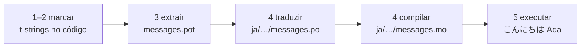

# Tutorial

Esta página vai de um diretório vazio a um programa que cumprimenta em japonês.
Cinco passos, sem pressupor experiência com gettext, e cada comando é mostrado
com a saída que ele realmente produz — assim, a cada passo você sabe se está no
caminho certo.

Você precisa do Python 3.14 ou mais recente, porque t-strings são sintaxe nova
no 3.14. O japonês é o idioma-alvo de exemplo desta página, mas nada depende
dessa escolha — substitua-o por qualquer idioma no passo 4, onde o código de
localidade `ja` é a única coisa que o nomeia.

## 1. Instale { #1-install }

```console
python -m pip install "gettext-tstrings[babel]"
```

O extra `[babel]` traz o [Babel], a ferramenta que coleta suas mensagens em
arquivos de catálogo no passo 3. É uma ferramenta de desenvolvimento: o código
em produção renderiza apenas com a biblioteca padrão.

## 2. Marque uma mensagem no seu código { #2-mark-a-message-in-your-code }

Crie `app.py`:

```python
from gettext_tstrings import tr

name = "Ada"
print(tr(t"Hello {name}"))
```

`t"Hello {name}"` parece uma f-string, mas o prefixo `t` mantém o texto e o
valor separados em vez de fundi-los na hora. É essa separação que permite a
`tr()` buscar uma tradução para a frase inteira `Hello {name}` e inserir o
valor depois.

Execute agora:

```console
$ python app.py
Hello Ada
```

Nenhuma tradução foi instalada ainda, então o texto de origem é renderizado
como está. Um programa que usa esta biblioteca nunca *exige* um catálogo para
rodar — o inglês (ou qualquer que seja seu idioma de origem) é o fallback
embutido.

## 3. Extraia as mensagens { #3-extract-the-messages }

Quem traduz não lê seu código-fonte; um pequeno arquivo chamado **catálogo**
viaja entre vocês. O primeiro passo em direção a ele é coletar do código todas
as mensagens marcadas.

Diga ao Babel como encontrar suas mensagens criando `babel.cfg`:

```ini
[gettext_tstrings: **.py]
encoding = utf-8
```

Depois extraia para um arquivo de template (`.pot`):

```console
$ mkdir -p locales
$ pybabel extract -F babel.cfg -c "Translators:" -o locales/messages.pot .
extracting messages from app.py (encoding="utf-8")
writing PO template file to locales/messages.pot
```

`locales/messages.pot` agora contém uma entrada por mensagem:

```po
#. gettext-tstrings
#: app.py:4
#, python-brace-format
msgid "Hello {name}"
msgstr ""
```

`msgid` é a chave que seu código vai consultar. O `msgstr` vazio é onde entra
uma tradução — mas não neste arquivo: um `.pot` é um *template*, e o próximo
passo o copia uma vez por idioma.

## 4. Traduza e compile { #4-translate-and-compile }

Crie o catálogo japonês a partir do template:

```console
$ pybabel init -i locales/messages.pot -d locales -l ja
creating catalog locales/ja/LC_MESSAGES/messages.po based on locales/messages.pot
```

Abra `locales/ja/LC_MESSAGES/messages.po` e preencha o `msgstr`:

```po
msgid "Hello {name}"
msgstr "こんにちは {name}"
```

Mantenha `{name}` exatamente como está — o marcador é como o valor encontra
seu lugar dentro da frase traduzida, e a tradução é livre para movê-lo para
onde o idioma de destino precisar. Em um projeto real, este arquivo `.po` é o
que você entrega a quem traduz ou envia a uma plataforma de tradução; o
formato é o mesmo nos dois casos.

Catálogos são editados como texto, mas carregados em forma binária (`.mo`),
então compile:

```console
$ pybabel compile -d locales
compiling catalog locales/ja/LC_MESSAGES/messages.po to locales/ja/LC_MESSAGES/messages.mo
```

Este comando também é uma rede de segurança. Se a tradução tivesse danificado o
marcador — `{nome}` em vez de `{name}`, por exemplo —, ele se recusaria a
passar:

```console
$ pybabel compile -d locales
error: locales/ja/LC_MESSAGES/messages.po:24: translation does not match the
source placeholders: {name} is missing; {nome} is not in the source message
1 errors encountered.
```

## 5. Execute { #5-run-it }

Aponte `app.py` para o catálogo compilado. Clique nos marcadores para ver o
que cada linha está fazendo:

```python
import gettext

from gettext_tstrings import Translator

_ = Translator(gettext.translation("messages", localedir="locales", languages=["ja"]))  # (1)!

name = "Ada"
print(_(t"Hello {name}"))  # (2)!
```

1. A biblioteca padrão carrega o `.mo` compilado, e o `Translator` o vincula
   a uma função chamável. `_` é o nome convencional do gettext para "traduza
   isto" — curto porque aparece em toda string exibida a quem usa o programa.
   É a mesma função que `tr`, vinculada a um catálogo.
2. Na chamada: o texto da t-string vira a chave de busca `Hello {name}`, o
   catálogo responde `こんにちは {name}`, a resposta é verificada contra os
   marcadores de origem, e só então o valor é inserido.

```console
$ python app.py
こんにちは Ada
```

Esse é o ciclo completo, e vale a pena vê-lo como uma única imagem:



**Marcar → extrair → traduzir → compilar → executar.** Todo o restante deste
site é um refinamento de um desses cinco passos.

## Próximos passos { #where-next }

- [Por que t-strings](comparison.md) — do que este design protege você, em
  comparação com `%(name)s`, `.format()` e strings `$`.
- [Guia](guide.md) — plurais, idioma por requisição, strings preguiçosas e o
  que acontece em tempo de execução quando, mesmo assim, um catálogo está
  errado.
- [Em produção](workflow.md) — este mesmo ciclo como uma equipe o executa,
  semana após semana: atualização de catálogos, portões de CI e plataformas
  de tradução.
- [Extração](extraction.md) — a referência completa do `pybabel`: nomes de
  função personalizados, modo estrito para CI e as verificações que protegem
  seus catálogos.

  [Babel]: https://babel.pocoo.org/
