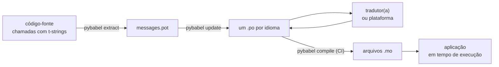

# Em produção

O [tutorial](tutorial.md) executa o ciclo uma vez, sozinho, em um programa com
uma única mensagem. Em um projeto real o ciclo continua girando: mensagens
mudam depois de já terem sido traduzidas, quem traduz trabalha em outro lugar
e no próprio ritmo, e um catálogo compilado é distribuído com cada release.
Esta página é essa prática — o que fica no repositório, o que viaja, o que o
CI precisa barrar e onde o runtime vincula um idioma.

## A forma de um projeto { #the-shape-of-a-project }

```text
myapp/
├── babel.cfg
├── pyproject.toml
├── src/
│   └── myapp/
└── locales/
    ├── messages.pot
    ├── ja/LC_MESSAGES/messages.po
    └── de/LC_MESSAGES/messages.po
```

Versione `babel.cfg`, o template `.pot` e cada `.po` — eles são as fontes do
build de tradução, e seus diffs são a forma de revisar mudanças de tradução.
Os arquivos `.mo` compilados são artefatos de build: produza-os no CI ou na
hora de empacotar, em vez de versioná-los, para que um `.po` e seu `.mo`
jamais possam discordar sobre o que é distribuído.

Um arquivo tem um papel em cada direção: o `.pot` leva suas mensagens *para
fora*, até quem traduz; os arquivos `.po` trazem as traduções *de volta*.
Tudo abaixo é o tráfego entre esses dois.



## O ciclo depois da primeira tradução { #the-cycle-after-the-first-translation }

O `pybabel init` do tutorial roda uma única vez por idioma, para sempre. Daí
em diante, o ciclo de trabalho é **extrair → atualizar → traduzir →
compilar**, e seu centro é o `pybabel update`, que incorpora um template
recém-extraído aos catálogos existentes sem descartar as traduções que já
estão neles.

Suponha que a saudação `Hello {name}` — já traduzida como
`こんにちは {name}` — seja reescrita no código como `Welcome back, {name}`.
Extraia e atualize:

```console
$ pybabel extract -F babel.cfg -c "Translators:" -o locales/messages.pot .
extracting messages from app.py (encoding="utf-8")
writing PO template file to locales/messages.pot
$ pybabel update -i locales/messages.pot -d locales
updating catalog locales/ja/LC_MESSAGES/messages.po based on locales/messages.pot
```

O catálogo japonês agora contém:

```po
#. gettext-tstrings
#: app.py:4
#, fuzzy, python-brace-format
msgid "Welcome back, {name}"
msgstr "こんにちは {name}"
```

O Babel notou que o novo msgid se parece com um que foi removido e o
emparelhou com a tradução antiga — mas marcou o par como **fuzzy**: um palpite
da máquina à espera de um humano. A marca tem dentes. O `pybabel compile`
**exclui as entradas fuzzy do `.mo`**, então, até que quem traduz confirme o
par, a aplicação renderiza o novo texto em inglês em vez de um japonês
desatualizado:

```console
$ pybabel compile -d locales
compiling catalog locales/ja/LC_MESSAGES/messages.po to locales/ja/LC_MESSAGES/messages.mo
$ python app.py
Welcome back, Ada
```

Uma mensagem alterada, portanto, degrada da mesma forma que uma quebrada —
para o idioma de origem, nunca para uma tradução desatualizada. A parte de
quem traduz nesse ciclo é revisar o `msgstr` e apagar a marca `fuzzy`; a
compilação seguinte recolhe a entrada.

!!! note "Os nomes dos marcadores fazem parte da identidade da mensagem"

    O msgid é a chave do catálogo, e o *nome* do marcador está dentro dele —
    então renomear uma variável no código (`name` → `user_name`) muda o msgid
    e manda a tradução dessa mensagem em todos os idiomas de volta ao ciclo
    fuzzy. Dê às variáveis interpoladas nomes que sejam palavras
    compreensíveis para quem traduz, e renomeie-as apenas por um bom motivo.

    A formatação é a imagem espelhada: `!r` e `:.2f` [não fazem parte do
    msgid](internals.md#from-template-to-msgid), então apertar `{amount:,.2f}`
    para `{amount:,.0f}` não muda nada em catálogo nenhum. Reescrever a
    *frase*, claro, é uma mudança real — esse é o ciclo acima.

## O que o CI barra { #what-ci-gates }

Três falhas merecem um build vermelho: os catálogos ficaram para trás em
relação ao código, uma tradução quebrou um marcador, ou uma entrada quebrada
escapou até o tempo de execução. Um passo por falha:

```yaml
- run: pybabel extract -F babel.cfg -c "Translators:" -o locales/messages.pot .
- run: pybabel update -i locales/messages.pot -d locales --check
- run: pybabel compile -d locales
- run: pytest
```

`pybabel update --check` não reescreve nada e sai com código diferente de zero
quando um catálogo está desatualizado em relação ao template recém-extraído —
a guarda contra fazer merge de código cujas mensagens ninguém re-extraiu.
`pybabel compile` executa as verificações de marcadores do Babel e do
[verificador registrado](extraction.md#your-existing-toolchain-validates-these-catalogs)
deste pacote.

!!! bug "`--check` não consegue barrar um catálogo que usa contextos"

    No Babel 2.18.0, `pybabel update --check` relata **todo** catálogo que
    contenha um `msgctxt` como desatualizado, a cada execução, por mais em dia
    que ele esteja. A comparação passa por `Catalog.is_identical`, que procura
    cada mensagem pela chave sob a qual ela está armazenada — e, para uma
    mensagem com contexto, essa chave é o par `(id, context)`, que
    `Catalog.get` não aceita. A busca não retorna nada, e os catálogos nunca
    são considerados iguais:

    ```pycon
    >>> from babel.messages.catalog import Catalog
    >>> c = Catalog(locale="ja")
    >>> c.add("Guide", "ガイド", context="navigation")
    <Message 'Guide' (flags: [])>
    >>> c.is_identical(c)
    False
    ```

    Ou seja, se você usa `pgettext` ou `npgettext` de alguma forma — e
    desambiguar um homônimo é a razão de eles existirem —, esse passo falha da
    pior maneira possível: sempre vermelho, então a equipe o desliga, então
    nada barra a desatualização. Até que isso seja corrigido lá em cima,
    compare os conjuntos de mensagens você mesmo. Ler o template e cada
    catálogo com `babel.messages.pofile.read_po` e comparar
    `{(m.context, m.id) for m in catalog if m.id}` é a verificação inteira, e é
    o que [o próprio build deste site](index.md) faz.

!!! danger "Verifique o código de saída, não o log"

    `pybabel compile` relata cada erro de marcador, sai com código diferente
    de zero — **e mesmo assim escreve o `.mo`**. Um pipeline que compila e
    depois copia `locales/` para uma imagem distribui o catálogo quebrado, a
    menos que a saída diferente de zero de fato o interrompa. Deixar o passo
    derrubar o build, como acima, é a correção inteira.

A última linha é a sua suíte de testes comum, com um hábito a mais: em algum
lugar dela, renderize ao menos uma mensagem por idioma distribuído através de
um tradutor estrito —

```python
import gettext

from gettext_tstrings import Translator

def test_catalogs_render(language: str) -> None:
    translations = gettext.translation("messages", localedir="locales", languages=[language])
    _ = Translator(translations, strict=True)
    name = "Ada"
    assert _(t"Welcome back, {name}")
```

— porque `strict=True` [levanta exceção onde a produção recairia em silêncio](guide.md#what-happens-when-a-catalog-is-wrong),
e uma renderização em tempo de execução é a única verificação que vê o
catálogo exatamente como a aplicação o verá, `.mo` e tudo.

## Trabalhando com tradutores e plataformas { #working-with-translators-and-platforms }

O arquivo `.po` é o formato de intercâmbio de todo o mundo gettext, e é por
isso que esta biblioteca o reutiliza: entregar a tradução significa entregar
um arquivo, seja o destinatário um colega com um editor de PO ou uma
plataforma como Weblate ou Crowdin. Três coisas fazem essa entrega funcionar
bem:

**Diga para que serve a mensagem.** Um comentário no código viaja com a
mensagem — é isso que a flag `-c "Translators:"` coleta:

```python
from gettext_tstrings import tr

name = "Ada"
# Translators: shown on the dashboard right after sign-in
print(tr(t"Welcome back, {name}"))
```

```po
#. Translators: shown on the dashboard right after sign-in
#. gettext-tstrings
#: app.py:5
#, python-brace-format
msgid "Welcome back, {name}"
msgstr ""
```

Quem traduz vê esse comentário no editor, ao lado da mensagem, do outro lado
do mundo. É a alavanca de qualidade mais barata de todo o fluxo de trabalho.
Para uma palavra que é homônima de si mesma — o botão "Open" versus o estado
"Open" — dê à mensagem um [contexto](guide.md#binding-a-catalog) com
`pgettext`, que vira um `msgctxt` visível no catálogo.

**Deixe a plataforma validar os marcadores.** Toda mensagem extraída de uma
t-string carrega a flag `python-brace-format`, e essa única linha é o que liga
o controle de qualidade de marcadores em ferramentas que você não controla —
o Weblate documenta a verificação, plataformas comerciais amarram as suas à
mesma flag, e `msgfmt --check-format` a impõe em qualquer pipeline GNU. Os
detalhes, e o que o verificador incluído captura além deles, estão na
[página de extração](extraction.md#your-existing-toolchain-validates-these-catalogs).

**Confie na rede de segurança exatamente até onde ela alcança.** O que quer
que volte de uma plataforma ainda é dado entrando no seu build; os portões de
CI acima são o que transforma "a plataforma provavelmente verificou isto" em
"isto não pode ser distribuído quebrado".

## Vincular um idioma em tempo de execução { #binding-a-language-at-runtime }

Tudo até aqui produz catálogos. A decisão restante é onde a aplicação
seleciona um deles, e ela tem uma única resposta honesta: vincule uma vez por
*escopo de um idioma* — o processo em uma CLI, a requisição em um serviço web.

=== "Um processo, um idioma"

    Uma ferramenta de linha de comando ou aplicação desktop lê o ambiente de
    quem a usa uma vez, na inicialização. Não passar `languages=` deixa a
    biblioteca padrão negociar a partir de `LANGUAGE`, `LC_ALL`,
    `LC_MESSAGES` e `LANG`; `fallback=True` devolve um catálogo nulo — texto
    de origem — em vez de levantar exceção quando nenhum deles corresponde a
    um catálogo que você distribui.

    ```python
    import gettext

    from gettext_tstrings import Translator

    _ = Translator(gettext.translation("messages", localedir="locales", fallback=True))

    name = "Ada"
    print(_(t"Welcome back, {name}"))
    ```

=== "Flask"

    Uma aplicação web decide por requisição. Carregue cada catálogo uma vez
    no import e vincule o negociado ao contexto antes de a view rodar —
    [`set_translations`](guide.md#per-request-language) é local ao contexto,
    então requisições concorrentes em idiomas diferentes nunca veem o vínculo
    umas das outras.

    ```python
    import gettext

    from flask import Flask, request

    from gettext_tstrings import set_translations, tr

    LANGUAGES = ("en", "ja", "de")
    CATALOGS = {
        language: gettext.translation(
            "messages", localedir="locales", languages=[language], fallback=True
        )
        for language in LANGUAGES
    }

    app = Flask(__name__)

    @app.before_request
    def bind_language() -> None:
        language = request.accept_languages.best_match(LANGUAGES) or "en"
        set_translations(CATALOGS[language])

    @app.get("/")
    def home() -> str:
        name = "Ada"
        return tr(t"Welcome back, {name}")
    ```

=== "Middleware ASGI"

    Sob frameworks assíncronos — FastAPI, Starlette e qualquer outro ASGI —,
    envolva a requisição em
    [`use_translations`](guide.md#per-request-language): o vínculo vive em um
    `ContextVar`, que a troca de tarefas assíncronas preserva por requisição.

    ```python
    import gettext

    from fastapi import FastAPI, Request

    from gettext_tstrings import tr, use_translations

    LANGUAGES = ("en", "ja", "de")
    CATALOGS = {
        language: gettext.translation(
            "messages", localedir="locales", languages=[language], fallback=True
        )
        for language in LANGUAGES
    }

    app = FastAPI()

    @app.middleware("http")
    async def bind_language(request: Request, call_next):
        language = negotiate_language(request.headers.get("accept-language"), LANGUAGES)
        with use_translations(CATALOGS[language]):
            return await call_next(request)
    ```

    `negotiate_language` representa o seu parsing de Accept-Language — a
    maioria dos frameworks, ou seus ecossistemas, fornece um; o que importa
    aqui é o vínculo em torno de `call_next`.

Dois hábitos de execução completam o quadro. Strings criadas no momento do
import — o rótulo de um formulário, o nome de exibição de um enum — não devem
capturar o idioma que estivesse ativo durante o import; defina-as com
[`lazy_gettext`](guide.md#deferred-translation) e elas serão renderizadas no
idioma ativo no *uso*. E direcione o logger `gettext_tstrings` para algum
lugar que um humano olhe: seus avisos são o modo leniente relatando uma
tradução que escapou de todos os portões, uma linha por mensagem quebrada em
vez de uma por renderização.

## Distribuição { #shipping }

A produção precisa do pacote, dos arquivos `.mo` e de nada mais. O Babel é
uma dependência de desenvolvimento e de CI — mantenha `gettext-tstrings[babel]`
fora da imagem de produção e instale ali o pacote puro; a renderização roda
apenas com a biblioteca padrão. Compile os catálogos no mesmo build que
produz o artefato implantado, para que os arquivos `.mo` dentro dele sejam
exatamente os `.po` revisados, e nada compilado no laptop de alguém jamais
seja distribuído.

Antes de um release, o checklist a que esta página se reduz:

- `pybabel update --check` passa — nenhuma mensagem mudou sem que os
  catálogos ficassem sabendo.
- `pybabel compile` condiciona o build ao seu código de saída.
- As entradas `fuzzy` restantes são intencionais — cada uma renderiza como
  texto de origem até que quem traduz a confirme.
- A suíte de testes renderiza cada idioma distribuído uma vez com
  `strict=True`.
- O artefato de produção contém arquivos `.mo` e nenhum Babel.
- O logger `gettext_tstrings` está direcionado ao monitoramento.

## Próximos passos { #where-next }

- [Extração](extraction.md) — a referência para a metade de ferramentas desta
  página: opções de mapeamento, nomes de função personalizados, modo estrito
  e cada verificador.
- [Guia](guide.md) — a metade de execução: plurais, contextos, strings
  preguiçosas e os modos de falha em detalhe.
- [Como funciona](internals.md) — por que o msgid tem a forma que tem, e o
  que a validação de fato verifica.
