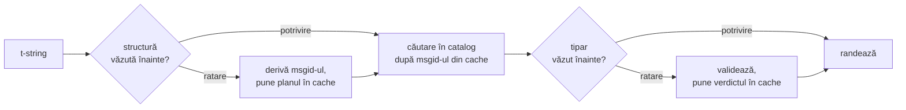

# Cum funcționează

Nimic de pe pagina aceasta nu este necesar pentru a folosi biblioteca —
[tutorialul](tutorial.md) și [ghidul](guide.md) acoperă asta. În schimb, pagina
de față reconstruiește biblioteca de la principii: ce este de fapt un t-string,
cum cade un msgid din el, ce face o traducere validă și cum reușește
implementarea ca toată acea verificare să coste zecimi de microsecundă.
Citește-o dacă ești curios, dacă vrei să contribui sau dacă plănuiești să
[implementezi tu însuți convenția](#reimplementing-it).

## Ce este de fapt un t-string { #what-a-t-string-actually-is }

Un f-string produce un `str`, și îl produce imediat — până când vreo funcție îl
primește, valoarea a fost deja interpolată, iar propoziția este pecetluită. Un
t-string ([PEP 750]) are aceeași sintaxă și aceeași evaluare nerăbdătoare a
expresiilor sale, dar produce un tip diferit:

```pycon
>>> name = "Ada"
>>> f"Hello {name}!"
'Hello Ada!'
>>> t"Hello {name}!"
Template(strings=('Hello ', '!'), interpolations=(Interpolation('Ada', 'name', None, ''),))
```

Acel obiect `Template` păstrează, tot separate, părțile de care are nevoie o
conductă de cataloage:

```pycon
>>> template = t"Total: {amount:,.2f}"
>>> template.strings
('Total: ', '')
>>> template.interpolations[0].expression
'amount'
>>> template.interpolations[0].value
1234.5
>>> template.interpolations[0].format_spec
',.2f'
```

- `strings` — textul literal din jurul interpolărilor, în ordine.
- Pentru fiecare interpolare: **expresia** ca text sursă (`'amount'`),
  **valoarea** ei evaluată (`1234.5`), și orice **conversie** (`!r`) și
  **specificație de format** (`,.2f`) — purtate separat, nu aplicate.

Tot ce face această bibliotecă este un consum disciplinat al acelei structuri.
Limbajul a făcut deja singura separare de care are nevoie i18n — textul static
deoparte de valori — așa că biblioteca nu îți parsează niciodată codul sursă și
nu ghicește niciodată unde stă o valoare în interiorul unei propoziții. Ce
rămâne sunt trei decizii: cum devine structura o cheie de catalog, ce poate
spune o traducere a acelei chei și cum se randează cele două înapoi împreună.

## De la șablon la msgid { #from-template-to-msgid }

Un msgid — cheia după care este indexat un catalog — este derivat numai din
părțile *statice* ale șablonului. Parcurge `strings` și `interpolations` în
ordinea din sursă; escapează acoladele din fiecare segment literal (`{` devine
`{{`); pentru fiecare interpolare, emite un token `{name}`, unde `name` este
textul expresiei cu spațiile albe din jur eliminate. Din
`t"Total: {amount:,.2f}"`:

```text
strings         ('Total: ', '')
interpolations  expression 'amount'   conversion None   format_spec ',.2f'
msgid           'Total: {amount}'
```

Fiecare parte a acelei reguli are un motiv:

- **Expresia trebuie să fie un nume simplu** — `str.isidentifier()` este
  adevărat și nu este un cuvânt-cheie Python. `t"Hello {user.name}"` este
  respins chiar la punctul de apel. Un msgid este o *cheie*: trebuie să iasă
  identic la fiecare rulare și la fiecare extragere, și este citit de
  traducători, așa că substituentul trebuie să fie un cuvânt stabil și plin de
  înțeles — nu un fragment de cod care invită catalogul să devină un limbaj de
  expresii.
- **Conversia și specificația de format nu intră niciodată în msgid.**
  Traducătorii nu ar trebui să fie nevoiți să citească `:,.2f`, și nicio
  traducere nu ar trebui să îl poată schimba. Corolarul merită știut:
  strângerea lui `:,.2f` la `:,.0f` în codul tău nu schimbă niciun msgid, deci
  nu invalidează nicio traducere în nicio limbă. Cheia de catalog urmărește *ce
  spune propoziția*, nu cum este formatată valoarea.
- **Un nume repetat trebuie să își repete formatarea exact.**
  `t"{x:.2f} vs {x:.3f}"` este respins, pentru că amândouă aparițiile se
  contopesc în același token `{x}`, iar msgid-ul nu ar mai putea spune ce
  formatare ar trebui să folosească o randare.
- **Msgid-ul gol nu este căutat niciodată**, pentru că gettext îl rezervă
  antetului cu metadatele proprii ale catalogului. `t""` se randează ca `""`
  fără să atingă catalogul.

Setul complet de reguli, inclusiv cazurile-limită pe care pagina aceasta le
sare, este
[SPEC §2](https://github.com/yhay81/gettext-tstrings/blob/main/SPEC.md).

## Ce poate spune o traducere { #what-a-translation-may-say }

Un tipar care se întoarce dintr-un catalog este parsat cu `string.Formatter` —
același parser pe care îl folosește `str.format`. Gramatica este împrumutată
intenționat, nu inventată: un tipar pe care biblioteca de față îl acceptă este
unul pe care ecosistemul mai larg îl înțelege deja. Apoi se aplică două
verificări.

**Forma:** fiecare câmp trebuie să fie un `{name}` gol. O conversie sau o
specificație de format — inclusiv `{name:}`, explicit vidă — este respinsă, la
fel ca și câmpurile poziționale (`{0}`, `{}`) și numele umplute cu spații albe
(`{ name }`). Ultimul contează mai mult decât pare: și `str.format`, și GNU
`msgfmt` resping `{ name }`, așa că a-l accepta aici ar produce cataloage pe
care nicio altă unealtă din lanț nu le poate valida.

**Numele:** mulțimea de substituenți a tiparului este comparată cu cea a
sursei. Pentru un mesaj la singular, fiecare nume din sursă este *cerut* și
nimic altceva nu este *permis*. Pentru un mesaj la plural, cele două ramuri sunt
contopite:

- **permis** = reuniunea numelor din amândouă ramurile
- **cerut** = intersecția lor

Așadar, față de `t"One file"` / `t"{n} files"`, numele `n` este permis într-o
traducere a oricăreia dintre forme, dar nu este cerut de niciuna. Acea asimetrie
este ceea ce permite ca sistemul de plural al unei limbi țintă să difere de cel
al sursei — japoneza traduce amândouă ramurile cu o singură formă, care
probabil folosește `{n}`; o limbă cu mai multe forme decât engleza poate avea
nevoie de `{n}` într-o formă în care engleza nu are niciuna.

Nimic din toate acestea nu este ipotetic: catalogul de interfață al acestui sit
poartă mesajul la plural `Built {n} localized page` / `Built {n} localized
pages` — două ramuri englezești — iar edițiile sitului traduc acel unic mesaj în
oriunde între o formă și șase:

| Catalog | Forme | Traducerile, în ordinea formelor |
| --- | --- | --- |
| Japoneză | 1 | `ローカライズ済みページを{n}件ビルドしました` |
| Turcă | 2 | `{n} yerelleştirilmiş sayfa oluşturuldu` — de două ori, identic: substantivele turcești rămân la singular după un numeral |
| Italiană | 2 | `Generata {n} pagina localizzata` · `Generate {n} pagine localizzate` — participiul se acordă în gen și număr |
| Letonă | 3 | `Izveidota {n} lokalizēta lapa` · `Izveidotas {n} lokalizētas lapas` · `Izveidots {n} lokalizētu lapu` — a treia formă este pentru **zero, singur** |
| Rusă | 3 | `Собрана {n} локализованная страница` · `Собраны {n} локализованные страницы` · `Собрано {n} локализованных страниц` |
| Poloneză | 3 | `Zbudowano {n} zlokalizowaną stronę` · `Zbudowano {n} zlokalizowane strony` · `Zbudowano {n} zlokalizowanych stron` |
| Slovenă | 4 | `Zgrajena {n} lokalizirana stran` · `Zgrajeni {n} lokalizirani strani` · `Zgrajene {n} lokalizirane strani` · `Zgrajenih {n} lokaliziranih strani` — a doua este un **dual**, pentru exact doi |
| Irlandeză | 5 | `Tógadh {n} leathanach logánaithe` · `Tógadh {n} leathanaigh logánaithe` — unu, doi, 3–6, 7–10 și restul; radicalul alternează, dar *leathanach* începe cu `l`, pe care nicio mutație irlandeză nu o scrie, așa că mai multe forme coincid |
| Arabă | 6 | printre care `تم إنشاء صفحة مترجمة واحدة ({n})` pentru exact una și `تم إنشاء {n} صفحات مترجمة` pentru câteva |

Fiecare rând este o intrare vie din `i18n/*/LC_MESSAGES/site.po` al acestui
depozit, randată de [buildul multilingv](index.md) la fiecare lansare — iar un
test fixează acest tabel de acele cataloage, așa că cele două nu se pot
depărta unul de altul.

În limitele acelea, reordonarea și repetarea sunt lăsate intenționat
neconstrânse. Amândouă sunt necesare gramatical în limbi reale, iar
restricționarea numărului de apariții ar respinge traduceri corecte fără niciun
beneficiu de securitate: o traducere tot nu poate *evalua* nimic, pentru că nu
există nicio cale de evaluare — substituenții sunt căutați după nume în
valorile deja calculate ale șablonului, niciodată dați lui `eval`, lui
`getattr` sau lui `str.format` însuși.

## Randarea { #rendering }

Randarea unui tipar validat este o plimbare peste bucățile lui: emite fiecare
parte literală, iar pentru fiecare substituent, ia valoarea captată a
interpolării și aplică conversia și specificația de format *dinspre sursă* —
`format(convert(value, conversion), format_spec)`. În timp ce face asta, sunt
păstrate două garanții:

- **Fiecare valoare distinctă este formatată cel mult o dată per randare**,
  chiar și atunci când traducerea repetă un substituent. Repetarea schimbă cât
  de des este inserat rezultatul, nu cât de des rulează `__format__`-ul tău.
- **La plural, un substituent citește ramura care l-a definit.** Un nume
  prezent în amândouă ramurile citește valoarea captată de ramura pe care o
  selectează limba *sursă* (`singular` când `n == 1`, altfel `plural`); un nume
  specific unei ramuri își citește întotdeauna propria ramură, chiar și atunci
  când regulile de plural ale limbii țintă l-au făcut disponibil în altă formă.

Când validarea eșuează la momentul randării, răspunsul se împarte după cine a
furnizat tiparul. Un tipar care a ieșit dintr-un *catalog* degradează: se
jurnalizează un avertisment și se randează textul sursă, păstrând contractul
lui gettext potrivit căruia un catalog stricat nu doboară niciodată aplicația
([ghidul arată amândouă modurile](guide.md#what-happens-when-a-catalog-is-wrong)).
Un tipar transmis direct de apelant — `CompiledTemplate.render` — ridică
întotdeauna o excepție, pentru că nu există niciun text sursă *de la care* să
degradeze; permisivitatea există pentru căutările în catalog, nu pentru
argumente.

## Diagnosticele fac parte din proiectare { #diagnostics-are-part-of-the-design }

O eroare de substituent aterizează de obicei în fața unui traducător, nu a unui
programator, și adesea într-un fișier în care problema este invizibilă. A-i
spune `{name} is missing` cuiva care vede exact acele caractere în editorul lui
este o fundătură, așa că mesajele sunt calculate după trei reguli:

- Un nume care conține un **caracter invizibil** — un spațiu neîntreruptor
  produs de o metodă de introducere, un spațiu de lățime zero — este tipărit cu
  acel caracter înlocuit de punctul lui de cod, chiar la locul lui:
  `{<U+00A0>name}`. Cititorul are nevoie să vadă *unde*.
- Un nume ale cărui litere **amestecă sisteme de scriere**, cazul homoglifelor,
  este arătat de două ori — o dată lizibil, o dată escapat — pentru că `{nаme}`
  cu un `а` chirilic nu se deosebește de `{name}` pe hârtie, iar forma escapată
  `(nаme)` este singura scriere care le distinge una de alta.
- Orice altceva este arătat **așa cum a fost scris**. `{名前}` și `{café}` sunt
  nume obișnuite; escaparea lor l-ar lăsa pe cititor incapabil să găsească ce
  s-a vrut.

Pe același principiu, un substituent „lipsă” care *pare* prezent își capătă
absența explicată — acolade cu lățime întreagă de la o metodă de introducere
est-asiatică, dublarea în `{{name}}` de la un dus-întors de escapare, numele
aflat în afara oricăror acolade.
[Tabelul de citire a eșecurilor din ghid](guide.md#reading-a-failure-message)
arată fiecare dintre aceste mesaje cuvânt cu cuvânt.

## Calea fierbinte { #the-hot-path }

Tot ce s-a spus mai sus se întâmplă la fiecare șir tradus pe care îl randează o
aplicație, așa că implementarea este construită în jurul unei singure idei:
**validarea nu este niciodată sărită, deci validarea trebuie să fie ceea ce se
pune în cache.**



Trei cache-uri, câte unul pe etapă:

- **Un plan per structură de punct de apel.** Tuplul `strings` al șablonului —
  un obiect pe care interpretorul l-a construit deja — este cheia de cache, așa
  că o căutare nu alocă nimic. La o potrivire, expresia, conversia și
  specificația de format ale fiecărei interpolări sunt totuși comparate cu cele
  înregistrate: două puncte de apel care împart același text literal, dar
  diferă în formatare (`t"{x:.2f}"` față de `t"{x:.3f}"`) nu trebuie să se
  ciocnească, iar acea comparație este prețul folosirii unei chei pe care
  interpretorul o oferă gratis.
- **Un verdict per tipar.** Prima dată când un catalog răspunde cu un anumit
  tipar, acesta este parsat și validat; rezultatul — un plan de randare
  compilat, sau o consemnare a invalidității — este păstrat pe plan. Fiecare
  randare ulterioară a acelui mesaj ajunge la el printr-o singură căutare în
  dicționar. Și tiparele invalide sunt ținute minte, motiv pentru care o
  intrare stricată din catalog avertizează o singură dată, nu la fiecare
  randare.
- **Un plan contopit per pereche de plural**, care ține mulțimile de
  reuniune/intersecție, astfel încât aritmetica ramurilor să se întâmple o dată
  per mesaj, nu o dată per apel.

Fiecare cache este mărginit, și niciunul nu reține *valori* interpolate — doar
structură statică și textul tiparelor. Rezultatul, măsurat de
[`benchmarks/runtime.py`](https://github.com/yhay81/gettext-tstrings/blob/main/benchmarks/runtime.py):
aproximativ 0,4 µs pentru un mesaj cu un singur câmp, inclusiv construcția
t-stringului însuși, cam de 2,5× cât un `gettext(...).format(...)` simplu, care
nu verifică nimic. Comentariul din capul lui
[`core.py`](https://github.com/yhay81/gettext-tstrings/blob/main/src/gettext_tstrings/core.py)
consemnează măsurătorile individuale din spatele acestei forme.

## Reimplementarea ei { #reimplementing-it }

Nimic din cele de mai sus nu este cunoaștere ascunsă: convenția este consemnată
ca [specificația v1](spec.md), iar
[suita ei de conformitate](spec.md#conformance) lizibilă de mașină permite unui
extractor, unui plugin de IDE sau unei implementări în alt limbaj să se verifice
față de fiecare regulă explicată pe pagina aceasta. Implementarea de față rulează
suita în propriile teste, ceea ce ține pagina aceasta, specificația și codul să
nu se depărteze una de alta în tăcere.

  [PEP 750]: https://peps.python.org/pep-0750/
