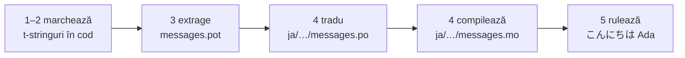

# Tutorial

Această pagină pornește de la un director gol și ajunge la un program care
salută în japoneză. Cinci pași, fără a presupune experiență cu gettext, iar
fiecare comandă este arătată împreună cu ieșirea pe care o produce cu
adevărat — așa că la fiecare pas știi dacă ești pe drumul cel bun.

Ai nevoie de Python 3.14 sau mai nou, pentru că t-stringurile sunt sintaxă
nouă în 3.14. Japoneza este limba-țintă folosită ca exemplu în această pagină,
dar nimic nu depinde de acea alegere — pune orice limbă la pasul 4, unde codul
de locale `ja` este singurul lucru care o numește.

## 1. Instalează { #1-install }

```console
python -m pip install "gettext-tstrings[babel]"
```

Extra-ul `[babel]` aduce cu el [Babel], instrumentul care îți adună mesajele
în fișiere de catalog la pasul 3. Este un instrument pentru timpul dezvoltării:
codul de producție randează doar cu biblioteca standard.

## 2. Marchează un mesaj în cod { #2-mark-a-message-in-your-code }

Creează `app.py`:

```python
from gettext_tstrings import tr

name = "Ada"
print(tr(t"Hello {name}"))
```

`t"Hello {name}"` arată ca un f-string, dar prefixul `t` ține textul și
valoarea separate, în loc să le contopească pe loc. Tocmai această separare îi
permite lui `tr()` să caute o traducere pentru întreaga propoziție
`Hello {name}` și să insereze valoarea abia după aceea.

Rulează-l acum:

```console
$ python app.py
Hello Ada
```

Nu este instalată încă nicio traducere, așa că textul sursă se randează ca
atare. Un program care folosește această bibliotecă nu *are nevoie* niciodată
de un catalog ca să ruleze — engleza (sau oricare ar fi limba ta sursă) este
soluția de rezervă încorporată.

## 3. Extrage mesajele { #3-extract-the-messages }

Traducătorii nu îți citesc codul sursă; între tine și ei circulă un fișier mic
numit **catalog**. Primul pas către el este să aduni din cod fiecare mesaj
marcat.

Spune-i lui Babel cum să îți găsească mesajele, creând `babel.cfg`:

```ini
[gettext_tstrings: **.py]
encoding = utf-8
```

Apoi extrage-le într-un fișier șablon (`.pot`):

```console
$ mkdir -p locales
$ pybabel extract -F babel.cfg -c "Translators:" -o locales/messages.pot .
extracting messages from app.py (encoding="utf-8")
writing PO template file to locales/messages.pot
```

`locales/messages.pot` conține acum câte o intrare pentru fiecare mesaj:

```po
#. gettext-tstrings
#: app.py:4
#, python-brace-format
msgid "Hello {name}"
msgstr ""
```

`msgid` este cheia pe care o va căuta codul tău. `msgstr`-ul gol este locul în
care merge o traducere — dar nu în acest fișier: un `.pot` este un *șablon*, iar
pasul următor îl copiază o dată pentru fiecare limbă.

## 4. Tradu și compilează { #4-translate-and-compile }

Creează catalogul japonez din șablon:

```console
$ pybabel init -i locales/messages.pot -d locales -l ja
creating catalog locales/ja/LC_MESSAGES/messages.po based on locales/messages.pot
```

Deschide `locales/ja/LC_MESSAGES/messages.po` și completează `msgstr`-ul:

```po
msgid "Hello {name}"
msgstr "こんにちは {name}"
```

Păstrează `{name}` exact așa cum este — substituentul este felul în care
valoarea își găsește locul înăuntrul propoziției traduse, iar traducerea este
liberă să îl mute oriunde are nevoie limba țintă. Într-un proiect real, acest
fișier `.po` este cel pe care îl dai unui traducător sau îl încarci pe o
platformă de traducere; formatul este același în ambele cazuri.

Cataloagele sunt editate ca text, dar sunt încărcate într-o formă binară
(`.mo`), așa că trebuie compilate:

```console
$ pybabel compile -d locales
compiling catalog locales/ja/LC_MESSAGES/messages.po to locales/ja/LC_MESSAGES/messages.mo
```

Această comandă este și o plasă de siguranță. Dacă traducerea ar fi deteriorat
substituentul — să zicem `{nome}` în loc de `{name}` — ea ar fi refuzat să
treacă:

```console
$ pybabel compile -d locales
error: locales/ja/LC_MESSAGES/messages.po:24: translation does not match the
source placeholders: {name} is missing; {nome} is not in the source message
1 errors encountered.
```

## 5. Rulează-l { #5-run-it }

Îndreaptă `app.py` către catalogul compilat. Apasă pe marcaje ca să vezi ce
face fiecare linie:

```python
import gettext

from gettext_tstrings import Translator

_ = Translator(gettext.translation("messages", localedir="locales", languages=["ja"]))  # (1)!

name = "Ada"
print(_(t"Hello {name}"))  # (2)!
```

1. Biblioteca standard încarcă `.mo`-ul compilat, iar `Translator` îl leagă de
   un apelabil. `_` este numele gettext convențional pentru „tradu asta” —
   scurt, pentru că apare pe fiecare șir care ajunge sub ochii
   utilizatorului. Este aceeași funcție ca `tr`, legată de un singur catalog.
2. La apel: textul t-stringului devine cheia de căutare `Hello {name}`,
   catalogul răspunde `こんにちは {name}`, răspunsul este verificat față de
   substituenții din sursă, și abia apoi este pusă valoarea înăuntru.

```console
$ python app.py
こんにちは Ada
```

Aceasta este toată bucla, și merită văzută ca o singură imagine:



**Marchează → extrage → tradu → compilează → rulează.** Tot restul de pe acest
sit este o rafinare a unuia dintre acei cinci pași.

## Încotro mai departe { #where-next }

- [De ce t-stringuri](comparison.md) — de ce anume te ferește această
  proiectare, în comparație cu `%(name)s`, `.format()` și `$`-stringurile.
- [Ghid](guide.md) — plural, limbi per cerere, șiruri amânate și ce se întâmplă
  la rulare atunci când un catalog este totuși greșit.
- [În producție](workflow.md) — aceeași buclă așa cum o rulează o echipă,
  săptămână de săptămână: actualizarea cataloagelor, porțile de CI și
  platformele de traducere.
- [Extragere](extraction.md) — referința `pybabel` completă: nume proprii de
  funcții, modul strict pentru CI și verificările care îți păzesc cataloagele.

  [Babel]: https://babel.pocoo.org/
