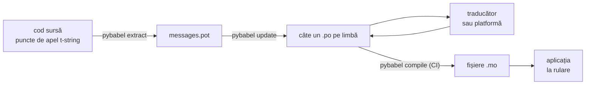

# În producție

[Tutorialul](tutorial.md) rulează bucla o singură dată, de unul singur, pe un
program cu un singur mesaj. Într-un proiect real bucla se învârte mai departe:
mesajele se schimbă după ce au fost traduse, traducătorul lucrează în altă
parte și după propriul orar, iar un catalog compilat este livrat cu fiecare
lansare. Pagina de față este acea practică — ce rămâne în depozit, ce
călătorește, ce trebuie să păzească CI-ul și unde leagă runtime-ul o limbă.

Totul se adună la șase verificări, așa că iată-le mai întâi; fiecare secțiune de
mai jos o configurează pe una dintre ele.

- `pybabel update --check` trece — niciun mesaj nu s-a schimbat fără ca
  cataloagele să afle.
- `pybabel compile` condiționează buildul de starea lui de ieșire.
- Intrările `fuzzy` rămase sunt intenționate — fiecare se randează ca text sursă
  până când un traducător o confirmă.
- Suita de teste randează o dată fiecare limbă livrată, cu `strict=True`.
- Artefactul de producție conține fișiere `.mo` și niciun Babel.
- Jurnalizatorul `gettext_tstrings` este dirijat către monitorizare.

## Forma unui proiect { #the-shape-of-a-project }

```text
myapp/
├── babel.cfg
├── pyproject.toml
├── src/
│   └── myapp/
└── locales/
    ├── messages.pot
    ├── ja/LC_MESSAGES/messages.po
    └── de/LC_MESSAGES/messages.po
```

Comite `babel.cfg`, șablonul `.pot` și fiecare `.po` — ele sunt sursele
buildului de traducere, iar diferențele dintre ele sunt modul în care revizuiești
schimbările de traducere. Fișierele `.mo` compilate sunt artefacte de build:
produ-le în CI sau la momentul împachetării, în loc să le comiți, astfel încât
un `.po` și `.mo`-ul lui să nu poată niciodată să nu fie de acord asupra a ceea
ce se livrează.

Un fișier are câte un rol în fiecare direcție: `.pot`-ul îți duce mesajele
*afară*, către traducători, iar fișierele `.po` aduc traducerile *înapoi*.
Restul acestei pagini este ceea ce circulă între ele.



## Ciclul de după prima traducere { #the-cycle-after-the-first-translation }

`pybabel init` din tutorial se rulează de obicei o singură dată, atunci când se
adaugă o limbă. De atunci încolo, ciclul de lucru este **extrage → actualizează →
tradu → compilează**, iar centrul lui este `pybabel update`, care pliază un
șablon proaspăt peste cataloagele existente fără să arunce traducerile aflate
deja în ele.

Să presupunem că salutul `Hello {name}` — deja tradus ca `こんにちは {name}` —
este reformulat în cod ca `Welcome back, {name}`. Extrage și actualizează:

```console
$ pybabel extract -F babel.cfg -c "Translators:" -o locales/messages.pot .
extracting messages from app.py (encoding="utf-8")
writing PO template file to locales/messages.pot
$ pybabel update -i locales/messages.pot -d locales
updating catalog locales/ja/LC_MESSAGES/messages.po based on locales/messages.pot
```

Catalogul japonez conține acum:

```po
#. gettext-tstrings
#: app.py:4
#, fuzzy, python-brace-format
msgid "Welcome back, {name}"
msgstr "こんにちは {name}"
```

Babel a observat că noul msgid seamănă cu unul eliminat și l-a împerecheat cu
vechea traducere — dar a marcat perechea **fuzzy**: ghiceala unei mașini care
așteaptă un om. Marcajul schimbă ce anume se compilează. `pybabel compile`
**exclude intrările fuzzy din `.mo`**, așa că, până când un traducător confirmă
perechea, aplicația
randează noul text englezesc, nu unul japonez învechit:

```console
$ pybabel compile -d locales
compiling catalog locales/ja/LC_MESSAGES/messages.po to locales/ja/LC_MESSAGES/messages.mo
$ python app.py
Welcome back, Ada
```

Prin urmare, un mesaj schimbat degradează la fel ca unul stricat — către limba
sursă, niciodată către o traducere depășită. Partea traducătorului din ciclu
este să revizuiască `msgstr`-ul și să șteargă marcajul `fuzzy`; următoarea
compilare ridică intrarea.

!!! note "Numele substituenților fac parte din identitatea mesajului"

    Msgid-ul este cheia catalogului, iar *numele* substituentului se află
    înăuntrul lui — așa că redenumirea unei variabile în cod (`name` →
    `user_name`) schimbă msgid-ul și trimite traducerea lui din fiecare limbă
    înapoi prin ciclul fuzzy. Numește variabilele interpolate ca pe niște
    cuvinte pe care un traducător le va înțelege, și redenumește-le numai
    dintr-un motiv.

    Formatarea este imaginea în oglindă: `!r` și `:.2f` [nu fac parte din
    msgid](internals.md#from-template-to-msgid), așa că strângerea lui
    `{amount:,.2f}` la `{amount:,.0f}` nu schimbă nimic în niciun catalog.
    Reformularea *propoziției*, desigur, este o schimbare reală — aceea este
    bucla de mai sus.

## Ce anume păzește CI-ul { #what-ci-gates }

Trei eșecuri merită un build roșu: cataloagele au rămas în urma codului, o
traducere a stricat un substituent, sau o intrare stricată a scăpat până la
runtime. Câte un pas pentru fiecare eșec:

```yaml
- run: pybabel extract -F babel.cfg -c "Translators:" -o locales/messages.pot .
- run: pybabel update -i locales/messages.pot -d locales --check
- run: pybabel compile -d locales
- run: pytest
```

`pybabel update --check` nu rescrie nimic și iese cu o valoare nenulă atunci
când un catalog nu mai este la zi față de șablonul proaspăt extras — paza
împotriva fuzionării de cod ale cărui mesaje nu le-a reextras nimeni.
`pybabel compile` rulează verificările de substituenți atât ale lui Babel, cât
și ale
[verificatorului înregistrat](extraction.md#your-existing-toolchain-validates-these-catalogs)
al acestui pachet.

!!! bug "Babel 2.18.0: `--check` nu poate păzi un catalog care folosește contexte"

    Pe Babel 2.18.0, `pybabel update --check` raportează **fiecare** catalog
    care conține un `msgctxt` ca fiind neactualizat, la fiecare rulare, oricât
    de la zi ar fi. O poartă care pică permanent este mai rea decât nicio
    poartă, pentru că echipa o oprește — așa că, dacă folosești `pgettext` sau
    `npgettext` cât de cât, înlocuiește acest pas în loc să trăiești cu el.
    Citirea șablonului și a fiecărui catalog cu
    `babel.messages.pofile.read_po` și compararea lui
    `{(m.context, m.id) for m in catalog if m.id}` este toată verificarea, și
    este exact ce face [buildul propriu al acestui sit](index.md). Cauza este
    [descrisă pe pagina Capcane](pitfalls.md#your-tools-have-bugs-too).

!!! danger "Verifică starea de ieșire, nu jurnalul"

    `pybabel compile` raportează fiecare eroare de substituent, iese cu o
    valoare nenulă — **și scrie oricum fișierul `.mo`**. O conductă care
    compilează și apoi copiază `locales/` într-o imagine livrează catalogul
    stricat, dacă ieșirea nenulă nu o oprește cu adevărat. A lăsa pasul să
    pice buildul, ca mai sus, este întreaga reparație.

Ultima linie este suita ta obișnuită de teste, cu un singur obicei adăugat:
undeva în ea, randează cel puțin un mesaj pentru fiecare limbă livrată printr-un
traducător strict —

```python
import gettext

from gettext_tstrings import Translator


def test_catalogs_render(language: str) -> None:
    translations = gettext.translation("messages", localedir="locales", languages=[language])
    _ = Translator(translations, strict=True)
    name = "Ada"
    assert _(t"Welcome back, {name}")
```

— pentru că `strict=True`
[ridică o excepție acolo unde producția ar reveni pe tăcute la sursă](guide.md#what-happens-when-a-catalog-is-wrong),
iar o randare la rulare este singura verificare care vede catalogul exact așa
cum îl va vedea aplicația, cu `.mo` cu tot.

## Lucrul cu traducători și platforme { #working-with-translators-and-platforms }

Fișierul `.po` este formatul de schimb al întregii lumi gettext, ceea ce este și
motivul pentru care biblioteca de față îl reutilizează: a preda traducerea
înseamnă a preda un fișier, fie că destinatarul este un coleg cu un editor PO,
fie că este o platformă precum Weblate sau Crowdin. Trei lucruri fac predarea să
meargă bine:

**Spune la ce servește mesajul.** Un comentariu din cod călătorește împreună cu
mesajul — asta adună flagul `-c "Translators:"`:

```python
from gettext_tstrings import tr

name = "Ada"
# Translators: shown on the dashboard right after sign-in
print(tr(t"Welcome back, {name}"))
```

```po
#. Translators: shown on the dashboard right after sign-in
#. gettext-tstrings
#: app.py:5
#, python-brace-format
msgid "Welcome back, {name}"
msgstr ""
```

Un traducător vede acel comentariu în editorul lui, lângă mesaj, de cealaltă
parte a lumii. Este cea mai ieftină pârghie de calitate din tot fluxul de lucru.
Pentru un cuvânt care își este propriul omonim — „Open” butonul față de „Open”
starea — dă mesajului un [context](guide.md#binding-a-catalog) cu `pgettext`,
care devine un `msgctxt` vizibil în catalog.

**Lasă platforma să valideze substituenții.** Fiecare mesaj extras dintr-un
t-string poartă flagul `python-brace-format`, iar acea singură linie este ceea
ce aprinde QA-ul de substituenți în unelte pe care nu le controlezi — Weblate
documentează verificarea, platformele comerciale își leagă propria verificare de
același flag, iar `msgfmt --check-format` o impune în orice conductă GNU.
Detaliile, și ce prinde verificatorul inclus dincolo de ele, se află pe
[pagina de extragere](extraction.md#your-existing-toolchain-validates-these-catalogs).

**Ai încredere în plasa de siguranță exact atât cât se întinde ea.** Orice se
întoarce de la o platformă este tot date care intră în buildul tău; porțile de
CI de mai sus sunt cele care transformă „platforma probabil a verificat asta” în
„asta nu poate fi livrată stricată”.

## Legarea unei limbi la rulare { #binding-a-language-at-runtime }

Tot ce s-a spus până acum produce cataloage. Decizia rămasă este unde anume
selectează aplicația una dintre ele, și are un singur răspuns cinstit: leagă o
dată pentru fiecare *domeniu al unei limbi* — procesul, pentru un CLI; cererea,
pentru un serviciu web.

=== "Un proces, o limbă"

    O unealtă de linie de comandă sau o aplicație de birou citește mediul
    utilizatorului o singură dată, la pornire. Netransmițând niciun
    `languages=`, lași biblioteca standard să negocieze din `LANGUAGE`,
    `LC_ALL`, `LC_MESSAGES` și `LANG`; `fallback=True` întoarce un catalog nul
    — textul sursă — în loc să ridice o excepție atunci când niciunul dintre
    ele nu se potrivește cu un catalog pe care îl livrezi.

    ```python
    import gettext

    from gettext_tstrings import Translator

    _ = Translator(gettext.translation("messages", localedir="locales", fallback=True))

    name = "Ada"
    print(_(t"Welcome back, {name}"))
    ```

=== "Flask"

    O aplicație web decide pentru fiecare cerere. Încarcă fiecare catalog o
    dată, la import, apoi leagă-l pe cel negociat de context înainte să ruleze
    view-ul — [`set_translations`](guide.md#per-request-language) este local
    contextului, așa că cereri concurente în limbi diferite nu văd niciodată
    legarea celeilalte.

    ```python
    import gettext

    from flask import Flask, request

    from gettext_tstrings import set_translations, tr

    LANGUAGES = ("en", "ja", "de")
    CATALOGS = {
        language: gettext.translation(
            "messages", localedir="locales", languages=[language], fallback=True
        )
        for language in LANGUAGES
    }

    app = Flask(__name__)


    @app.before_request
    def bind_language() -> None:
        language = request.accept_languages.best_match(LANGUAGES) or "en"
        set_translations(CATALOGS[language])


    @app.get("/")
    def home() -> str:
        name = "Ada"
        return tr(t"Welcome back, {name}")
    ```

=== "Middleware ASGI"

    Sub framework-uri asincrone — FastAPI, Starlette și orice altceva ASGI —
    învelește cererea în [`use_translations`](guide.md#per-request-language):
    legarea trăiește într-o `ContextVar`, pe care comutarea de taskuri async o
    păstrează pentru fiecare cerere.

    ```python
    import gettext

    from fastapi import FastAPI, Request

    from gettext_tstrings import tr, use_translations

    LANGUAGES = ("en", "ja", "de")
    CATALOGS = {
        language: gettext.translation(
            "messages", localedir="locales", languages=[language], fallback=True
        )
        for language in LANGUAGES
    }

    app = FastAPI()


    @app.middleware("http")
    async def bind_language(request: Request, call_next):
        language = negotiate_language(request.headers.get("accept-language"), LANGUAGES)
        with use_translations(CATALOGS[language]):
            return await call_next(request)
    ```

    `negotiate_language` ține locul parsării tale de Accept-Language —
    majoritatea framework-urilor sau a ecosistemelor lor oferă una; ce contează
    aici este legarea din jurul lui `call_next`.

Două obiceiuri de rulare completează tabloul. Șirurile create la momentul
importului — o etichetă de formular, numele afișat al unui enum — nu trebuie să
captureze limba care se întâmpla să fie activă în timpul importului;
definește-le cu [`lazy_gettext`](guide.md#deferred-translation) și se vor randa
în limba activă la *utilizare*. Și direcționează jurnalizatorul
`gettext_tstrings` undeva unde se uită un om: avertismentele lui sunt modul
permisiv raportând o traducere care a scăpat de fiecare poartă, câte o linie per
mesaj stricat, nu câte una per randare.

## Livrarea { #shipping }

Producția are nevoie de pachet, de fișierele `.mo` și de nimic altceva. Babel
este o dependență de dezvoltare și de CI — ține `gettext-tstrings[babel]` în
afara imaginii de producție și instalează acolo pachetul gol; randarea rulează
numai pe biblioteca standard. Compilează cataloagele în același build care
produce artefactul pe care îl desfășori, astfel încât fișierele `.mo` dinăuntrul
lui să fie exact fișierele `.po` revizuite, și nimic compilat pe laptopul cuiva
să nu ajungă vreodată livrat.

Înainte de o lansare, lista de verificare la care se reduce pagina aceasta:

- `pybabel update --check` trece — niciun mesaj nu s-a schimbat fără ca
  cataloagele să afle despre asta.
- `pybabel compile` păzește buildul prin starea lui de ieșire.
- Intrările `fuzzy` rămase sunt intenționate — fiecare dintre ele se randează ca
  text sursă până când un traducător o confirmă.
- Suita de teste randează o dată fiecare limbă livrată, cu `strict=True`.
- Artefactul de producție conține fișiere `.mo` și niciun Babel.
- Jurnalizatorul `gettext_tstrings` este direcționat către monitorizare.

## Încotro mai departe { #where-next }

- [Extragere](extraction.md) — referința pentru jumătatea de unelte a acestei
  pagini: opțiunile de mapare, numele proprii de funcții, modul strict și
  fiecare verificator.
- [Ghid](guide.md) — jumătatea de rulare: plural, contexte, șiruri amânate și
  modurile de eșec în detaliu.
- [Cum funcționează](internals.md) — de ce arată msgid-ul așa cum arată și ce
  verifică de fapt validarea.
