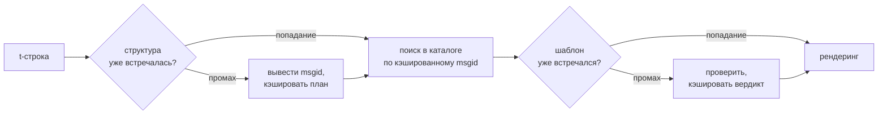

# Как это работает

Ничто на этой странице не требуется для использования библиотеки — это
покрывают [учебник](tutorial.md) и [руководство](guide.md). Здесь библиотека
выстраивается заново из первых принципов: что такое t-строка на самом деле,
как из неё получается msgid, что делает перевод корректным и как реализация
сводит стоимость всех этих проверок к десятым долям микросекунды. Читайте,
если вам любопытно, если хотите внести вклад или собираетесь
[реализовать соглашение самостоятельно](#reimplementing-it).

## Что такое t-строка на самом деле { #what-a-t-string-actually-is }

f-строка производит `str`, и производит его немедленно: к моменту, когда её
получает любая функция, значение уже интерполировано и предложение
запечатано. У t-строки ([PEP 750]) тот же синтаксис и то же немедленное
вычисление выражений, но другой тип результата:

```pycon
>>> name = "Ada"
>>> f"Hello {name}!"
'Hello Ada!'
>>> t"Hello {name}!"
Template(strings=('Hello ', '!'), interpolations=(Interpolation('Ada', 'name', None, ''),))
```

Этот объект `Template` хранит части, нужные конвейеру каталога, всё ещё
раздельно:

```pycon
>>> template = t"Total: {amount:,.2f}"
>>> template.strings
('Total: ', '')
>>> template.interpolations[0].expression
'amount'
>>> template.interpolations[0].value
1234.5
>>> template.interpolations[0].format_spec
',.2f'
```

- `strings` — литеральный текст вокруг интерполяций, по порядку.
- Для каждой интерполяции: **выражение** как исходный текст (`'amount'`),
  его вычисленное **значение** (`1234.5`) и любые **преобразование** (`!r`)
  и **спецификация формата** (`,.2f`) — они переносятся отдельно, а не
  применяются.

Всё, что делает эта библиотека, — дисциплинированное потребление этой
структуры. Язык уже произвёл то единственное разделение, которое нужно
i18n, — статический текст отдельно от значений, — поэтому библиотека никогда
не разбирает ваш исходный код и никогда не гадает, где внутри предложения
стоит значение. Остаются три решения: как структура становится ключом
каталога, что может сказать перевод этого ключа и как обе части рендерятся
обратно вместе.

## От шаблона к msgid { #from-template-to-msgid }

msgid — ключ, по которому индексируется каталог, — выводится только из
*статических* частей шаблона. Пройдите `strings` и `interpolations` в
исходном порядке; экранируйте скобки в каждом литеральном сегменте (`{`
становится `{{`); для каждой интерполяции выпустите один токен `{name}`, где
`name` — текст выражения с обрезанными окружающими пробелами. Из
`t"Total: {amount:,.2f}"`:

```text
strings         ('Total: ', '')
interpolations  expression 'amount'   conversion None   format_spec ',.2f'
msgid           'Total: {amount}'
```

У каждой части этого правила есть причина:

- **Выражение должно быть простым именем** — `str.isidentifier()` истинно,
  и это не ключевое слово Python. `t"Hello {user.name}"` отклоняется в месте
  вызова. msgid — это *ключ*: он должен получаться одинаковым при каждом
  запуске и каждом извлечении, и его читают переводчики, поэтому заполнитель
  обязан быть стабильным осмысленным словом — а не фрагментом кода,
  приглашающим каталог стать языком выражений.
- **Преобразование и спецификация формата никогда не попадают в msgid.**
  Переводчики не должны читать `:,.2f`, и никакой перевод не должен уметь
  это изменить. Следствие стоит знать: уточнение `:,.2f` до `:,.0f` в вашем
  коде не меняет ни одного msgid и потому не делает недействительным ни один
  перевод ни на одном языке. Ключ каталога отслеживает, *что говорит
  предложение*, а не то, как отформатировано значение.
- **Повторённое имя должно повторять своё форматирование в точности.**
  `t"{x:.2f} vs {x:.3f}"` отклоняется: оба вхождения схлопываются в один и
  тот же токен `{x}`, и msgid больше не мог бы сказать, какое форматирование
  должен использовать рендеринг.
- **Пустой msgid никогда не ищется**, потому что gettext резервирует его под
  собственный заголовок метаданных каталога. `t""` рендерится как `""`, не
  касаясь каталога.

Полный набор правил, включая крайние случаи, которые эта страница опускает, —
[SPEC §2](https://github.com/yhay81/gettext-tstrings/blob/main/SPEC.md).

## Что может сказать перевод { #what-a-translation-may-say }

Шаблон, возвращающийся из каталога, разбирается `string.Formatter` — тем же
парсером, что использует `str.format`. Грамматика намеренно заимствована, а
не изобретена: шаблон, который принимает эта библиотека, — это шаблон,
который уже понимает вся остальная экосистема. Затем применяются две
проверки.

**Форма:** каждое поле должно быть голым `{name}`. Преобразование или
спецификация формата — включая явно пустую `{name:}` — отклоняются, как и
позиционные поля (`{0}`, `{}`) и имена с пробелами внутри скобок
(`{ name }`). Последнее важнее, чем кажется: и `str.format`, и GNU `msgfmt`
отклоняют `{ name }`, поэтому принять его здесь означало бы производить
каталоги, которые ни один другой инструмент в цепочке не сможет проверить.

**Имена:** множество заполнителей шаблона сравнивается с множеством
источника. Для единственного числа каждое имя источника *обязательно*, и
ничего другого не *разрешено*. Для сообщения с множественным числом две
ветви объединяются:

- **разрешено** = объединение имён обеих ветвей
- **обязательно** = их пересечение

Так что относительно `t"One file"` / `t"{n} files"` имя `n` разрешено в
переводе любой из форм, но не обязательно ни в одной. Именно эта асимметрия
позволяет системе множественного числа целевого языка отличаться от
исходной: японский переводит обе ветви одной формой, которая, вероятно,
использует `{n}`; языку с большим числом форм, чем в английском, `{n}` может
понадобиться в форме, которой у английского нет.

Всё это не гипотетично: собственный служебный каталог этого сайта содержит
сообщение с множественным числом `Built {n} localized page` / `Built {n}
localized pages` — две английские ветви, — а издания сайта переводят это
единственное сообщение числом форм от одной до шести:

| Каталог | Формы | Переводы в порядке форм |
| --- | --- | --- |
| Японский | 1 | `ローカライズ済みページを{n}件ビルドしました` |
| Турецкий | 2 | `{n} yerelleştirilmiş sayfa oluşturuldu` — дважды, одинаково: турецкие существительные остаются в единственном числе после числительного |
| Итальянский | 2 | `Generata {n} pagina localizzata` · `Generate {n} pagine localizzate` — причастие согласуется в роде и числе |
| Русский | 3 | `Собрана {n} локализованная страница` · `Собраны {n} локализованные страницы` · `Собрано {n} локализованных страниц` |
| Польский | 3 | `Zbudowano {n} zlokalizowaną stronę` · `Zbudowano {n} zlokalizowane strony` · `Zbudowano {n} zlokalizowanych stron` |
| Арабский | 6 | среди них `تم إنشاء صفحة مترجمة واحدة ({n})` ровно для одного и `تم إنشاء {n} صفحات مترجمة` для нескольких |

Каждая строка — живая запись в `i18n/*/LC_MESSAGES/site.po` этого
репозитория, которую [многоязычная сборка](index.md) рендерит при каждом
релизе, — а тест привязывает эту таблицу к тем каталогам, так что
разойтись они не могут.

В этих границах перестановка и повтор намеренно не ограничены. И то и другое
грамматически необходимо в реальных языках, а ограничение числа вхождений
отклоняло бы корректные переводы без всякой пользы для безопасности: перевод
по-прежнему не может ничего *вычислить*, потому что пути вычисления не
существует — заполнители ищутся по имени среди уже вычисленных значений
шаблона и никогда не передаются в `eval`, `getattr` или сам `str.format`.

## Рендеринг { #rendering }

Рендеринг проверенного шаблона — проход по его фрагментам: выпустить каждую
литеральную часть, а для каждого заполнителя взять захваченное интерполяцией
значение и применить преобразование и спецификацию формата *исходной
стороны* — `format(convert(value, conversion), format_spec)`. При этом
соблюдаются две гарантии:

- **Каждое отдельное значение форматируется не более одного раза за
  рендеринг**, даже когда перевод повторяет заполнитель. Повтор меняет то,
  сколько раз вставляется результат, а не то, сколько раз выполняется ваш
  `__format__`.
- **Для множественного числа заполнитель читает ту ветвь, которая его
  определила.** Имя, присутствующее в обеих ветвях, читает значение,
  захваченное ветвью, которую выбирает *исходный* язык (`singular` при
  `n == 1`, иначе `plural`); имя, специфичное для одной ветви, всегда читает
  свою ветвь, даже когда правила множественного числа целевого языка сделали
  его доступным в другой форме.

Когда проверка терпит неудачу во время рендеринга, ответ зависит от того,
кто предоставил шаблон. Шаблон, пришедший из *каталога*, деградирует:
записывается одно предупреждение и рендерится исходный текст — так
сохраняется контракт gettext, что сломанный каталог никогда не роняет
приложение ([руководство показывает оба режима](guide.md#what-happens-when-a-catalog-is-wrong)).
Шаблон, переданный вызывающей стороной напрямую —
`CompiledTemplate.render`, — всегда вызывает исключение, потому что нет
исходного текста, к которому можно деградировать; снисходительность
существует для поиска в каталоге, а не для аргументов.

## Диагностика — часть дизайна { #diagnostics-are-part-of-the-design }

Ошибка заполнителя обычно попадает к переводчику, а не к программисту, и
часто в файле, где проблема невидима. Сказать `{name} is missing` тому, кто
видит эти самые символы в своём редакторе, — тупик, поэтому сообщения
строятся по трём правилам:

- Имя с **невидимым символом** — неразрывным пробелом от метода ввода,
  пробелом нулевой ширины — печатается с этим символом, заменённым его
  кодовой точкой, прямо на месте: `{<U+00A0>name}`. Читателю нужно видеть
  *где*.
- Имя, в буквах которого **смешаны системы письма**, — случай омоглифа —
  показывается дважды: один раз читаемо, один раз в экранированном виде,
  потому что `{nаme}` с кириллической `а` в печати неотличимо от `{name}`, и
  экранированная форма `(nаme)` — единственное написание, которое их
  различает.
- Всё остальное показывается **как написано**. `{名前}` и `{café}` —
  обычные имена; их экранирование лишило бы читателя возможности найти то,
  что имелось в виду.

По тому же принципу «отсутствующий» заполнитель, который *выглядит*
присутствующим, получает объяснение своего отсутствия: полноширинные скобки
восточноазиатского метода ввода, удвоение `{{name}}` после круговой поездки
экранирования, имя вне всяких скобок.
[Таблица чтения ошибок в руководстве](guide.md#reading-a-failure-message)
показывает каждое из этих сообщений дословно.

## Горячий путь { #the-hot-path }

Всё описанное выше происходит с каждой переведённой строкой, которую
рендерит приложение, поэтому реализация построена вокруг одной идеи:
**проверка никогда не пропускается, а значит, кэшироваться должна именно
проверка.**



Три кэша, по одному на стадию:

- **План на структуру места вызова.** Кортеж `strings` шаблона — объект,
  который интерпретатор уже построил, — служит ключом кэша, поэтому поиск
  ничего не выделяет. При попадании выражение, преобразование и спецификация
  формата каждой интерполяции всё равно сравниваются с записанными: два
  места вызова, разделяющие литеральный текст, но различающиеся
  форматированием (`t"{x:.2f}"` против `t"{x:.3f}"`), не должны
  столкнуться, и это сравнение — цена использования ключа, который
  интерпретатор отдаёт бесплатно.
- **Вердикт на шаблон.** Когда каталог впервые отвечает данным шаблоном, тот
  разбирается и проверяется; результат — скомпилированный план рендеринга
  или запись о некорректности — сохраняется в плане. Каждый последующий
  рендеринг этого сообщения достигает его за один поиск в словаре.
  Некорректные шаблоны тоже запоминаются — поэтому сломанная запись каталога
  предупреждает один раз, а не при каждом рендеринге.
- **Объединённый план на пару множественного числа**, хранящий множества
  объединения и пересечения, чтобы арифметика ветвей выполнялась один раз на
  сообщение, а не на каждый вызов.

Каждый кэш ограничен, и ни один не удерживает интерполированные *значения* —
только статическую структуру и текст шаблонов. Результат, измеренный
[`benchmarks/runtime.py`](https://github.com/yhay81/gettext-tstrings/blob/main/benchmarks/runtime.py):
примерно 0,4 мкс на сообщение с одним полем, включая построение самой
t-строки, — около 2,5× от простого `gettext(...).format(...)`, который не
проверяет ничего. Комментарий в начале
[`core.py`](https://github.com/yhay81/gettext-tstrings/blob/main/src/gettext_tstrings/core.py)
фиксирует отдельные измерения, стоящие за этой картиной.

## Реализовать самостоятельно { #reimplementing-it }

Ничто из вышесказанного не тайное знание: соглашение записано как
[spec v1](spec.md), а его машиночитаемый
[набор тестов на соответствие](spec.md#conformance) позволяет экстрактору,
плагину IDE или реализации на другом языке проверить себя по каждому правилу,
объяснённому на этой странице. Эта реализация запускает набор в собственных
тестах — именно это не даёт этой странице, спецификации и коду молча
разойтись.

  [PEP 750]: https://peps.python.org/pep-0750/
