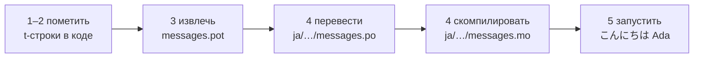

# Учебник

Эта страница проходит путь от пустой директории до программы, которая
здоровается по-японски. Пять шагов, опыт работы с gettext не требуется, и
каждая команда показана с выводом, который она действительно производит, —
так что на каждом шаге вы знаете, всё ли идёт по плану.

Нужен Python 3.14 или новее, потому что t-строки — новый синтаксис в 3.14.
Японский — язык-пример этой страницы, но от этого выбора ничего не зависит:
подставьте любой язык на шаге 4, где код локали `ja` — единственное, что его
называет.

## 1. Установка { #1-install }

```console
python -m pip install "gettext-tstrings[babel]"
```

Extra `[babel]` устанавливает [Babel] — инструмент, который на шаге 3 собирает
ваши сообщения в файлы каталогов. Это инструмент времени разработки: код в
продакшене рендерит только средствами стандартной библиотеки.

## 2. Пометьте сообщение в коде { #2-mark-a-message-in-your-code }

Создайте `app.py`:

```python
from gettext_tstrings import tr

name = "Ada"
print(tr(t"Hello {name}"))
```

`t"Hello {name}"` выглядит как f-строка, но префикс `t` сохраняет текст и
значение раздельно, вместо того чтобы сразу их объединить. Именно это
разделение позволяет `tr()` найти перевод целого предложения `Hello {name}` и
подставить значение потом.

Запустите прямо сейчас:

```console
$ python app.py
Hello Ada
```

Переводы ещё не установлены, поэтому исходный текст выводится как есть.
Программе, использующей эту библиотеку, каталог никогда не *обязателен* для
запуска: английский (или любой другой ваш исходный язык) — встроенный
fallback.

## 3. Извлеките сообщения { #3-extract-the-messages }

Переводчики не читают ваш исходный код; между вами и ними путешествует
небольшой файл — **каталог**. Первый шаг к нему — собрать из кода все
помеченные сообщения.

Сообщите Babel, где искать сообщения, создав `babel.cfg`:

```ini
[gettext_tstrings: **.py]
encoding = utf-8
```

Затем извлеките их в файл-шаблон (`.pot`):

```console
$ mkdir -p locales
$ pybabel extract -F babel.cfg -c "Translators:" -o locales/messages.pot .
extracting messages from app.py (encoding="utf-8")
writing PO template file to locales/messages.pot
```

Теперь `locales/messages.pot` содержит по одной записи на сообщение:

```po
#. gettext-tstrings
#: app.py:4
#, python-brace-format
msgid "Hello {name}"
msgstr ""
```

`msgid` — ключ, по которому будет искать ваш код. Пустой `msgstr` — место для
перевода, но не в этом файле: `.pot` — это *шаблон*, и следующий шаг копирует
его по одному разу на язык.

## 4. Переведите и скомпилируйте { #4-translate-and-compile }

Создайте японский каталог из шаблона:

```console
$ pybabel init -i locales/messages.pot -d locales -l ja
creating catalog locales/ja/LC_MESSAGES/messages.po based on locales/messages.pot
```

Откройте `locales/ja/LC_MESSAGES/messages.po` и заполните `msgstr`:

```po
msgid "Hello {name}"
msgstr "こんにちは {name}"
```

Оставьте `{name}` ровно таким, как есть: заполнитель — это то, как значение
находит своё место внутри переведённого предложения, и перевод волен
переместить его туда, куда требует целевой язык. В реальном проекте именно
этот `.po`-файл вы передаёте переводчику или загружаете на платформу
перевода; формат в обоих случаях один и тот же.

Каталоги редактируются как текст, но загружаются в двоичной форме (`.mo`),
поэтому скомпилируйте:

```console
$ pybabel compile -d locales
compiling catalog locales/ja/LC_MESSAGES/messages.po to locales/ja/LC_MESSAGES/messages.mo
```

Эта команда — ещё и страховка. Если бы перевод повредил заполнитель —
скажем, `{nome}` вместо `{name}`, — она отказалась бы его пропустить:

```console
$ pybabel compile -d locales
error: locales/ja/LC_MESSAGES/messages.po:24: translation does not match the
source placeholders: {name} is missing; {nome} is not in the source message
1 errors encountered.
```

## 5. Запустите { #5-run-it }

Направьте `app.py` на скомпилированный каталог. Щёлкните по маркерам, чтобы
увидеть, что делает каждая строка:

```python
import gettext

from gettext_tstrings import Translator

_ = Translator(gettext.translation("messages", localedir="locales", languages=["ja"]))  # (1)!

name = "Ada"
print(_(t"Hello {name}"))  # (2)!
```

1. Стандартная библиотека загружает скомпилированный `.mo`, а `Translator`
   привязывает его к вызываемому объекту. `_` — традиционное в gettext имя
   для «переведи это», короткое, потому что оно стоит у каждой видимой
   пользователю строки. Это та же функция, что и `tr`, привязанная к одному
   каталогу.
2. В момент вызова: текст t-строки становится ключом поиска `Hello {name}`,
   каталог отвечает `こんにちは {name}`, ответ проверяется по заполнителям
   источника, и только после этого подставляется значение.

```console
$ python app.py
こんにちは Ada
```

Вот и весь цикл, и его стоит увидеть одной картиной:



**Пометить → извлечь → перевести → скомпилировать → запустить.** Всё
остальное на этом сайте — уточнение одного из этих пяти шагов.

## Что дальше { #where-next }

- [Зачем нужны t-строки](comparison.md) — от чего защищает этот дизайн по
  сравнению с `%(name)s`, `.format()` и `$`-строками.
- [Руководство](guide.md) — множественное число, язык запроса, отложенные
  строки и что происходит во время выполнения, если каталог всё-таки неверен.
- [В продакшене](workflow.md) — тот же цикл, как его ведёт команда неделя за
  неделей: обновление каталогов, ворота CI и платформы перевода.
- [Извлечение](extraction.md) — полный справочник по `pybabel`: собственные
  имена функций, строгий режим для CI и проверки, охраняющие ваши каталоги.

  [Babel]: https://babel.pocoo.org/
