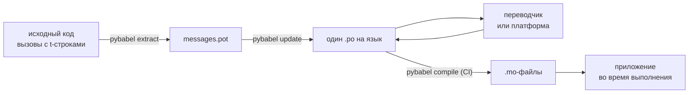

# В продакшене

[Учебник](tutorial.md) проходит цикл один раз, в одиночку, на программе с
одним сообщением. В реальном проекте цикл продолжает вращаться: сообщения
меняются после того, как их перевели, переводчик работает в другом месте и по
собственному расписанию, а скомпилированный каталог уходит с каждым релизом.
Эта страница — про эту практику: что остаётся в репозитории, что
путешествует, что обязан проверять CI и где среда выполнения привязывает
язык.

В сумме получается шесть проверок, так что вот они сразу; каждый раздел ниже
настраивает одну из них.

- `pybabel update --check` проходит — ни одно сообщение не изменилось так,
  чтобы каталоги об этом не услышали.
- `pybabel compile` останавливает сборку по своему коду возврата.
- Оставшиеся записи `fuzzy` оставлены намеренно — каждая выводится как
  исходный текст, пока переводчик её не подтвердит.
- Набор тестов один раз рендерит каждый поставляемый язык со `strict=True`.
- Артефакт продакшена содержит `.mo`-файлы и не содержит Babel.
- Логгер `gettext_tstrings` направлен в мониторинг.

## Структура проекта { #the-shape-of-a-project }

```text
myapp/
├── babel.cfg
├── pyproject.toml
├── src/
│   └── myapp/
└── locales/
    ├── messages.pot
    ├── ja/LC_MESSAGES/messages.po
    └── de/LC_MESSAGES/messages.po
```

Коммитьте `babel.cfg`, шаблон `.pot` и каждый `.po` — это исходники сборки
перевода, и их диффы — то, по чему вы рецензируете изменения переводов.
Скомпилированные `.mo`-файлы — артефакты сборки: создавайте их в CI или при
упаковке, а не коммитьте, чтобы `.po` и его `.mo` никогда не могли разойтись
в том, что уходит в поставку.

У одного файла роль в обе стороны: `.pot` несёт ваши сообщения *к*
переводчикам, `.po`-файлы несут переводы *обратно*. Остальная часть этой
страницы — про то, что движется между ними.



## Цикл после первого перевода { #the-cycle-after-the-first-translation }

`pybabel init` из учебника обычно выполняется один раз — когда добавляется
язык. Дальше рабочий цикл — **извлечь → обновить → перевести → скомпилировать**, и
его центр — `pybabel update`, который вливает свежий шаблон в существующие
каталоги, не отбрасывая уже накопленные переводы.

Допустим, приветствие `Hello {name}` — уже переведённое как
`こんにちは {name}` — переформулировано в коде в `Welcome back, {name}`.
Извлеките и обновите:

```console
$ pybabel extract -F babel.cfg -c "Translators:" -o locales/messages.pot .
extracting messages from app.py (encoding="utf-8")
writing PO template file to locales/messages.pot
$ pybabel update -i locales/messages.pot -d locales
updating catalog locales/ja/LC_MESSAGES/messages.po based on locales/messages.pot
```

Японский каталог теперь содержит:

```po
#. gettext-tstrings
#: app.py:4
#, fuzzy, python-brace-format
msgid "Welcome back, {name}"
msgstr "こんにちは {name}"
```

Babel заметил, что новый msgid похож на удалённый, и связал его со старым
переводом — но пометил пару как **fuzzy**: догадка машины, ожидающая
человека. Флаг меняет то, что компилируется. `pybabel compile` **исключает
fuzzy-записи из `.mo`**, поэтому, пока переводчик не подтвердит пару, приложение выводит
новый английский текст, а не устаревший японский:

```console
$ pybabel compile -d locales
compiling catalog locales/ja/LC_MESSAGES/messages.po to locales/ja/LC_MESSAGES/messages.mo
$ python app.py
Welcome back, Ada
```

Изменённое сообщение, таким образом, деградирует так же, как сломанное, — к
исходному языку и никогда к устаревшему переводу. Часть цикла на стороне
переводчика — поправить `msgstr` и удалить флаг `fuzzy`; следующая
компиляция подхватит запись.

!!! note "Имена заполнителей — часть идентичности сообщения"

    msgid — это ключ каталога, и *имя* заполнителя находится внутри него,
    поэтому переименование переменной в коде (`name` → `user_name`) меняет
    msgid и отправляет перевод этого сообщения на каждом языке обратно в
    цикл fuzzy. Называйте интерполируемые переменные словами, понятными
    переводчику, и переименовывайте их только по веской причине.

    Форматирование — зеркальный случай: `!r` и `:.2f` [не входят в
    msgid](internals.md#from-template-to-msgid), поэтому уточнение
    `{amount:,.2f}` до `{amount:,.0f}` не меняет ничего ни в одном каталоге.
    Переформулировка самого *предложения*, разумеется, настоящее изменение —
    это и есть цикл выше.

## Что проверяет CI { #what-ci-gates }

Красной сборки стоят три сбоя: каталоги отстали от кода, перевод сломал
заполнитель или сломанная запись просочилась до времени выполнения. По
одному шагу на каждый сбой:

```yaml
- run: pybabel extract -F babel.cfg -c "Translators:" -o locales/messages.pot .
- run: pybabel update -i locales/messages.pot -d locales --check
- run: pybabel compile -d locales
- run: pytest
```

`pybabel update --check` ничего не переписывает и завершается ненулевым
статусом, когда каталог устарел относительно свежеизвлечённого шаблона, —
это защита от слияния кода, чьи сообщения никто не переизвлёк.
`pybabel compile` выполняет проверки заполнителей и самого Babel, и
[зарегистрированного checker](extraction.md#your-existing-toolchain-validates-these-catalogs)
этого пакета.

!!! bug "Babel 2.18.0: `--check` не может проверять каталог, использующий контексты"

    На Babel 2.18.0 `pybabel update --check` сообщает, что устарел **каждый**
    каталог, содержащий `msgctxt`, — при каждом запуске и насколько бы
    свежим тот ни был. Вечно падающие ворота хуже, чем никаких, потому что
    команда их отключает, — так что, если вы вообще пользуетесь `pgettext` или
    `npgettext`, замените этот шаг, а не миритесь с ним. Прочитать шаблон и
    каждый каталог через `babel.messages.pofile.read_po` и сравнить
    `{(m.context, m.id) for m in catalog if m.id}` — вот и вся проверка, и
    именно её делает [собственная сборка этого сайта](index.md). Причина
    [разобрана на странице «Подводные камни»](pitfalls.md#your-tools-have-bugs-too).

!!! danger "Проверяйте статус выхода, а не журнал"

    `pybabel compile` сообщает о каждой ошибке заполнителей, выходит с
    ненулевым статусом — **и всё равно записывает `.mo`**. Pipeline, который
    компилирует и затем копирует `locales/` в образ, отправит сломанный
    каталог в поставку, если ненулевой статус его на самом деле не
    остановит. Позволить этому шагу провалить сборку, как выше, — и есть всё
    решение.

Последняя строка — ваш обычный набор тестов с одной добавленной привычкой:
где-нибудь в нём прорендерите хотя бы одно сообщение на каждый поставляемый
язык через строгий переводчик —

```python
import gettext

from gettext_tstrings import Translator


def test_catalogs_render(language: str) -> None:
    translations = gettext.translation("messages", localedir="locales", languages=[language])
    _ = Translator(translations, strict=True)
    name = "Ada"
    assert _(t"Welcome back, {name}")
```

— потому что `strict=True` [вызывает исключение там, где продакшен молча
откатился бы](guide.md#what-happens-when-a-catalog-is-wrong), а рендеринг во
время выполнения — единственная проверка, которая видит каталог ровно таким,
каким его увидит приложение, вместе с `.mo`.

## Работа с переводчиками и платформами { #working-with-translators-and-platforms }

`.po`-файл — формат обмена всего мира gettext, и именно поэтому эта
библиотека использует его повторно: передать перевод — значит передать файл,
будь получатель коллегой с PO-редактором или платформой вроде Weblate или
Crowdin. Передачу делают удачной три вещи:

**Скажите, для чего это сообщение.** Комментарий в коде путешествует вместе
с сообщением — именно его собирает флаг `-c "Translators:"`:

```python
from gettext_tstrings import tr

name = "Ada"
# Translators: shown on the dashboard right after sign-in
print(tr(t"Welcome back, {name}"))
```

```po
#. Translators: shown on the dashboard right after sign-in
#. gettext-tstrings
#: app.py:5
#, python-brace-format
msgid "Welcome back, {name}"
msgstr ""
```

Переводчик видит этот комментарий в своём редакторе, рядом с сообщением, на
другом конце света. Это самый дешёвый рычаг качества во всём процессе. Для
слова-омонима — «Open» как кнопка против «Open» как состояние — дайте
сообщению [контекст](guide.md#binding-a-catalog) через `pgettext`, который
станет видимым `msgctxt` в каталоге.

**Пусть платформа проверяет заполнители.** Каждое сообщение, извлечённое из
t-строки, несёт флаг `python-brace-format`, и именно эта одна строка
включает QA заполнителей в инструментах, которыми вы не управляете: Weblate
документирует эту проверку, коммерческие платформы привязывают собственные к
тому же флагу, а `msgfmt --check-format` обеспечивает её в любом конвейере
GNU. Подробности — и что сверх них ловит поставляемый checker — на
[странице извлечения](extraction.md#your-existing-toolchain-validates-these-catalogs).

**Доверяйте страховке ровно настолько, насколько она тянет.** Что бы ни
вернулось с платформы, это по-прежнему данные, входящие в вашу сборку;
именно ворота CI выше превращают «платформа, наверное, это проверила» в
«это не может уйти в поставку сломанным».

## Привязка языка во время выполнения { #binding-a-language-at-runtime }

Всё предыдущее производит каталоги. Остаётся решить, где приложение выбирает
один из них, и у решения один честный ответ: привязывайте один раз на
*область действия языка* — процесс для CLI, запрос для веб-сервиса.

=== "Один процесс, один язык"

    Консольный инструмент или настольное приложение читает окружение
    пользователя один раз, при запуске. Без `languages=` стандартная
    библиотека сама договаривается по `LANGUAGE`, `LC_ALL`, `LC_MESSAGES` и
    `LANG`; `fallback=True` возвращает нулевой каталог — исходный текст —
    вместо исключения, когда ни одно из них не совпало с каталогом, который
    вы поставляете.

    ```python
    import gettext

    from gettext_tstrings import Translator

    _ = Translator(gettext.translation("messages", localedir="locales", fallback=True))

    name = "Ada"
    print(_(t"Welcome back, {name}"))
    ```

=== "Flask"

    Веб-приложение решает на каждый запрос. Загрузите каждый каталог один
    раз при импорте, затем привяжите согласованный к контексту до выполнения
    view — [`set_translations`](guide.md#per-request-language) локальна для
    контекста, поэтому параллельные запросы на разных языках никогда не
    видят чужую привязку.

    ```python
    import gettext

    from flask import Flask, request

    from gettext_tstrings import set_translations, tr

    LANGUAGES = ("en", "ja", "de")
    CATALOGS = {
        language: gettext.translation(
            "messages", localedir="locales", languages=[language], fallback=True
        )
        for language in LANGUAGES
    }

    app = Flask(__name__)


    @app.before_request
    def bind_language() -> None:
        language = request.accept_languages.best_match(LANGUAGES) or "en"
        set_translations(CATALOGS[language])


    @app.get("/")
    def home() -> str:
        name = "Ada"
        return tr(t"Welcome back, {name}")
    ```

=== "Middleware ASGI"

    Под асинхронными фреймворками — FastAPI, Starlette и всем прочим ASGI —
    оберните запрос в [`use_translations`](guide.md#per-request-language):
    привязка живёт в `ContextVar`, который переключение async-задач
    сохраняет для каждого запроса.

    ```python
    import gettext

    from fastapi import FastAPI, Request

    from gettext_tstrings import tr, use_translations

    LANGUAGES = ("en", "ja", "de")
    CATALOGS = {
        language: gettext.translation(
            "messages", localedir="locales", languages=[language], fallback=True
        )
        for language in LANGUAGES
    }

    app = FastAPI()


    @app.middleware("http")
    async def bind_language(request: Request, call_next):
        language = negotiate_language(request.headers.get("accept-language"), LANGUAGES)
        with use_translations(CATALOGS[language]):
            return await call_next(request)
    ```

    `negotiate_language` обозначает ваш разбор Accept-Language — он есть в
    большинстве фреймворков или их экосистем; важна здесь привязка вокруг
    `call_next`.

Картину завершают две привычки времени выполнения. Строки, созданные при
импорте, — метка формы, отображаемое имя enum — не должны захватывать язык,
активный во время импорта; определяйте их через
[`lazy_gettext`](guide.md#deferred-translation), и они выведутся на языке,
активном в момент *использования*. И направьте logger `gettext_tstrings`
туда, куда смотрит человек: его предупреждения — это мягкий режим,
сообщающий о переводе, проскользнувшем мимо всех ворот, по одной строке на
сломанное сообщение, а не на каждый рендеринг.

## Поставка { #shipping }

Продакшену нужны пакет, `.mo`-файлы и больше ничего. Babel — зависимость
разработки и CI: держите `gettext-tstrings[babel]` вне продакшен-образа и
устанавливайте там голый пакет; рендеринг работает на одной стандартной
библиотеке. Компилируйте каталоги в той же сборке, которая производит
развёртываемый артефакт, — тогда `.mo`-файлы внутри него будут ровно теми
самыми отрецензированными `.po`-файлами, и ничто, скомпилированное на чьём-то
ноутбуке, никогда не уйдёт в поставку.

Перед релизом — контрольный список, к которому сводится эта страница:

- `pybabel update --check` проходит — ни одно сообщение не изменилось так,
  чтобы каталоги об этом не услышали.
- `pybabel compile` блокирует сборку своим статусом выхода.
- Оставшиеся записи `fuzzy` намеренны — каждая выводится как исходный текст,
  пока переводчик её не подтвердит.
- Набор тестов рендерит каждый поставляемый язык один раз со `strict=True`.
- Продакшен-артефакт содержит `.mo`-файлы и никакого Babel.
- Logger `gettext_tstrings` направлен в мониторинг.

## Что дальше { #where-next }

- [Извлечение](extraction.md) — справочник по инструментальной половине этой
  страницы: опции сопоставления, собственные имена функций, строгий режим и
  каждая проверка.
- [Руководство](guide.md) — половина времени выполнения: множественное
  число, контексты, отложенные строки и режимы сбоев в подробностях.
- [Как это работает](internals.md) — почему msgid выглядит именно так и что
  на самом деле проверяет валидация.
