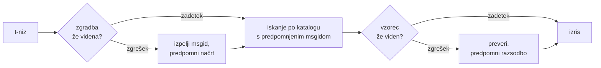

# Kako deluje

Nič na tej strani ni potrebno za uporabo knjižnice — to pokrivata
[vadnica](tutorial.md) in [vodnik](guide.md). Ta stran knjižnico namesto tega
znova sestavi iz prvih načel: kaj t-niz v resnici je, kako iz njega izpade
msgid, kaj prevod naredi veljaven in kako izvedba doseže, da vse to preverjanje
stane desetinke mikrosekunde. Preberite jo, če vas zanima, če želite
prispevati ali če nameravate
[dogovor izvesti sami](#reimplementing-it).

## Kaj t-niz v resnici je { #what-a-t-string-actually-is }

F-niz proizvede `str`, in to takoj — ko ga katera koli funkcija prejme, je
vrednost že interpolirana in poved je zapečatena. T-niz ([PEP 750]) ima isto
sintakso in isto takojšnje vrednotenje svojih izrazov, a proizvede drug tip:

```pycon
>>> name = "Ada"
>>> f"Hello {name}!"
'Hello Ada!'
>>> t"Hello {name}!"
Template(strings=('Hello ', '!'), interpolations=(Interpolation('Ada', 'name', None, ''),))
```

Ta objekt `Template` ohrani dele, ki jih katalogni cevovod potrebuje, in to še
vedno ločene:

```pycon
>>> template = t"Total: {amount:,.2f}"
>>> template.strings
('Total: ', '')
>>> template.interpolations[0].expression
'amount'
>>> template.interpolations[0].value
1234.5
>>> template.interpolations[0].format_spec
',.2f'
```

- `strings` — dobesedno besedilo okoli interpolacij, v zaporedju.
- Za vsako interpolacijo: **izraz** kot izvorno besedilo (`'amount'`), njegova
  ovrednotena **vrednost** (`1234.5`) ter morebitna **pretvorba** (`!r`) in
  **formatna specifikacija** (`,.2f`) — nošeni ločeno, namesto uporabljeni.

Vse, kar ta knjižnica počne, je disciplinirano uživanje te zgradbe. Jezik je
eno ločitev, ki jo i18n potrebuje — statično besedilo proč od vrednosti —, že
opravil, zato knjižnica nikoli ne razčlenjuje vaše izvorne kode in nikoli ne
ugiba, kje znotraj povedi tiči vrednost. Ostanejo tri odločitve: kako zgradba
postane katalogni ključ, kaj sme prevod tega ključa povedati in kako se oba
izrišeta nazaj skupaj.

## Od predloge do msgida { #from-template-to-msgid }

Msgid — ključ, po katerem je katalog indeksiran — je izpeljan izključno iz
*statičnih* delov predloge. Prehodite `strings` in `interpolations` po vrsti iz
izvorne kode; vsak dobesedni odsek ubežno zapišite z zavitimi oklepaji (`{`
postane `{{`); za vsako interpolacijo izpišite eno značko `{name}`, kjer je
`name` besedilo izraza z odstranjenim obdajajočim praznim prostorom. Iz
`t"Total: {amount:,.2f}"`:

```text
strings         ('Total: ', '')
interpolations  expression 'amount'   conversion None   format_spec ',.2f'
msgid           'Total: {amount}'
```

Vsak del tega pravila ima svoj razlog:

- **Izraz mora biti preprosto ime** — `str.isidentifier()` je resničen in ime
  ni Pythonova ključna beseda. `t"Hello {user.name}"` je zavrnjen na klicnem
  mestu. Msgid je *ključ*: ob vsakem teku in vsaki ekstrakciji mora izpasti
  enak, berejo pa ga prevajalci, zato mora biti ograda stabilna, smiselna
  beseda — ne drobec kode, ki katalog vabi, naj postane izrazni jezik.
- **Pretvorba in formatna specifikacija nikoli ne vstopita v msgid.**
  Prevajalcem ni treba brati `:,.2f` in noben prevod tega ne sme spremeniti.
  Posledico je vredno poznati: zaostritev `:,.2f` v `:,.0f` v vaši kodi ne
  spremeni nobenega msgida, zato ne razveljavi nobenega prevoda v nobenem
  jeziku. Katalogni ključ sledi *temu, kar poved pove*, ne pa temu, kako je
  vrednost oblikovana.
- **Ponovljeno ime mora natanko ponoviti tudi svoje oblikovanje.**
  `t"{x:.2f} vs {x:.3f}"` je zavrnjen, ker se obe pojavitvi zlijeta v isto
  značko `{x}` in msgid ne bi mogel več povedati, katero oblikovanje naj izris
  uporabi.
- **Prazen msgid se nikoli ne išče**, ker ga gettext rezervira za katalogovo
  lastno glavo s podatki. `t""` se izriše kot `""`, ne da bi se dotaknil
  kataloga.

Celoten nabor pravil, vključno z robnimi primeri, ki jih ta stran preskoči, je
[SPEC §2](https://github.com/yhay81/gettext-tstrings/blob/main/SPEC.md).

## Kaj sme prevod povedati { #what-a-translation-may-say }

Vzorec, ki se vrne iz kataloga, se razčleni s `string.Formatter` — istim
razčlenjevalnikom, kot ga uporablja `str.format`. Slovnica je namenoma
izposojena, ne izmišljena: vzorec, ki ga ta knjižnica sprejme, je vzorec, ki ga
širši ekosistem že razume. Nato se uporabita dve preverjanji.

**Oblika:** vsako polje mora biti golo `{name}`. Pretvorba ali formatna
specifikacija — vključno z izrecno prazno `{name:}` — je zavrnjena, prav tako
pozicijska polja (`{0}`, `{}`) in imena, obdana s praznim prostorom
(`{ name }`). Zadnje je pomembnejše, kot je videti: `str.format` in GNU-jev
`msgfmt` `{ name }` oba zavrneta, zato bi njegovo sprejemanje tukaj proizvedlo
kataloge, ki jih nobeno drugo orodje v verigi ne more preveriti.

**Imena:** množica ograd vzorca se primerja z izvorno. Pri sporočilu v ednini
je vsako izvorno ime *zahtevano* in nič drugega ni *dovoljeno*. Pri množinskem
sporočilu se veji zlijeta:

- **dovoljeno** = unija imen obeh vej
- **zahtevano** = njun presek

Tako je glede na `t"One file"` / `t"{n} files"` ime `n` dovoljeno v prevodu
katere koli oblike, a zahtevano v nobeni. Prav ta asimetrija omogoča, da se
množinski sistem ciljnega jezika razlikuje od izvornega — japonščina obe veji
prevede z eno obliko, ki verjetno uporabi `{n}`; jezik z več oblikami, kot jih
ima angleščina, utegne `{n}` potrebovati v obliki, kjer je angleščina nima.

Nič od tega ni hipotetično: lastni katalog okvira tega spletišča nosi množinsko
sporočilo `Built {n} localized page` / `Built {n} localized pages` — dve
angleški veji —, različice spletišča pa to eno sporočilo prevedejo v kjer koli
od ene do šestih oblik:

| Katalog | Oblike | Prevodi, po vrsti oblik |
| --- | --- | --- |
| japonščina | 1 | `ローカライズ済みページを{n}件ビルドしました` |
| turščina | 2 | `{n} yerelleştirilmiş sayfa oluşturuldu` — dvakrat, enako: turški samostalniki za števnikom ostanejo v ednini |
| italijanščina | 2 | `Generata {n} pagina localizzata` · `Generate {n} pagine localizzate` — deležnik se ujema v spolu in številu |
| ruščina | 3 | `Собрана {n} локализованная страница` · `Собраны {n} локализованные страницы` · `Собрано {n} локализованных страниц` |
| poljščina | 3 | `Zbudowano {n} zlokalizowaną stronę` · `Zbudowano {n} zlokalizowane strony` · `Zbudowano {n} zlokalizowanych stron` |
| arabščina | 6 | med njimi `تم إنشاء صفحة مترجمة واحدة ({n})` za natanko eno in `تم إنشاء {n} صفحات مترجمة` za nekaj njih |

Vsaka vrstica je živ vnos v datotekah `i18n/*/LC_MESSAGES/site.po` tega
repozitorija, ki jih ob vsaki izdaji izriše
[večjezična gradnja](index.md) — test pa to tabelo pripne na te kataloge, tako
da se ne moreta razhajati.

Znotraj teh meja sta prerazporejanje in ponavljanje namenoma neomejena. Oboje
je v resničnih jezikih slovnično nujno, omejevanje števila pojavitev pa bi
zavračalo pravilne prevode brez varnostne koristi: prevod še vedno ne more
ničesar *ovrednotiti*, ker pot do vrednotenja ne obstaja — ograde se iščejo po
imenu med že izračunanimi vrednostmi predloge in nikoli ne gredo v `eval`,
`getattr` ali `str.format` sam.

## Izris { #rendering }

Izris preverjenega vzorca je sprehod po njegovih kosih: izpiši vsak dobesedni
del, za vsako ogrado pa vzemi ujeto vrednost interpolacije in uporabi
pretvorbo in formatno specifikacijo z *izvorne strani* — `format(convert(value,
conversion), format_spec)`. Pri tem sta ohranjeni dve jamstvi:

- **Vsaka posamezna vrednost se na izris oblikuje kvečjemu enkrat**, tudi kadar
  prevod ogrado ponovi. Ponavljanje spremeni, kolikokrat se rezultat vstavi, ne
  pa, kolikokrat teče vaš `__format__`.
- **Pri množini ograda bere vejo, ki jo je določila.** Ime, navzoče v obeh
  vejah, bere vrednost, ki jo je ujela veja, ki jo izbere *izvorni* jezik
  (`singular`, kadar je `n == 1`, sicer `plural`); vejno specifično ime vedno
  bere svojo vejo, tudi kadar so ga množinska pravila ciljnega jezika naredila
  dostopnega v drugi obliki.

Kadar preverjanje ob izrisu spodleti, se odziv razcepi po tem, kdo je vzorec
prispeval. Vzorec, ki je prišel iz *kataloga*, se poslabša: zabeleži se eno
opozorilo in izriše se izvorno besedilo, s čimer se ohrani gettextov dogovor,
da pokvarjen katalog nikoli ne podre aplikacije
([vodnik prikaže oba načina](guide.md#what-happens-when-a-catalog-is-wrong)).
Vzorec, ki ga je klicatelj izročil neposredno — `CompiledTemplate.render` —,
vedno sproži izjemo, ker ni izvornega besedila, na katero bi se lahko
poslabšal; prizanesljivost obstaja za iskanja po katalogu, ne za argumente.

## Diagnostika je del zasnove { #diagnostics-are-part-of-the-design }

Napaka pri ogradi običajno pristane pred prevajalcem, ne pred programerjem, in
to pogosto v datoteki, kjer je težava nevidna. Reči `{name} is missing` nekomu,
ki natanko te znake vidi v svojem urejevalniku, je slepa ulica, zato so
sporočila izračunana po treh pravilih:

- Ime, ki vsebuje **neviden znak** — nedeljivi presledek, ki ga je proizvedla
  vnosna metoda, presledek nične širine —, se izpiše s tem znakom, zamenjanim s
  svojo kodno točko, na mestu: `{<U+00A0>name}`. Bralec mora videti *kje*.
- Ime, katerega črke **mešajo pisave**, torej primer homoglifa, je prikazano
  dvakrat — enkrat berljivo, enkrat ubežno zapisano —, ker `{nаme}` s cirilskim
  `а` v tisku ni razločljiv od `{name}`, ubežni zapis `(nаme)` pa je edini
  zapis, ki ju loči.
- Vse drugo je prikazano **tako, kot je zapisano**. `{名前}` in `{café}` sta
  običajni imeni; ubežni zapis bi bralcu onemogočil, da najde, kaj je bilo
  mišljeno.

Po istem načelu dobi »manjkajoča« ograda, ki je videti *navzoča*, pojasnjeno
svojo odsotnost — široki zaviti oklepaji iz vzhodnoazijske vnosne metode,
podvojitev `{{name}}` iz krožne poti ubežnega zapisovanja, ime zunaj vseh
oklepajev. [Vodnikova tabela za branje napak](guide.md#reading-a-failure-message)
prikaže vsako od teh sporočil dobesedno.

## Vroča pot { #the-hot-path }

Vse zgornje se zgodi ob vsakem prevedenem nizu, ki ga aplikacija izriše, zato
je izvedba zgrajena okoli ene zamisli: **preverjanje se nikoli ne preskoči,
zato mora biti predpomnjeno prav preverjanje.**



Trije predpomnilniki, po eden na stopnjo:

- **Načrt na zgradbo klicnega mesta.** Ključ predpomnilnika je predlogina
  n-terica `strings` — objekt, ki ga je tolmač že zgradil —, zato iskanje ne
  alocira ničesar. Ob zadetku se izraz, pretvorba in formatna specifikacija
  vsake interpolacije še vedno primerjajo z zabeleženimi: dve klicni mesti, ki
  si delita dobesedno besedilo, a se razlikujeta v oblikovanju (`t"{x:.2f}"`
  proti `t"{x:.3f}"`), ne smeta trčiti, ta primerjava pa je cena za uporabo
  ključa, ki ga tolmač izroči zastonj.
- **Razsodba na vzorec.** Ko katalog prvič odgovori z danim vzorcem, se ta
  razčleni in preveri; izid — kompiliran načrt izrisa ali zapis o
  neveljavnosti — se hrani na načrtu. Vsak poznejši izris tega sporočila do
  njega pride z enim samim slovarskim iskanjem. Zapomnjeni so tudi neveljavni
  vzorci, in prav zato pokvarjen katalogni vnos opozori enkrat namesto ob
  vsakem izrisu.
- **Zlit načrt na množinski par**, ki drži množici unije in preseka, tako da se
  aritmetika vej zgodi enkrat na sporočilo, ne enkrat na klic.

Vsak predpomnilnik je omejen in nobeden ne zadrži interpoliranih *vrednosti* —
le statično zgradbo in besedilo vzorcev. Izid, izmerjen z
[`benchmarks/runtime.py`](https://github.com/yhay81/gettext-tstrings/blob/main/benchmarks/runtime.py):
približno 0,4 µs za sporočilo z enim poljem, vključno z izgradnjo samega
t-niza, kar je okoli 2,5-kratnik golega `gettext(...).format(...)`, ki ne
preveri ničesar. Komentar na vrhu
[`core.py`](https://github.com/yhay81/gettext-tstrings/blob/main/src/gettext_tstrings/core.py)
beleži posamezne meritve, ki dajejo to sliko.

## Izvesti jo na novo { #reimplementing-it }

Nič od zgornjega ni tajno izročilo: dogovor je zapisan kot
[specifikacija v1](spec.md), njegova strojno berljiva
[zbirka testov skladnosti](spec.md#conformance) pa ekstraktorju, vtičniku za
IDE ali izvedbi v drugem jeziku omogoča, da se preveri glede na vsako pravilo,
ki ga je ta stran razložila. Ta izvedba zbirko poganja v svojih testih in prav
to preprečuje, da bi se ta stran, specifikacija in koda tiho razšle.

  [PEP 750]: https://peps.python.org/pep-0750/
