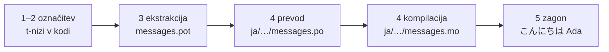

# Vadnica

Ta stran vodi od praznega imenika do programa, ki pozdravi v japonščini. Pet
korakov, brez predpostavljenih izkušenj z gettextom, in vsak ukaz je prikazan
z izpisom, ki ga v resnici proizvede — tako pri vsakem koraku veste, ali ste
na pravi poti.

Potrebujete Python 3.14 ali novejši, ker so t-nizi nova sintaksa v 3.14.
Japonščina je ciljni jezik primera na tej strani, vendar od te izbire nič ne
visi — v koraku 4 vstavite poljuben jezik; koda locale `ja` je edino mesto,
ki ga poimenuje.

## 1. Namestitev { #1-install }

```console
python -m pip install "gettext-tstrings[babel]"
```

Dodatek `[babel]` prinese [Babel], orodje, ki v koraku 3 zbere vaša sporočila
v katalogne datoteke. To je orodje za čas razvoja: produkcijska koda izrisuje
zgolj s standardno knjižnico.

## 2. Označite sporočilo v svoji kodi { #2-mark-a-message-in-your-code }

Ustvarite `app.py`:

```python
from gettext_tstrings import tr

name = "Ada"
print(tr(t"Hello {name}"))
```

`t"Hello {name}"` je videti kot f-niz, vendar predpona `t` ohrani besedilo in
vrednost ločena, namesto da bi ju na mestu zlila. Prav ta ločitev omogoča, da
`tr()` poišče prevod celotnega stavka `Hello {name}` in vrednost vstavi šele
zatem.

Zaženite ga takoj:

```console
$ python app.py
Hello Ada
```

Nameščen ni še noben prevod, zato se izvorno besedilo izriše takšno, kot je.
Program, ki uporablja to knjižnico, za zagon kataloga nikoli *ne zahteva* —
angleščina (ali kar koli je vaš izvorni jezik) je vgrajeni zasilni izpis.

## 3. Izvlecite sporočila { #3-extract-the-messages }

Prevajalci ne berejo vaše izvorne kode; med vami in njimi potuje majhna
datoteka, imenovana **katalog**. Prvi korak do nje je, da iz kode zberete
vsako označeno sporočilo.

Povejte Babelu, kako naj najde vaša sporočila, tako da ustvarite `babel.cfg`:

```ini
[gettext_tstrings: **.py]
encoding = utf-8
```

Nato ekstrahirajte v datoteko predloge (`.pot`):

```console
$ mkdir -p locales
$ pybabel extract -F babel.cfg -c "Translators:" -o locales/messages.pot .
extracting messages from app.py (encoding="utf-8")
writing PO template file to locales/messages.pot
```

`locales/messages.pot` zdaj vsebuje po en vnos na sporočilo:

```po
#. gettext-tstrings
#: app.py:4
#, python-brace-format
msgid "Hello {name}"
msgstr ""
```

`msgid` je ključ, ki ga bo iskala vaša koda. Prazen `msgstr` je mesto za
prevod — vendar ne v tej datoteki: `.pot` je *predloga* in naslednji korak jo
skopira enkrat za vsak jezik.

## 4. Prevedite in kompilirajte { #4-translate-and-compile }

Iz predloge ustvarite japonski katalog:

```console
$ pybabel init -i locales/messages.pot -d locales -l ja
creating catalog locales/ja/LC_MESSAGES/messages.po based on locales/messages.pot
```

Odprite `locales/ja/LC_MESSAGES/messages.po` in izpolnite `msgstr`:

```po
msgid "Hello {name}"
msgstr "こんにちは {name}"
```

Pustite `{name}` točno takšen, kot je — ograda je način, kako vrednost najde
svoje mesto znotraj prevedenega stavka, prevod pa jo sme premakniti kamor koli
jo ciljni jezik potrebuje. V resničnem projektu je ta datoteka `.po` tisto,
kar izročite prevajalcu ali naložite na prevajalsko platformo; format je v
obeh primerih enak.

Kataloge urejate kot besedilo, nalagajo pa se v binarni obliki (`.mo`), zato
jih kompilirajte:

```console
$ pybabel compile -d locales
compiling catalog locales/ja/LC_MESSAGES/messages.po to locales/ja/LC_MESSAGES/messages.mo
```

Ta ukaz je hkrati varnostna mreža. Če bi prevod poškodoval ogrado — recimo
`{nome}` namesto `{name}` — je ne bi spustil skozi:

```console
$ pybabel compile -d locales
error: locales/ja/LC_MESSAGES/messages.po:24: translation does not match the
source placeholders: {name} is missing; {nome} is not in the source message
1 errors encountered.
```

## 5. Zaženite ga { #5-run-it }

Usmerite `app.py` na kompiliran katalog. Kliknite oznake in videli boste, kaj
počne posamezna vrstica:

```python
import gettext

from gettext_tstrings import Translator

_ = Translator(gettext.translation("messages", localedir="locales", languages=["ja"]))  # (1)!

name = "Ada"
print(_(t"Hello {name}"))  # (2)!
```

1. Standardna knjižnica naloži kompiliran `.mo`, `Translator` pa ga veže na
   klicljiv objekt. `_` je običajno gettextovo ime za „prevedi to“ — kratko,
   ker se pojavi pri vsakem nizu, ki ga vidi uporabnik. To je ista funkcija
   kot `tr`, vezana na en katalog.
2. Ob klicu: besedilo t-niza postane iskalni ključ `Hello {name}`, katalog
   odgovori `こんにちは {name}`, odgovor se preveri glede na izvorne ograde in
   šele nato se vstavi vrednost.

```console
$ python app.py
こんにちは Ada
```

To je celotna zanka in vredno jo je videti kot eno samo sliko:



**Označi → izvleci → prevedi → kompiliraj → zaženi.** Vse drugo na tem
spletišču je le izpopolnitev enega od teh petih korakov.

## Kam naprej { #where-next }

- [Zakaj t-nizi](comparison.md) — pred čim vas ta zasnova varuje v primerjavi
  z `%(name)s`, `.format()` in `$`-nizi.
- [Vodnik](guide.md) — množina, jeziki na zahtevo, odloženi nizi in kaj se med
  izvajanjem zgodi, ko je katalog vseeno napačen.
- [V produkciji](workflow.md) — ista zanka, kot jo teden za tednom poganja
  ekipa: posodabljanje katalogov, zaščite v CI in prevajalske platforme.
- [Ekstrakcija](extraction.md) — celotna referenca `pybabel`: lastna imena
  funkcij, strogi način za CI in preverjanja, ki varujejo vaše kataloge.

  [Babel]: https://babel.pocoo.org/
