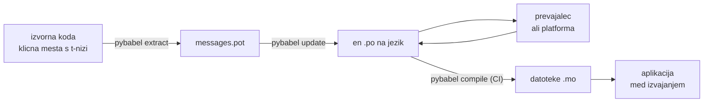

# V produkciji

[Vadnica](tutorial.md) zanko požene enkrat, sami in na programu z enim samim
sporočilom. V resničnem projektu se zanka vrti naprej: sporočila se spremenijo,
potem ko so že prevedena, prevajalec dela drugje in po svojem urniku,
kompiliran katalog pa gre z vsako izdajo v svet. Ta stran je ta praksa — kaj
ostane v repozitoriju, kaj potuje, kaj mora zapirati CI in kje se med izvajanjem
veže jezik.

## Oblika projekta { #the-shape-of-a-project }

```text
myapp/
├── babel.cfg
├── pyproject.toml
├── src/
│   └── myapp/
└── locales/
    ├── messages.pot
    ├── ja/LC_MESSAGES/messages.po
    └── de/LC_MESSAGES/messages.po
```

V repozitorij dodajte `babel.cfg`, predlogo `.pot` in vsak `.po` — to so viri
prevajalske gradnje in njihove razlike so način, kako pregledujete spremembe
prevodov. Kompilirane datoteke `.mo` so gradbeni izdelki: proizvajajte jih v CI
ali ob pakiranju, namesto da bi jih dodajali v repozitorij, tako da si `.po` in
njegov `.mo` nikoli ne moreta biti neenotna o tem, kaj se odpremi.

Ena datoteka ima vlogo v vsako smer: `.pot` nosi vaša sporočila *ven* k
prevajalcem, datoteke `.po` pa prevode *nazaj*. Vse spodnje je promet med tema
dvema.



## Cikel po prvem prevodu { #the-cycle-after-the-first-translation }

`pybabel init` iz vadnice se na jezik požene enkrat za vselej. Od tam naprej je
delovni cikel **izvleci → posodobi → prevedi → kompiliraj**, njegovo središče
pa je `pybabel update`, ki svežo predlogo zloži v obstoječe kataloge, ne da bi
zavrgel prevode, ki so že v njih.

Recimo, da je pozdrav `Hello {name}` — že preveden kot `こんにちは {name}` — v
kodi preoblikovan v `Welcome back, {name}`. Izvlecite in posodobite:

```console
$ pybabel extract -F babel.cfg -c "Translators:" -o locales/messages.pot .
extracting messages from app.py (encoding="utf-8")
writing PO template file to locales/messages.pot
$ pybabel update -i locales/messages.pot -d locales
updating catalog locales/ja/LC_MESSAGES/messages.po based on locales/messages.pot
```

Japonski katalog zdaj vsebuje:

```po
#. gettext-tstrings
#: app.py:4
#, fuzzy, python-brace-format
msgid "Welcome back, {name}"
msgstr "こんにちは {name}"
```

Babel je opazil, da je novi msgid podoben odstranjenemu, in ga je združil s
starim prevodom — a je par označil kot **fuzzy**: strojna domneva, ki čaka na
človeka. Zastavica ima zobe. `pybabel compile` **ohlapne vnose iz `.mo`
izpusti**, zato aplikacija, dokler prevajalec para ne potrdi, izriše novo
angleško besedilo namesto zastarelega japonskega:

```console
$ pybabel compile -d locales
compiling catalog locales/ja/LC_MESSAGES/messages.po to locales/ja/LC_MESSAGES/messages.mo
$ python app.py
Welcome back, Ada
```

Spremenjeno sporočilo se torej poslabša enako kot pokvarjeno — do izvornega
jezika, nikoli do zastarelega prevoda. Prevajalčev delež v ciklu je, da
`msgstr` popravi in zastavico `fuzzy` izbriše; naslednja kompilacija vnos
pobere.

!!! note "Imena ograd so del identitete sporočila"

    Msgid je katalogni ključ in *ime* ograde je v njem — zato preimenovanje
    spremenljivke v kodi (`name` → `user_name`) spremeni msgid in pošlje njegov
    prevod v vsakem jeziku nazaj skozi ohlapni cikel. Interpolirane
    spremenljivke poimenujte z besedami, ki jih bo prevajalec razumel, in jih
    preimenujte samo z razlogom.

    Oblikovanje je zrcalna slika: `!r` in `:.2f` [nista del
    msgida](internals.md#from-template-to-msgid), zato zaostritev
    `{amount:,.2f}` v `{amount:,.0f}` v nobenem katalogu ne spremeni ničesar.
    Preoblikovanje *povedi* pa je seveda resnična sprememba — in to je zgornji
    cikel.

## Kaj zapira CI { #what-ci-gates }

Tri odpovedi so vredne rdeče gradnje: katalogi so zaostali za kodo, prevod je
pokvaril ogrado ali pa se je pokvarjen vnos prebil vse do izvajanja. Po en
korak na odpoved:

```yaml
- run: pybabel extract -F babel.cfg -c "Translators:" -o locales/messages.pot .
- run: pybabel update -i locales/messages.pot -d locales --check
- run: pybabel compile -d locales
- run: pytest
```

`pybabel update --check` ničesar ne prepiše in se konča z neničelnim stanjem,
kadar je katalog zastarel glede na sveže izvlečeno predlogo — to je zaščita
pred združevanjem kode, katere sporočil ni nihče znova izvlekel. `pybabel
compile` požene preverjanja ograd tako Babela kot
[registriranega preverjevalnika](extraction.md#your-existing-toolchain-validates-these-catalogs)
tega paketa.

!!! bug "`--check` ne more zapreti kataloga, ki uporablja kontekste"

    Na Babelu 2.18.0 `pybabel update --check` **vsak** katalog, ki vsebuje
    `msgctxt`, javi kot zastarel, ob vsakem teku, ne glede na to, kako svež je.
    Primerjava teče skozi `Catalog.is_identical`, ki vsako sporočilo poišče po
    ključu, pod katerim je shranjeno — pri kontekstnem sporočilu pa je ta ključ
    par `(id, context)`, ki ga `Catalog.get` ne sprejema. Iskanje ne vrne
    ničesar in katalogi nikoli ne izpadejo enaki:

    ```pycon
    >>> from babel.messages.catalog import Catalog
    >>> c = Catalog(locale="ja")
    >>> c.add("Guide", "ガイド", context="navigation")
    <Message 'Guide' (flags: [])>
    >>> c.is_identical(c)
    False
    ```

    Če torej `pgettext` ali `npgettext` sploh uporabljate — in razdvoumljanje
    homonima je razlog, zakaj obstajata —, ta korak odpove na najslabši možni
    način: vedno rdeč, zato ga ekipa izklopi, zato zastarelosti ne zapira nič.
    Dokler ni popravljeno pri viru, primerjajte množice sporočil sami. Branje
    predloge in vsakega kataloga s `babel.messages.pofile.read_po` ter
    primerjava `{(m.context, m.id) for m in catalog if m.id}` je celotno
    preverjanje — in prav to počne [gradnja tega spletišča](index.md).

!!! danger "Preverjajte izhodno stanje, ne dnevnika"

    `pybabel compile` javi vsako napako pri ogradah, konča se z neničelnim
    stanjem — **`.mo` pa vseeno zapiše**. Cevovod, ki kompilira in nato
    `locales/` prekopira v sliko, odpremi pokvarjen katalog, razen če ga
    neničelno stanje res ustavi. Da korak podre gradnjo, kot zgoraj, je
    celoten popravek.

Zadnja vrstica je vaša običajna testna zbirka z eno dodano navado: nekje v njej
izrišite vsaj eno sporočilo na odpremljeni jezik skozi strog prevajalnik —

```python
import gettext

from gettext_tstrings import Translator


def test_catalogs_render(language: str) -> None:
    translations = gettext.translation("messages", localedir="locales", languages=[language])
    _ = Translator(translations, strict=True)
    name = "Ada"
    assert _(t"Welcome back, {name}")
```

— ker `strict=True` [sproži izjemo tam, kjer bi se produkcija tiho vrnila na izvirnik](guide.md#what-happens-when-a-catalog-is-wrong),
izris med izvajanjem pa je edino preverjanje, ki katalog vidi natanko tako, kot
ga bo videla aplikacija, z `.mo` in vsem.

## Delo s prevajalci in platformami { #working-with-translators-and-platforms }

Datoteka `.po` je izmenjevalni format celotnega sveta gettexta in prav zato jo
ta knjižnica ponovno uporablja: predati prevajanje pomeni predati datoteko, naj
je prejemnik sodelavec z urejevalnikom PO ali platforma, kakršni sta Weblate in
Crowdin. Predajo naredijo dobro tri stvari:

**Povejte, čemu je sporočilo namenjeno.** Komentar v kodi potuje s sporočilom —
prav to zbira zastavica `-c "Translators:"`:

```python
from gettext_tstrings import tr

name = "Ada"
# Translators: shown on the dashboard right after sign-in
print(tr(t"Welcome back, {name}"))
```

```po
#. Translators: shown on the dashboard right after sign-in
#. gettext-tstrings
#: app.py:5
#, python-brace-format
msgid "Welcome back, {name}"
msgstr ""
```

Prevajalec ta komentar vidi v svojem urejevalniku, ob sporočilu, na drugem
koncu sveta. To je najcenejši vzvod kakovosti v celotnem delovnem procesu. Pri
besedi, ki je sama sebi homonim — »Odpri« kot gumb proti »Odprto« kot stanje —,
sporočilu dodajte [kontekst](guide.md#binding-a-catalog) s `pgettext`, ki v
katalogu postane viden `msgctxt`.

**Pustite platformi, da preveri ograde.** Vsako sporočilo, izvlečeno iz t-niza,
nosi zastavico `python-brace-format` in prav ta ena vrstica vklopi nadzor
kakovosti ograd v orodjih, ki jih ne nadzorujete — Weblate to preverjanje
dokumentira, komercialne platforme svojega vežejo na isto zastavico,
`msgfmt --check-format` pa ga uveljavlja v vsakem cevovodu GNU. Podrobnosti in
kaj priloženi preverjevalnik ujame vrh tega, so na
[strani o ekstrakciji](extraction.md#your-existing-toolchain-validates-these-catalogs).

**Varnostni mreži zaupajte natanko toliko, kolikor sega.** Kar koli se vrne s
platforme, so še vedno podatki, ki vstopajo v vašo gradnjo; zgornje zaščite v
CI so tisto, kar »platforma je to najbrž preverila« spremeni v »to se ne more
odpremiti pokvarjeno«.

## Vezava jezika med izvajanjem { #binding-a-language-at-runtime }

Vse doslej proizvaja kataloge. Preostala odločitev je, kje aplikacija enega
izbere, in ima en sam pošten odgovor: vežite enkrat na *obseg enega jezika* —
na proces pri orodju ukazne vrstice, na zahtevo pri spletni storitvi.

=== "En proces, en jezik"

    Orodje ukazne vrstice ali namizna aplikacija okolje uporabnika prebere
    enkrat, ob zagonu. Če `languages=` ne podate, se standardna knjižnica
    pogaja iz `LANGUAGE`, `LC_ALL`, `LC_MESSAGES` in `LANG`; `fallback=True`
    vrne ničelni katalog — izvorno besedilo —, namesto da bi sprožil izjemo,
    kadar se noben od njih ne ujema s katalogom, ki ga odpremljate.

    ```python
    import gettext

    from gettext_tstrings import Translator

    _ = Translator(gettext.translation("messages", localedir="locales", fallback=True))

    name = "Ada"
    print(_(t"Welcome back, {name}"))
    ```

=== "Flask"

    Spletna aplikacija se odloči za vsako zahtevo posebej. Vsak katalog
    naložite enkrat ob uvozu, nato pa izpogajanega vežite na kontekst, preden
    steče pogled — [`set_translations`](guide.md#per-request-language) je
    krajevno vezan na kontekst, zato sočasne zahteve v različnih jezikih nikoli
    ne vidijo vezav druga druge.

    ```python
    import gettext

    from flask import Flask, request

    from gettext_tstrings import set_translations, tr

    LANGUAGES = ("en", "ja", "de")
    CATALOGS = {
        language: gettext.translation(
            "messages", localedir="locales", languages=[language], fallback=True
        )
        for language in LANGUAGES
    }

    app = Flask(__name__)


    @app.before_request
    def bind_language() -> None:
        language = request.accept_languages.best_match(LANGUAGES) or "en"
        set_translations(CATALOGS[language])


    @app.get("/")
    def home() -> str:
        name = "Ada"
        return tr(t"Welcome back, {name}")
    ```

=== "Vmesno programje ASGI"

    Pod asinhronimi ogrodji — FastAPI, Starlette in kar koli drugega z ASGI —
    zahtevo ovijte v [`use_translations`](guide.md#per-request-language):
    vezava živi v `ContextVar`, ki ga preklapljanje asinhronih opravil ohrani
    za vsako zahtevo posebej.

    ```python
    import gettext

    from fastapi import FastAPI, Request

    from gettext_tstrings import tr, use_translations

    LANGUAGES = ("en", "ja", "de")
    CATALOGS = {
        language: gettext.translation(
            "messages", localedir="locales", languages=[language], fallback=True
        )
        for language in LANGUAGES
    }

    app = FastAPI()


    @app.middleware("http")
    async def bind_language(request: Request, call_next):
        language = negotiate_language(request.headers.get("accept-language"), LANGUAGES)
        with use_translations(CATALOGS[language]):
            return await call_next(request)
    ```

    `negotiate_language` predstavlja vaše razčlenjevanje glave Accept-Language —
    večina ogrodij ali njihovih ekosistemov ga ponuja; tukaj je pomembna vezava
    okoli `call_next`.

Sliko dopolnita dve navadi med izvajanjem. Nizi, ustvarjeni ob uvozu — oznaka
obrazca, prikazno ime naštevnega tipa —, ne smejo ujeti jezika, ki je bil
dejaven med uvozom; določite jih z
[`lazy_gettext`](guide.md#deferred-translation) in izrisali se bodo v jeziku,
dejavnem ob *rabi*. In dnevnik `gettext_tstrings` usmerite tja, kamor kdo
gleda: njegova opozorila so prizanesljivi način, ki javlja prevod, izmuznjen
vsem zaščitam, po eno vrstico na pokvarjeno sporočilo namesto po eno na izris.

## Odprema { #shipping }

Produkcija potrebuje paket, datoteke `.mo` in nič drugega. Babel je odvisnost
razvoja in CI — `gettext-tstrings[babel]` pustite zunaj produkcijske slike in
tam namestite goli paket; izris teče izključno na standardni knjižnici.
Kataloge kompilirajte v isti gradnji, ki proizvede izdelek, ki ga razmestite,
tako da so datoteke `.mo` v njem natanko pregledane datoteke `.po` in da se ne
odpremi nič, kar je bilo kompilirano na nekem prenosniku.

Pred izdajo je kontrolni seznam, na katerega se ta stran skrči:

- `pybabel update --check` uspe — nobeno sporočilo se ni spremenilo, ne da bi
  za to izvedeli katalogi.
- `pybabel compile` gradnjo zapira po svojem izhodnem stanju.
- Preostali vnosi `fuzzy` so namerni — vsak se izriše kot izvorno besedilo,
  dokler ga prevajalec ne potrdi.
- Testna zbirka vsak odpremljeni jezik enkrat izriše s `strict=True`.
- Produkcijski izdelek vsebuje datoteke `.mo` in nobenega Babela.
- Dnevnik `gettext_tstrings` je usmerjen v nadzorni sistem.

## Kam naprej { #where-next }

- [Ekstrakcija](extraction.md) — referenca za orodno polovico te strani:
  možnosti preslikav, lastna imena funkcij, strogi način in vsak
  preverjevalnik.
- [Vodnik](guide.md) — izvajalna polovica: množina, konteksti, odloženi nizi in
  načini odpovedi do podrobnosti.
- [Kako deluje](internals.md) — zakaj je msgid videti tako, kot je videti, in
  kaj preverjanje v resnici preveri.
