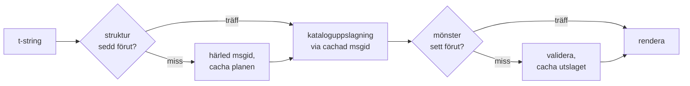

# Så fungerar det

Ingenting på den här sidan krävs för att använda biblioteket —
[handledningen](tutorial.md) och [guiden](guide.md) täcker det. Den här sidan
bygger i stället upp biblioteket från första principer: vad en t-string
faktiskt är, hur en msgid faller ut ur den, vad som gör en översättning
giltig, och hur implementationen får all den kontrollen att kosta tiondels
mikrosekunder. Läs den om du är nyfiken, om du vill bidra, eller om du tänker
[implementera konventionen själv](#reimplementing-it).

## Vad en t-string faktiskt är { #what-a-t-string-actually-is }

En f-string producerar en `str`, och producerar den omedelbart — när någon
funktion tar emot den har värdet redan interpolerats och meningen är
förseglad. En t-string ([PEP 750]) har samma syntax och samma ivriga
utvärdering av sina uttryck, men producerar en annan typ:

```pycon
>>> name = "Ada"
>>> f"Hello {name}!"
'Hello Ada!'
>>> t"Hello {name}!"
Template(strings=('Hello ', '!'), interpolations=(Interpolation('Ada', 'name', None, ''),))
```

Det där `Template`-objektet behåller delarna en katalogpipeline behöver,
fortfarande åtskilda:

```pycon
>>> template = t"Total: {amount:,.2f}"
>>> template.strings
('Total: ', '')
>>> template.interpolations[0].expression
'amount'
>>> template.interpolations[0].value
1234.5
>>> template.interpolations[0].format_spec
',.2f'
```

- `strings` — den bokstavliga texten runt interpolationerna, i ordning.
- För varje interpolation: **uttrycket** som källtext (`'amount'`), dess
  utvärderade **värde** (`1234.5`), och eventuell **konvertering** (`!r`) och
  **formatspecifikation** (`,.2f`) — burna separat i stället för tillämpade.

Allt det här biblioteket gör är en disciplinerad konsumtion av den
strukturen. Språket har redan gjort den enda åtskillnad i18n behöver —
statisk text skild från värden — så biblioteket parsar aldrig din källkod och
gissar aldrig var ett värde sitter i en mening. Vad som återstår är tre
beslut: hur strukturen blir en katalognyckel, vad en översättning av den
nyckeln får säga, och hur de två renderas ihop igen.

## Från template till msgid { #from-template-to-msgid }

En msgid — nyckeln en katalog indexeras med — härleds enbart ur mallens
*statiska* delar. Gå igenom `strings` och `interpolations` i källordning;
klammer-escapa varje bokstavligt segment (`{` blir `{{`); för varje
interpolation, mata ut ett `{name}`-token, där `name` är uttryckstexten med
omgivande blanksteg borttagna. Från `t"Total: {amount:,.2f}"`:

```text
strings         ('Total: ', '')
interpolations  expression 'amount'   conversion None   format_spec ',.2f'
msgid           'Total: {amount}'
```

Varje del av den regeln har ett skäl:

- **Uttrycket måste vara ett rent namn** — `str.isidentifier()` är sant och
  det är inte ett Python-nyckelord. `t"Hello {user.name}"` avvisas vid
  anropsplatsen. En msgid är en *nyckel*: den måste bli identisk vid varje
  körning och varje extrahering, och den läses av översättare, så
  platshållaren måste vara ett stabilt, meningsfullt ord — inte ett
  kodfragment som bjuder in katalogen att bli ett uttrycksspråk.
- **Konverteringen och formatspecifikationen når aldrig msgid:n.**
  Översättare ska inte behöva läsa `:,.2f`, och ingen översättning ska kunna
  ändra det. Följdsatsen är värd att känna till: att skärpa `:,.2f` till
  `:,.0f` i din kod ändrar ingen msgid, så det ogiltigförklarar ingen
  översättning på något språk. Katalognyckeln följer *vad meningen säger*,
  inte hur värdet formateras.
- **Ett upprepat namn måste upprepa sin formatering exakt.**
  `t"{x:.2f} vs {x:.3f}"` avvisas, eftersom båda förekomsterna kollapsar
  till samma `{x}`-token och msgid:n inte längre skulle kunna säga vilken
  formatering en rendering ska använda.
- **Den tomma msgid:n slås aldrig upp**, eftersom gettext reserverar den för
  katalogens egen metadatahuvud. `t""` renderas som `""` utan att röra
  katalogen.

Hela regeluppsättningen, inklusive kantfall den här sidan hoppar över, är
[SPEC §2](https://github.com/yhay81/gettext-tstrings/blob/main/SPEC.md).

## Vad en översättning får säga { #what-a-translation-may-say }

Ett mönster som kommer tillbaka från en katalog parsas med
`string.Formatter` — samma parser som `str.format` använder. Grammatiken är
avsiktligt lånad snarare än uppfunnen: ett mönster det här biblioteket
accepterar är ett som det bredare ekosystemet redan förstår. Sedan tillämpas
två kontroller.

**Form:** varje fält måste vara ett rent `{name}`. En konvertering eller
formatspecifikation — inklusive den explicit tomma `{name:}` — avvisas,
liksom positionsfält (`{0}`, `{}`) och blankstegsutfyllda namn (`{ name }`).
Det sista spelar större roll än det ser ut: `str.format` och GNU `msgfmt`
avvisar båda `{ name }`, så att acceptera det här skulle producera kataloger
som inget annat verktyg i kedjan kan validera.

**Namn:** mönstrets platshållarmängd jämförs med källans. För ett
singularmeddelande är varje källnamn *obligatoriskt* och ingenting annat
*tillåtet*. För ett pluralmeddelande sammanfogas de två grenarna:

- **tillåtet** = unionen av båda grenarnas namn
- **obligatoriskt** = deras snitt

Så mot `t"One file"` / `t"{n} files"` är namnet `n` tillåtet i en
översättning av endera formen men obligatoriskt i ingen. Den asymmetrin är
vad som låter ett målspråks pluralsystem skilja sig från källans — japanskan
översätter båda grenarna med en form som troligen använder `{n}`; ett språk
med fler former än engelskan kan behöva `{n}` i en form där engelskan inte
har någon.

Inget av det är hypotetiskt: den här webbplatsens egen katalog för
sidramverket bär pluralmeddelandet `Built {n} localized page` /
`Built {n} localized pages` — två engelska grenar — och webbplatsens utgåvor
översätter det enda meddelandet till allt från en form till sex:

| Katalog | Former | Översättningarna, i formordning |
| --- | --- | --- |
| Japanska | 1 | `ローカライズ済みページを{n}件ビルドしました` |
| Turkiska | 2 | `{n} yerelleştirilmiş sayfa oluşturuldu` — två gånger, identiskt: turkiska substantiv förblir i singular efter ett räkneord |
| Italienska | 2 | `Generata {n} pagina localizzata` · `Generate {n} pagine localizzate` — participet kongruerar i genus och numerus |
| Lettiska | 3 | `Izveidota {n} lokalizēta lapa` · `Izveidotas {n} lokalizētas lapas` · `Izveidots {n} lokalizētu lapu` — den tredje formen gäller **enbart noll** |
| Ryska | 3 | `Собрана {n} локализованная страница` · `Собраны {n} локализованные страницы` · `Собрано {n} локализованных страниц` |
| Polska | 3 | `Zbudowano {n} zlokalizowaną stronę` · `Zbudowano {n} zlokalizowane strony` · `Zbudowano {n} zlokalizowanych stron` |
| Slovenska | 4 | `Zgrajena {n} lokalizirana stran` · `Zgrajeni {n} lokalizirani strani` · `Zgrajene {n} lokalizirane strani` · `Zgrajenih {n} lokaliziranih strani` — den andra är ett **dualis**, för exakt två |
| Iriska | 5 | `Tógadh {n} leathanach logánaithe` · `Tógadh {n} leathanaigh logánaithe` — en, två, 3–6, 7–10 och resten; stammen växlar, men *leathanach* börjar på `l`, som ingen irisk mutation skrivs ut på, så flera former sammanfaller |
| Arabiska | 6 | bland dem `تم إنشاء صفحة مترجمة واحدة ({n})` för exakt en och `تم إنشاء {n} صفحات مترجمة` för några få |

Varje rad är en levande post i det här förrådets
`i18n/*/LC_MESSAGES/site.po`, renderad av det
[flerspråkiga bygget](index.md) vid varje release — och ett test spikar den
här tabellen mot de katalogerna, så att de två inte kan glida isär.

Inom de gränserna är omflyttning och upprepning avsiktligt obegränsade. Båda
är grammatiskt nödvändiga i verkliga språk, och att begränsa antalet
förekomster skulle avvisa korrekta översättningar utan någon
säkerhetsvinst: en översättning kan ändå inte *utvärdera* någonting,
eftersom ingen utvärderingsväg finns — platshållare slås upp efter namn i
mallens redan beräknade värden, aldrig matade till `eval`, `getattr` eller
`str.format` självt.

## Rendering { #rendering }

Att rendera ett validerat mönster är en vandring över dess bitar: mata ut
varje bokstavlig del, och ta för varje platshållare interpolationens fångade
värde och tillämpa *källsidans* konvertering och formatspecifikation —
`format(convert(value, conversion), format_spec)`. Två garantier hålls under
tiden:

- **Varje distinkt värde formateras högst en gång per rendering**, även när
  översättningen upprepar en platshållare. Upprepning ändrar hur ofta
  resultatet sätts in, inte hur ofta din `__format__` körs.
- **För pluralformer läser en platshållare den gren som definierade den.**
  Ett namn som finns i båda grenarna läser värdet fångat av den gren som
  *källspråket* väljer (`singular` när `n == 1`, annars `plural`); ett
  grenspecifikt namn läser alltid sin egen gren, även när målspråkets
  pluralregler gjort det tillgängligt i en annan form.

När valideringen misslyckas vid renderingstillfället delas svaret efter vem
som tillhandahöll mönstret. Ett mönster som kom ur en *katalog* degraderar:
logga en varning och rendera källtexten, i enlighet med gettexts kontrakt
att en trasig katalog aldrig fäller applikationen
([guiden visar båda lägena](guide.md#what-happens-when-a-catalog-is-wrong)).
Ett mönster anroparen skickade in direkt — `CompiledTemplate.render` —
kastar alltid, eftersom det inte finns någon källtext att degradera *från*;
överseendet finns för kataloguppslagningar, inte för argument.

## Diagnostiken är en del av designen { #diagnostics-are-part-of-the-design }

Ett platshållarfel landar oftast framför en översättare, inte en
programmerare, och ofta i en fil där problemet är osynligt. Att säga
`{name} is missing` till någon som kan se exakt de tecknen i sin redigerare
är en återvändsgränd, så meddelandena beräknas med tre regler:

- Ett namn som innehåller ett **osynligt tecken** — ett hårt mellanslag en
  inmatningsmetod producerat, ett nollbreddsmellanslag — skrivs ut med det
  tecknet ersatt av sin kodpunkt, på plats: `{<U+00A0>name}`. Läsaren
  behöver se *var*.
- Ett namn vars bokstäver **blandar skriftsystem**, homoglyffallet, visas
  två gånger — en gång läsbart, en gång escapat — eftersom `{nаme}` med ett
  kyrilliskt `а` inte går att skilja från `{name}` i tryck, och den escapade
  formen `(nаme)` är den enda stavning som skiljer dem åt.
- Allt annat visas **som skrivet**. `{名前}` och `{café}` är vanliga namn;
  att escapa dem skulle lämna läsaren oförmögen att hitta vad som avsågs.

Enligt samma princip får en "saknad" platshållare som *ser* närvarande ut
sin frånvaro förklarad — fullbreddsklamrar från en östasiatisk
inmatningsmetod, `{{name}}`-dubblering från en escape-rundresa, namnet
utanför alla klamrar. [Tabellen för att läsa
felmeddelanden](translators.md#reading-a-failure-message), skriven för
översättare, visar vart och ett av de meddelandena ordagrant.

## Den heta vägen { #the-hot-path }

Allt ovanstående sker för varje översatt sträng en applikation renderar, så
implementationen är byggd kring en idé: **valideringen hoppas aldrig över,
alltså måste det vara valideringen som cachas.**



Tre cachar, en per steg:

- **En plan per anropsplatsstruktur.** Mallens `strings`-tupel — ett objekt
  tolken redan byggt — är cachenyckeln, så en uppslagning allokerar
  ingenting. Vid en träff jämförs ändå varje interpolations uttryck,
  konvertering och formatspecifikation mot de inspelade: två anropsplatser
  som delar bokstavlig text men skiljer sig i formatering (`t"{x:.2f}"` mot
  `t"{x:.3f}"`) får inte kollidera, och den jämförelsen är priset för att
  använda en nyckel tolken lämnar över gratis.
- **Ett utslag per mönster.** Första gången en katalog svarar med ett givet
  mönster parsas och valideras det; resultatet — en kompilerad
  renderingsplan, eller en anteckning om ogiltighet — behålls på planen.
  Varje senare rendering av det meddelandet når det i en enda
  ordboksuppslagning. Ogiltiga mönster kommer också ihåg, vilket är varför
  en trasig katalogpost varnar en gång i stället för vid varje rendering.
- **En sammanslagen plan per pluralpar**, som håller unions-/snittmängderna
  så att grenaritmetiken sker en gång per meddelande, inte en gång per
  anrop.

Varje cache är begränsad, och ingen behåller interpolerade *värden* — bara
statisk struktur och mönstertext. Resultatet, mätt av
[`benchmarks/runtime.py`](https://github.com/yhay81/gettext-tstrings/blob/main/benchmarks/runtime.py):
ungefär 0,4 µs för ett enfältsmeddelande inklusive konstruktionen av själva
t-strängen, cirka 2,5× en ren `gettext(...).format(...)` som inte
kontrollerar någonting. Kommentaren överst i
[`core.py`](https://github.com/yhay81/gettext-tstrings/blob/main/src/gettext_tstrings/core.py)
dokumenterar de enskilda mätningarna bakom den formen.

## Återimplementera det { #reimplementing-it }

Inget av ovanstående är hemlig kunskap: konventionen är nedskriven som
[spec v1](spec.md), och dess maskinläsbara
[konformitetssvit](spec.md#conformance) låter en extraktor, ett
IDE-insticksprogram eller en implementation i ett annat språk kontrollera
sig själv mot varje regel den här sidan förklarat. Den här implementationen
kör sviten i sina egna tester, vilket är vad som hindrar den här sidan,
specifikationen och koden från att glida isär i tysthet.

  [PEP 750]: https://peps.python.org/pep-0750/
