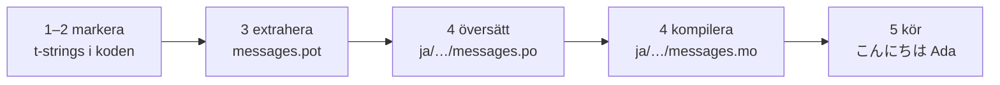

# Handledning

Den här sidan går från en tom katalog till ett program som hälsar på japanska.
Fem steg, ingen gettext-erfarenhet förutsätts, och varje kommando visas med
den utdata det faktiskt producerar — så att du i varje steg vet om du är på
rätt spår.

Du behöver Python 3.14 eller nyare, eftersom t-strings är ny syntax i 3.14.
Japanska är sidans exempelmål, men ingenting hänger på det valet — byt till
vilket språk som helst i steg 4, där språkkoden `ja` är det enda som namnger
det.

## 1. Installera { #1-install }

```console
python -m pip install "gettext-tstrings[babel]"
```

Extrat `[babel]` drar in [Babel], verktyget som samlar dina meddelanden i
katalogfiler i steg 3. Det är ett utvecklingsverktyg: produktionskod renderar
med enbart standardbiblioteket.

## 2. Markera ett meddelande i din kod { #2-mark-a-message-in-your-code }

Skapa `app.py`:

```python
from gettext_tstrings import tr

name = "Ada"
print(tr(t"Hello {name}"))
```

`t"Hello {name}"` ser ut som en f-string, men prefixet `t` håller texten och
värdet åtskilda i stället för att slå ihop dem på plats. Den åtskillnaden är
vad som låter `tr()` slå upp en översättning för hela meningen `Hello {name}`
och sätta in värdet efteråt.

Kör det nu:

```console
$ python app.py
Hello Ada
```

Inga översättningar är installerade ännu, så källtexten renderas som den är.
Ett program som använder det här biblioteket *kräver* aldrig en katalog för
att köra — engelska (eller vad ditt källspråk nu är) är den inbyggda
reservlösningen.

## 3. Extrahera meddelandena { #3-extract-the-messages }

Översättare läser inte din källkod; en liten fil som kallas **katalog** reser
mellan dig och dem. Första steget mot en sådan är att samla ihop varje
markerat meddelande ur koden.

Berätta för Babel hur den hittar dina meddelanden genom att skapa `babel.cfg`:

```ini
[gettext_tstrings: **.py]
encoding = utf-8
```

Extrahera sedan till en mallfil (`.pot`):

```console
$ mkdir -p locales
$ pybabel extract -F babel.cfg -c "Translators:" -o locales/messages.pot .
extracting messages from app.py (encoding="utf-8")
writing PO template file to locales/messages.pot
```

`locales/messages.pot` innehåller nu en post per meddelande:

```po
#. gettext-tstrings
#: app.py:4
#, python-brace-format
msgid "Hello {name}"
msgstr ""
```

`msgid` är nyckeln din kod slår upp. Den tomma `msgstr` är där en översättning
hamnar — men inte i den här filen: en `.pot` är en *mall*, och nästa steg
kopierar den en gång per språk.

## 4. Översätt och kompilera { #4-translate-and-compile }

Skapa den japanska katalogen från mallen:

```console
$ pybabel init -i locales/messages.pot -d locales -l ja
creating catalog locales/ja/LC_MESSAGES/messages.po based on locales/messages.pot
```

Öppna `locales/ja/LC_MESSAGES/messages.po` och fyll i `msgstr`:

```po
msgid "Hello {name}"
msgstr "こんにちは {name}"
```

Behåll `{name}` exakt som det är — platshållaren är hur värdet hittar sin
plats i den översatta meningen, och översättningen får fritt flytta den dit
målspråket behöver den. I ett riktigt projekt är den här `.po`-filen vad du
lämnar över till en översättare eller laddar upp till en
översättningsplattform; formatet är detsamma i båda fallen.

Kataloger redigeras som text men läses in i binär form (`.mo`), så kompilera:

```console
$ pybabel compile -d locales
compiling catalog locales/ja/LC_MESSAGES/messages.po to locales/ja/LC_MESSAGES/messages.mo
```

Det här kommandot är också ett skyddsnät. Hade översättningen skadat
platshållaren — säg `{nome}` i stället för `{name}` — skulle det vägra
släppa igenom:

```console
$ pybabel compile -d locales
error: locales/ja/LC_MESSAGES/messages.po:24: translation does not match the
source placeholders: {name} is missing; {nome} is not in the source message
1 errors encountered.
```

## 5. Kör det { #5-run-it }

Peka `app.py` mot den kompilerade katalogen. Klicka på markörerna för att se
vad varje rad gör:

```python
import gettext

from gettext_tstrings import Translator

_ = Translator(gettext.translation("messages", localedir="locales", languages=["ja"]))  # (1)!

name = "Ada"
print(_(t"Hello {name}"))  # (2)!
```

1. Standardbiblioteket läser in den kompilerade `.mo`-filen, och `Translator`
   binder den till en anropbar funktion. `_` är det konventionella
   gettext-namnet för "översätt det här" — kort eftersom det förekommer vid
   varje sträng som möter användaren. Det är samma funktion som `tr`, bunden
   till en katalog.
2. Vid anropet: t-strängens text blir uppslagsnyckeln `Hello {name}`,
   katalogen svarar `こんにちは {name}`, svaret kontrolleras mot källans
   platshållare, och först därefter sätts värdet in.

```console
$ python app.py
こんにちは Ada
```

Det är hela kretsloppet, och det är värt att se som en enda bild:



**Markera → extrahera → översätt → kompilera → kör.** Allt annat på den här
webbplatsen är en förfining av något av dessa fem steg.

## Vart härnäst { #where-next }

- [Varför t-strings](comparison.md) — vad den här designen skyddar dig mot,
  jämfört med `%(name)s`, `.format()` och `$`-strängar.
- [Guide](guide.md) — pluralformer, språk per förfrågan, uppskjutna strängar,
  och vad som händer vid körning när en katalog ändå är fel.
- [I produktion](workflow.md) — samma kretslopp så som ett team kör det, vecka
  efter vecka: kataloguppdateringar, CI-grindar och översättningsplattformar.
- [Extrahering](extraction.md) — den fullständiga `pybabel`-referensen: egna
  funktionsnamn, strikt CI-läge och kontrollerna som vaktar dina kataloger.

  [Babel]: https://babel.pocoo.org/
