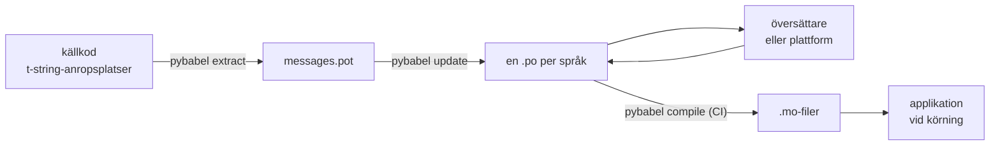

# I produktion

[Handledningen](tutorial.md) kör kretsloppet en gång, ensam, på ett program
med ett meddelande. I ett riktigt projekt fortsätter kretsloppet snurra:
meddelanden ändras efter att de har översatts, översättaren arbetar
någon annanstans och enligt sitt eget schema, och en kompilerad katalog
levereras med varje release. Den här sidan är den praktiken — vad som
stannar i förrådet, vad som reser, vad CI måste grinda, och var körmiljön
binder ett språk.

## Formen på ett projekt { #the-shape-of-a-project }

```text
myapp/
├── babel.cfg
├── pyproject.toml
├── src/
│   └── myapp/
└── locales/
    ├── messages.pot
    ├── ja/LC_MESSAGES/messages.po
    └── de/LC_MESSAGES/messages.po
```

Committa `babel.cfg`, `.pot`-mallen och varje `.po` — de är källorna till
översättningsbygget, och deras diffar är hur du granskar
översättningsändringar. De kompilerade `.mo`-filerna är byggartefakter:
producera dem i CI eller vid paketering i stället för att committa dem, så
att en `.po` och dess `.mo` aldrig kan bli oense om vad som levereras.

En fil har en roll i vardera riktningen: `.pot`-filen bär dina meddelanden
*ut* till översättarna, `.po`-filerna bär översättningarna *tillbaka*. Allt
nedan är trafiken mellan de två.



## Cykeln efter den första översättningen { #the-cycle-after-the-first-translation }

Handledningens `pybabel init` körs en gång per språk, någonsin. Från och med
då är arbetscykeln **extrahera → uppdatera → översätt → kompilera**, och
dess mittpunkt är `pybabel update`, som viker in en färsk mall i de
befintliga katalogerna utan att kasta bort översättningarna som redan finns
i dem.

Anta att hälsningen `Hello {name}` — redan översatt som
`こんにちは {name}` — omformuleras i koden till `Welcome back, {name}`.
Extrahera och uppdatera:

```console
$ pybabel extract -F babel.cfg -c "Translators:" -o locales/messages.pot .
extracting messages from app.py (encoding="utf-8")
writing PO template file to locales/messages.pot
$ pybabel update -i locales/messages.pot -d locales
updating catalog locales/ja/LC_MESSAGES/messages.po based on locales/messages.pot
```

Den japanska katalogen innehåller nu:

```po
#. gettext-tstrings
#: app.py:4
#, fuzzy, python-brace-format
msgid "Welcome back, {name}"
msgstr "こんにちは {name}"
```

Babel märkte att den nya msgid:n liknar en borttagen och parade ihop den med
den gamla översättningen — men flaggade paret **fuzzy**: en maskins gissning
som väntar på en människa. Flaggan har tänder. `pybabel compile`
**utesluter fuzzy-poster ur `.mo`-filen**, så tills en översättare bekräftar
paret renderar applikationen den nya engelska texten snarare än en inaktuell
japansk:

```console
$ pybabel compile -d locales
compiling catalog locales/ja/LC_MESSAGES/messages.po to locales/ja/LC_MESSAGES/messages.mo
$ python app.py
Welcome back, Ada
```

Ett ändrat meddelande degraderar därför på samma sätt som ett trasigt — till
källspråket, aldrig till en föråldrad översättning. Översättarens del av
cykeln är att revidera `msgstr` och radera `fuzzy`-flaggan; nästa
kompilering plockar upp posten.

!!! note "Platshållarnamn är en del av meddelandets identitet"

    Msgid:n är katalognyckeln, och platshållarens *namn* finns inuti den —
    så att byta namn på en variabel i koden (`name` → `user_name`) ändrar
    msgid:n och skickar varje språks översättning av den tillbaka genom
    fuzzy-cykeln. Namnge interpolerade variabler som ord en översättare
    förstår, och byt namn på dem bara av ett skäl.

    Formatering är spegelbilden: `!r` och `:.2f` är [inte en del av
    msgid:n](internals.md#from-template-to-msgid), så att skärpa
    `{amount:,.2f}` till `{amount:,.0f}` ändrar ingenting i någon katalog.
    Att omformulera *meningen* är förstås en verklig ändring — det är cykeln
    ovan.

## Vad CI ska grinda { #what-ci-gates }

Tre fel är värda ett rött bygge: katalogerna halkade efter koden, en
översättning bröt en platshållare, eller en trasig post slank igenom till
körmiljön. Ett steg per fel:

```yaml
- run: pybabel extract -F babel.cfg -c "Translators:" -o locales/messages.pot .
- run: pybabel update -i locales/messages.pot -d locales --check
- run: pybabel compile -d locales
- run: pytest
```

`pybabel update --check` skriver ingenting och avslutar med icke-noll när en
katalog är inaktuell gentemot den nyextraherade mallen — vakten mot att
sammanfoga kod vars meddelanden ingen extraherade om. `pybabel compile` kör
platshållarkontrollerna från både Babel och detta pakets
[registrerade kontroll](extraction.md#your-existing-toolchain-validates-these-catalogs).

!!! bug "`--check` kan inte grinda en katalog som använder kontexter"

    På Babel 2.18.0 rapporterar `pybabel update --check` **varje** katalog som
    innehåller ett `msgctxt` som inaktuell, vid varje körning, hur aktuell den
    än är. Jämförelsen går genom `Catalog.is_identical`, som slår upp varje
    meddelande under den nyckel det lagras under — och för ett kontextbärande
    meddelande är den nyckeln paret `(id, context)`, som `Catalog.get` inte tar
    emot. Uppslagningen ger ingenting, och katalogerna blir aldrig lika:

    ```pycon
    >>> from babel.messages.catalog import Catalog
    >>> c = Catalog(locale="ja")
    >>> c.add("Guide", "ガイド", context="navigation")
    <Message 'Guide' (flags: [])>
    >>> c.is_identical(c)
    False
    ```

    Så om du över huvud taget använder `pgettext` eller `npgettext` — och att
    särskilja en homonym är själva skälet till att de finns — fallerar det här
    steget på värsta tänkbara sätt: alltid rött, så ett team stänger av det, så
    ingenting grindar inaktualitet. Tills det är åtgärdat uppströms får du
    jämföra meddelandemängderna själv. Att läsa mallen och varje katalog med
    `babel.messages.pofile.read_po` och jämföra
    `{(m.context, m.id) for m in catalog if m.id}` är hela kontrollen, och det
    är vad [den här webbplatsens eget bygge](index.md) gör.

!!! danger "Kontrollera avslutsstatusen, inte loggen"

    `pybabel compile` rapporterar varje platshållarfel, avslutar med
    icke-noll — **och skriver `.mo`-filen ändå**. En pipeline som kompilerar
    och sedan kopierar `locales/` in i en avbild levererar den trasiga
    katalogen om inte den icke-noll-statusen faktiskt stoppar den. Att låta
    steget fälla bygget, som ovan, är hela lösningen.

Sista raden är din vanliga testsvit, med en vana tillagd: någonstans i den,
rendera minst ett meddelande per levererat språk genom en strikt
översättare —

```python
import gettext

from gettext_tstrings import Translator


def test_catalogs_render(language: str) -> None:
    translations = gettext.translation("messages", localedir="locales", languages=[language])
    _ = Translator(translations, strict=True)
    name = "Ada"
    assert _(t"Welcome back, {name}")
```

— eftersom `strict=True` [kastar där produktion tyst skulle falla tillbaka](guide.md#what-happens-when-a-catalog-is-wrong),
och en rendering vid körning är den enda kontroll som ser katalogen exakt
som applikationen kommer att göra, `.mo` och allt.

## Arbeta med översättare och plattformar { #working-with-translators-and-platforms }

`.po`-filen är utbytesformatet för hela gettext-världen, vilket är skälet
till att det här biblioteket återanvänder den: att lämna över översättning
innebär att lämna över en fil, oavsett om mottagaren är en kollega med en
PO-redigerare eller en plattform som Weblate eller Crowdin. Tre saker får
överlämningen att fungera väl:

**Säg vad meddelandet är till för.** En kommentar i koden reser med
meddelandet — det är vad flaggan `-c "Translators:"` samlar in:

```python
from gettext_tstrings import tr

name = "Ada"
# Translators: shown on the dashboard right after sign-in
print(tr(t"Welcome back, {name}"))
```

```po
#. Translators: shown on the dashboard right after sign-in
#. gettext-tstrings
#: app.py:5
#, python-brace-format
msgid "Welcome back, {name}"
msgstr ""
```

En översättare ser den kommentaren i sin redigerare, bredvid meddelandet, på
andra sidan jorden. Det är den billigaste kvalitetsspaken i hela
arbetsflödet. För ett ord som är sin egen homonym — "Open" som knapp mot
"Open" som tillstånd — ge meddelandet en
[kontext](guide.md#binding-a-catalog) med `pgettext`, som blir en synlig
`msgctxt` i katalogen.

**Låt plattformen validera platshållare.** Varje meddelande som extraheras
ur en t-string bär flaggan `python-brace-format`, och den enda raden är vad
som slår på platshållar-QA i verktyg du inte kontrollerar — Weblate
dokumenterar kontrollen, kommersiella plattformar nycklar sina egna på samma
flagga, och `msgfmt --check-format` upprätthåller den i varje GNU-pipeline.
Detaljerna, och vad den medföljande kontrollen fångar utöver dem, finns på
[extraheringssidan](extraction.md#your-existing-toolchain-validates-these-catalogs).

**Lita på skyddsnätet exakt så långt det räcker.** Vad som än kommer
tillbaka från en plattform är fortfarande data på väg in i ditt bygge;
CI-grindarna ovan är vad som förvandlar "plattformen kontrollerade nog det
här" till "det här kan inte levereras trasigt".

## Binda ett språk vid körning { #binding-a-language-at-runtime }

Allt hittills producerar kataloger. Det återstående beslutet är var
applikationen väljer en, och det har ett ärligt svar: bind en gång per
*språkets giltighetsomfång* — processen för ett CLI, förfrågan för en
webbtjänst.

=== "En process, ett språk"

    Ett kommandoradsverktyg eller en skrivbordsapplikation läser användarens
    miljö en gång, vid uppstart. Att inte skicka något `languages=` låter
    standardbiblioteket förhandla utifrån `LANGUAGE`, `LC_ALL`,
    `LC_MESSAGES` och `LANG`; `fallback=True` returnerar en nollkatalog —
    källtext — i stället för att kasta undantag när ingen av dem matchar en
    katalog du levererar.

    ```python
    import gettext

    from gettext_tstrings import Translator

    _ = Translator(gettext.translation("messages", localedir="locales", fallback=True))

    name = "Ada"
    print(_(t"Welcome back, {name}"))
    ```

=== "Flask"

    En webbapplikation bestämmer per förfrågan. Läs in varje katalog en gång
    vid import, bind sedan den framförhandlade till kontexten innan vyn körs
    — [`set_translations`](guide.md#per-request-language) är kontextlokal,
    så samtidiga förfrågningar på olika språk ser aldrig varandras bindning.

    ```python
    import gettext

    from flask import Flask, request

    from gettext_tstrings import set_translations, tr

    LANGUAGES = ("en", "ja", "de")
    CATALOGS = {
        language: gettext.translation(
            "messages", localedir="locales", languages=[language], fallback=True
        )
        for language in LANGUAGES
    }

    app = Flask(__name__)


    @app.before_request
    def bind_language() -> None:
        language = request.accept_languages.best_match(LANGUAGES) or "en"
        set_translations(CATALOGS[language])


    @app.get("/")
    def home() -> str:
        name = "Ada"
        return tr(t"Welcome back, {name}")
    ```

=== "ASGI-middleware"

    Under asynkrona ramverk — FastAPI, Starlette och allt annat ASGI —
    omslut förfrågan med
    [`use_translations`](guide.md#per-request-language): bindningen bor i en
    `ContextVar`, som asynkrona uppgiftsväxlingar bevarar per förfrågan.

    ```python
    import gettext

    from fastapi import FastAPI, Request

    from gettext_tstrings import tr, use_translations

    LANGUAGES = ("en", "ja", "de")
    CATALOGS = {
        language: gettext.translation(
            "messages", localedir="locales", languages=[language], fallback=True
        )
        for language in LANGUAGES
    }

    app = FastAPI()


    @app.middleware("http")
    async def bind_language(request: Request, call_next):
        language = negotiate_language(request.headers.get("accept-language"), LANGUAGES)
        with use_translations(CATALOGS[language]):
            return await call_next(request)
    ```

    `negotiate_language` står för din Accept-Language-tolkning — de flesta
    ramverk eller deras ekosystem tillhandahåller en; det som spelar roll
    här är bindningen runt `call_next`.

Två körningsvanor fullbordar bilden. Strängar som skapas vid
importtillfället — en formuläretikett, ett enums visningsnamn — får inte
fånga vilket språk som råkade vara aktivt under importen; definiera dem med
[`lazy_gettext`](guide.md#deferred-translation) så renderar de på det språk
som är aktivt vid *användning*. Och dirigera loggern `gettext_tstrings` dit
en människa tittar: dess varningar är det överseende läget som rapporterar
en översättning som slunkit förbi varje grind, en rad per trasigt meddelande
snarare än en per rendering.

## Leverans { #shipping }

Produktion behöver paketet, `.mo`-filerna och ingenting annat. Babel är ett
utvecklings- och CI-beroende — håll `gettext-tstrings[babel]` utanför
produktionsavbilden och installera det rena paketet där; rendering körs på
enbart standardbiblioteket. Kompilera kataloger i samma bygge som producerar
artefakten du driftsätter, så att `.mo`-filerna inuti den är exakt de
granskade `.po`-filerna, och ingenting som kompilerats på någons laptop
någonsin levereras.

Före en release, checklistan den här sidan kokar ner till:

- `pybabel update --check` passerar — inget meddelande ändrades utan att
  katalogerna fick höra om det.
- `pybabel compile` grindar bygget på sin avslutsstatus.
- Kvarvarande `fuzzy`-poster är avsiktliga — var och en renderas som
  källtext tills en översättare bekräftar den.
- Testsviten renderar varje levererat språk en gång med `strict=True`.
- Produktionsartefakten innehåller `.mo`-filer och ingen Babel.
- Loggern `gettext_tstrings` är dirigerad till övervakning.

## Vart härnäst { #where-next }

- [Extrahering](extraction.md) — referensen för verktygshalvan av den här
  sidan: mappningsalternativ, egna funktionsnamn, strikt läge och varje
  kontroll.
- [Guide](guide.md) — körningshalvan: pluralformer, kontexter, uppskjutna
  strängar och fellägena i detalj.
- [Så fungerar det](internals.md) — varför msgid:n ser ut som den gör, och
  vad valideringen faktiskt kontrollerar.
