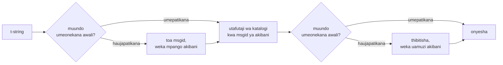

# Jinsi inavyofanya kazi

Hakuna chochote kwenye ukurasa huu kinachohitajika ili kutumia maktaba —
[mafunzo](tutorial.md) na [mwongozo](guide.md) hufunika hilo. Badala yake,
ukurasa huu huijenga upya maktaba kutoka misingi: t-string ni nini hasa, msgid
huanguka vipi kutoka kwake, ni nini kinachofanya tafsiri kuwa halali, na jinsi
utekelezaji unavyofanya ukaguzi wote huo ugharimu sehemu ya kumi ya mikrosekunde.
Isome ikiwa una udadisi, ikiwa unataka kuchangia, au ikiwa unapanga
[kutekeleza makubaliano mwenyewe](#reimplementing-it).

## t-string ni nini hasa { #what-a-t-string-actually-is }

f-string huzalisha `str`, nayo huizalisha papo hapo — kufikia wakati
kitendakazi chochote kinaipokea, thamani imekwisha ingizwa na sentensi
imefungwa. t-string ([PEP 750]) ina sintaksia ileile na utathmini uleule wa
papo hapo wa misemo yake, lakini huzalisha aina tofauti:

```pycon
>>> name = "Ada"
>>> f"Hello {name}!"
'Hello Ada!'
>>> t"Hello {name}!"
Template(strings=('Hello ', '!'), interpolations=(Interpolation('Ada', 'name', None, ''),))
```

Kitu hicho cha `Template` hutunza sehemu ambazo mkondo wa katalogi unazihitaji,
zikiwa bado zimetenganishwa:

```pycon
>>> template = t"Total: {amount:,.2f}"
>>> template.strings
('Total: ', '')
>>> template.interpolations[0].expression
'amount'
>>> template.interpolations[0].value
1234.5
>>> template.interpolations[0].format_spec
',.2f'
```

- `strings` — maandishi halisi yanayozunguka viingizio, kwa mpangilio.
- Kwa kila kiingizio: **usemi** kama maandishi chanzo (`'amount'`), **thamani**
  yake iliyotathminiwa (`1234.5`), na **ubadilishaji** wowote (`!r`) pamoja na
  **ainisho la umbizo** (`,.2f`) — vikibebwa peke yake badala ya kutumika.

Kila kitu ambacho maktaba hii hufanya ni utumiaji wenye nidhamu wa muundo huo.
Lugha tayari ilifanya utenganisho ule mmoja ambao i18n inauhitaji — maandishi
tuli mbali na thamani — hivyo maktaba haichanganui kamwe msimbo wako chanzo
wala haikisii kamwe mahali thamani inapokaa ndani ya sentensi. Kinachobaki ni
maamuzi matatu: muundo huwa vipi ufunguo wa katalogi, tafsiri ya ufunguo huo
inaweza kusema nini, na hivyo viwili huonyeshwa vipi pamoja tena.

## Kutoka kiolezo hadi msgid { #from-template-to-msgid }

msgid — ufunguo ambao katalogi hupangwa kwao — hutokana na sehemu *tuli* pekee
za kiolezo. Pitia `strings` na `interpolations` kwa mpangilio wa chanzo;
kwepesha mabano katika kila kipande halisi (`{` huwa `{{`); kwa kila kiingizio,
toa alama moja ya `{name}`, ambapo `name` ni maandishi ya usemi yakiwa
yameondolewa nafasi tupu zinazoyazunguka. Kutoka `t"Total: {amount:,.2f}"`:

```text
strings         ('Total: ', '')
interpolations  expression 'amount'   conversion None   format_spec ',.2f'
msgid           'Total: {amount}'
```

Kila sehemu ya kanuni hiyo ina sababu:

- **Usemi lazima uwe jina tupu** — `str.isidentifier()` ni kweli nalo si neno
  la msingi la Python. `t"Hello {user.name}"` hukataliwa mahali pa wito. msgid
  ni *ufunguo*: lazima itoke ikiwa ileile katika kila mzunguko na kila utoaji,
  nayo husomwa na wafasiri, hivyo kishika nafasi lazima kiwe neno thabiti na
  lenye maana — si kipande cha msimbo kinachoalika katalogi kuwa lugha ya
  misemo.
- **Ubadilishaji na ainisho la umbizo havingii kamwe ndani ya msgid.** Wafasiri
  hawapaswi kulazimika kusoma `:,.2f`, na hakuna tafsiri inayopaswa kuweza
  kuibadilisha. Matokeo yake yanastahili kujulikana: kukaza `:,.2f` kuwa
  `:,.0f` ndani ya msimbo wako hakubadilishi msgid yoyote, hivyo hakubatilishi
  tafsiri yoyote katika lugha yoyote. Ufunguo wa katalogi hufuatilia *kile
  sentensi inachosema*, si jinsi thamani inavyoumbizwa.
- **Jina linalorudiwa lazima lirudie uumbizaji wake sawasawa.**
  `t"{x:.2f} vs {x:.3f}"` hukataliwa, kwa sababu matokeo yote mawili
  huporomoka kuwa alama ileile ya `{x}` na msgid isingeweza tena kusema ni
  uumbizaji upi uonyeshaji unapaswa kutumia.
- **msgid tupu haitafutwi kamwe**, kwa sababu gettext huihifadhi kwa kichwa cha
  metadata cha katalogi yenyewe. `t""` huonyeshwa kama `""` bila kugusa
  katalogi.

Seti kamili ya kanuni, ikijumuisha kesi za pembeni ambazo ukurasa huu
huziruka, iko katika
[SPEC §2](https://github.com/yhay81/gettext-tstrings/blob/main/SPEC.md).

## Tafsiri inaweza kusema nini { #what-a-translation-may-say }

Muundo unaorudi kutoka katalogi huchanganuliwa kwa `string.Formatter` —
kichanganuzi kilekile ambacho `str.format` hukitumia. Sarufi imeazimwa kwa
makusudi badala ya kubuniwa: muundo ambao maktaba hii hukubali ni ule ambao
mfumo ikolojia mpana tayari huuelewa. Kisha ukaguzi mbili hutumika.

**Umbo:** kila uga lazima uwe `{name}` tupu. Ubadilishaji au ainisho la umbizo
— ikijumuisha `{name:}` iliyo tupu waziwazi — hukataliwa, na vivyo hivyo uga wa
nafasi (`{0}`, `{}`) na majina yaliyojazwa nafasi tupu (`{ name }`). Hilo la
mwisho lina uzito zaidi kuliko linavyoonekana: `str.format` na GNU `msgfmt`
zote mbili hukataa `{ name }`, hivyo kuikubali hapa kungezalisha katalogi
ambazo hakuna zana nyingine katika mnyororo inayoweza kuzithibitisha.

**Majina:** seti ya vishika nafasi ya muundo hulinganishwa na ile ya chanzo.
Kwa ujumbe wa umoja kila jina la chanzo *linahitajika* na hakuna kingine
*kinachoruhusiwa*. Kwa ujumbe wa wingi matawi mawili huunganishwa:

- **kinachoruhusiwa** = muungano wa majina ya matawi yote mawili
- **kinachohitajika** = mwingiliano wao

Kwa hiyo dhidi ya `t"One file"` / `t"{n} files"`, jina `n` linaruhusiwa katika
tafsiri ya umbo lolote lakini halihitajiki katika lolote. Kutolingana huko
ndiko kunakoruhusu mfumo wa wingi wa lugha lengwa kutofautiana na ule wa chanzo
— Kijapani hutafsiri matawi yote mawili kwa umbo moja ambalo pengine hutumia
`{n}`; lugha yenye maumbo mengi kuliko Kiingereza inaweza kuhitaji `{n}` katika
umbo ambalo Kiingereza halina.

Hakuna kati ya hayo ni dhahania: katalogi ya kiolesura ya tovuti hii yenyewe
hubeba ujumbe wa wingi `Built {n} localized page` / `Built {n} localized pages`
— matawi mawili ya Kiingereza — nayo matoleo ya tovuti hutafsiri ujumbe huo
mmoja katika kuanzia umbo moja hadi sita:

| Katalogi | Maumbo | Tafsiri, kwa mpangilio wa maumbo |
| --- | --- | --- |
| Kijapani | 1 | `ローカライズ済みページを{n}件ビルドしました` |
| Kituruki | 2 | `{n} yerelleştirilmiş sayfa oluşturuldu` — mara mbili, ikiwa ileile: nomino za Kituruki hubaki katika umoja baada ya nambari |
| Kiitaliano | 2 | `Generata {n} pagina localizzata` · `Generate {n} pagine localizzate` — shirikishi hukubaliana katika jinsia na idadi |
| Kirusi | 3 | `Собрана {n} локализованная страница` · `Собраны {n} локализованные страницы` · `Собрано {n} локализованных страниц` |
| Kipolandi | 3 | `Zbudowano {n} zlokalizowaną stronę` · `Zbudowano {n} zlokalizowane strony` · `Zbudowano {n} zlokalizowanych stron` |
| Kiarabu | 6 | miongoni mwayo `تم إنشاء صفحة مترجمة واحدة ({n})` kwa moja hasa na `تم إنشاء {n} صفحات مترجمة` kwa chache |

Kila safu ni ingizo hai ndani ya `i18n/*/LC_MESSAGES/site.po` ya hazina hii,
linaloonyeshwa na [ujenzi wa lugha nyingi](index.md) katika kila toleo — na
jaribio hulibandika jedwali hili kwenye katalogi hizo, ili hivyo viwili
visiweze kutengana.

Ndani ya mipaka hiyo, kupanga upya na kurudia hakuna vizuizi kwa makusudi.
Vyote viwili ni vya lazima kisarufi katika lugha halisi, na kuzuia idadi ya
mara zinazotokea kungekataa tafsiri sahihi bila faida yoyote ya kiusalama:
tafsiri bado haiwezi *kutathmini* chochote, kwa sababu hakuna njia ya utathmini
iliyopo — vishika nafasi hutafutwa kwa jina ndani ya thamani za kiolezo
zilizokwisha kokotolewa, kamwe havilishwi kwa `eval`, `getattr`, au
`str.format` yenyewe.

## Uonyeshaji { #rendering }

Kuonyesha muundo uliothibitishwa ni matembezi juu ya vipande vyake: toa kila
sehemu halisi, na kwa kila kishika nafasi, chukua thamani iliyonaswa ya
kiingizio na utumie ubadilishaji na ainisho la umbizo la *upande wa chanzo* —
`format(convert(value, conversion), format_spec)`. Dhamana mbili hutunzwa
wakati wa kufanya hivyo:

- **Kila thamani tofauti huumbizwa mara moja tu kwa kila uonyeshaji**, hata
  wakati tafsiri inarudia kishika nafasi. Kurudia hubadilisha mara ngapi
  matokeo huingizwa, si mara ngapi `__format__` yako huendeshwa.
- **Kwa wingi, kishika nafasi husoma tawi lililokibainisha.** Jina lililopo
  katika matawi yote mawili husoma thamani iliyonaswa na tawi ambalo lugha
  *chanzo* huliteua (`singular` wakati `n == 1`, la sivyo `plural`); jina la
  tawi mahususi daima husoma tawi lake mwenyewe, hata wakati kanuni za wingi za
  lugha lengwa zilipoifanya ipatikane katika umbo jingine.

Uthibitishaji unaposhindwa wakati wa kuonyesha, jibu hugawanywa kutegemea nani
alitoa muundo. Muundo uliotoka *katalogi* hushuka: andika onyo moja na uonyeshe
maandishi chanzo, ukitunza mkataba wa gettext kwamba katalogi mbovu kamwe
haiiangushi programu
([mwongozo huonyesha hali zote mbili](guide.md#what-happens-when-a-catalog-is-wrong)).
Muundo ambao anayeita aliupitisha moja kwa moja — `CompiledTemplate.render` —
daima huinua hitilafu, kwa sababu hakuna maandishi chanzo ya *kushukia*;
uvumilivu upo kwa ajili ya utafutaji wa katalogi, si kwa ajili ya hoja.

## Uchunguzi wa hitilafu ni sehemu ya muundo { #diagnostics-are-part-of-the-design }

Hitilafu ya kishika nafasi mara nyingi hutua mbele ya mfasiri, si mtayarishaji
programu, na mara nyingi ndani ya faili ambapo tatizo halionekani. Kumwambia
`{name} is missing` mtu anayeweza kuona herufi hizohizo ndani ya kihariri chake
ni njia isiyo na mwisho, hivyo jumbe hukokotolewa kwa kanuni tatu:

- Jina lenye **herufi isiyoonekana** — nafasi isiyokatika ambayo mbinu ya
  kuingiza maandishi ilizalisha, nafasi yenye upana sifuri — huchapishwa herufi
  hiyo ikiwa imebadilishwa na nukta yake ya msimbo, mahali pale:
  `{<U+00A0>name}`. Msomaji anahitaji kuona *wapi*.
- Jina ambalo herufi zake **huchanganya mifumo ya uandishi**, kesi ya
  homoglifu, huonyeshwa mara mbili — mara moja kwa namna inayosomeka, mara moja
  kwa namna iliyokwepwa — kwa sababu `{nаme}` yenye `а` ya Kisirili
  haitofautiani na `{name}` katika kuchapishwa, na umbo lililokwepwa `(nаme)`
  ndiyo tahajia pekee inayozitofautisha.
- Kila kitu kingine huonyeshwa **kama kilivyoandikwa**. `{名前}` na `{café}` ni
  majina ya kawaida; kuyakwepesha kungemwacha msomaji asiweze kupata
  kilichokusudiwa.

Kwa msingi uleule, kishika nafasi "kilichokosekana" ambacho *huonekana* kipo
hupewa maelezo ya kutokuwepo kwake — mabano ya upana kamili kutoka mbinu ya
kuingiza maandishi ya Asia ya Mashariki, kurudufishwa kwa `{{name}}` kutoka
safari ya kukwepesha, jina lililo nje ya mabano yoyote.
[Jedwali la kusoma kushindwa la mwongozo](guide.md#reading-a-failure-message)
huonyesha kila mojawapo ya jumbe hizi neno kwa neno.

## Njia yenye joto { #the-hot-path }

Yote yaliyo hapo juu hutokea kwa kila mfuatano uliotafsiriwa ambao programu
huuonyesha, hivyo utekelezaji umejengwa kuzunguka wazo moja: **uthibitishaji
hauruki kamwe, hivyo uthibitishaji ndio unaopaswa kuwekwa akibani.**



Akiba tatu, moja kwa kila hatua:

- **Mpango kwa kila muundo wa mahali pa wito.** Tuple ya `strings` ya kiolezo —
  kitu ambacho mkalimani tayari alikijenga — ndio ufunguo wa akiba, hivyo
  utafutaji hautengi kumbukumbu yoyote. Ukipatikana, usemi, ubadilishaji, na
  ainisho la umbizo la kila kiingizio bado hulinganishwa na yale yaliyorekodiwa:
  mahali pawili pa wito panaposhiriki maandishi halisi lakini panatofautiana
  katika uumbizaji (`t"{x:.2f}"` dhidi ya `t"{x:.3f}"`) hapapaswi kugongana, na
  ulinganisho huo ndiyo bei ya kutumia ufunguo ambao mkalimani hukukabidhi bure.
- **Uamuzi kwa kila muundo.** Mara ya kwanza katalogi inapojibu kwa muundo
  fulani, huchanganuliwa na kuthibitishwa; matokeo — mpango wa uonyeshaji
  uliokusanywa, au rekodi ya kutokuwa halali — huhifadhiwa kwenye mpango. Kila
  uonyeshaji wa baadaye wa ujumbe huo huufikia kwa utafutaji mmoja wa kamusi.
  Miundo isiyo halali hukumbukwa pia, ndiyo maana ingizo bovu la katalogi huonya
  mara moja badala ya kila uonyeshaji.
- **Mpango uliounganishwa kwa kila jozi ya wingi**, ukishikilia seti za
  muungano/mwingiliano ili hesabu ya matawi ifanyike mara moja kwa kila ujumbe,
  si mara moja kwa kila wito.

Kila akiba ina mipaka, na hakuna inayohifadhi *thamani* zilizoingizwa — muundo
tuli na maandishi ya muundo tu. Matokeo, yaliyopimwa na
[`benchmarks/runtime.py`](https://github.com/yhay81/gettext-tstrings/blob/main/benchmarks/runtime.py):
takribani mikrosekunde 0.4 kwa ujumbe wenye uga mmoja ikijumuisha ujenzi wa
t-string yenyewe, karibu mara 2.5 ya `gettext(...).format(...)` tupu isiyokagua
chochote. Maelezo yaliyo juu ya
[`core.py`](https://github.com/yhay81/gettext-tstrings/blob/main/src/gettext_tstrings/core.py)
hurekodi vipimo mahususi vilivyo nyuma ya umbo hilo.

## Kuitekeleza upya { #reimplementing-it }

Hakuna kati ya yaliyo hapo juu ni siri ya ndani: makubaliano yameandikwa kama
[ainisho v1](spec.md), na [seti yake ya utiifu](spec.md#conformance)
inayosomeka na mashine huruhusu kitoaji, programu-jalizi ya IDE, au utekelezaji
katika lugha nyingine kujikagua dhidi ya kila kanuni ambayo ukurasa huu
umeieleza. Utekelezaji huu huendesha seti hiyo ndani ya majaribio yake yenyewe,
ndicho kinachozuia ukurasa huu, ainisho, na msimbo visitengane kimyakimya.

  [PEP 750]: https://peps.python.org/pep-0750/
