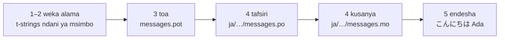

# Mafunzo

Ukurasa huu husafiri kutoka saraka tupu hadi programu inayosalimia kwa
Kijapani. Hatua tano, hakuna uzoefu wa gettext unaohitajika, na kila amri
inaonyeshwa pamoja na matokeo inayotoa kwa kweli — hivyo katika kila hatua
unajua kama uko kwenye njia sahihi.

Unahitaji Python 3.14 au mpya zaidi, kwa sababu t-strings ni sintaksia mpya
katika 3.14. Kijapani ndicho kielelezo cha ukurasa huu, lakini hakuna
kinachotegemea chaguo hilo. Ili kutumia lugha nyingine, badilisha `ja` katika
hatua ya 4 — msimbo huo wa eneo ndicho kitu pekee kinachoitaja.

## 1. Sakinisha { #1-install }

```console
python -m pip install "gettext-tstrings[babel]"
```

Nyongeza ya `[babel]` huleta [Babel], zana inayokusanya jumbe zako katika
mafaili ya katalogi katika hatua ya 3. Ni zana ya wakati wa usanidi: msimbo wa
uzalishaji huonyesha kwa kutumia maktaba sanifu peke yake.

## 2. Weka alama kwenye ujumbe ndani ya msimbo wako { #2-mark-a-message-in-your-code }

Tengeneza `app.py`:

```python
from gettext_tstrings import tr

name = "Ada"
print(tr(t"Hello {name}"))
```

`t"Hello {name}"` huonekana kama f-string, lakini kiambishi `t` hutenganisha
maandishi na thamani badala ya kuviunganisha papo hapo. Utenganisho huo ndio
unaowezesha `tr()` kutafuta tafsiri ya sentensi nzima `Hello {name}` na kisha
kuingiza thamani baadaye.

Iendeshe sasa:

```console
$ python app.py
Hello Ada
```

Hakuna tafsiri zilizosakinishwa bado, hivyo maandishi chanzo huonyeshwa kama
yalivyo. Programu inayotumia maktaba hii kamwe *haihitaji* katalogi ili
kuendeshwa — Kiingereza (au lugha yoyote iliyo chanzo chako) ndicho kimbilio
kilichojengwa ndani.

## 3. Toa jumbe { #3-extract-the-messages }

Wafasiri kwa kawaida hufanya kazi kutoka katalogi badala ya msimbo chanzo,
hivyo faili dogo linaloitwa **katalogi** husafiri kati yako na wao. Hatua ya
kwanza kuelekea kwake ni kukusanya kila ujumbe uliowekewa alama kutoka kwenye
msimbo.

Mwambie Babel jinsi ya kupata jumbe zako kwa kutengeneza `babel.cfg`:

```ini
[gettext_tstrings: **.py]
encoding = utf-8
```

Kisha toa ndani ya faili la kiolezo (`.pot`):

```console
$ mkdir -p locales
$ pybabel extract -F babel.cfg -c "Translators:" -o locales/messages.pot .
extracting messages from app.py (encoding="utf-8")
writing PO template file to locales/messages.pot
```

`locales/messages.pot` sasa lina ingizo moja kwa kila ujumbe:

```po
#. gettext-tstrings
#: app.py:4
#, python-brace-format
msgid "Hello {name}"
msgstr ""
```

`msgid` ndio ufunguo ambao msimbo wako utautafuta. `msgstr` tupu ndipo tafsiri
huingia — lakini si katika faili hili: `.pot` ni *kiolezo*, na hatua inayofuata
hulinakili mara moja kwa kila lugha.

## 4. Tafsiri na kusanya { #4-translate-and-compile }

Tengeneza katalogi ya Kijapani kutoka kwenye kiolezo:

```console
$ pybabel init -i locales/messages.pot -d locales -l ja
creating catalog locales/ja/LC_MESSAGES/messages.po based on locales/messages.pot
```

Fungua `locales/ja/LC_MESSAGES/messages.po` na ujaze `msgstr`:

```po
msgid "Hello {name}"
msgstr "こんにちは {name}"
```

Kiweke `{name}` kama kilivyo hasa — kishika nafasi ndicho njia ambayo thamani
hupata mahali pake ndani ya sentensi iliyotafsiriwa, na tafsiri ina uhuru wa
kukihamisha popote lugha lengwa inapohitaji. Katika mradi halisi, faili hili la
`.po` ndilo unalomkabidhi mfasiri au unalopakia kwenye jukwaa la tafsiri;
umbizo ni lilelile kwa njia yoyote.

Katalogi huhaririwa kama maandishi lakini hupakiwa katika hali ya mfumo-jozi
(`.mo`), hivyo zikusanye:

```console
$ pybabel compile -d locales
compiling catalog locales/ja/LC_MESSAGES/messages.po to locales/ja/LC_MESSAGES/messages.mo
```

Amri hii pia ni wavu wa usalama. Kama tafsiri ingekuwa imeharibu kishika
nafasi — `{nome}` badala ya `{name}`, tuseme — isingekubali kupita:

```console
$ pybabel compile -d locales
error: locales/ja/LC_MESSAGES/messages.po:24: translation does not match the
source placeholders: {name} is missing; {nome} is not in the source message
1 errors encountered.
```

Tahadhari moja inayostahili kujulikana sasa: huripoti hitilafu na hutoka kwa
hali isiyo sifuri, lakini huandika `.mo` hata hivyo. Katika mradi halisi ni CI
inayopaswa kusimama kwa hali hiyo ya kutoka —
[Katika uzalishaji](workflow.md#what-ci-gates) huiweka.

## 5. Iendeshe { #5-run-it }

Hatua za 2–4 zilitumia `tr()`, ambayo hutafuta katalogi na haipati yoyote. Sasa
kwa kuwa moja ipo, ipakie na uifunge mara moja: `Translator` hushikilia
katalogi ili sehemu za wito zisilazimike kuitaja, nalo `_` ni jina la kawaida
la gettext kwa matokeo yake.

Elekeza `app.py` kwenye katalogi iliyokusanywa. Bofya alama ili uone kila
mstari unafanya nini:

```python
import gettext

from gettext_tstrings import Translator

_ = Translator(gettext.translation("messages", localedir="locales", languages=["ja"]))  # (1)!

name = "Ada"
print(_(t"Hello {name}"))  # (2)!
```

1. Maktaba sanifu hupakia `.mo` iliyokusanywa, na `Translator` huifunga kwenye
   kitendakazi. `_` ni jina la kawaida la gettext lenye maana ya "tafsiri hii"
   — fupi kwa sababu huonekana kwenye kila mfuatano unaomfikia mtumiaji.
   Hufanya tafsiri ileile kama `tr`, ikiwa imefungwa kwenye katalogi moja.
2. Wakati wa wito: maandishi ya t-string huwa ufunguo wa utafutaji
   `Hello {name}`, katalogi hujibu `こんにちは {name}`, jibu hukaguliwa dhidi ya
   vishika nafasi vya chanzo, na hapo tu ndipo thamani huingizwa.

```console
$ python app.py
こんにちは Ada
```

Huo ndio mzunguko mzima, na unastahili kuonwa kama picha moja:



**Weka alama → toa → tafsiri → kusanya → endesha.** Kila kitu kingine kwenye
tovuti hii ni uboreshaji wa mojawapo ya hatua hizo tano.

## Wapi kuendelea { #where-next }

- [Kwa nini t-strings](comparison.md) — kile ambacho muundo huu unakukinga
  nacho, ikilinganishwa na `%(name)s`, `.format()`, na `$`-strings.
- [Mwongozo](guide.md) — wingi, lugha kwa kila ombi, mifuatano iliyoahirishwa,
  na kinachotokea wakati wa utekelezaji katalogi inapokuwa na kasoro hata
  hivyo.
- [Katika uzalishaji](workflow.md) — mzunguko huohuo kama timu inavyouendesha,
  wiki baada ya wiki: kusasisha katalogi, vizuizi vya CI, na majukwaa ya
  tafsiri.
- [Utoaji](extraction.md) — marejeo kamili ya `pybabel`: majina maalum ya
  vitendakazi, hali kali ya CI, na ukaguzi unaolinda katalogi zako.
- [Uhamiaji](migration.md) — ikiwa mradi ambao kwa kweli unataka kufanya haya
  ndani yake tayari una katalogi za gettext.
- [Kwa watafsiri](translators.md) — ukurasa mmoja wa kumkabidhi yeyote
  anayejaza mistari hiyo ya `msgstr`.

  [Babel]: https://babel.pocoo.org/
