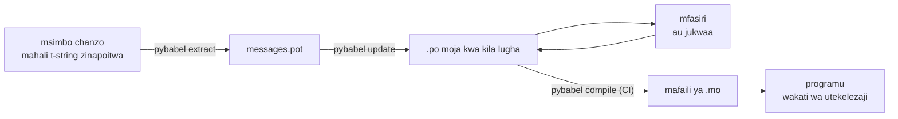

# Katika uzalishaji

[Mafunzo](tutorial.md) huendesha mzunguko mara moja, peke yake, kwenye programu
yenye ujumbe mmoja. Katika mradi halisi mzunguko huendelea kuzunguka: jumbe
hubadilika baada ya kutafsiriwa, mfasiri hufanya kazi mahali pengine na kwa
ratiba yake mwenyewe, na katalogi iliyokusanywa husafirishwa na kila toleo.
Ukurasa huu ni utendaji huo — kinachobaki katika hazina, kinachosafiri,
kinachopaswa kuzuiwa na CI, na mahali wakati wa utekelezaji unapofunga lugha.

## Umbo la mradi { #the-shape-of-a-project }

```text
myapp/
├── babel.cfg
├── pyproject.toml
├── src/
│   └── myapp/
└── locales/
    ├── messages.pot
    ├── ja/LC_MESSAGES/messages.po
    └── de/LC_MESSAGES/messages.po
```

Hifadhi `babel.cfg`, kiolezo cha `.pot`, na kila `.po` katika hazina — hivyo
ndivyo vyanzo vya ujenzi wa tafsiri, na tofauti zake ndizo namna unavyopitia
mabadiliko ya tafsiri. Mafaili ya `.mo` yaliyokusanywa ni bidhaa za ujenzi:
yazalishe katika CI au wakati wa kufungasha badala ya kuyahifadhi katika
hazina, ili `.po` na `.mo` yake zisiweze kamwe kutofautiana kuhusu
kinachosafirishwa.

Faili moja lina jukumu kwa kila upande: `.pot` hubeba jumbe zako *kwenda* kwa
wafasiri, mafaili ya `.po` hubeba tafsiri *kurudi*. Kila kitu kilicho hapa
chini ni msafara kati ya hayo mawili.



## Mzunguko baada ya tafsiri ya kwanza { #the-cycle-after-the-first-translation }

`pybabel init` ya mafunzo huendeshwa mara moja kwa kila lugha, milele. Kuanzia
hapo mzunguko wa kazi ni **toa → sasisha → tafsiri → kusanya**, na kitovu chake
ni `pybabel update`, ambayo huingiza kiolezo kipya ndani ya katalogi zilizopo
bila kutupa tafsiri zilizomo tayari.

Tuseme salamu `Hello {name}` — iliyotafsiriwa tayari kama `こんにちは {name}` —
inaandikwa upya ndani ya msimbo kuwa `Welcome back, {name}`. Toa na usasishe:

```console
$ pybabel extract -F babel.cfg -c "Translators:" -o locales/messages.pot .
extracting messages from app.py (encoding="utf-8")
writing PO template file to locales/messages.pot
$ pybabel update -i locales/messages.pot -d locales
updating catalog locales/ja/LC_MESSAGES/messages.po based on locales/messages.pot
```

Katalogi ya Kijapani sasa ina:

```po
#. gettext-tstrings
#: app.py:4
#, fuzzy, python-brace-format
msgid "Welcome back, {name}"
msgstr "こんにちは {name}"
```

Babel iliona kuwa msgid mpya inafanana na ile iliyoondolewa nayo ikaioanisha na
tafsiri ya zamani — lakini ikaweka alama ya **fuzzy** kwenye jozi hiyo: kisio
la mashine linalosubiri binadamu. Alama hiyo ina meno. `pybabel compile`
**huyaacha maingizo ya fuzzy nje ya `.mo`**, hivyo hadi mfasiri athibitishe
jozi hiyo, programu huonyesha maandishi mapya ya Kiingereza badala ya ya
Kijapani yaliyopitwa na wakati:

```console
$ pybabel compile -d locales
compiling catalog locales/ja/LC_MESSAGES/messages.po to locales/ja/LC_MESSAGES/messages.mo
$ python app.py
Welcome back, Ada
```

Kwa hiyo ujumbe uliobadilika hushuka kwa namna ileile ambayo ujumbe bovu
hushuka — hadi lugha chanzo, kamwe si hadi tafsiri iliyopitwa na wakati. Sehemu
ya mfasiri katika mzunguko ni kurekebisha `msgstr` na kufuta alama ya `fuzzy`;
ukusanyaji unaofuata hulichukua ingizo hilo.

!!! note "Majina ya vishika nafasi ni sehemu ya utambulisho wa ujumbe"

    msgid ndio ufunguo wa katalogi, na *jina* la kishika nafasi liko ndani yake
    — hivyo kubadilisha jina la kigezo ndani ya msimbo (`name` → `user_name`)
    hubadilisha msgid na hupeleka tafsiri yake ya kila lugha kurudi kwenye
    mzunguko wa fuzzy. Yape vigezo vinavyoingizwa majina yaliyo maneno ambayo
    mfasiri atayaelewa, na yabadilishe kwa sababu tu.

    Uumbizaji ni kioo chake: `!r` na `:.2f` [si sehemu ya
    msgid](internals.md#from-template-to-msgid), hivyo kukaza `{amount:,.2f}`
    kuwa `{amount:,.0f}` hakubadilishi chochote katika katalogi yoyote.
    Kuandika upya *sentensi*, bila shaka, ni mabadiliko halisi — huo ndio
    mzunguko ulio hapo juu.

## Kile CI inachozuia { #what-ci-gates }

Kushindwa kwa aina tatu kunastahili ujenzi mwekundu: katalogi zimebaki nyuma ya
msimbo, tafsiri imevunja kishika nafasi, au ingizo bovu limepenya hadi wakati
wa utekelezaji. Hatua moja kwa kila kushindwa:

```yaml
- run: pybabel extract -F babel.cfg -c "Translators:" -o locales/messages.pot .
- run: pybabel update -i locales/messages.pot -d locales --check
- run: pybabel compile -d locales
- run: pytest
```

`pybabel update --check` haiandiki upya chochote na hutoka kwa hali isiyo sifuri
katalogi inapokuwa imepitwa na wakati ikilinganishwa na kiolezo kilichotolewa
hivi punde — mlinzi dhidi ya kuunganisha msimbo ambao jumbe zake hakuna
aliyezitoa upya. `pybabel compile` huendesha ukaguzi wa vishika nafasi wa Babel
na wa
[kikaguzi kilichosajiliwa](extraction.md#your-existing-toolchain-validates-these-catalogs)
cha kifurushi hiki.

!!! bug "`--check` haiwezi kuzuia katalogi inayotumia miktadha"

    Kwenye Babel 2.18.0, `pybabel update --check` huripoti **kila** katalogi
    yenye `msgctxt` kuwa imepitwa na wakati, katika kila mzunguko, hata iwe ni
    mpya kiasi gani. Ulinganisho hupitia `Catalog.is_identical`, ambayo hutafuta
    kila ujumbe kwa ufunguo unaohifadhiwa nao — na kwa ujumbe wenye muktadha
    ufunguo huo ni jozi ya `(id, context)`, ambayo `Catalog.get` haiikubali.
    Utafutaji hurudisha si kitu, na katalogi hazilingani kamwe:

    ```pycon
    >>> from babel.messages.catalog import Catalog
    >>> c = Catalog(locale="ja")
    >>> c.add("Guide", "ガイド", context="navigation")
    <Message 'Guide' (flags: [])>
    >>> c.is_identical(c)
    False
    ```

    Kwa hiyo ukitumia `pgettext` au `npgettext` hata kidogo — na kutofautisha
    maneno yenye sura moja ndiyo sababu ya kuwepo kwake — hatua hii hushindwa
    kwa namna mbaya kabisa: daima nyekundu, hivyo timu huizima, hivyo hakuna
    kinachozuia ukale. Hadi itakaporekebishwa upande wa juu, linganisha seti za
    jumbe mwenyewe. Kusoma kiolezo na kila katalogi kwa
    `babel.messages.pofile.read_po` na kulinganisha
    `{(m.context, m.id) for m in catalog if m.id}` ndio ukaguzi mzima, nao ndio
    [ujenzi wa tovuti hii yenyewe](index.md) unaofanya.

!!! danger "Kagua hali ya kutoka, si kumbukumbu"

    `pybabel compile` huripoti kila hitilafu ya kishika nafasi, hutoka kwa hali
    isiyo sifuri — **na huandika `.mo` hata hivyo**. Mkondo unaokusanya kisha
    kunakili `locales/` ndani ya taswira husafirisha katalogi bovu isipokuwa
    kutoka huko kusiko sifuri kunausimamisha kwelikweli. Kuiacha hatua hiyo
    iuangushe ujenzi, kama ilivyo hapo juu, ndiyo suluhisho zima.

Mstari wa mwisho ni seti yako ya kawaida ya majaribio, ikiwa na tabia moja
imeongezwa: mahali fulani ndani yake, onyesha angalau ujumbe mmoja kwa kila
lugha inayosafirishwa kupitia mfasiri mkali —

```python
import gettext

from gettext_tstrings import Translator


def test_catalogs_render(language: str) -> None:
    translations = gettext.translation("messages", localedir="locales", languages=[language])
    _ = Translator(translations, strict=True)
    name = "Ada"
    assert _(t"Welcome back, {name}")
```

— kwa sababu `strict=True` [huinua hitilafu pale uzalishaji ungerejea
kimyakimya](guide.md#what-happens-when-a-catalog-is-wrong), na uonyeshaji wa
wakati wa utekelezaji ndio ukaguzi pekee unaoiona katalogi sawasawa na
programu itakavyoiona, pamoja na `.mo` na vyote.

## Kufanya kazi na wafasiri na majukwaa { #working-with-translators-and-platforms }

Faili la `.po` ndilo umbizo la kubadilishana la ulimwengu mzima wa gettext,
ndiyo sababu maktaba hii hulitumia tena: kukabidhi tafsiri kunamaanisha
kukabidhi faili, iwe mpokeaji ni mwenzako mwenye kihariri cha PO au jukwaa kama
Weblate au Crowdin. Mambo matatu huufanya ukabidhi ufanye kazi vizuri:

**Sema ujumbe ni wa nini.** Maoni yaliyo ndani ya msimbo husafiri pamoja na
ujumbe — hicho ndicho bendera ya `-c "Translators:"` inachokusanya:

```python
from gettext_tstrings import tr

name = "Ada"
# Translators: shown on the dashboard right after sign-in
print(tr(t"Welcome back, {name}"))
```

```po
#. Translators: shown on the dashboard right after sign-in
#. gettext-tstrings
#: app.py:5
#, python-brace-format
msgid "Welcome back, {name}"
msgstr ""
```

Mfasiri huyaona maoni hayo katika kihariri chake, kando ya ujumbe, upande wa
pili wa dunia. Ndicho kishikizo cha bei rahisi zaidi cha ubora katika mtiririko
mzima wa kazi. Kwa neno lenye sura moja na maana mbili — "Open" kitufe dhidi ya
"Open" hali — mpe ujumbe [muktadha](guide.md#binding-a-catalog) kwa `pgettext`,
ambao huwa `msgctxt` inayoonekana ndani ya katalogi.

**Liache jukwaa lithibitishe vishika nafasi.** Kila ujumbe uliotolewa kutoka
t-string hubeba bendera ya `python-brace-format`, na mstari huo mmoja ndio
unaowasha QA ya vishika nafasi katika zana usizozidhibiti — Weblate huandika
ukaguzi huo, majukwaa ya kibiashara huegemeza yao juu ya bendera ileile, na
`msgfmt --check-format` huulazimisha katika mkondo wowote wa GNU. Maelezo, na
kile kikaguzi kilichoambatishwa hukamata zaidi yake, viko kwenye
[ukurasa wa utoaji](extraction.md#your-existing-toolchain-validates-these-catalogs).

**Amini wavu wa usalama kwa kadiri unavyofika tu.** Chochote kinachorudi kutoka
jukwaani bado ni data inayoingia katika ujenzi wako; vizuizi vya CI vilivyo
hapo juu ndivyo vinavyogeuza "labda jukwaa lilikagua hili" kuwa "hili haliwezi
kusafirishwa likiwa bovu".

## Kufunga lugha wakati wa utekelezaji { #binding-a-language-at-runtime }

Kila kitu hadi sasa huzalisha katalogi. Uamuzi uliobaki ni mahali programu
inapochagua moja, nao una jibu moja la ukweli: funga mara moja kwa kila *wigo
wa lugha* — mchakato kwa CLI, ombi kwa huduma ya wavuti.

=== "Mchakato mmoja, lugha moja"

    Zana ya mstari wa amri au programu ya kompyuta mezani husoma mazingira ya
    mtumiaji mara moja, wakati wa kuanza. Kutopitisha `languages=` huiacha
    maktaba sanifu ijadiliane kutoka `LANGUAGE`, `LC_ALL`, `LC_MESSAGES`, na
    `LANG`; `fallback=True` hurudisha katalogi tupu — maandishi chanzo — badala
    ya kuinua hitilafu wakati hakuna kati yao inayolingana na katalogi
    unayosafirisha.

    ```python
    import gettext

    from gettext_tstrings import Translator

    _ = Translator(gettext.translation("messages", localedir="locales", fallback=True))

    name = "Ada"
    print(_(t"Welcome back, {name}"))
    ```

=== "Flask"

    Programu ya wavuti huamua kwa kila ombi. Pakia kila katalogi mara moja
    wakati wa kuingiza moduli, kisha funga ile iliyojadiliwa kwenye muktadha
    kabla mwonekano haujaendeshwa —
    [`set_translations`](guide.md#per-request-language) ni ya muktadha wa
    ndani, hivyo maombi yanayoendeshwa sambamba kwa lugha tofauti kamwe
    hayaoni ufungaji wa mwenzake.

    ```python
    import gettext

    from flask import Flask, request

    from gettext_tstrings import set_translations, tr

    LANGUAGES = ("en", "ja", "de")
    CATALOGS = {
        language: gettext.translation(
            "messages", localedir="locales", languages=[language], fallback=True
        )
        for language in LANGUAGES
    }

    app = Flask(__name__)


    @app.before_request
    def bind_language() -> None:
        language = request.accept_languages.best_match(LANGUAGES) or "en"
        set_translations(CATALOGS[language])


    @app.get("/")
    def home() -> str:
        name = "Ada"
        return tr(t"Welcome back, {name}")
    ```

=== "Kiungo cha kati cha ASGI"

    Chini ya mifumo isiyolandanishwa — FastAPI, Starlette, na kingine chochote
    cha ASGI — zungushia ombi
    [`use_translations`](guide.md#per-request-language): ufungaji hukaa ndani ya
    `ContextVar`, ambayo ubadilishaji wa kazi zisizolandanishwa huihifadhi kwa
    kila ombi.

    ```python
    import gettext

    from fastapi import FastAPI, Request

    from gettext_tstrings import tr, use_translations

    LANGUAGES = ("en", "ja", "de")
    CATALOGS = {
        language: gettext.translation(
            "messages", localedir="locales", languages=[language], fallback=True
        )
        for language in LANGUAGES
    }

    app = FastAPI()


    @app.middleware("http")
    async def bind_language(request: Request, call_next):
        language = negotiate_language(request.headers.get("accept-language"), LANGUAGES)
        with use_translations(CATALOGS[language]):
            return await call_next(request)
    ```

    `negotiate_language` husimama badala ya uchanganuzi wako wa
    Accept-Language — mifumo mingi au mifumo ikolojia yao hutoa mmoja;
    kinachohusika hapa ni ufungaji unaozunguka `call_next`.

Tabia mbili za wakati wa utekelezaji hukamilisha picha. Mifuatano
iliyotengenezwa wakati wa kuingiza moduli — lebo ya fomu, jina la kuonyesha la
enum — haipaswi kunasa lugha yoyote iliyokuwa hai wakati wa kuingiza; ibainishe
kwa [`lazy_gettext`](guide.md#deferred-translation) nayo itaonyeshwa kwa lugha
iliyo hai wakati wa *matumizi*. Na elekeza kiandikaji kumbukumbu cha
`gettext_tstrings` mahali ambapo binadamu huangalia: maonyo yake ni hali ya
kuvumilia ikiripoti tafsiri iliyopenya vizuizi vyote, mstari mmoja kwa kila
ujumbe bovu badala ya mmoja kwa kila uonyeshaji.

## Usafirishaji { #shipping }

Uzalishaji unahitaji kifurushi, mafaili ya `.mo`, na hakuna kingine. Babel ni
kitegemezi cha usanidi na CI — weka `gettext-tstrings[babel]` nje ya taswira ya
uzalishaji na usakinishe kifurushi tupu hapo; uonyeshaji huendeshwa kwa maktaba
sanifu peke yake. Kusanya katalogi ndani ya ujenzi uleule unaozalisha bidhaa
unayoisambaza, ili mafaili ya `.mo` yaliyomo yawe hasa mafaili ya `.po`
yaliyopitiwa, na kusiwe na kilichokusanywa kwenye kompyuta ya mtu kinachosafiri
kamwe.

Kabla ya toleo, orodha hakiki ambayo ukurasa huu hujikita ndani yake:

- `pybabel update --check` hupita — hakuna ujumbe uliobadilika bila katalogi
  kupata habari.
- `pybabel compile` huzuia ujenzi kwa kutegemea hali yake ya kutoka.
- Maingizo ya `fuzzy` yaliyobaki ni ya makusudi — kila moja huonyeshwa kama
  maandishi chanzo hadi mfasiri alithibitishe.
- Seti ya majaribio huonyesha kila lugha inayosafirishwa mara moja kwa
  `strict=True`.
- Bidhaa ya uzalishaji ina mafaili ya `.mo` na haina Babel.
- Kiandikaji kumbukumbu cha `gettext_tstrings` kimeelekezwa kwenye ufuatiliaji.

## Wapi kuendelea { #where-next }

- [Utoaji](extraction.md) — marejeo ya nusu ya zana ya ukurasa huu: machaguo ya
  ramani, majina maalum ya vitendakazi, hali kali, na kila kikaguzi.
- [Mwongozo](guide.md) — nusu ya wakati wa utekelezaji: wingi, miktadha,
  mifuatano iliyoahirishwa, na namna za kushindwa kwa kina.
- [Jinsi inavyofanya kazi](internals.md) — kwa nini msgid inaonekana hivyo
  ilivyo, na uthibitishaji hukagua nini hasa.
