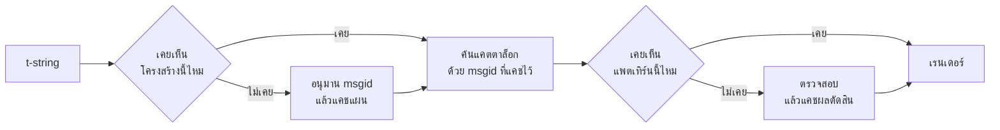

# หลักการทำงาน

ไม่มีสิ่งใดในหน้านี้จำเป็นต่อการใช้ไลบรารี — [บทแนะนำ](tutorial.md) และ[คู่มือ](guide.md) ครอบคลุมส่วนนั้นไว้แล้ว หน้านี้เลือกจะสร้างไลบรารีขึ้นใหม่จากหลักการพื้นฐานแทน: t-string คืออะไรกันแน่ msgid ตกผลึกออกมาจากมันได้อย่างไร อะไรทำให้คำแปลถูกต้อง และการอิมพลีเมนต์ทำให้การตรวจทั้งหมดนั้นมีต้นทุนเพียงเศษเสี้ยวของไมโครวินาทีได้อย่างไร อ่านหน้านี้หากคุณอยากรู้ อยากมีส่วนร่วม หรือวางแผนจะ[นำข้อตกลงนี้ไปอิมพลีเมนต์เอง](#reimplementing-it)

## t-string คืออะไรกันแน่ { #what-a-t-string-actually-is }

f-string ผลิต `str` และผลิตออกมาทันที — เมื่อฟังก์ชันใดก็ตามได้รับมัน ค่าก็ถูกแทรกเข้าไปและประโยคก็ถูกผนึกเรียบร้อยแล้ว t-string ([PEP 750]) มีไวยากรณ์เดียวกันและประเมินนิพจน์แบบทันทีเหมือนกัน แต่ผลิตชนิดข้อมูลที่ต่างออกไป:

```pycon
>>> name = "Ada"
>>> f"Hello {name}!"
'Hello Ada!'
>>> t"Hello {name}!"
Template(strings=('Hello ', '!'), interpolations=(Interpolation('Ada', 'name', None, ''),))
```

อ็อบเจกต์ `Template` นั้นเก็บชิ้นส่วนที่ไปป์ไลน์แคตตาล็อกต้องใช้ไว้ในสภาพที่ยังแยกจากกัน:

```pycon
>>> template = t"Total: {amount:,.2f}"
>>> template.strings
('Total: ', '')
>>> template.interpolations[0].expression
'amount'
>>> template.interpolations[0].value
1234.5
>>> template.interpolations[0].format_spec
',.2f'
```

- `strings` — ข้อความตามตัวอักษรที่ล้อมรอบส่วนแทรกค่า เรียงตามลำดับ
- สำหรับส่วนแทรกค่าแต่ละตัว: **นิพจน์ (expression)** ในรูปข้อความซอร์ส (`'amount'`) **ค่า (value)** ที่ประเมินแล้ว (`1234.5`) และ **conversion** (`!r`) กับ **format spec** (`,.2f`) หากมี — ถูกพกพามาแยกกันแทนที่จะถูกนำไปใช้แล้ว

ทุกสิ่งที่ไลบรารีนี้ทำคือการบริโภคโครงสร้างนั้นอย่างมีวินัย ตัวภาษาได้ทำการแยกหนึ่งเดียวที่ i18n ต้องการให้เรียบร้อยแล้ว — ข้อความสถิตแยกจากค่า — ไลบรารีจึงไม่เคยต้องแยกวิเคราะห์ซอร์สโค้ดของคุณ และไม่เคยต้องเดาว่าค่าอยู่ตรงไหนของประโยค สิ่งที่เหลือคือการตัดสินใจสามข้อ: โครงสร้างนี้กลายเป็นคีย์แคตตาล็อกได้อย่างไร คำแปลของคีย์นั้นพูดอะไรได้บ้าง และทั้งสองเรนเดอร์กลับมารวมกันอย่างไร

## จากเทมเพลตสู่ msgid { #from-template-to-msgid }

msgid — คีย์ที่แคตตาล็อกใช้ทำดัชนี — ถูกอนุมานจากส่วน *สถิต* ของเทมเพลตเท่านั้น เดินไล่ `strings` และ `interpolations` ตามลำดับในซอร์ส ทำ brace-escape ให้แต่ละส่วนข้อความตามตัวอักษร (`{` กลายเป็น `{{`) และสำหรับส่วนแทรกค่าแต่ละตัว ปล่อยโทเคน `{name}` หนึ่งตัว โดยที่ `name` คือข้อความนิพจน์ที่ตัดช่องว่างหัวท้ายออกแล้ว จาก `t"Total: {amount:,.2f}"`:

```text
strings         ('Total: ', '')
interpolations  expression 'amount'   conversion None   format_spec ',.2f'
msgid           'Total: {amount}'
```

แต่ละส่วนของกฎนั้นมีเหตุผลรองรับ:

- **นิพจน์ต้องเป็นชื่อเปล่า ๆ** — `str.isidentifier()` เป็นจริง และไม่ใช่คีย์เวิร์ดของ Python `t"Hello {user.name}"` ถูกปฏิเสธตั้งแต่จุดเรียก msgid คือ *คีย์*: มันต้องออกมาเหมือนกันทุกการรันและทุกการสกัดข้อความ และนักแปลเป็นผู้อ่านมัน ตัวยึดตำแหน่งจึงต้องเป็นคำที่เสถียรและมีความหมาย — ไม่ใช่เศษโค้ดที่เชื้อเชิญให้แคตตาล็อกกลายเป็นภาษานิพจน์
- **conversion และ format spec ไม่มีวันเข้าไปอยู่ใน msgid** นักแปลไม่ควรต้องอ่าน `:,.2f` และไม่ควรมีคำแปลใดเปลี่ยนแปลงมันได้ ผลพวงที่ควรรู้: การปรับ `:,.2f` เป็น `:,.0f` ในโค้ดของคุณไม่เปลี่ยน msgid ใดเลย จึงไม่ทำให้คำแปลในภาษาใดกลายเป็นโมฆะ คีย์แคตตาล็อกติดตาม *สิ่งที่ประโยคพูด* ไม่ใช่วิธีจัดรูปแบบของค่า
- **ชื่อที่ปรากฏซ้ำต้องซ้ำการจัดรูปแบบแบบเป๊ะ ๆ** `t"{x:.2f} vs {x:.3f}"` ถูกปฏิเสธ เพราะทั้งสองตำแหน่งยุบรวมเป็นโทเคน `{x}` ตัวเดียวกัน และ msgid จะไม่สามารถบอกได้อีกต่อไปว่าการเรนเดอร์ควรใช้การจัดรูปแบบใด
- **msgid ว่างจะไม่ถูกนำไปค้นหาเลย** เพราะ gettext สงวนมันไว้สำหรับเฮดเดอร์เมทาดาทาของแคตตาล็อกเอง `t""` เรนเดอร์เป็น `""` โดยไม่แตะแคตตาล็อกเลย

ชุดกฎฉบับเต็ม รวมทั้งกรณีขอบที่หน้านี้ข้ามไป อยู่ที่ [SPEC §2](https://github.com/yhay81/gettext-tstrings/blob/main/SPEC.md)

## คำแปลพูดอะไรได้บ้าง { #what-a-translation-may-say }

แพตเทิร์นที่กลับมาจากแคตตาล็อกถูกแยกวิเคราะห์ด้วย `string.Formatter` — parser ตัวเดียวกับที่ `str.format` ใช้ ไวยากรณ์นี้จงใจยืมมาแทนที่จะประดิษฐ์ขึ้นเอง: แพตเทิร์นที่ไลบรารีนี้ยอมรับคือแพตเทิร์นที่ระบบนิเวศวงกว้างเข้าใจอยู่แล้ว จากนั้นจึงใช้การตรวจสองอย่าง

**รูปทรง (shape):** ทุกฟิลด์ต้องเป็น `{name}` เปล่า ๆ conversion หรือ format spec — รวมถึงแบบว่างอย่างชัดแจ้ง `{name:}` — ถูกปฏิเสธ เช่นเดียวกับฟิลด์ตามตำแหน่ง (`{0}`, `{}`) และชื่อที่มีช่องว่างล้อมรอบ (`{ name }`) ข้อสุดท้ายสำคัญกว่าที่เห็น: ทั้ง `str.format` และ GNU `msgfmt` ต่างปฏิเสธ `{ name }` การยอมรับมันที่นี่จึงจะผลิตแคตตาล็อกที่ไม่มีเครื่องมืออื่นใดในห่วงโซ่สามารถตรวจสอบได้

**ชื่อ (names):** เซตตัวยึดตำแหน่งของแพตเทิร์นถูกเปรียบเทียบกับเซตของต้นทาง สำหรับข้อความเอกพจน์ ทุกชื่อของต้นทางเป็นสิ่ง *จำเป็น (required)* และไม่มีชื่ออื่นใดเป็นสิ่งที่ *อนุญาต (allowed)* สำหรับข้อความพหูพจน์ ทั้งสองกิ่งจะถูกผสาน:

- **allowed** = ยูเนียนของชื่อจากทั้งสองกิ่ง
- **required** = อินเตอร์เซกชันของทั้งสอง

ดังนั้นเมื่อเทียบกับ `t"One file"` / `t"{n} files"` ชื่อ `n` เป็นสิ่งที่อนุญาตในคำแปลของรูปใดก็ได้ แต่ไม่จำเป็นสำหรับรูปใดเลย ความไม่สมมาตรนี้เองที่ยอมให้ระบบพหูพจน์ของภาษาปลายทางแตกต่างจากของต้นทาง — ภาษาญี่ปุ่นแปลทั้งสองกิ่งด้วยรูปเดียวซึ่งน่าจะใช้ `{n}` ส่วนภาษาที่มีรูปมากกว่าภาษาอังกฤษอาจต้องใช้ `{n}` ในรูปที่ภาษาอังกฤษไม่มี

ทั้งหมดนั้นไม่ใช่เรื่องสมมุติ: แคตตาล็อกส่วนโครม (chrome) ของไซต์นี้เองมีข้อความพหูพจน์ `Built {n} localized page` / `Built {n} localized pages` — สองกิ่งภาษาอังกฤษ — และรุ่นภาษาต่าง ๆ ของไซต์แปลข้อความเดียวนี้ออกมาเป็นตั้งแต่หนึ่งรูปไปจนถึงหกรูป:

| แคตตาล็อก | จำนวนรูป | คำแปล เรียงตามลำดับรูป |
| --- | --- | --- |
| ญี่ปุ่น | 1 | `ローカライズ済みページを{n}件ビルドしました` |
| ตุรกี | 2 | `{n} yerelleştirilmiş sayfa oluşturuldu` — สองครั้ง เหมือนกันทุกตัวอักษร: คำนามภาษาตุรกีคงรูปเอกพจน์เมื่อตามหลังตัวเลข |
| อิตาลี | 2 | `Generata {n} pagina localizzata` · `Generate {n} pagine localizzate` — กริยารูป participle ผันตามเพศและพจน์ |
| ลัตเวีย | 3 | `Izveidota {n} lokalizēta lapa` · `Izveidotas {n} lokalizētas lapas` · `Izveidots {n} lokalizētu lapu` — รูปที่สามมีไว้สำหรับ**ศูนย์เท่านั้น** |
| รัสเซีย | 3 | `Собрана {n} локализованная страница` · `Собраны {n} локализованные страницы` · `Собрано {n} локализованных страниц` |
| โปแลนด์ | 3 | `Zbudowano {n} zlokalizowaną stronę` · `Zbudowano {n} zlokalizowane strony` · `Zbudowano {n} zlokalizowanych stron` |
| สโลวีเนีย | 4 | `Zgrajena {n} lokalizirana stran` · `Zgrajeni {n} lokalizirani strani` · `Zgrajene {n} lokalizirane strani` · `Zgrajenih {n} lokaliziranih strani` — รูปที่สองคือ**ทวิพจน์ (dual)** สำหรับสองหน่วยพอดี |
| ไอริช | 5 | `Tógadh {n} leathanach logánaithe` · `Tógadh {n} leathanaigh logánaithe` — หนึ่ง สอง 3–6 7–10 และที่เหลือ; ก้านคำสลับรูปไปมา แต่ *leathanach* ขึ้นต้นด้วย `l` ซึ่งไม่มีการกลายเสียงต้นคำ (mutation) ของภาษาไอริชแบบใดเขียนออกมา หลายรูปจึงพ้องกัน |
| อาหรับ | 6 | ในจำนวนนั้นมี `تم إنشاء صفحة مترجمة واحدة ({n})` สำหรับหนึ่งหน้าพอดี และ `تم إنشاء {n} صفحات مترجمة` สำหรับจำนวนไม่กี่หน้า |

ทุกแถวคือรายการที่มีอยู่จริงใน `i18n/*/LC_MESSAGES/site.po` ของรีโพซิทอรีนี้ ถูกเรนเดอร์โดย[การ build หลายภาษา](index.md)ในทุกรีลีส — และมีการทดสอบตรึงตารางนี้เข้ากับแคตตาล็อกเหล่านั้น ทั้งสองจึงไม่มีทางลอยห่างออกจากกัน

ภายในขอบเขตเหล่านั้น การสลับลำดับและการใช้ซ้ำถูกปล่อยอิสระโดยตั้งใจ ทั้งสองเป็นสิ่งจำเป็นทางไวยากรณ์ในภาษาจริง และการจำกัดจำนวนครั้งที่ปรากฏจะปฏิเสธคำแปลที่ถูกต้องโดยไม่ได้ประโยชน์ด้านความปลอดภัยใด ๆ: คำแปลยังคง *ประเมินผล* อะไรไม่ได้อยู่ดี เพราะไม่มีเส้นทางการประเมินผลอยู่เลย — ตัวยึดตำแหน่งถูกค้นหาด้วยชื่อจากค่าที่เทมเพลตคำนวณไว้เรียบร้อยแล้ว ไม่เคยถูกป้อนให้ `eval`, `getattr` หรือแม้แต่ `str.format` เองเลย

## การเรนเดอร์ { #rendering }

การเรนเดอร์แพตเทิร์นที่ผ่านการตรวจสอบแล้วคือการเดินไล่ตามชิ้นส่วนของมัน: ปล่อยแต่ละส่วนข้อความตามตัวอักษรออกมา และสำหรับตัวยึดตำแหน่งแต่ละตัว หยิบค่าที่ส่วนแทรกค่าจับไว้แล้วใช้ conversion กับ format spec ของ *ฝั่งต้นทาง* — `format(convert(value, conversion), format_spec)` โดยระหว่างทำมีการรักษาหลักประกันสองข้อ:

- **ค่าที่แตกต่างกันแต่ละค่าถูกจัดรูปแบบมากที่สุดหนึ่งครั้งต่อการเรนเดอร์** แม้ในกรณีที่คำแปลใช้ตัวยึดตำแหน่งซ้ำ การใช้ซ้ำเปลี่ยนเพียงจำนวนครั้งที่ผลลัพธ์ถูกแทรกเข้าไป ไม่ใช่จำนวนครั้งที่ `__format__` ของคุณรัน
- **สำหรับพหูพจน์ ตัวยึดตำแหน่งอ่านค่าจากกิ่งที่นิยามมัน** ชื่อที่ปรากฏในทั้งสองกิ่งอ่านค่าที่ถูกจับโดยกิ่งซึ่งภาษา *ต้นทาง* เลือก (`singular` เมื่อ `n == 1` มิฉะนั้น `plural`) ส่วนชื่อที่มีเฉพาะกิ่งใดกิ่งหนึ่งอ่านจากกิ่งของตัวเองเสมอ แม้ในกรณีที่กฎพหูพจน์ของภาษาปลายทางทำให้มันใช้ได้ในรูปอื่น

เมื่อการตรวจสอบล้มเหลว ณ เวลาเรนเดอร์ การตอบสนองแบ่งตามว่าใครเป็นผู้จัดหาแพตเทิร์นมา แพตเทิร์นที่ออกมาจาก *แคตตาล็อก* จะถอยกลับ: บันทึกคำเตือนหนึ่งรายการแล้วเรนเดอร์ข้อความต้นทาง รักษาสัญญาของ gettext ที่ว่าแคตตาล็อกที่พังจะไม่มีวันพาแอปพลิเคชันล่ม ([คู่มือแสดงทั้งสองโหมด](guide.md#what-happens-when-a-catalog-is-wrong)) ส่วนแพตเทิร์นที่ผู้เรียกส่งเข้ามาโดยตรง — `CompiledTemplate.render` — ยกข้อยกเว้นเสมอ เพราะไม่มีข้อความต้นทางให้ถอยกลับ *ไปหา* ความผ่อนปรนมีไว้สำหรับการค้นแคตตาล็อก ไม่ใช่สำหรับอาร์กิวเมนต์

## การวินิจฉัยเป็นส่วนหนึ่งของการออกแบบ { #diagnostics-are-part-of-the-design }

ข้อผิดพลาดของตัวยึดตำแหน่งมักไปตกอยู่ตรงหน้านักแปล ไม่ใช่โปรแกรมเมอร์ และบ่อยครั้งอยู่ในไฟล์ที่มองไม่เห็นปัญหาด้วยตาเปล่า การบอกว่า `{name} is missing` กับคนที่มองเห็นอักขระเหล่านั้นอยู่ตรงหน้าในโปรแกรมแก้ไขของตนคือทางตัน ข้อความวินิจฉัยจึงถูกคำนวณด้วยกฎสามข้อ:

- ชื่อที่มี **อักขระล่องหน** — no-break space ที่ input method สร้างขึ้น หรือ zero-width space — จะถูกพิมพ์โดยแทนที่อักขระนั้นด้วย code point ของมัน ณ ตำแหน่งเดิม: `{<U+00A0>name}` เพราะผู้อ่านจำเป็นต้องเห็นว่า *อยู่ตรงไหน*
- ชื่อที่ตัวอักษร **ปนกันหลายระบบการเขียน** — กรณี homoglyph — จะถูกแสดงสองครั้ง ครั้งหนึ่งแบบอ่านได้ อีกครั้งแบบ escape เพราะ `{nаme}` ที่มี `а` แบบซีริลลิกนั้นแยกไม่ออกจาก `{name}` เมื่อพิมพ์ออกมา และรูปแบบที่ escape แล้ว `(nаme)` คือการสะกดเดียวที่บอกความแตกต่างได้
- อย่างอื่นทั้งหมดถูกแสดง **ตามที่เขียนไว้** `{名前}` และ `{café}` เป็นชื่อธรรมดา การ escape พวกมันจะทำให้ผู้อ่านหาไม่เจอว่าหมายถึงสิ่งใด

ด้วยหลักการเดียวกัน ตัวยึดตำแหน่งที่ "หายไป" แต่ *ดูเหมือน* จะอยู่ตรงนั้นจะได้รับคำอธิบายว่าทำไมมันจึงหายไป — วงเล็บปีกกาแบบเต็มความกว้าง (full-width) จาก input method ของเอเชียตะวันออก การซ้อนเป็น `{{name}}` จากการ escape ไป-กลับ หรือชื่อที่อยู่นอกวงเล็บปีกกาใด ๆ [ตารางการอ่านความล้มเหลว](translators.md#reading-a-failure-message) ที่เขียนไว้สำหรับนักแปลแสดงข้อความเหล่านี้แต่ละข้อความแบบคำต่อคำ

## เส้นทางร้อน { #the-hot-path }

ทั้งหมดข้างบนเกิดขึ้นกับทุกสตริงแปลที่แอปพลิเคชันเรนเดอร์ การอิมพลีเมนต์จึงถูกสร้างขึ้นรอบแนวคิดเดียว: **การตรวจสอบไม่มีวันถูกข้าม ดังนั้นสิ่งที่ต้องถูกแคชก็คือการตรวจสอบ**



แคชสามตัว หนึ่งตัวต่อหนึ่งขั้นตอน:

- **แผน (plan) ต่อหนึ่งโครงสร้างของจุดเรียก** ทูเพิล `strings` ของเทมเพลต — อ็อบเจกต์ที่อินเทอร์พรีเตอร์สร้างไว้อยู่แล้ว — คือคีย์ของแคช การค้นหาจึงไม่จัดสรรหน่วยความจำใดเลย เมื่อ hit นิพจน์ conversion และ format spec ของส่วนแทรกค่าแต่ละตัวยังคงถูกเทียบกับที่บันทึกไว้: จุดเรียกสองจุดที่มีข้อความตามตัวอักษรเหมือนกันแต่การจัดรูปแบบต่างกัน (`t"{x:.2f}"` กับ `t"{x:.3f}"`) ต้องไม่ชนกัน และการเทียบนั้นคือราคาของการใช้คีย์ที่อินเทอร์พรีเตอร์ยื่นให้ฟรี ๆ
- **ผลตัดสิน (verdict) ต่อหนึ่งแพตเทิร์น** ครั้งแรกที่แคตตาล็อกตอบกลับด้วยแพตเทิร์นหนึ่ง ๆ มันจะถูกแยกวิเคราะห์และตรวจสอบ ผลลัพธ์ — แผนเรนเดอร์ที่คอมไพล์แล้ว หรือบันทึกความไม่ถูกต้อง — ถูกเก็บไว้บนแผน การเรนเดอร์ข้อความนั้นทุกครั้งถัดไปเข้าถึงมันได้ด้วยการค้นดิกชันนารีเพียงครั้งเดียว แพตเทิร์นที่ไม่ถูกต้องก็ถูกจดจำไว้เช่นกัน นี่คือเหตุผลที่รายการแคตตาล็อกที่พังเตือนเพียงครั้งเดียวแทนที่จะเตือนทุกครั้งที่เรนเดอร์
- **แผนที่ผสานแล้วต่อหนึ่งคู่พหูพจน์** ถือเซตยูเนียน/อินเตอร์เซกชันไว้ เพื่อให้เลขคณิตของกิ่งเกิดขึ้นครั้งเดียวต่อข้อความ ไม่ใช่ครั้งเดียวต่อการเรียก

แคชทุกตัวมีขอบเขตจำกัด และไม่มีตัวใดเก็บ *ค่า* ที่ถูกแทรกเลย — เก็บเพียงโครงสร้างสถิตกับข้อความแพตเทิร์นเท่านั้น ผลลัพธ์ที่วัดโดย [`benchmarks/runtime.py`](https://github.com/yhay81/gettext-tstrings/blob/main/benchmarks/runtime.py): ราว 0.4 µs สำหรับข้อความหนึ่งฟิลด์ ซึ่งรวมการสร้างตัว t-string เองด้วย หรือประมาณ 2.5 เท่าของ `gettext(...).format(...)` ธรรมดาที่ไม่ตรวจสอบอะไรเลย คำอธิบายที่หัวไฟล์ [`core.py`](https://github.com/yhay81/gettext-tstrings/blob/main/src/gettext_tstrings/core.py) บันทึกผลการวัดรายตัวที่อยู่เบื้องหลังรูปทรงนั้นไว้

## การนำไปอิมพลีเมนต์เอง { #reimplementing-it }

ไม่มีสิ่งใดข้างบนเป็นความรู้ลับเฉพาะกลุ่ม: ข้อตกลงนี้ถูกเขียนไว้เป็น [spec v1](spec.md) และ[ชุดทดสอบความสอดคล้อง](spec.md#conformance)ที่เครื่องอ่านได้ของมันช่วยให้ตัวสกัดข้อความ ปลั๊กอิน IDE หรือการอิมพลีเมนต์ในภาษาอื่นสามารถตรวจตัวเองกับทุกกฎที่หน้านี้อธิบายไว้ได้ การอิมพลีเมนต์นี้รันชุดทดสอบดังกล่าวในการทดสอบของตัวเอง และนั่นคือสิ่งที่กันไม่ให้หน้านี้ ข้อกำหนด และโค้ดลอยห่างจากกันไปอย่างเงียบเชียบ

  [PEP 750]: https://peps.python.org/pep-0750/
