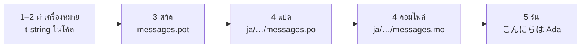

# บทแนะนำ

หน้านี้พาคุณจากไดเรกทอรีว่างเปล่าไปสู่โปรแกรมที่ทักทายเป็นภาษาญี่ปุ่น
ทั้งหมดมีห้าขั้นตอน ไม่ต้องมีประสบการณ์ gettext มาก่อน
และทุกคำสั่งแสดงพร้อมผลลัพธ์ที่มันสร้างขึ้นจริง —
คุณจึงรู้ได้ในทุกขั้นตอนว่ายังเดินถูกทางอยู่หรือไม่

คุณต้องใช้ Python 3.14 ขึ้นไป เพราะ t-string เป็นไวยากรณ์ใหม่ใน 3.14
หน้านี้ใช้ภาษาญี่ปุ่นเป็นภาษาเป้าหมายตัวอย่าง
แต่ไม่มีอะไรผูกติดกับตัวเลือกนั้น หากต้องการใช้ภาษาอื่น
ให้แทนที่ `ja` ในขั้นตอนที่ 4 — รหัสโลแคลนั้นคือสิ่งเดียวที่ระบุภาษา

## 1. ติดตั้ง { #1-install }

```console
python -m pip install "gettext-tstrings[babel]"
```

extra `[babel]` จะติดตั้ง [Babel]
เครื่องมือที่รวบรวมข้อความของคุณเข้าไฟล์แคตตาล็อกในขั้นตอนที่ 3
มันเป็นเครื่องมือสำหรับช่วงพัฒนา:
โค้ดที่ใช้งานจริงเรนเดอร์ได้ด้วยไลบรารีมาตรฐานเพียงอย่างเดียว

## 2. ทำเครื่องหมายข้อความในโค้ดของคุณ { #2-mark-a-message-in-your-code }

สร้าง `app.py`:

```python
from gettext_tstrings import tr

name = "Ada"
print(tr(t"Hello {name}"))
```

`t"Hello {name}"` หน้าตาเหมือน f-string แต่คำนำหน้า `t`
จะเก็บข้อความและค่าแยกจากกันแทนที่จะรวมเข้าด้วยกันทันที
การแยกนี้เองที่ทำให้ `tr()` ค้นหาคำแปลของทั้งประโยค `Hello {name}`
แล้วจึงใส่ค่าเข้าไปทีหลังได้

ลองรันดูตอนนี้เลย:

```console
$ python app.py
Hello Ada
```

ยังไม่มีคำแปลติดตั้งไว้ ข้อความต้นทางจึงถูกเรนเดอร์ตามเดิม
โปรแกรมที่ใช้ไลบรารีนี้ไม่เคย*บังคับ*ให้ต้องมีแคตตาล็อกจึงจะรันได้ —
ภาษาอังกฤษ (หรือภาษาต้นทางของคุณ) คือ fallback ในตัว

## 3. สกัดข้อความออกมา { #3-extract-the-messages }

โดยทั่วไปนักแปลทำงานจากแคตตาล็อกมากกว่าจากซอร์สโค้ด
สิ่งที่เดินทางไปมาระหว่างคุณกับพวกเขาจึงเป็นไฟล์เล็ก ๆ ที่เรียกว่า**แคตตาล็อก**
ก้าวแรกสู่ไฟล์นั้นคือการรวบรวมข้อความที่ทำเครื่องหมายไว้ทุกข้อความออกมาจากโค้ด

บอก Babel ให้รู้วิธีค้นหาข้อความของคุณด้วยการสร้าง `babel.cfg`:

```ini
[gettext_tstrings: **.py]
encoding = utf-8
```

จากนั้นสกัดออกมาเป็นไฟล์เทมเพลต (`.pot`):

```console
$ mkdir -p locales
$ pybabel extract -F babel.cfg -c "Translators:" -o locales/messages.pot .
extracting messages from app.py (encoding="utf-8")
writing PO template file to locales/messages.pot
```

ตอนนี้ `locales/messages.pot` มีหนึ่งรายการต่อหนึ่งข้อความ:

```po
#. gettext-tstrings
#: app.py:4
#, python-brace-format
msgid "Hello {name}"
msgstr ""
```

`msgid` คือคีย์ที่โค้ดของคุณจะใช้ค้นหา ส่วน `msgstr`
ที่ว่างเปล่าคือที่สำหรับเติมคำแปล — แต่ไม่ใช่ในไฟล์นี้: `.pot`
คือ*เทมเพลต* และขั้นตอนถัดไปจะคัดลอกมันหนึ่งชุดต่อหนึ่งภาษา

## 4. แปลและคอมไพล์ { #4-translate-and-compile }

สร้างแคตตาล็อกภาษาญี่ปุ่นจากเทมเพลต:

```console
$ pybabel init -i locales/messages.pot -d locales -l ja
creating catalog locales/ja/LC_MESSAGES/messages.po based on locales/messages.pot
```

เปิด `locales/ja/LC_MESSAGES/messages.po` แล้วเติม `msgstr`:

```po
msgid "Hello {name}"
msgstr "こんにちは {name}"
```

คง `{name}` ไว้อย่างนั้นทุกประการ —
ตัวยึดตำแหน่งคือวิธีที่ค่าหาที่ทางของตัวเองภายในประโยคที่แปลแล้ว
และคำแปลมีอิสระที่จะย้ายมันไปไว้ตรงไหนก็ได้ตามที่ภาษาปลายทางต้องการ
ในโปรเจกต์จริง ไฟล์ `.po`
นี้คือสิ่งที่คุณส่งมอบให้นักแปลหรืออัปโหลดขึ้นแพลตฟอร์มการแปล
รูปแบบไฟล์เหมือนกันไม่ว่าทางไหน

แคตตาล็อกถูกแก้ไขในรูปข้อความ แต่ถูกโหลดในรูปไบนารี (`.mo`)
ดังนั้นจึงต้องคอมไพล์:

```console
$ pybabel compile -d locales
compiling catalog locales/ja/LC_MESSAGES/messages.po to locales/ja/LC_MESSAGES/messages.mo
```

คำสั่งนี้ยังเป็นตาข่ายนิรภัยด้วย หากคำแปลทำตัวยึดตำแหน่งเสียหาย —
เช่นพิมพ์ `{nome}` แทน `{name}` — มันจะไม่ยอมให้ผ่าน:

```console
$ pybabel compile -d locales
error: locales/ja/LC_MESSAGES/messages.po:24: translation does not match the
source placeholders: {name} is missing; {nome} is not in the source message
1 errors encountered.
```

มีข้อควรรู้หนึ่งอย่างตั้งแต่ตอนนี้: มันรายงานข้อผิดพลาดและออกด้วยสถานะที่ไม่ใช่ศูนย์
แต่ก็ยังเขียนไฟล์ `.mo` อยู่ดี ในโปรเจกต์จริง CI คือฝ่ายที่ต้องหยุดเมื่อเจอสถานะทางออกนั้น —
[การใช้งานจริง](workflow.md#what-ci-gates) จัดวางเรื่องนั้นไว้ให้

## 5. รันโปรแกรม { #5-run-it }

ขั้นตอนที่ 2–4 ใช้ `tr()` ซึ่งมองหาแคตตาล็อกแล้วไม่พบ
ตอนนี้ที่มีแคตตาล็อกแล้ว จงโหลดมันและผูกไว้เพียงครั้งเดียว: `Translator`
ถือแคตตาล็อกไว้เพื่อให้จุดเรียกใช้ไม่ต้องระบุมันเอง และ `_`
คือชื่อตามธรรมเนียมของ gettext สำหรับผลลัพธ์นั้น

ชี้ `app.py` ไปยังแคตตาล็อกที่คอมไพล์แล้ว
คลิกที่เครื่องหมายเพื่อดูว่าแต่ละบรรทัดกำลังทำอะไร:

```python
import gettext

from gettext_tstrings import Translator

_ = Translator(gettext.translation("messages", localedir="locales", languages=["ja"]))  # (1)!

name = "Ada"
print(_(t"Hello {name}"))  # (2)!
```

1. ไลบรารีมาตรฐานโหลด `.mo` ที่คอมไพล์แล้ว และ `Translator`
   ผูกมันเข้ากับ callable โดย `_` คือชื่อตามธรรมเนียม gettext ที่แปลว่า
   "แปลสิ่งนี้" — สั้นเพราะมันปรากฏบนทุกสตริงที่ผู้ใช้มองเห็น
   มันทำการแปลแบบเดียวกับ `tr` ที่ผูกไว้กับแคตตาล็อกเดียว
2. ตอนเรียกใช้: ข้อความของ t-string กลายเป็นคีย์ค้นหา `Hello {name}`
   แคตตาล็อกตอบกลับ `こんにちは {name}`
   คำตอบถูกตรวจสอบเทียบกับตัวยึดตำแหน่งต้นทาง
   แล้วจึงใส่ค่าเข้าไปเป็นขั้นสุดท้าย

```console
$ python app.py
こんにちは Ada
```

นั่นคือลูปทั้งหมด และคุ้มค่าที่จะมองมันเป็นภาพเดียว:



**ทำเครื่องหมาย → สกัด → แปล → คอมไพล์ → รัน**
ทุกอย่างที่เหลือบนเว็บไซต์นี้คือการขยายรายละเอียดของหนึ่งในห้าขั้นตอนนั้น

## หน้าถัดไป { #where-next }

- [ทำไมต้อง t-string](comparison.md) —
  สิ่งที่การออกแบบนี้ปกป้องคุณจากมัน เมื่อเทียบกับ `%(name)s`,
  `.format()` และ `$`-strings
- [คู่มือ](guide.md) — รูปพหูพจน์ ภาษาแบบต่อคำขอ สตริงแบบเลื่อนการแปล
  และสิ่งที่เกิดขึ้นตอนรันไทม์เมื่อแคตตาล็อกผิดพลาดอยู่ดี
- [การใช้งานจริง](workflow.md) —
  ลูปเดียวกันนี้ในแบบที่ทีมใช้สัปดาห์แล้วสัปดาห์เล่า: การอัปเดตแคตตาล็อก
  เกต CI และแพลตฟอร์มการแปล
- [การสกัดข้อความ](extraction.md) — เอกสารอ้างอิง `pybabel` ฉบับเต็ม:
  ชื่อฟังก์ชันแบบกำหนดเอง โหมด CI แบบเข้มงวด
  และการตรวจสอบที่คอยคุ้มครองแคตตาล็อกของคุณ
- [การย้ายระบบ](migration.md) —
  หากโปรเจกต์ที่คุณอยากทำเรื่องนี้จริง ๆ มีแคตตาล็อก gettext อยู่แล้ว
- [สำหรับนักแปล](translators.md) —
  หน้าเดียวที่คุณส่งมอบให้ใครก็ตามที่เป็นคนเติมบรรทัด `msgstr` เหล่านั้น

  [Babel]: https://babel.pocoo.org/
