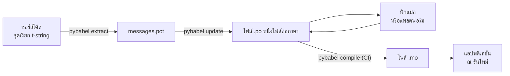

# การใช้งานจริง

[บทแนะนำ](tutorial.md) หมุนวงจรนี้เพียงรอบเดียว ทำคนเดียว กับโปรแกรมที่มีข้อความเพียงข้อความเดียว แต่ในโปรเจกต์จริงวงจรจะหมุนต่อไปไม่หยุด: ข้อความเปลี่ยนแปลงหลังจากถูกแปลไปแล้ว นักแปลทำงานอยู่ที่อื่นตามกำหนดเวลาของตนเอง และแคตตาล็อกที่คอมไพล์แล้วต้องจัดส่งไปพร้อมทุกรีลีส หน้านี้ว่าด้วยแนวปฏิบัติดังกล่าว — อะไรควรอยู่ในรีโพซิทอรี อะไรเดินทางไปมา CI ต้องกั้นอะไรไว้ และรันไทม์ผูกภาษาไว้ที่จุดใด

## รูปร่างของโปรเจกต์ { #the-shape-of-a-project }

```text
myapp/
├── babel.cfg
├── pyproject.toml
├── src/
│   └── myapp/
└── locales/
    ├── messages.pot
    ├── ja/LC_MESSAGES/messages.po
    └── de/LC_MESSAGES/messages.po
```

คอมมิต `babel.cfg` เทมเพลต `.pot` และไฟล์ `.po` ทุกไฟล์ — สิ่งเหล่านี้คือซอร์สของการ build งานแปล และ diff ของมันคือวิธีที่คุณรีวิวการเปลี่ยนแปลงของคำแปล ส่วนไฟล์ `.mo` ที่คอมไพล์แล้วเป็นสิ่งประดิษฐ์จากการ build (build artifact): สร้างมันใน CI หรือตอนทำแพ็กเกจแทนที่จะคอมมิต เพื่อให้ `.po` กับ `.mo` ของมันไม่มีวันขัดแย้งกันว่าอะไรถูกจัดส่งออกไป

มีไฟล์หนึ่งที่มีบทบาทในแต่ละทิศทาง: `.pot` พาข้อความของคุณ *ออกไป* หานักแปล ส่วนไฟล์ `.po` พาคำแปล *กลับมา* ทุกอย่างด้านล่างนี้คือการจราจรระหว่างสองสิ่งนั้น



## วงจรหลังการแปลครั้งแรก { #the-cycle-after-the-first-translation }

`pybabel init` ในบทแนะนำรันเพียงครั้งเดียวต่อภาษา ตลอดกาล นับจากนั้นวงจรการทำงานคือ **extract → update → translate → compile** และศูนย์กลางของมันคือ `pybabel update` ซึ่งพับเทมเพลตชุดใหม่เข้ากับแคตตาล็อกที่มีอยู่โดยไม่ทิ้งคำแปลที่อยู่ในนั้นอยู่แล้ว

สมมติว่าคำทักทาย `Hello {name}` — ซึ่งแปลไว้แล้วว่า `こんにちは {name}` — ถูกแก้ถ้อยคำในโค้ดเป็น `Welcome back, {name}` สกัดข้อความแล้วอัปเดต:

```console
$ pybabel extract -F babel.cfg -c "Translators:" -o locales/messages.pot .
extracting messages from app.py (encoding="utf-8")
writing PO template file to locales/messages.pot
$ pybabel update -i locales/messages.pot -d locales
updating catalog locales/ja/LC_MESSAGES/messages.po based on locales/messages.pot
```

ตอนนี้แคตตาล็อกภาษาญี่ปุ่นมีเนื้อหาดังนี้:

```po
#. gettext-tstrings
#: app.py:4
#, fuzzy, python-brace-format
msgid "Welcome back, {name}"
msgstr "こんにちは {name}"
```

Babel สังเกตว่า msgid ใหม่คล้ายกับอันที่ถูกลบไป จึงจับคู่มันกับคำแปลเดิม — แต่ติดธง **fuzzy** ให้กับคู่นั้น: การเดาของเครื่องที่รอมนุษย์มายืนยัน ธงนี้มีฤทธิ์จริง `pybabel compile` **ไม่รวมรายการ fuzzy ลงใน `.mo`** ดังนั้นจนกว่านักแปลจะยืนยันคู่นี้ แอปพลิเคชันจะเรนเดอร์ข้อความภาษาอังกฤษตัวใหม่ ไม่ใช่ภาษาญี่ปุ่นที่ตกยุคไปแล้ว:

```console
$ pybabel compile -d locales
compiling catalog locales/ja/LC_MESSAGES/messages.po to locales/ja/LC_MESSAGES/messages.mo
$ python app.py
Welcome back, Ada
```

ข้อความที่ถูกเปลี่ยนจึงถอยกลับ (degrade) แบบเดียวกับข้อความที่พัง — กลับไปยังภาษาต้นทาง ไม่มีวันกลับไปยังคำแปลที่ล้าสมัย ส่วนของนักแปลในวงจรนี้คือแก้ `msgstr` แล้วลบธง `fuzzy` ออก การคอมไพล์ครั้งถัดไปจะเก็บรายการนั้นขึ้นมาเอง

!!! note "ชื่อตัวยึดตำแหน่งเป็นส่วนหนึ่งของอัตลักษณ์ของข้อความ"

    msgid คือคีย์ของแคตตาล็อก และ *ชื่อ* ของตัวยึดตำแหน่งอยู่ข้างในนั้น — ดังนั้นการเปลี่ยนชื่อตัวแปรในโค้ด (`name` → `user_name`) จะเปลี่ยน msgid และส่งคำแปลของข้อความนั้นในทุกภาษากลับเข้าวงจร fuzzy อีกครั้ง จงตั้งชื่อตัวแปรที่ถูกแทรกค่าด้วยคำที่นักแปลจะเข้าใจ และเปลี่ยนชื่อก็ต่อเมื่อมีเหตุผลจริง ๆ เท่านั้น

    การจัดรูปแบบเป็นภาพสะท้อนกลับด้าน: `!r` และ `:.2f` [ไม่ใช่ส่วนหนึ่งของ msgid](internals.md#from-template-to-msgid) ดังนั้นการปรับ `{amount:,.2f}` ให้เป็น `{amount:,.0f}` จะไม่เปลี่ยนอะไรในแคตตาล็อกใดเลย แน่นอนว่าการแก้ถ้อยคำของ *ประโยค* เป็นการเปลี่ยนแปลงจริง — นั่นคือวงจรที่อธิบายไว้ข้างบน

## สิ่งที่ CI ต้องกั้นไว้ { #what-ci-gates }

ความล้มเหลวสามแบบคุ้มค่ากับ build สีแดง: แคตตาล็อกตามโค้ดไม่ทัน คำแปลทำตัวยึดตำแหน่งพัง หรือรายการที่พังหลุดรอดไปถึงรันไทม์ หนึ่งขั้นตอนต่อหนึ่งความล้มเหลว:

```yaml
- run: pybabel extract -F babel.cfg -c "Translators:" -o locales/messages.pot .
- run: pybabel update -i locales/messages.pot -d locales --check
- run: pybabel compile -d locales
- run: pytest
```

`pybabel update --check` ไม่เขียนทับสิ่งใดและออกด้วยสถานะไม่เป็นศูนย์เมื่อแคตตาล็อกล้าหลังเทมเพลตที่เพิ่งสกัดมาใหม่ — เป็นด่านป้องกันการ merge โค้ดที่ไม่มีใครสกัดข้อความซ้ำ ส่วน `pybabel compile` จะรันการตรวจตัวยึดตำแหน่งทั้งของ Babel และของ[ตัวตรวจที่แพ็กเกจนี้ลงทะเบียนไว้](extraction.md#your-existing-toolchain-validates-these-catalogs)

!!! bug "`--check` กั้นแคตตาล็อกที่ใช้บริบทไม่ได้"

    บน Babel 2.18.0 `pybabel update --check` จะรายงานว่าแคตตาล็อกที่มี `msgctxt` **ทุกอัน** ล้าสมัย ทุกครั้งที่รัน ไม่ว่ามันจะทันสมัยเพียงใดก็ตาม การเปรียบเทียบวิ่งผ่าน `Catalog.is_identical` ซึ่งค้นหาข้อความแต่ละรายการด้วยคีย์ที่ใช้เก็บข้อความนั้น — และสำหรับข้อความที่มีบริบท คีย์ดังกล่าวคือคู่ `(id, context)` ซึ่ง `Catalog.get` ไม่รับ การค้นหาจึงไม่คืนอะไรกลับมา และแคตตาล็อกก็ไม่มีวันเทียบได้ว่าเท่ากัน:

    ```pycon
    >>> from babel.messages.catalog import Catalog
    >>> c = Catalog(locale="ja")
    >>> c.add("Guide", "ガイド", context="navigation")
    <Message 'Guide' (flags: [])>
    >>> c.is_identical(c)
    False
    ```

    ดังนั้นถ้าคุณใช้ `pgettext` หรือ `npgettext` แม้เพียงเล็กน้อย — และการแยกแยะคำพ้องรูปก็คือเหตุผลที่สองสิ่งนี้มีอยู่ — ขั้นตอนนี้จะพังแบบปล่อยผ่านในทางที่เลวร้ายที่สุด: แดงตลอดเวลา ทีมจึงปิดมันทิ้ง แล้วก็เลยไม่เหลืออะไรมากั้นความล้าสมัยไว้อีก จนกว่าจะมีการแก้ที่ต้นทาง ให้เปรียบเทียบเซตของข้อความด้วยตัวคุณเอง การอ่านเทมเพลตและแคตตาล็อกแต่ละอันด้วย `babel.messages.pofile.read_po` แล้วเปรียบเทียบ `{(m.context, m.id) for m in catalog if m.id}` คือทั้งหมดของการตรวจนี้ และเป็นสิ่งที่[การ build ของเว็บไซต์นี้เอง](index.md)ทำอยู่

!!! danger "ตรวจสถานะออก (exit status) ไม่ใช่ตรวจล็อก"

    `pybabel compile` รายงานข้อผิดพลาดตัวยึดตำแหน่งทีละรายการ ออกด้วยสถานะไม่เป็นศูนย์ — **แต่ก็ยังเขียนไฟล์ `.mo` อยู่ดี** ไปป์ไลน์ที่คอมไพล์แล้วคัดลอก `locales/` เข้าอิมเมจจะจัดส่งแคตตาล็อกที่พังออกไป เว้นแต่สถานะไม่เป็นศูนย์นั้นจะหยุดมันได้จริง การปล่อยให้ขั้นตอนนี้ทำให้ build ล้มเหลวดังตัวอย่างข้างบนคือการแก้ไขทั้งหมดที่ต้องทำ

บรรทัดสุดท้ายคือชุดทดสอบตามปกติของคุณ โดยเพิ่มนิสัยหนึ่งอย่าง: ที่ไหนสักแห่งในนั้น ให้เรนเดอร์อย่างน้อยหนึ่งข้อความต่อหนึ่งภาษาที่จัดส่ง ผ่านตัวแปลแบบเข้มงวด —

```python
import gettext

from gettext_tstrings import Translator


def test_catalogs_render(language: str) -> None:
    translations = gettext.translation("messages", localedir="locales", languages=[language])
    _ = Translator(translations, strict=True)
    name = "Ada"
    assert _(t"Welcome back, {name}")
```

— เพราะ `strict=True` [ยกข้อยกเว้นตรงจุดที่โปรดักชันจะถอยกลับอย่างเงียบ ๆ](guide.md#what-happens-when-a-catalog-is-wrong) และการเรนเดอร์ ณ รันไทม์คือการตรวจเพียงหนึ่งเดียวที่เห็นแคตตาล็อกในแบบเดียวกับที่แอปพลิเคชันจะเห็นเป๊ะ ๆ รวมทั้ง `.mo` และทุกสิ่ง

## การทำงานกับนักแปลและแพลตฟอร์ม { #working-with-translators-and-platforms }

ไฟล์ `.po` คือฟอร์แมตแลกเปลี่ยนของโลก gettext ทั้งใบ ซึ่งเป็นเหตุผลที่ไลบรารีนี้นำมันกลับมาใช้: การส่งมอบงานแปลหมายถึงการส่งมอบไฟล์หนึ่งไฟล์ ไม่ว่าผู้รับจะเป็นเพื่อนร่วมงานที่ใช้โปรแกรมแก้ไข PO หรือแพลตฟอร์มอย่าง Weblate หรือ Crowdin สามสิ่งต่อไปนี้ทำให้การส่งมอบราบรื่น:

**บอกว่าข้อความนี้มีไว้เพื่ออะไร** คอมเมนต์ในโค้ดจะเดินทางไปพร้อมกับข้อความ — นั่นคือสิ่งที่แฟล็ก `-c "Translators:"` เก็บรวบรวม:

```python
from gettext_tstrings import tr

name = "Ada"
# Translators: shown on the dashboard right after sign-in
print(tr(t"Welcome back, {name}"))
```

```po
#. Translators: shown on the dashboard right after sign-in
#. gettext-tstrings
#: app.py:5
#, python-brace-format
msgid "Welcome back, {name}"
msgstr ""
```

นักแปลจะเห็นคอมเมนต์นั้นในโปรแกรมแก้ไขของตนเอง อยู่ข้างข้อความ ที่อีกซีกโลกหนึ่ง มันคือคันโยกคุณภาพที่ถูกที่สุดในเวิร์กโฟลว์ทั้งหมด สำหรับคำที่พ้องรูปกับตัวเอง — "Open" ที่เป็นปุ่ม กับ "Open" ที่เป็นสถานะ — ให้ใส่[บริบท](guide.md#binding-a-catalog)ให้ข้อความด้วย `pgettext` ซึ่งจะกลายเป็น `msgctxt` ที่มองเห็นได้ในแคตตาล็อก

**ให้แพลตฟอร์มตรวจสอบตัวยึดตำแหน่ง** ทุกข้อความที่สกัดจาก t-string จะติดแฟล็ก `python-brace-format` มาด้วย และบรรทัดเดียวนั้นคือสิ่งที่เปิดการทำ QA ตัวยึดตำแหน่งในเครื่องมือที่คุณควบคุมไม่ได้ — Weblate มีเอกสารอธิบายการตรวจนี้ แพลตฟอร์มเชิงพาณิชย์ผูกการตรวจของตนกับแฟล็กเดียวกัน และ `msgfmt --check-format` บังคับใช้มันในไปป์ไลน์ GNU ใดก็ได้ รายละเอียด รวมทั้งสิ่งที่ตัวตรวจที่มาพร้อมแพ็กเกจจับได้เกินกว่านั้น อยู่ที่[หน้าการสกัดข้อความ](extraction.md#your-existing-toolchain-validates-these-catalogs)

**เชื่อตาข่ายนิรภัยเพียงเท่าที่มันครอบคลุมจริง** สิ่งที่กลับมาจากแพลตฟอร์มยังคงเป็นข้อมูลที่เข้าสู่ build ของคุณ ด่าน CI ข้างบนคือสิ่งที่เปลี่ยน "แพลตฟอร์มน่าจะตรวจแล้วแหละ" ให้กลายเป็น "สิ่งนี้จัดส่งแบบพัง ๆ ออกไปไม่ได้"

## การผูกภาษา ณ รันไทม์ { #binding-a-language-at-runtime }

ทุกอย่างที่ผ่านมาผลิตแคตตาล็อก การตัดสินใจที่เหลือคือแอปพลิเคชันจะเลือกแคตตาล็อกที่จุดใด และมันมีคำตอบตรงไปตรงมาเพียงหนึ่งเดียว: ผูกหนึ่งครั้งต่อ *ขอบเขตของภาษา* — โปรเซสสำหรับ CLI และคำขอ (request) สำหรับเว็บเซอร์วิส

=== "หนึ่งโปรเซส หนึ่งภาษา"

    เครื่องมือบรรทัดคำสั่งหรือแอปพลิเคชันเดสก์ท็อปอ่าน environment ของผู้ใช้เพียงครั้งเดียวตอนเริ่มโปรแกรม การไม่ส่ง `languages=` ปล่อยให้ไลบรารีมาตรฐานเจรจาจาก `LANGUAGE`, `LC_ALL`, `LC_MESSAGES` และ `LANG` ส่วน `fallback=True` คืนแคตตาล็อกว่าง — ข้อความต้นทาง — แทนที่จะยกข้อยกเว้นเมื่อไม่มีตัวใดตรงกับแคตตาล็อกที่คุณจัดส่ง

    ```python
    import gettext

    from gettext_tstrings import Translator

    _ = Translator(gettext.translation("messages", localedir="locales", fallback=True))

    name = "Ada"
    print(_(t"Welcome back, {name}"))
    ```

=== "Flask"

    เว็บแอปพลิเคชันตัดสินใจต่อคำขอ โหลดแต่ละแคตตาล็อกเพียงครั้งเดียวตอน import แล้วผูกตัวที่เจรจาได้เข้ากับ context ก่อนที่ view จะรัน — [`set_translations`](guide.md#per-request-language) เป็นแบบ context-local ดังนั้นคำขอที่มาพร้อมกันในภาษาต่างกันจะไม่มีวันเห็นการผูกของกันและกัน

    ```python
    import gettext

    from flask import Flask, request

    from gettext_tstrings import set_translations, tr

    LANGUAGES = ("en", "ja", "de")
    CATALOGS = {
        language: gettext.translation(
            "messages", localedir="locales", languages=[language], fallback=True
        )
        for language in LANGUAGES
    }

    app = Flask(__name__)


    @app.before_request
    def bind_language() -> None:
        language = request.accept_languages.best_match(LANGUAGES) or "en"
        set_translations(CATALOGS[language])


    @app.get("/")
    def home() -> str:
        name = "Ada"
        return tr(t"Welcome back, {name}")
    ```

=== "มิดเดิลแวร์ ASGI"

    ภายใต้เฟรมเวิร์กแบบ async — FastAPI, Starlette และอะไรก็ตามที่เป็น ASGI — ให้ห่อคำขอด้วย [`use_translations`](guide.md#per-request-language): การผูกอาศัยอยู่ใน `ContextVar` ซึ่งการสลับ async task รักษาไว้ให้เป็นรายคำขอ

    ```python
    import gettext

    from fastapi import FastAPI, Request

    from gettext_tstrings import tr, use_translations

    LANGUAGES = ("en", "ja", "de")
    CATALOGS = {
        language: gettext.translation(
            "messages", localedir="locales", languages=[language], fallback=True
        )
        for language in LANGUAGES
    }

    app = FastAPI()


    @app.middleware("http")
    async def bind_language(request: Request, call_next):
        language = negotiate_language(request.headers.get("accept-language"), LANGUAGES)
        with use_translations(CATALOGS[language]):
            return await call_next(request)
    ```

    `negotiate_language` เป็นตัวแทนของการแยกวิเคราะห์ Accept-Language ของคุณ — เฟรมเวิร์กส่วนใหญ่หรือระบบนิเวศของมันมีให้อยู่แล้ว สิ่งที่สำคัญตรงนี้คือการผูกที่ล้อมรอบ `call_next`

นิสัยรันไทม์อีกสองอย่างเติมภาพให้สมบูรณ์ สตริงที่ถูกสร้างตอน import — ป้ายกำกับฟอร์ม ชื่อแสดงผลของ enum — ต้องไม่จับเอาภาษาที่บังเอิญแอ็กทีฟอยู่ระหว่าง import ให้นิยามมันด้วย [`lazy_gettext`](guide.md#deferred-translation) แล้วมันจะเรนเดอร์ในภาษาที่แอ็กทีฟ ณ ตอน *ใช้งาน* และให้ route ล็อกเกอร์ `gettext_tstrings` ไปยังที่ที่มีมนุษย์คอยดู: คำเตือนของมันคือโหมดผ่อนปรนที่กำลังรายงานคำแปลซึ่งหลุดรอดทุกด่านมาได้ หนึ่งบรรทัดต่อหนึ่งข้อความที่พัง ไม่ใช่หนึ่งบรรทัดต่อหนึ่งการเรนเดอร์

## การจัดส่ง { #shipping }

โปรดักชันต้องการเพียงแพ็กเกจกับไฟล์ `.mo` และไม่ต้องการอะไรอื่นอีก Babel เป็น dependency สำหรับการพัฒนาและ CI — เก็บ `gettext-tstrings[babel]` ให้พ้นจากอิมเมจโปรดักชันแล้วติดตั้งแพ็กเกจเปล่าที่นั่น การเรนเดอร์รันบนไลบรารีมาตรฐานล้วน ๆ ให้คอมไพล์แคตตาล็อกใน build เดียวกับที่ผลิตสิ่งประดิษฐ์ (artifact) ที่คุณ deploy เพื่อให้ไฟล์ `.mo` ข้างในเป็นไฟล์ `.po` ที่ผ่านการรีวิวแล้วเป๊ะ ๆ และไม่มีสิ่งใดที่คอมไพล์บนแล็ปท็อปของใครบางคนหลุดออกไปได้เลย

ก่อนออกรีลีส เช็กลิสต์ที่หน้านี้ย่อลงมาเหลือคือ:

- `pybabel update --check` ผ่าน — ไม่มีข้อความใดเปลี่ยนโดยที่แคตตาล็อกไม่รับรู้
- `pybabel compile` กั้น build ด้วยสถานะออกของมัน
- รายการ `fuzzy` ที่เหลืออยู่เป็นความตั้งใจ — แต่ละรายการจะเรนเดอร์เป็นข้อความต้นทางจนกว่านักแปลจะยืนยัน
- ชุดทดสอบเรนเดอร์แต่ละภาษาที่จัดส่งหนึ่งครั้งด้วย `strict=True`
- สิ่งประดิษฐ์โปรดักชันมีไฟล์ `.mo` และไม่มี Babel
- ล็อกเกอร์ `gettext_tstrings` ถูก route ไปยังระบบมอนิเตอริง

## อ่านต่อ { #where-next }

- [การสกัดข้อความ](extraction.md) — เอกสารอ้างอิงสำหรับครึ่งฝั่งเครื่องมือของหน้านี้: ตัวเลือกการ mapping ชื่อฟังก์ชันกำหนดเอง โหมดเข้มงวด และตัวตรวจทุกตัว
- [คู่มือ](guide.md) — ครึ่งฝั่งรันไทม์: รูปพหูพจน์ บริบท สตริงแบบเลื่อนการแปล และโหมดความล้มเหลวโดยละเอียด
- [หลักการทำงาน](internals.md) — ทำไม msgid ถึงหน้าตาแบบนั้น และการตรวจสอบตรวจอะไรกันแน่
