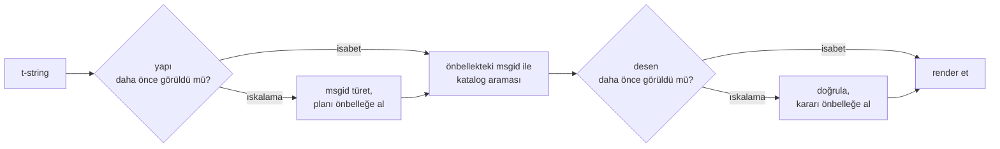

# Nasıl Çalışır

Bu sayfadaki hiçbir şey kütüphaneyi kullanmak için gerekli değildir — onu
[öğretici](tutorial.md) ve [kılavuz](guide.md) karşılar. Bu sayfa kütüphaneyi
ilk ilkelerden yeniden kurar: bir t-string gerçekte nedir, ondan bir msgid
nasıl çıkar, bir çeviriyi geçerli kılan nedir ve gerçekleştirim tüm bu
denetimi nasıl mikrosaniyenin onda birleri düzeyine indirir. Meraklıysanız,
katkıda bulunmak istiyorsanız ya da
[uzlaşımı kendiniz gerçekleştirmeyi](#reimplementing-it) planlıyorsanız
okuyun.

## Bir t-string gerçekte nedir { #what-a-t-string-actually-is }

Bir f-string bir `str` üretir ve onu hemen üretir — herhangi bir işlev onu
aldığında değer çoktan yerine konmuş ve cümle mühürlenmiştir. Bir t-string
([PEP 750]) aynı sözdizimine ve ifadelerinin aynı hevesli değerlendirmesine
sahiptir, ama farklı bir tür üretir:

```pycon
>>> name = "Ada"
>>> f"Hello {name}!"
'Hello Ada!'
>>> t"Hello {name}!"
Template(strings=('Hello ', '!'), interpolations=(Interpolation('Ada', 'name', None, ''),))
```

O `Template` nesnesi, bir katalog boru hattının ihtiyaç duyduğu parçaları
hâlâ ayrık halde tutar:

```pycon
>>> template = t"Total: {amount:,.2f}"
>>> template.strings
('Total: ', '')
>>> template.interpolations[0].expression
'amount'
>>> template.interpolations[0].value
1234.5
>>> template.interpolations[0].format_spec
',.2f'
```

- `strings` — interpolasyonların çevresindeki değişmez metin, sırayla.
- Her interpolasyon için: kaynak metin olarak **ifade** (`'amount'`),
  değerlendirilmiş **değer** (`1234.5`) ve varsa **dönüşüm** (`!r`) ile
  **biçim belirtimi** (`,.2f`) — uygulanmak yerine ayrı ayrı taşınır.

Bu kütüphanenin yaptığı her şey, o yapının disiplinli bir tüketimidir. Dil,
i18n'in ihtiyaç duyduğu tek ayrımı — statik metni değerlerden ayırmayı —
zaten yapmıştır; dolayısıyla kütüphane kaynak kodunuzu asla ayrıştırmaz ve
bir değerin cümlenin neresinde durduğunu asla tahmin etmez. Geriye üç karar
kalır: yapı nasıl bir katalog anahtarına dönüşür, o anahtarın bir çevirisi ne
söyleyebilir ve ikisi birlikte nasıl geri render edilir.

## Template'ten msgid'ye { #from-template-to-msgid }

Bir msgid — kataloğun indekslendiği anahtar — template'in yalnızca *statik*
parçalarından türetilir. `strings` ile `interpolations` üzerinde kaynak
sırasıyla yürüyün; her değişmez parçayı ayraç-kaçışlayın (`{`, `{{` olur);
her interpolasyon için bir `{name}` belirteci üretin; burada `name`,
çevresindeki boşluğu kırpılmış ifade metnidir. `t"Total: {amount:,.2f}"`
örneğinden:

```text
strings         ('Total: ', '')
interpolations  expression 'amount'   conversion None   format_spec ',.2f'
msgid           'Total: {amount}'
```

Bu kuralın her parçasının bir gerekçesi vardır:

- **İfade yalın bir ad olmalıdır** — `str.isidentifier()` doğrudur ve bir
  Python anahtar sözcüğü değildir. `t"Hello {user.name}"` çağrı noktasında
  reddedilir. Bir msgid bir *anahtardır*: her çalıştırmada ve her çıkarmada
  özdeş çıkmak zorundadır ve çevirmenler tarafından okunur; dolayısıyla yer
  tutucu, kararlı ve anlamlı bir sözcük olmalıdır — kataloğu bir ifade diline
  dönüşmeye davet eden bir kod parçası değil.
- **Dönüşüm ve biçim belirtimi msgid'ye asla girmez.** Çevirmenler `:,.2f`
  okumak zorunda kalmamalı ve hiçbir çeviri onu değiştirememelidir. Doğal
  sonucu bilmeye değer: kodunuzda `:,.2f`yi `:,.0f` yapmak hiçbir msgid'yi
  değiştirmez; dolayısıyla hiçbir dilde hiçbir çeviriyi geçersiz kılmaz.
  Katalog anahtarı, değerin nasıl biçimlendirildiğini değil, *cümlenin ne
  söylediğini* izler.
- **Yinelenen bir ad, biçimlendirmesini birebir yinelemek zorundadır.**
  `t"{x:.2f} vs {x:.3f}"` reddedilir, çünkü iki geçiş de aynı `{x}`
  belirtecine indirgenir ve msgid, bir render'ın hangi biçimlendirmeyi
  kullanacağını artık söyleyemezdi.
- **Boş msgid asla aranmaz**, çünkü gettext onu kataloğun kendi üstveri
  başlığı için ayırır. `t""`, kataloğa dokunmadan `""` olarak render edilir.

Bu sayfanın atladığı kenar durumlar dahil kural kümesinin tamamı
[SPEC §2](https://github.com/yhay81/gettext-tstrings/blob/main/SPEC.md)
belgesindedir.

## Bir çeviri ne söyleyebilir { #what-a-translation-may-say }

Katalogdan dönen bir desen `string.Formatter` ile — `str.format`ın
kullandığı ayrıştırıcının aynısıyla — ayrıştırılır. Dil bilgisi bilerek icat
edilmek yerine ödünç alınmıştır: bu kütüphanenin kabul ettiği bir desen,
geniş ekosistemin zaten anladığı bir desendir. Sonra iki denetim uygulanır.

**Biçim:** her alan yalın bir `{name}` olmalıdır. Bir dönüşüm ya da biçim
belirtimi — açıkça boş olan `{name:}` dahil — reddedilir; konumsal alanlar
(`{0}`, `{}`) ve boşlukla doldurulmuş adlar (`{ name }`) da öyle. Sonuncusu
göründüğünden önemlidir: `str.format` da GNU `msgfmt` de `{ name }`
biçimini reddeder; onu burada kabul etmek, zincirdeki başka hiçbir aracın
doğrulayamayacağı kataloglar üretirdi.

**Adlar:** desenin yer tutucu kümesi kaynağınkiyle karşılaştırılır. Tekil bir
mesajda her kaynak ad *zorunludur* ve başka hiçbir şeye *izin verilmez*.
Çoğul bir mesajda iki dal birleştirilir:

- **izin verilen** = iki dalın adlarının birleşimi
- **zorunlu** = kesişimleri

Yani `t"One file"` / `t"{n} files"` karşısında `n` adı, iki biçimin de
çevirisinde izinlidir ama ikisinde de zorunlu değildir. Hedef dilin çoğul
sisteminin kaynağınkinden farklı olabilmesini sağlayan, bu bakışımsızlıktır —
Japonca iki dalı, büyük olasılıkla `{n}` kullanan tek bir biçimle çevirir;
İngilizceden çok biçimi olan bir dil, İngilizcede hiç olmayan bir biçimde
`{n}` isteyebilir.

Bunların hiçbiri varsayımsal değildir: bu sitenin kendi arayüz kataloğu
`Built {n} localized page` / `Built {n} localized pages` çoğul mesajını —
iki İngilizce dal — taşır ve sitenin dil sürümleri bu tek mesajı bir
biçimden altı biçime kadar çevirir:

| Katalog | Biçimler | Çeviriler, biçim sırasıyla |
| --- | --- | --- |
| Japonca | 1 | `ローカライズ済みページを{n}件ビルドしました` |
| Türkçe | 2 | `{n} yerelleştirilmiş sayfa oluşturuldu` — iki kez, birebir aynı: Türkçede adlar bir sayıdan sonra tekil kalır |
| İtalyanca | 2 | `Generata {n} pagina localizzata` · `Generate {n} pagine localizzate` — ortaç, cins ve sayıya göre uyum gösterir |
| Letonca | 3 | `Izveidota {n} lokalizēta lapa` · `Izveidotas {n} lokalizētas lapas` · `Izveidots {n} lokalizētu lapu` — üçüncü biçim **yalnızca sıfır** içindir |
| Rusça | 3 | `Собрана {n} локализованная страница` · `Собраны {n} локализованные страницы` · `Собрано {n} локализованных страниц` |
| Lehçe | 3 | `Zbudowano {n} zlokalizowaną stronę` · `Zbudowano {n} zlokalizowane strony` · `Zbudowano {n} zlokalizowanych stron` |
| Slovence | 4 | `Zgrajena {n} lokalizirana stran` · `Zgrajeni {n} lokalizirani strani` · `Zgrajene {n} lokalizirane strani` · `Zgrajenih {n} lokaliziranih strani` — ikincisi bir **ikil**dir, tam olarak iki için |
| İrlandaca | 5 | `Tógadh {n} leathanach logánaithe` · `Tógadh {n} leathanaigh logánaithe` — bir, iki, 3–6, 7–10 ve gerisi; gövde değişir, ama *leathanach* `l` ile başlar ve İrlandacanın hiçbir ünsüz değişimi `l` üzerinde yazıya dökülmez, bu yüzden birkaç biçim çakışır |
| Arapça | 6 | aralarında tam olarak bir için `تم إنشاء صفحة مترجمة واحدة ({n})` ve birkaçı için `تم إنشاء {n} صفحات مترجمة` biçimleri var |

Her satır, bu deponun `i18n/*/LC_MESSAGES/site.po` dosyalarındaki canlı bir
girdidir ve her sürümde [çok dilli derleme](index.md) tarafından render
edilir — üstelik bir test bu tabloyu o kataloglara sabitler, böylece ikisi
birbirinden ayrışamaz.

Bu sınırlar içinde, yeniden sıralama ve yineleme bilerek serbesttir. İkisi de
gerçek dillerde dil bilgisi gereğidir ve geçiş sayısını kısıtlamak, hiçbir
güvenlik kazancı olmadan doğru çevirileri reddederdi: bir çeviri yine de
hiçbir şeyi *değerlendiremez*, çünkü değerlendirme yolu yoktur — yer
tutucular, template'in zaten hesaplanmış değerlerinde ada göre aranır; asla
`eval`e, `getattr`a ya da `str.format`ın kendisine verilmez.

## Render { #rendering }

Doğrulanmış bir deseni render etmek, parçaları üzerinde bir yürüyüştür: her
değişmez parçayı yaz ve her yer tutucu için interpolasyonun yakalanmış
değerini al, *kaynak taraflı* dönüşüm ve biçim belirtimini uygula —
`format(convert(value, conversion), format_spec)`. Bunu yaparken iki güvence
korunur:

- **Ayrı her değer, render başına en fazla bir kez biçimlendirilir**, çeviri
  bir yer tutucuyu yinelese bile. Yineleme, sonucun kaç kez yerleştirildiğini
  değiştirir; `__format__` metodunuzun kaç kez çalıştığını değil.
- **Çoğullarda bir yer tutucu, kendisini tanımlayan dalı okur.** İki dalda da
  bulunan bir ad, *kaynak* dilin seçtiği dalın (`n == 1` iken `singular`,
  değilse `plural`) yakaladığı değeri okur; dala özgü bir ad ise, hedef dilin
  çoğul kuralları onu başka bir biçimde erişilebilir kılmış olsa bile, her
  zaman kendi dalını okur.

Render anında doğrulama başarısız olduğunda yanıt, deseni kimin sağladığına
göre ikiye ayrılır. Bir *katalogdan* gelen desen alçalır: bir uyarı günlükle
ve kaynak metni render et; gettext'in, bozuk bir kataloğun uygulamayı asla
düşürmeyeceği sözleşmesi korunur
([kılavuz iki kipi de gösterir](guide.md#what-happens-when-a-catalog-is-wrong)).
Çağıranın doğrudan verdiği bir desen — `CompiledTemplate.render` — her zaman
hata fırlatır, çünkü alçalınacak bir kaynak metin yoktur; hoşgörü katalog
aramaları içindir, argümanlar için değil.

## Tanılar tasarımın parçasıdır { #diagnostics-are-part-of-the-design }

Bir yer tutucu hatası genellikle bir programcının değil, bir çevirmenin
önüne düşer ve çoğu zaman sorunun görünmez olduğu bir dosyada. O karakterleri
editöründe aynen görebilen birine `{name} is missing` demek çıkmaz sokaktır;
bu yüzden mesajlar üç kuralla hesaplanır:

- **Görünmez bir karakter** içeren bir ad — bir giriş yönteminin ürettiği
  bölünmesiz boşluk, sıfır genişlikli bir boşluk — o karakter yerinde kod
  noktasıyla değiştirilmiş olarak yazdırılır: `{<U+00A0>name}`. Okurun
  *nerede* olduğunu görmesi gerekir.
- Harfleri **yazı sistemlerini karıştıran** bir ad — homoglif durumu — iki
  kez gösterilir: bir kez okunur, bir kez kaçışlanmış biçimde; çünkü Kiril
  `а` içeren `{nаme}` baskıda `{name}`'den ayırt edilemez ve kaçışlanmış
  biçim, ikisini birbirinden ayıran tek yazımdır.
- Diğer her şey **yazıldığı gibi** gösterilir. `{名前}` ve `{café}` sıradan
  adlardır; onları kaçışlamak, okuru neyin kastedildiğini bulamaz halde
  bırakırdı.

Aynı ilkeyle, *var gibi görünen* "eksik" bir yer tutucunun yokluğu açıklanır
— Doğu Asya giriş yönteminden gelen tam genişlikli ayraçlar, bir kaçışlama
gidiş dönüşünden kalan `{{name}}` ikilemesi, ayraçların dışında kalmış ad.
[Kılavuzun hata okuma tablosu](guide.md#reading-a-failure-message), bu
mesajların her birini birebir gösterir.

## Sıcak yol { #the-hot-path }

Yukarıdakilerin tümü, bir uygulamanın render ettiği her çevrilmiş dizgide
gerçekleşir; bu yüzden gerçekleştirim tek bir fikrin çevresine kurulmuştur:
**doğrulama asla atlanmaz, öyleyse önbelleğe alınan şey doğrulama
olmalıdır.**



Üç önbellek, aşama başına bir tane:

- **Çağrı noktası yapısı başına bir plan.** Template'in `strings` demeti —
  yorumlayıcının zaten kurduğu bir nesne — önbellek anahtarıdır; dolayısıyla
  bir arama hiçbir şey ayırmaz. İsabet durumunda her interpolasyonun
  ifadesi, dönüşümü ve biçim belirtimi yine de kayıtlı olanlarla
  karşılaştırılır: değişmez metni paylaşan ama biçimlendirmede ayrışan iki
  çağrı noktası (`t"{x:.2f}"` ile `t"{x:.3f}"`) çakışmamalıdır ve o
  karşılaştırma, yorumlayıcının bedavaya verdiği bir anahtarı kullanmanın
  bedelidir.
- **Desen başına bir karar.** Bir katalog belirli bir desenle ilk kez yanıt
  verdiğinde desen ayrıştırılır ve doğrulanır; sonuç — derlenmiş bir render
  planı ya da geçersizlik kaydı — planın üzerinde tutulur. O mesajın sonraki
  her render'ı ona tek bir sözlük aramasıyla ulaşır. Geçersiz desenler de
  hatırlanır; bozuk bir katalog girdisinin her render'da değil, bir kez
  uyarmasının nedeni budur.
- **Çoğul çift başına birleştirilmiş bir plan**; birleşim/kesişim kümelerini
  tutar, böylece dal aritmetiği çağrı başına değil, mesaj başına bir kez
  yapılır.

Her önbellek sınırlıdır ve hiçbiri interpolasyona giren *değerleri* tutmaz —
yalnızca statik yapı ve desen metni.
[`benchmarks/runtime.py`](https://github.com/yhay81/gettext-tstrings/blob/main/benchmarks/runtime.py)
ile ölçülen sonuç: t-string'in kurulması dahil, tek alanlı bir mesaj için
kabaca 0,4 µs — hiçbir şeyi denetlemeyen düz bir
`gettext(...).format(...)` çağrısının yaklaşık 2,5 katı.
[`core.py`](https://github.com/yhay81/gettext-tstrings/blob/main/src/gettext_tstrings/core.py)
dosyasının başındaki açıklama, bu biçimin ardındaki tekil ölçümleri kaydeder.

## Yeniden gerçekleştirmek { #reimplementing-it }

Yukarıdakilerin hiçbiri gizli bir irfan değildir: uzlaşım
[spec v1](spec.md) olarak yazılıdır ve makine tarafından okunabilir
[uyumluluk paketi](spec.md#conformance), bir çıkarıcının, bir IDE
eklentisinin ya da başka bir dildeki bir gerçekleştirimin, bu sayfanın
açıkladığı her kurala karşı kendini denetlemesine izin verir. Bu
gerçekleştirim, paketi kendi testlerinin bir parçası olarak çalıştırır; bu
sayfayı, belirtimi ve kodu sessizce birbirinden uzaklaşmaktan alıkoyan da
budur.

  [PEP 750]: https://peps.python.org/pep-0750/
