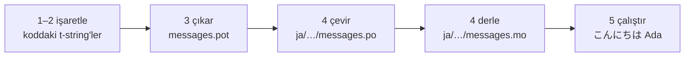

# Öğretici

Bu sayfa boş bir dizinden Japonca selam veren bir programa gider. Beş adım,
gettext deneyimi varsayılmaz ve her komut gerçekte ürettiği çıktıyla birlikte
gösterilir — böylece her adımda doğru yolda olup olmadığınızı bilirsiniz.

Python 3.14 veya daha yenisine ihtiyacınız var, çünkü t-string'ler 3.14'te
gelen yeni bir sözdizimidir. Japonca bu sayfanın örnek hedefidir, ama hiçbir
şey bu seçime bağlı değildir — 4. adımda yerine dilediğiniz dili koyun; onu
adlandıran tek şey oradaki `ja` yerel ayar kodudur.

## 1. Kurulum { #1-install }

```console
python -m pip install "gettext-tstrings[babel]"
```

`[babel]` ekstrası, 3. adımda mesajlarınızı katalog dosyalarında toplayan araç
olan [Babel]'i getirir. Bu bir geliştirme zamanı aracıdır: üretim kodu yalnızca
standart kütüphaneyle render eder.

## 2. Kodunuzda bir mesajı işaretleyin { #2-mark-a-message-in-your-code }

`app.py` dosyasını oluşturun:

```python
from gettext_tstrings import tr

name = "Ada"
print(tr(t"Hello {name}"))
```

`t"Hello {name}"` bir f-string'e benzer, ama `t` öneki metinle değeri oracıkta
birleştirmek yerine ayrı tutar. `tr()` işlevinin `Hello {name}` cümlesinin
tamamı için bir çeviri arayıp değeri sonradan yerleştirebilmesini sağlayan da
bu ayrımdır.

Şimdi çalıştırın:

```console
$ python app.py
Hello Ada
```

Henüz kurulu bir çeviri yok, bu yüzden kaynak metin olduğu gibi render edilir.
Bu kütüphaneyi kullanan bir program çalışmak için asla bir katalog
*gerektirmez* — İngilizce (ya da kaynak diliniz her neyse) yerleşik geri
düşüştür.

## 3. Mesajları çıkarın { #3-extract-the-messages }

Çevirmenler kaynak kodunuzu okumaz; sizinle onlar arasında **katalog** denen
küçük bir dosya gidip gelir. Ona giden ilk adım, işaretlenmiş her mesajı kodun
içinden toplamaktır.

`babel.cfg` dosyasını oluşturarak Babel'e mesajlarınızı nasıl bulacağını
söyleyin:

```ini
[gettext_tstrings: **.py]
encoding = utf-8
```

Ardından bir şablon dosyasına (`.pot`) çıkarın:

```console
$ mkdir -p locales
$ pybabel extract -F babel.cfg -c "Translators:" -o locales/messages.pot .
extracting messages from app.py (encoding="utf-8")
writing PO template file to locales/messages.pot
```

`locales/messages.pot` artık mesaj başına bir girdi içeriyor:

```po
#. gettext-tstrings
#: app.py:4
#, python-brace-format
msgid "Hello {name}"
msgstr ""
```

`msgid`, kodunuzun arayacağı anahtardır. Boş `msgstr` çevirinin gideceği
yerdir — ama bu dosyada değil: bir `.pot` bir *şablondur* ve sonraki adım onu
dil başına bir kez kopyalar.

## 4. Çevirin ve derleyin { #4-translate-and-compile }

Şablondan Japonca kataloğu oluşturun:

```console
$ pybabel init -i locales/messages.pot -d locales -l ja
creating catalog locales/ja/LC_MESSAGES/messages.po based on locales/messages.pot
```

`locales/ja/LC_MESSAGES/messages.po` dosyasını açın ve `msgstr` alanını
doldurun:

```po
msgid "Hello {name}"
msgstr "こんにちは {name}"
```

`{name}` yer tutucusunu tam olarak olduğu gibi bırakın — değer, çevrilmiş
cümlenin içindeki yerini bu yer tutucu sayesinde bulur ve çeviri onu hedef
dilin gerektirdiği herhangi bir yere taşımakta özgürdür. Gerçek bir projede
bir çevirmene teslim ettiğiniz ya da bir çeviri platformuna yüklediğiniz dosya
bu `.po` dosyasıdır; format iki durumda da aynıdır.

Kataloglar metin olarak düzenlenir ama ikili bir biçimde (`.mo`) yüklenir, bu
yüzden derleyin:

```console
$ pybabel compile -d locales
compiling catalog locales/ja/LC_MESSAGES/messages.po to locales/ja/LC_MESSAGES/messages.mo
```

Bu komut aynı zamanda bir güvenlik ağıdır. Çeviri yer tutucuya zarar vermiş
olsaydı — diyelim `{name}` yerine `{nome}` yazılmış olsaydı — geçmeyi
reddederdi:

```console
$ pybabel compile -d locales
error: locales/ja/LC_MESSAGES/messages.po:24: translation does not match the
source placeholders: {name} is missing; {nome} is not in the source message
1 errors encountered.
```

## 5. Çalıştırın { #5-run-it }

`app.py` dosyasını derlenmiş kataloğa yöneltin. Her satırın ne yaptığını
görmek için işaretlere tıklayın:

```python
import gettext

from gettext_tstrings import Translator

_ = Translator(gettext.translation("messages", localedir="locales", languages=["ja"]))  # (1)!

name = "Ada"
print(_(t"Hello {name}"))  # (2)!
```

1. Standart kütüphane derlenmiş `.mo` dosyasını yükler ve `Translator` onu
   çağrılabilir bir nesneye bağlar. `_`, "bunu çevir" için geleneksel gettext
   adıdır — kullanıcıya görünen her dizgide geçtiği için kısadır. `tr` ile
   aynı işlevdir; tek bir kataloğa bağlanmıştır.
2. Çağrı anında: t-string'in metni `Hello {name}` arama anahtarına dönüşür,
   katalog `こんにちは {name}` yanıtını verir, yanıt kaynak yer tutucularla
   karşılaştırılarak denetlenir ve değer ancak ondan sonra yerine konur.

```console
$ python app.py
こんにちは Ada
```

Döngünün tamamı bu ve onu tek bir resim olarak görmeye değer:



**İşaretle → çıkar → çevir → derle → çalıştır.** Bu sitedeki diğer her şey, bu
beş adımdan birinin inceltilmesidir.

## Sonraki adımlar { #where-next }

- [Neden t-string?](comparison.md) — bu tasarımın sizi nelerden koruduğu;
  `%(name)s`, `.format()` ve `$`-dizgileriyle karşılaştırmalı.
- [Kılavuz](guide.md) — çoğullar, istek başına diller, ertelenmiş dizgiler ve
  bir katalog yine de yanlışsa çalışma zamanında olanlar.
- [Üretimde](workflow.md) — aynı döngünün bir ekip tarafından hafta be hafta
  işletilişi: katalog güncellemeleri, CI kapıları ve çeviri platformları.
- [Çıkarma](extraction.md) — tam `pybabel` referansı: özel işlev adları, katı
  CI kipi ve kataloglarınızı koruyan denetimler.

  [Babel]: https://babel.pocoo.org/
