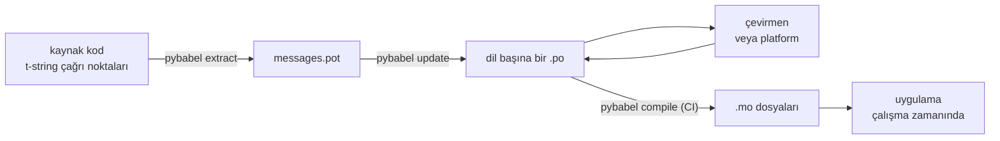

# Üretimde

[Öğretici](tutorial.md) döngüyü bir kez, tek başına, tek mesajlı bir program
üzerinde çalıştırır. Gerçek bir projede döngü dönmeye devam eder: mesajlar
çevrildikten sonra değişir, çevirmen başka bir yerde ve kendi takvimiyle
çalışır ve her sürümle birlikte derlenmiş bir katalog sevk edilir. Bu sayfa o
pratiktir — depoda ne kalır, ne yolculuk eder, CI neyi kapılamak zorundadır
ve çalışma zamanı bir dili nerede bağlar.

Hepsi altı denetime çıkıyor; o yüzden önce onlar. Aşağıdaki her bölüm
bunlardan birini kurar.

- `pybabel update --check` geçiyor — kataloglar haberdar olmadan hiçbir mesaj
  değişmemiş.
- `pybabel compile`, derlemeyi kendi çıkış durumuyla kapılıyor.
- Kalan `fuzzy` girdiler kasıtlı — her biri, bir çevirmen onaylayana dek
  kaynak metin olarak render edilir.
- Test paketi, sevk edilen her dili `strict=True` ile bir kez render ediyor.
- Üretim artefaktı `.mo` dosyalarını içeriyor ve Babel'i içermiyor.
- `gettext_tstrings` günlükçüsü izlemeye yönlendirilmiş.

## Bir projenin biçimi { #the-shape-of-a-project }

```text
myapp/
├── babel.cfg
├── pyproject.toml
├── src/
│   └── myapp/
└── locales/
    ├── messages.pot
    ├── ja/LC_MESSAGES/messages.po
    └── de/LC_MESSAGES/messages.po
```

`babel.cfg` dosyasını, `.pot` şablonunu ve her `.po` dosyasını commit'leyin —
bunlar çeviri derlemesinin kaynaklarıdır ve diff'leri, çeviri değişikliklerini
inceleme biçiminizdir. Derlenmiş `.mo` dosyaları derleme çıktılarıdır: onları
commit'lemek yerine CI'da ya da paketleme anında üretin; böylece bir `.po`
ile `.mo`su, neyin sevk edildiği konusunda asla anlaşmazlığa düşemez.

Bir dosyanın her yönde birer rolü vardır: `.pot`, mesajlarınızı çevirmenlere
*götürür*; `.po` dosyaları çevirileri *geri getirir*. Bu sayfanın geri kalanı,
o ikisi arasında hareket eden şeydir.



## İlk çeviriden sonraki çevrim { #the-cycle-after-the-first-translation }

Öğreticideki `pybabel init`, normalde bir dil eklendiğinde bir kez çalışır.
Ondan sonra çalışma çevrimi **çıkar → güncelle → çevir → derle** olur ve
merkezinde
`pybabel update` durur: taze bir şablonu, içlerindeki mevcut çevirileri
atmadan var olan katalogların içine katlar.

Diyelim ki `Hello {name}` selamı — hâlihazırda `こんにちは {name}` olarak
çevrilmişken — kodda `Welcome back, {name}` olarak yeniden yazıldı. Çıkarın
ve güncelleyin:

```console
$ pybabel extract -F babel.cfg -c "Translators:" -o locales/messages.pot .
extracting messages from app.py (encoding="utf-8")
writing PO template file to locales/messages.pot
$ pybabel update -i locales/messages.pot -d locales
updating catalog locales/ja/LC_MESSAGES/messages.po based on locales/messages.pot
```

Japonca katalog artık şunu içeriyor:

```po
#. gettext-tstrings
#: app.py:4
#, fuzzy, python-brace-format
msgid "Welcome back, {name}"
msgstr "こんにちは {name}"
```

Babel, yeni msgid'nin kaldırılmış bir msgid'ye benzediğini fark etti ve onu
eski çeviriyle eşleştirdi — ama çifti **fuzzy** olarak işaretledi: bir insanı
bekleyen bir makine tahmini. Bayrak, neyin derleneceğini değiştirir.
`pybabel compile`,
**fuzzy girdileri `.mo` dosyasının dışında bırakır**; böylece bir çevirmen
çifti onaylayana dek uygulama, bayat bir Japonca metin yerine yeni İngilizce
metni render eder:

```console
$ pybabel compile -d locales
compiling catalog locales/ja/LC_MESSAGES/messages.po to locales/ja/LC_MESSAGES/messages.mo
$ python app.py
Welcome back, Ada
```

Değişen bir mesaj, dolayısıyla, bozuk bir mesajla aynı biçimde alçalır —
kaynak dile, asla güncelliğini yitirmiş bir çeviriye değil. Çevrimde
çevirmenin payı, `msgstr`ı gözden geçirip `fuzzy` bayrağını silmektir; bir
sonraki derleme girdiyi alır.

!!! note "Yer tutucu adları mesajın kimliğinin parçasıdır"

    msgid katalog anahtarıdır ve yer tutucunun *adı* onun içindedir — bu
    yüzden kodda bir değişkeni yeniden adlandırmak (`name` → `user_name`)
    msgid'yi değiştirir ve her dilin o mesaj çevirisini fuzzy çevriminden
    yeniden geçirir. İnterpolasyona giren değişkenlere bir çevirmenin
    anlayacağı sözcüklerle ad verin ve onları yalnızca bir gerekçeyle yeniden
    adlandırın.

    Biçimlendirme bunun ayna görüntüsüdür: `!r` ve `:.2f`
    [msgid'nin parçası değildir](internals.md#from-template-to-msgid);
    dolayısıyla `{amount:,.2f}` biçimini `{amount:,.0f}` olarak sıkılaştırmak
    hiçbir katalogda hiçbir şeyi değiştirmez. *Cümleyi* yeniden yazmak ise
    elbette gerçek bir değişikliktir — o da yukarıdaki çevrimdir.

## CI'ın kapıladığı şeyler { #what-ci-gates }

Üç başarısızlık kırmızı bir derlemeye değer: kataloglar kodun gerisinde
kaldı, bir çeviri bir yer tutucuyu bozdu ya da bozuk bir girdi çalışma
zamanına sızdı. Her başarısızlığa bir adım:

```yaml
- run: pybabel extract -F babel.cfg -c "Translators:" -o locales/messages.pot .
- run: pybabel update -i locales/messages.pot -d locales --check
- run: pybabel compile -d locales
- run: pytest
```

`pybabel update --check` hiçbir şeyi yeniden yazmaz ve bir katalog, taze
çıkarılmış şablona göre güncel değilse sıfırdan farklı bir kodla çıkar —
mesajları kimsenin yeniden çıkarmadığı kodun merge edilmesine karşı korkuluk
budur. `pybabel compile`, hem Babel'in hem de bu paketin
[kayıtlı denetleyicisinin](extraction.md#your-existing-toolchain-validates-these-catalogs)
yer tutucu denetimlerini çalıştırır.

!!! bug "Babel 2.18.0: `--check`, bağlam kullanan bir kataloğu kapılayamaz"

    Babel 2.18.0'da `pybabel update --check`, `msgctxt` içeren **her**
    kataloğu, ne kadar güncel olursa olsun, her çalıştırmada güncel değil
    diye raporlar. Sürekli başarısız olan bir kapı, hiç kapı olmamasından
    kötüdür; çünkü ekip onu kapatır — bu yüzden `pgettext` ya da `npgettext`
    kullanıyorsanız, bu adımla yaşamak yerine onu değiştirin. Şablonu ve her
    kataloğu `babel.messages.pofile.read_po` ile okuyup
    `{(m.context, m.id) for m in catalog if m.id}` kümelerini karşılaştırmak
    denetimin tamamıdır; [bu sitenin kendi derlemesinin](index.md) yaptığı da
    budur. Nedeni
    [Tuzaklar sayfasında yazılıdır](pitfalls.md#your-tools-have-bugs-too).

!!! danger "Günlüğü değil, çıkış durumunu denetleyin"

    `pybabel compile` her yer tutucu hatasını raporlar, sıfırdan farklı bir
    kodla çıkar — **ve `.mo` dosyasını yine de yazar**. Derleyip sonra
    `locales/` dizinini bir imaja kopyalayan bir boru hattı, o sıfırdan
    farklı çıkış onu gerçekten durdurmadıkça bozuk kataloğu sevk eder.
    Yukarıdaki gibi, adımın derlemeyi düşürmesine izin vermek düzeltmenin
    tamamıdır.

Son satır, sıradan test paketinizdir; bir alışkanlık eklenmiş olarak: bir
yerinde, sevk edilen her dilden en az bir mesajı katı bir çevirmen nesnesi
üzerinden render edin —

```python
import gettext

from gettext_tstrings import Translator


def test_catalogs_render(language: str) -> None:
    translations = gettext.translation("messages", localedir="locales", languages=[language])
    _ = Translator(translations, strict=True)
    name = "Ada"
    assert _(t"Welcome back, {name}")
```

— çünkü `strict=True`,
[üretimin sessizce geri düşeceği yerde hata fırlatır](guide.md#what-happens-when-a-catalog-is-wrong)
ve çalışma zamanında bir render, kataloğu tam olarak uygulamanın göreceği
gibi — `.mo`suyla birlikte — gören tek denetimdir.

## Çevirmenlerle ve platformlarla çalışmak { #working-with-translators-and-platforms }

`.po` dosyası bütün gettext dünyasının değiş tokuş formatıdır; bu
kütüphanenin onu yeniden kullanmasının nedeni de budur: çeviriyi devretmek
bir dosyayı devretmek demektir — alıcı ister PO editörlü bir mesai arkadaşı
olsun, ister Weblate ya da Crowdin gibi bir platform. Üç şey bu devri iyi
işletir:

**Mesajın ne için olduğunu söyleyin.** Koddaki bir yorum mesajla birlikte
yolculuk eder — `-c "Translators:"` bayrağının topladığı budur:

```python
from gettext_tstrings import tr

name = "Ada"
# Translators: shown on the dashboard right after sign-in
print(tr(t"Welcome back, {name}"))
```

```po
#. Translators: shown on the dashboard right after sign-in
#. gettext-tstrings
#: app.py:5
#, python-brace-format
msgid "Welcome back, {name}"
msgstr ""
```

Bir çevirmen o yorumu, dünyanın öbür ucunda, kendi editöründe, mesajın hemen
yanında görür. Bütün iş akışındaki en ucuz kalite kaldıracı budur. Kendi
kendisinin eş adlısı olan bir sözcük için — düğme olan "Open" ile durum olan
"Open" — mesaja `pgettext` ile bir [bağlam](guide.md#binding-a-catalog)
verin; bu, katalogda görünür bir `msgctxt` olur.

**Yer tutucuları platform doğrulasın.** Bir t-string'den çıkarılan her mesaj
`python-brace-format` bayrağını taşır ve denetlemediğiniz araçlarda yer
tutucu QA'sını açan şey o tek satırdır — Weblate denetimi belgeler, ticari
platformlar kendi denetimlerini aynı bayrağa bağlar ve
`msgfmt --check-format` onu her GNU boru hattında zorlar. Ayrıntılar ve
paketle gelen denetleyicinin bunların ötesinde yakaladıkları
[çıkarma sayfasındadır](extraction.md#your-existing-toolchain-validates-these-catalogs).

**Güvenlik ağına tam olarak uzandığı yere kadar güvenin.** Bir platformdan
geri gelen şey yine de derlemenize giren veridir; "platform bunu muhtemelen
denetledi"yi "bu bozuk sevk edilemez"e çeviren, yukarıdaki CI kapılarıdır.

## Çalışma zamanında bir dil bağlamak { #binding-a-language-at-runtime }

Şimdiye kadarki her şey katalog üretir. Kalan karar, uygulamanın birini
nerede seçtiğidir ve bunun tek dürüst yanıtı vardır: *bir dilin kapsamı*
başına bir kez bağlayın — bir CLI için süreç, bir web servisi için istek.

=== "Tek süreç, tek dil"

    Bir komut satırı aracı ya da masaüstü uygulaması, kullanıcının ortamını
    bir kez, açılışta okur. `languages=` hiç verilmediğinde standart
    kütüphane `LANGUAGE`, `LC_ALL`, `LC_MESSAGES` ve `LANG` üzerinden
    pazarlık eder; `fallback=True`, hiçbiri sevk ettiğiniz bir katalogla
    eşleşmediğinde hata fırlatmak yerine boş bir katalog — kaynak metin —
    döndürür.

    ```python
    import gettext

    from gettext_tstrings import Translator

    _ = Translator(gettext.translation("messages", localedir="locales", fallback=True))

    name = "Ada"
    print(_(t"Welcome back, {name}"))
    ```

=== "Flask"

    Bir web uygulaması istek başına karar verir. Her kataloğu içe aktarmada
    bir kez yükleyin, sonra görünüm çalışmadan önce pazarlıkla seçileni
    bağlama bağlayın —
    [`set_translations`](guide.md#per-request-language) bağlam-yereldir;
    böylece farklı dillerdeki eşzamanlı istekler birbirinin bağlamasını asla
    görmez.

    ```python
    import gettext

    from flask import Flask, request

    from gettext_tstrings import set_translations, tr

    LANGUAGES = ("en", "ja", "de")
    CATALOGS = {
        language: gettext.translation(
            "messages", localedir="locales", languages=[language], fallback=True
        )
        for language in LANGUAGES
    }

    app = Flask(__name__)


    @app.before_request
    def bind_language() -> None:
        language = request.accept_languages.best_match(LANGUAGES) or "en"
        set_translations(CATALOGS[language])


    @app.get("/")
    def home() -> str:
        name = "Ada"
        return tr(t"Welcome back, {name}")
    ```

=== "ASGI ara katmanı"

    Async çatılarda — FastAPI, Starlette ve ASGI olan başka her şey — isteği
    [`use_translations`](guide.md#per-request-language) ile sarın: bağlama
    bir `ContextVar` içinde yaşar ve async görev geçişleri onu istek başına
    korur.

    ```python
    import gettext

    from fastapi import FastAPI, Request

    from gettext_tstrings import tr, use_translations

    LANGUAGES = ("en", "ja", "de")
    CATALOGS = {
        language: gettext.translation(
            "messages", localedir="locales", languages=[language], fallback=True
        )
        for language in LANGUAGES
    }

    app = FastAPI()


    @app.middleware("http")
    async def bind_language(request: Request, call_next):
        language = negotiate_language(request.headers.get("accept-language"), LANGUAGES)
        with use_translations(CATALOGS[language]):
            return await call_next(request)
    ```

    `negotiate_language`, sizin Accept-Language ayrıştırmanızın yerini tutar
    — çoğu çatı ya da ekosistemi bir tane sağlar; burada önemli olan,
    `call_next` çevresindeki bağlamadır.

İki çalışma zamanı alışkanlığı resmi tamamlar. İçe aktarma anında oluşturulan
dizgiler — bir form etiketi, bir enum'un görünen adı — içe aktarma sırasında
hangi dil etkinse onu yakalamamalıdır; onları
[`lazy_gettext`](guide.md#deferred-translation) ile tanımlayın ki
*kullanım* anında etkin olan dilde render edilsinler. Ve `gettext_tstrings`
günlükçüsünü bir insanın baktığı bir yere yönlendirin: uyarıları, hoşgörülü
kipin her kapıdan sıyrılmış bir çeviriyi raporlamasıdır — render başına değil,
bozuk mesaj başına bir satır.

## Sevkiyat { #shipping }

Üretimin pakete, `.mo` dosyalarına ve başka hiçbir şeye ihtiyacı yoktur.
Babel bir geliştirme ve CI bağımlılığıdır — `gettext-tstrings[babel]`
ekstrasını üretim imajının dışında tutun ve orada yalın paketi kurun; render,
yalnızca standart kütüphaneyle çalışır. Katalogları, dağıttığınız çıktıyı
üreten aynı derlemede derleyin; böylece içindeki `.mo` dosyaları tam olarak
incelenmiş `.po` dosyalarıdır ve birinin dizüstünde derlenmiş hiçbir şey asla
sevk edilmez.

Bir sürümden önce, bu sayfanın özetlendiği denetim listesi:

- `pybabel update --check` geçiyor — katalogların haberi olmadan hiçbir mesaj
  değişmedi.
- `pybabel compile`, çıkış durumuyla derlemeyi kapılıyor.
- Kalan `fuzzy` girdiler kasıtlı — her biri, bir çevirmen onaylayana dek
  kaynak metin olarak render edilir.
- Test paketi, sevk edilen her dili `strict=True` ile bir kez render ediyor.
- Üretim çıktısı `.mo` dosyaları içeriyor ve Babel içermiyor.
- `gettext_tstrings` günlükçüsü izlemeye yönlendirilmiş.

## Sonraki adımlar { #where-next }

- [Çıkarma](extraction.md) — bu sayfanın araç yarısının referansı: eşleme
  seçenekleri, özel işlev adları, katı kip ve her denetleyici.
- [Kılavuz](guide.md) — çalışma zamanı yarısı: çoğullar, bağlamlar,
  ertelenmiş dizgiler ve hata kipleri ayrıntısıyla.
- [Nasıl Çalışır](internals.md) — msgid neden bu biçimde görünür ve doğrulama
  gerçekte neyi denetler.
