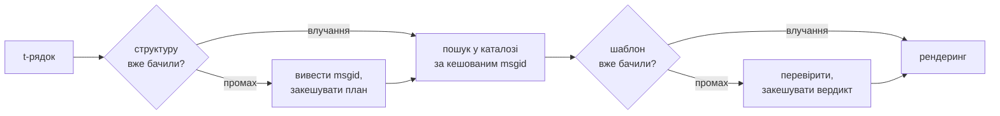

# Як це працює

Ніщо на цій сторінці не потрібне, щоб користуватися бібліотекою, — це
покривають [підручник](tutorial.md) і [посібник](guide.md). Ця сторінка
натомість відбудовує бібліотеку з перших принципів: що таке t-рядок
насправді, як із нього випадає msgid, що робить переклад припустимим і як
реалізація зводить вартість усієї цієї перевірки до десятих часток
мікросекунди. Читайте, якщо вам цікаво, якщо хочете зробити внесок або якщо
плануєте [реалізувати угоду самостійно](#reimplementing-it).

## Що таке t-рядок насправді { #what-a-t-string-actually-is }

f-рядок продукує `str`, і продукує його негайно — на момент, коли будь-яка
функція його отримує, значення вже інтерпольовано й речення запечатано.
t-рядок ([PEP 750]) має той самий синтаксис і те саме негайне обчислення
своїх виразів, але продукує інший тип:

```pycon
>>> name = "Ada"
>>> f"Hello {name}!"
'Hello Ada!'
>>> t"Hello {name}!"
Template(strings=('Hello ', '!'), interpolations=(Interpolation('Ada', 'name', None, ''),))
```

Цей об'єкт `Template` зберігає частини, потрібні конвеєру каталогу, все ще
розділеними:

```pycon
>>> template = t"Total: {amount:,.2f}"
>>> template.strings
('Total: ', '')
>>> template.interpolations[0].expression
'amount'
>>> template.interpolations[0].value
1234.5
>>> template.interpolations[0].format_spec
',.2f'
```

- `strings` — літеральний текст довкола інтерполяцій, по порядку.
- Для кожної інтерполяції: **вираз** як вихідний текст (`'amount'`), його
  обчислене **значення** (`1234.5`) та будь-які **перетворення** (`!r`) і
  **специфікація формату** (`,.2f`) — що несуться окремо, а не
  застосовуються.

Усе, що робить ця бібліотека, — дисципліноване споживання цієї структури.
Мова вже зробила той єдиний поділ, який потрібен i18n, — статичний текст
окремо від значень, — тож бібліотека ніколи не парсить ваш вихідний код і
ніколи не вгадує, де у реченні сидить значення. Лишаються три рішення: як
структура стає ключем каталогу, що може сказати переклад цього ключа і як
обидва рендеряться назад разом.

## Від шаблона до msgid { #from-template-to-msgid }

msgid — ключ, за яким індексується каталог, — виводиться лише зі *статичних*
частин шаблона. Пройдіть `strings` та `interpolations` у вихідному порядку;
екрануйте дужки в кожному літеральному сегменті (`{` стає `{{`); для кожної
інтерполяції випустіть один токен `{name}`, де `name` — текст виразу з
обрізаними довколишніми пропусками. З `t"Total: {amount:,.2f}"`:

```text
strings         ('Total: ', '')
interpolations  expression 'amount'   conversion None   format_spec ',.2f'
msgid           'Total: {amount}'
```

Кожна частина цього правила має причину:

- **Вираз мусить бути простим іменем** — `str.isidentifier()` істинне, і це
  не ключове слово Python. `t"Hello {user.name}"` відхиляється в місці
  виклику. msgid — це *ключ*: він має виходити ідентичним на кожному запуску
  й кожному видобуванні, і його читають перекладачі, тож заповнювач має бути
  стабільним, осмисленим словом — а не уривком коду, що запрошує каталог
  стати мовою виразів.
- **Перетворення і специфікація формату ніколи не входять до msgid.**
  Перекладачі не повинні читати `:,.2f`, і жоден переклад не повинен могти
  його змінити. Наслідок варто знати: підкручування `:,.2f` до `:,.0f` у
  вашому коді не змінює жодного msgid, тож не знецінює жодного перекладу
  жодною мовою. Ключ каталогу відстежує, *що каже речення*, а не як
  форматується значення.
- **Повторене ім'я мусить точно повторити своє форматування.**
  `t"{x:.2f} vs {x:.3f}"` відхиляється, бо обидва входження згортаються в той
  самий токен `{x}` і msgid більше не міг би сказати, яке форматування має
  використати рендеринг.
- **Порожній msgid ніколи не шукається**, бо gettext резервує його для
  метаданих заголовка самого каталогу. `t""` рендериться як `""`, не
  торкаючись каталогу.

Повний набір правил, включно з крайніми випадками, які ця сторінка минає, —
[SPEC §2](https://github.com/yhay81/gettext-tstrings/blob/main/SPEC.md).

## Що може сказати переклад { #what-a-translation-may-say }

Шаблон, що повертається з каталогу, парситься через `string.Formatter` — тим
самим парсером, що й у `str.format`. Граматика свідомо позичена, а не
вигадана: шаблон, який приймає ця бібліотека, — це шаблон, який ширша
екосистема вже розуміє. Далі застосовуються дві перевірки.

**Форма:** кожне поле мусить бути голим `{name}`. Перетворення чи
специфікація формату — включно з явно порожньою `{name:}` — відхиляються, як
і позиційні поля (`{0}`, `{}`) та імена з пропусками (`{ name }`). Останнє
важливіше, ніж здається: і `str.format`, і GNU `msgfmt` відкидають
`{ name }`, тож прийняти його тут означало б продукувати каталоги, які жоден
інший інструмент у ланцюжку не може перевірити.

**Імена:** множина заповнювачів шаблона порівнюється з множиною джерела. Для
одиничного повідомлення кожне ім'я джерела *обов'язкове*, і ніщо інше не
*дозволене*. Для повідомлення з множиною дві гілки зливаються:

- **дозволене** = об'єднання імен обох гілок
- **обов'язкове** = їхній перетин

Тож проти `t"One file"` / `t"{n} files"` ім'я `n` дозволене в перекладі
будь-якої форми, але не обов'язкове в жодній. Саме ця асиметрія дозволяє
системі множини цільової мови відрізнятися від вихідної: японська перекладає
обидві гілки однією формою, що, мабуть, використовує `{n}`; мові з більшою
кількістю форм, ніж в англійської, `{n}` може знадобитися у формі, якої
англійська не має.

Ніщо з цього не гіпотетичне: власний службовий каталог цього сайту несе
повідомлення з множиною `Built {n} localized page` / `Built {n} localized
pages` — дві англійські гілки, — а видання сайту перекладають це одне
повідомлення кількістю форм від однієї до шести:

| Каталог | Форми | Переклади, в порядку форм |
| --- | --- | --- |
| Японська | 1 | `ローカライズ済みページを{n}件ビルドしました` |
| Турецька | 2 | `{n} yerelleştirilmiş sayfa oluşturuldu` — двічі, однаково: турецькі іменники лишаються в однині після числівника |
| Італійська | 2 | `Generata {n} pagina localizzata` · `Generate {n} pagine localizzate` — дієприкметник узгоджується в роді й числі |
| Латвійська | 3 | `Izveidota {n} lokalizēta lapa` · `Izveidotas {n} lokalizētas lapas` · `Izveidots {n} lokalizētu lapu` — третя форма існує **лише для нуля** |
| Російська | 3 | `Собрана {n} локализованная страница` · `Собраны {n} локализованные страницы` · `Собрано {n} локализованных страниц` |
| Польська | 3 | `Zbudowano {n} zlokalizowaną stronę` · `Zbudowano {n} zlokalizowane strony` · `Zbudowano {n} zlokalizowanych stron` |
| Словенська | 4 | `Zgrajena {n} lokalizirana stran` · `Zgrajeni {n} lokalizirani strani` · `Zgrajene {n} lokalizirane strani` · `Zgrajenih {n} lokaliziranih strani` — друга форма це **двоїна**, рівно для двох |
| Ірландська | 5 | `Tógadh {n} leathanach logánaithe` · `Tógadh {n} leathanaigh logánaithe` — один, два, 3–6, 7–10 та решта; основа чергується, але *leathanach* починається на `l`, на якому не записується жодна ірландська мутація, тож кілька форм збігаються |
| Арабська | 6 | серед них `تم إنشاء صفحة مترجمة واحدة ({n})` рівно для однієї та `تم إنشاء {n} صفحات مترجمة` для кількох |

Кожен рядок — живий запис у `i18n/*/LC_MESSAGES/site.po` цього репозиторію,
який [багатомовна збірка](index.md) рендерить на кожному релізі, — а тест
прив'язує цю таблицю до тих каталогів, тож розійтися вони не можуть.

У цих межах перестановка й повторення свідомо не обмежені. Обидва граматично
необхідні в реальних мовах, а обмеження кількості входжень відкидало б
коректні переклади без жодної користі для безпеки: переклад однаково не може
нічого *обчислити*, бо шляху обчислення не існує — заповнювачі шукаються за
іменем серед уже обчислених значень шаблона й ніколи не потрапляють до
`eval`, `getattr` чи самого `str.format`.

## Рендеринг { #rendering }

Рендеринг перевіреного шаблона — прохід його фрагментами: випустити кожну
літеральну частину, а для кожного заповнювача взяти захоплене інтерполяцією
значення і застосувати перетворення та специфікацію формату *з боку
джерела* — `format(convert(value, conversion), format_spec)`. При цьому
тримаються дві гарантії:

- **Кожне окреме значення форматується щонайбільше раз на рендеринг**, навіть
  коли переклад повторює заповнювач. Повторення змінює, скільки разів
  результат вставляється, а не скільки разів виконується ваш `__format__`.
- **У множині заповнювач читає ту гілку, що його визначила.** Ім'я, наявне в
  обох гілках, читає значення, захоплене гілкою, яку обирає *вихідна* мова
  (`singular`, коли `n == 1`, інакше `plural`); ім'я, властиве одній гілці,
  завжди читає власну гілку — навіть коли правила множини цільової мови
  зробили його доступним в іншій формі.

Коли перевірка провалюється під час рендерингу, відповідь ділиться за тим,
хто надав шаблон. Шаблон, що прийшов із *каталогу*, деградує: записати одне
попередження й відрендерити початковий текст, тримаючи контракт gettext, за
яким зламаний каталог ніколи не кладе застосунок
([посібник показує обидва режими](guide.md#what-happens-when-a-catalog-is-wrong)).
Шаблон, який той, хто викликає, передав напряму — `CompiledTemplate.render`, —
завжди кидає виняток, бо нема початкового тексту, до якого можна деградувати;
поблажливість існує для пошуків у каталозі, а не для аргументів.

## Діагностика — частина дизайну { #diagnostics-are-part-of-the-design }

Помилка заповнювача зазвичай лягає перед перекладачем, а не програмістом, і
часто у файлі, де проблеми не видно. Сказати `{name} is missing` тому, хто
бачить рівно ці символи у своєму редакторі, — глухий кут, тож повідомлення
обчислюються за трьома правилами:

- Ім'я з **невидимим символом** — нерозривним пробілом від методу введення,
  пробілом нульової ширини — друкується з цим символом, заміненим його
  кодовою точкою, на місці: `{<U+00A0>name}`. Читачеві треба бачити *де*.
- Ім'я, чиї літери **змішують системи письма**, — випадок омогліфів —
  показується двічі: раз читабельно й раз екрановано, бо `{nаme}` з
  кириличною `а` у друці невідрізненне від `{name}`, і екранована форма
  `(nаme)` — єдине написання, що їх розрізняє.
- Усе інше показується **як написано**. `{名前}` та `{café}` — звичайні
  імена; екранування залишило б читача нездатним знайти, що малося на увазі.

За тим самим принципом «відсутній» заповнювач, що *виглядає* наявним, дістає
пояснення своєї відсутності: повноширинні дужки зі східноазійського методу
введення, подвоєння `{{name}}` після кола екранування, ім'я поза будь-якими
дужками. [Таблиця читання відмов](translators.md#reading-a-failure-message),
написана для перекладачів, показує кожне з цих повідомлень дослівно.

## Гарячий шлях { #the-hot-path }

Усе наведене відбувається на кожному перекладеному рядку, який рендерить
застосунок, тож реалізація збудована довкола однієї ідеї: **перевірка ніколи
не пропускається, отже кешуватися має саме перевірка.**



Три кеші, по одному на стадію:

- **План на структуру місця виклику.** Кортеж `strings` шаблона — об'єкт,
  який інтерпретатор уже збудував, — слугує ключем кешу, тож пошук нічого не
  алокує. При влучанні вираз, перетворення і специфікація формату кожної
  інтерполяції все одно порівнюються із записаними: два місця виклику зі
  спільним літеральним текстом, але різним форматуванням (`t"{x:.2f}"` проти
  `t"{x:.3f}"`) не повинні зіткнутися, і це порівняння — ціна ключа, який
  інтерпретатор віддає задарма.
- **Вердикт на шаблон.** Першого разу, коли каталог відповідає певним
  шаблоном, той парситься й перевіряється; результат — скомпільований план
  рендерингу або запис про непридатність — зберігається на плані. Кожен
  наступний рендеринг цього повідомлення дістається його за один пошук у
  словнику. Непридатні шаблони теж запам'ятовуються — тому зламаний запис
  каталогу попереджає раз, а не на кожному рендерингу.
- **Злитий план на пару множини**, що тримає множини об'єднання/перетину, —
  тож арифметика гілок відбувається раз на повідомлення, а не раз на виклик.

Кожен кеш обмежений, і жоден не тримає інтерпольованих *значень* — лише
статичну структуру й текст шаблонів. Результат, виміряний
[`benchmarks/runtime.py`](https://github.com/yhay81/gettext-tstrings/blob/main/benchmarks/runtime.py):
приблизно 0,4 мкс на повідомлення з одним полем, включно з побудовою самого
t-рядка, — близько 2,5× від голого `gettext(...).format(...)`, що не
перевіряє нічого. Коментар угорі
[`core.py`](https://github.com/yhay81/gettext-tstrings/blob/main/src/gettext_tstrings/core.py)
фіксує окремі вимірювання за цією формою.

## Реалізувати самостійно { #reimplementing-it }

Ніщо з наведеного — не приватне знання: угода записана як
[spec v1](spec.md), а її машиночитний
[набір тестів відповідності](spec.md#conformance) дозволяє видобувачу,
IDE-плагіну чи реалізації іншою мовою перевірити себе проти кожного правила,
яке пояснила ця сторінка. Ця реалізація запускає набір у власних тестах — і
саме це не дає цій сторінці, специфікації та коду мовчки розійтися.

  [PEP 750]: https://peps.python.org/pep-0750/
