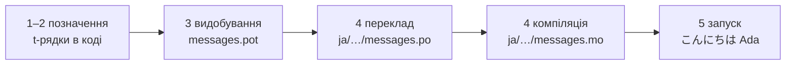

# Підручник

Ця сторінка веде від порожнього каталогу до програми, що вітається японською.
П'ять кроків, досвід із gettext не передбачається, і кожна команда показана з
виводом, який вона справді дає, — тож на кожному кроці ви знаєте, чи все йде
як слід.

Вам потрібен Python 3.14 або новіший, бо t-рядки — новий синтаксис у 3.14.
Японська — приклад цієї сторінки, але від цього вибору нічого не залежить.
Щоб скористатися іншою мовою, замініть `ja` на кроці 4 — цей код локалі є
єдиним місцем, що її називає.

## 1. Встановіть { #1-install }

```console
python -m pip install "gettext-tstrings[babel]"
```

Extra `[babel]` приносить [Babel] — інструмент, який на кроці 3 збирає ваші
повідомлення у файли каталогів. Це інструмент часу розробки: продакшн-код
рендерить лише стандартною бібліотекою.

## 2. Позначте повідомлення в коді { #2-mark-a-message-in-your-code }

Створіть `app.py`:

```python
from gettext_tstrings import tr

name = "Ada"
print(tr(t"Hello {name}"))
```

`t"Hello {name}"` виглядає як f-рядок, але префікс `t` тримає текст і
значення окремо, замість зливати їх на місці. Саме цей поділ дозволяє `tr()`
знайти переклад для цілого речення `Hello {name}` і вставити значення вже
після.

Запустіть просто зараз:

```console
$ python app.py
Hello Ada
```

Перекладів ще не встановлено, тож початковий текст рендериться як є. Програма
з цією бібліотекою ніколи не *вимагає* каталогу для запуску — англійська (або
якою є ваша вихідна мова) слугує вбудованим запасним варіантом.

## 3. Видобудьте повідомлення { #3-extract-the-messages }

Перекладачі зазвичай працюють із каталогами, а не з вихідним кодом, тож між
вами й ними подорожує невеликий файл — **каталог**. Перший крок до нього —
зібрати з коду всі позначені повідомлення.

Скажіть Babel, як знаходити ваші повідомлення, створивши `babel.cfg`:

```ini
[gettext_tstrings: **.py]
encoding = utf-8
```

Потім видобудьте їх у файл-шаблон (`.pot`):

```console
$ mkdir -p locales
$ pybabel extract -F babel.cfg -c "Translators:" -o locales/messages.pot .
extracting messages from app.py (encoding="utf-8")
writing PO template file to locales/messages.pot
```

`locales/messages.pot` тепер містить по одному запису на повідомлення:

```po
#. gettext-tstrings
#: app.py:4
#, python-brace-format
msgid "Hello {name}"
msgstr ""
```

`msgid` — це ключ, за яким шукатиме ваш код. Порожній `msgstr` — місце для
перекладу, але не в цьому файлі: `.pot` — це *шаблон*, і наступний крок
копіює його по одному разу на мову.

## 4. Перекладіть і скомпілюйте { #4-translate-and-compile }

Створіть японський каталог із шаблону:

```console
$ pybabel init -i locales/messages.pot -d locales -l ja
creating catalog locales/ja/LC_MESSAGES/messages.po based on locales/messages.pot
```

Відкрийте `locales/ja/LC_MESSAGES/messages.po` і заповніть `msgstr`:

```po
msgid "Hello {name}"
msgstr "こんにちは {name}"
```

Залиште `{name}` точно як є — заповнювач і є тим, як значення знаходить своє
місце всередині перекладеного речення, і переклад вільний пересунути його
туди, куди вимагає цільова мова. У реальному проєкті саме цей файл `.po` ви
передаєте перекладачеві чи вивантажуєте на платформу перекладу; формат в обох
випадках той самий.

Каталоги редагують як текст, але завантажують у двійковій формі (`.mo`), тож
скомпілюйте:

```console
$ pybabel compile -d locales
compiling catalog locales/ja/LC_MESSAGES/messages.po to locales/ja/LC_MESSAGES/messages.mo
```

Ця команда — заразом і страхувальна сітка. Якби переклад пошкодив
заповнювач — скажімо, `{nome}` замість `{name}`, — вона відмовилася б його
пропустити:

```console
$ pybabel compile -d locales
error: locales/ja/LC_MESSAGES/messages.po:24: translation does not match the
source placeholders: {name} is missing; {nome} is not in the source message
1 errors encountered.
```

Одне застереження варто знати вже зараз: вона повідомляє про помилку й виходить
з ненульовим кодом, але `.mo` усе одно записує. На справжньому проєкті саме CI
має спинитися на цьому коді виходу — [У продакшені](workflow.md#what-ci-gates)
це налаштовує.

## 5. Запустіть { #5-run-it }

Кроки 2–4 використовували `tr()`, який шукає каталог і не знаходить жодного.
Тепер, коли каталог існує, завантажте його і прив'яжіть один раз: `Translator`
тримає каталог, тож місцям виклику не доводиться його називати, а `_` —
традиційне для gettext ім'я результату.

Спрямуйте `app.py` на скомпільований каталог. Клацніть на позначки, щоб
побачити, що робить кожен рядок:

```python
import gettext

from gettext_tstrings import Translator

_ = Translator(gettext.translation("messages", localedir="locales", languages=["ja"]))  # (1)!

name = "Ada"
print(_(t"Hello {name}"))  # (2)!
```

1. Стандартна бібліотека завантажує скомпільований `.mo`, а `Translator`
   прив'язує його до викликаного об'єкта. `_` — традиційне ім'я gettext для
   «переклади це» — коротке, бо воно з'являється на кожному рядку, який
   бачить користувач. Він виконує той самий переклад, що й `tr`, прив'язаний
   до одного каталогу.
2. У момент виклику: текст t-рядка стає ключем пошуку `Hello {name}`, каталог
   відповідає `こんにちは {name}`, відповідь звіряється із заповнювачами
   джерела, і лише тоді підставляється значення.

```console
$ python app.py
こんにちは Ada
```

Ось і весь цикл, і його варто побачити однією картиною:



**Позначити → видобути → перекласти → скомпілювати → запустити.** Усе інше на
цьому сайті — уточнення одного з цих п'яти кроків.

## Куди далі { #where-next }

- [Навіщо t-рядки](comparison.md) — від чого цей дизайн вас захищає порівняно
  з `%(name)s`, `.format()` та `$`-рядками.
- [Посібник](guide.md) — множина, мова на запит, відкладені рядки і що
  відбувається під час виконання, коли каталог усе-таки хибний.
- [У продакшені](workflow.md) — цей самий цикл, як його веде команда тиждень
  за тижнем: оновлення каталогів, шлюзи CI та платформи перекладу.
- [Видобування](extraction.md) — повний довідник із `pybabel`: власні імена
  функцій, строгий режим для CI та перевірки, що охороняють ваші каталоги.
- [Міграція](migration.md) — якщо в проєкті, де ви насправді хочете це зробити,
  вже є каталоги gettext.
- [Для перекладачів](translators.md) — єдина сторінка, яку варто дати тому, хто
  заповнює рядки `msgstr`.

  [Babel]: https://babel.pocoo.org/
