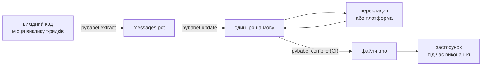

# У продакшені

[Підручник](tutorial.md) проходить цикл один раз, наодинці, на програмі з
одним повідомленням. У реальному проєкті цикл обертається далі: повідомлення
змінюються вже після того, як їх переклали, перекладач працює деінде і за
власним графіком, а скомпільований каталог їде з кожним релізом. Ця
сторінка — саме ця практика: що лишається в репозиторії, що подорожує, що
мусить вартувати CI і де середовище виконання прив'язує мову.

У сумі це шість перевірок, тож ось вони одразу; кожен розділ нижче налаштовує
одну з них.

- `pybabel update --check` проходить — жодне повідомлення не змінилося без
  того, щоб каталоги про це почули.
- `pybabel compile` вартує збірку за своїм статусом виходу.
- Записи `fuzzy`, що лишилися, є навмисними — кожен рендериться як вихідний
  текст, доки перекладач його не підтвердить.
- Набір тестів рендерить кожну доставлювану мову один раз зі `strict=True`.
- Продакшн-артефакт містить файли `.mo` і не містить Babel.
- Логер `gettext_tstrings` спрямований у моніторинг.

## Форма проєкту { #the-shape-of-a-project }

```text
myapp/
├── babel.cfg
├── pyproject.toml
├── src/
│   └── myapp/
└── locales/
    ├── messages.pot
    ├── ja/LC_MESSAGES/messages.po
    └── de/LC_MESSAGES/messages.po
```

Комітьте `babel.cfg`, шаблон `.pot` і кожен `.po` — вони є джерелами
перекладної збірки, а їхні diff — те, як ви рев'юїте зміни перекладів.
Скомпільовані файли `.mo` — артефакти збірки: створюйте їх у CI або на етапі
пакування, а не комітьте, щоб `.po` та його `.mo` ніколи не могли розійтися в
тому, що їде до користувачів.

Один файл має роль у кожному напрямку: `.pot` везе ваші повідомлення
*назовні* до перекладачів, файли `.po` везуть переклади *назад*. Решта цієї
сторінки — те, що рухається між ними.



## Цикл після першого перекладу { #the-cycle-after-the-first-translation }

`pybabel init` із підручника зазвичай запускається один раз — коли додають
мову. Далі робочий цикл — **видобути → оновити → перекласти → скомпілювати**,
і його центр — `pybabel update`, який вливає свіжий шаблон у наявні каталоги,
не викидаючи перекладів, що вже в них є.

Припустімо, привітання `Hello {name}` — уже перекладене як
`こんにちは {name}` — переформульовано в коді на `Welcome back, {name}`.
Видобудьте й оновіть:

```console
$ pybabel extract -F babel.cfg -c "Translators:" -o locales/messages.pot .
extracting messages from app.py (encoding="utf-8")
writing PO template file to locales/messages.pot
$ pybabel update -i locales/messages.pot -d locales
updating catalog locales/ja/LC_MESSAGES/messages.po based on locales/messages.pot
```

Японський каталог тепер містить:

```po
#. gettext-tstrings
#: app.py:4
#, fuzzy, python-brace-format
msgid "Welcome back, {name}"
msgstr "こんにちは {name}"
```

Babel помітив, що новий msgid схожий на вилучений, і спарував його зі старим
перекладом — але позначив пару **fuzzy**: здогад машини, що чекає людини.
Прапорець змінює те, що компілюється. `pybabel compile` **виключає записи
fuzzy з `.mo`**, тож
поки перекладач не підтвердить пару, застосунок рендерить новий англійський
текст, а не застарілий японський:

```console
$ pybabel compile -d locales
compiling catalog locales/ja/LC_MESSAGES/messages.po to locales/ja/LC_MESSAGES/messages.mo
$ python app.py
Welcome back, Ada
```

Змінене повідомлення, отже, деградує так само, як зламане, — до вихідної
мови, ніколи до застарілого перекладу. Частина циклу, що належить
перекладачеві, — переглянути `msgstr` і видалити прапорець `fuzzy`; наступна
компіляція підхопить запис.

!!! note "Імена заповнювачів — частина ідентичності повідомлення"

    msgid — це ключ каталогу, а *ім'я* заповнювача — всередині нього, тож
    перейменування змінної в коді (`name` → `user_name`) змінює msgid і
    відправляє переклад кожної мови назад через цикл fuzzy. Називайте
    інтерпольовані змінні словами, які зрозуміє перекладач, і перейменовуйте
    їх лише з поважної причини.

    Форматування — дзеркальний випадок: `!r` і `:.2f` [не входять до
    msgid](internals.md#from-template-to-msgid), тож підкручування
    `{amount:,.2f}` до `{amount:,.0f}` не змінює нічого в жодному каталозі.
    Переформулювання самого *речення*, звісно, — справжня зміна: це цикл
    вище.

## Що вартує CI { #what-ci-gates }

Три відмови варті червоної збірки: каталоги відстали від коду, переклад
зламав заповнювач або зламаний запис прослизнув до середовища виконання. По
одному кроку на відмову:

```yaml
- run: pybabel extract -F babel.cfg -c "Translators:" -o locales/messages.pot .
- run: pybabel update -i locales/messages.pot -d locales --check
- run: pybabel compile -d locales
- run: pytest
```

`pybabel update --check` нічого не переписує і виходить із ненульовим
статусом, коли каталог відстав від щойно видобутого шаблону, — запобіжник
проти злиття коду, чиї повідомлення ніхто не видобув наново. `pybabel
compile` запускає перевірки заповнювачів і Babel, і
[зареєстрованого чекера](extraction.md#your-existing-toolchain-validates-these-catalogs)
цього пакета.

!!! bug "Babel 2.18.0: `--check` не може вартувати каталог, що використовує контексти"

    На Babel 2.18.0 `pybabel update --check` повідомляє про **кожен** каталог,
    що містить `msgctxt`, як про застарілий — на кожному запуску, хоч би яким
    свіжим той був. Шлюз, що падає завжди, гірший за відсутність шлюзу, бо
    команда його вимикає, — тож якщо ви взагалі користуєтесь `pgettext` чи
    `npgettext`, замініть цей крок, а не живіть із ним. Прочитати шаблон і
    кожен каталог через `babel.messages.pofile.read_po` й порівняти
    `{(m.context, m.id) for m in catalog if m.id}` — це і є вся перевірка, і
    саме це робить [власна збірка цього сайту](index.md). Причина
    [описана на сторінці Пастки](pitfalls.md#your-tools-have-bugs-too).

!!! danger "Перевіряйте статус виходу, а не журнал"

    `pybabel compile` повідомляє кожну помилку заповнювачів, виходить із
    ненульовим статусом — **і все одно записує `.mo`**. Конвеєр, який
    компілює, а потім копіює `locales/` в образ, доставить зламаний каталог,
    якщо ненульовий вихід його насправді не зупинить. Дати кроку завалити
    збірку, як вище, — і є все виправлення.

Останній рядок — ваш звичайний набір тестів, з однією доданою звичкою: десь у
ньому рендерте принаймні одне повідомлення на кожну мову, що доставляється,
через строгий транслятор —

```python
import gettext

from gettext_tstrings import Translator


def test_catalogs_render(language: str) -> None:
    translations = gettext.translation("messages", localedir="locales", languages=[language])
    _ = Translator(translations, strict=True)
    name = "Ada"
    assert _(t"Welcome back, {name}")
```

— бо `strict=True` [кидає виняток там, де продакшн мовчки відкотився б](guide.md#what-happens-when-a-catalog-is-wrong),
а рендеринг під час виконання — та єдина перевірка, що бачить каталог точно
таким, яким його побачить застосунок, разом із `.mo`.

## Робота з перекладачами та платформами { #working-with-translators-and-platforms }

Файл `.po` — обмінний формат усього світу gettext, і саме тому ця бібліотека
його перевикористовує: передати переклад означає передати файл, байдуже, чи
одержувач — колега з PO-редактором, чи платформа на кшталт Weblate або
Crowdin. Три речі роблять цю передачу вдалою:

**Кажіть, для чого повідомлення.** Коментар у коді подорожує разом із
повідомленням — саме його збирає прапорець `-c "Translators:"`:

```python
from gettext_tstrings import tr

name = "Ada"
# Translators: shown on the dashboard right after sign-in
print(tr(t"Welcome back, {name}"))
```

```po
#. Translators: shown on the dashboard right after sign-in
#. gettext-tstrings
#: app.py:5
#, python-brace-format
msgid "Welcome back, {name}"
msgstr ""
```

Перекладач бачить цей коментар у своєму редакторі, поруч із повідомленням, на
іншому боці світу. Це найдешевший важіль якості в усьому процесі. Для слова,
що є власним омонімом — «Open» кнопка проти «Open» стану, — дайте
повідомленню [контекст](guide.md#binding-a-catalog) через `pgettext`, який
стане видимим `msgctxt` у каталозі.

**Хай платформа перевіряє заповнювачі.** Кожне повідомлення, видобуте з
t-рядка, несе прапорець `python-brace-format`, і саме цей один рядок вмикає
контроль заповнювачів в інструментах, які ви не контролюєте: Weblate
документує перевірку, комерційні платформи зав'язують на той самий прапорець
власну, а `msgfmt --check-format` забезпечує її в будь-якому GNU-конвеєрі.
Деталі — і що вбудований чекер ловить поза ними — на
[сторінці видобування](extraction.md#your-existing-toolchain-validates-these-catalogs).

**Довіряйте страхувальній сітці рівно настільки, наскільки вона сягає.** Хай
би що поверталося з платформи, це все ще дані, що входять у вашу збірку;
шлюзи CI вище — те, що перетворює «платформа, мабуть, це перевірила» на «це
не може поїхати зламаним».

## Прив'язування мови під час виконання { #binding-a-language-at-runtime }

Усе дотепер продукує каталоги. Лишається рішення, де застосунок обирає один,
і воно має одну чесну відповідь: прив'язуйте раз на *область дії мови* —
процес для CLI, запит для вебсервісу.

=== "Один процес, одна мова"

    Інструмент командного рядка чи десктопний застосунок читає середовище
    користувача один раз, на старті. Якщо не передавати `languages=`,
    стандартна бібліотека домовляється через `LANGUAGE`, `LC_ALL`,
    `LC_MESSAGES` і `LANG`; `fallback=True` повертає нульовий каталог —
    початковий текст — замість винятку, коли жодна з них не збігається з
    каталогом, який ви постачаєте.

    ```python
    import gettext

    from gettext_tstrings import Translator

    _ = Translator(gettext.translation("messages", localedir="locales", fallback=True))

    name = "Ada"
    print(_(t"Welcome back, {name}"))
    ```

=== "Flask"

    Вебзастосунок вирішує на кожен запит. Завантажте кожен каталог один раз
    при імпорті, потім прив'яжіть обраний до контексту перед виконанням
    view — [`set_translations`](guide.md#per-request-language)
    контекстно-локальний, тож конкурентні запити різними мовами ніколи не
    бачать чужої прив'язки.

    ```python
    import gettext

    from flask import Flask, request

    from gettext_tstrings import set_translations, tr

    LANGUAGES = ("en", "ja", "de")
    CATALOGS = {
        language: gettext.translation(
            "messages", localedir="locales", languages=[language], fallback=True
        )
        for language in LANGUAGES
    }

    app = Flask(__name__)


    @app.before_request
    def bind_language() -> None:
        language = request.accept_languages.best_match(LANGUAGES) or "en"
        set_translations(CATALOGS[language])


    @app.get("/")
    def home() -> str:
        name = "Ada"
        return tr(t"Welcome back, {name}")
    ```

=== "ASGI-проміжний шар"

    Під async-фреймворками — FastAPI, Starlette і будь-чим іншим ASGI —
    загорніть запит в [`use_translations`](guide.md#per-request-language):
    прив'язка живе в `ContextVar`, який перемикання async-задач зберігає для
    кожного запиту.

    ```python
    import gettext

    from fastapi import FastAPI, Request

    from gettext_tstrings import tr, use_translations

    LANGUAGES = ("en", "ja", "de")
    CATALOGS = {
        language: gettext.translation(
            "messages", localedir="locales", languages=[language], fallback=True
        )
        for language in LANGUAGES
    }

    app = FastAPI()


    @app.middleware("http")
    async def bind_language(request: Request, call_next):
        language = negotiate_language(request.headers.get("accept-language"), LANGUAGES)
        with use_translations(CATALOGS[language]):
            return await call_next(request)
    ```

    `negotiate_language` заступає ваш розбір Accept-Language — більшість
    фреймворків чи їхніх екосистем його надає; важлива тут прив'язка довкола
    `call_next`.

Дві звички часу виконання довершують картину. Рядки, створені при імпорті, —
підпис форми, показуване ім'я enum — не повинні захоплювати мову, що була
активною під час імпорту; визначайте їх через
[`lazy_gettext`](guide.md#deferred-translation) — і вони рендеряться мовою,
активною в момент *використання*. І спрямуйте логер `gettext_tstrings` туди,
куди дивиться людина: його попередження — це поблажливий режим, який
повідомляє про переклад, що прослизнув повз кожен шлюз, — по одному рядку на
зламане повідомлення, а не на кожен рендеринг.

## Доставка { #shipping }

Продакшену потрібні пакет, файли `.mo` — і нічого більше. Babel — залежність
розробки та CI: тримайте `gettext-tstrings[babel]` поза продакшн-образом і
встановлюйте там голий пакет; рендеринг працює лише на стандартній
бібліотеці. Компілюйте каталоги в тій самій збірці, що продукує артефакт,
який ви розгортаєте, — тоді файли `.mo` всередині нього є точно
відрев'юваними файлами `.po`, і ніщо, скомпільоване на чиємусь ноутбуці,
ніколи не поїде до користувачів.

Перед релізом — чекліст, до якого зводиться ця сторінка:

- `pybabel update --check` проходить — жодне повідомлення не змінилося без
  відома каталогів.
- `pybabel compile` вартує збірку своїм статусом виходу.
- Решта записів `fuzzy` — навмисні: кожен рендериться початковим текстом,
  поки перекладач його не підтвердить.
- Набір тестів рендерить кожну доставлювану мову раз зі `strict=True`.
- Продакшн-артефакт містить файли `.mo` і жодного Babel.
- Логер `gettext_tstrings` спрямований на моніторинг.

## Куди далі { #where-next }

- [Видобування](extraction.md) — довідник інструментальної половини цієї
  сторінки: опції зіставлення, власні імена функцій, строгий режим і кожен
  чекер.
- [Посібник](guide.md) — половина часу виконання: множина, контексти,
  відкладені рядки та режими відмов у деталях.
- [Як це працює](internals.md) — чому msgid виглядає саме так і що насправді
  перевіряє валідація.
