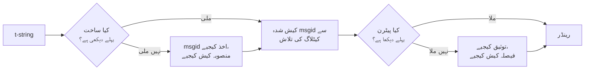

# یہ کیسے کام کرتی ہے

اس صفحے کا کچھ بھی لائبریری استعمال کرنے کے لیے ضروری نہیں —
[ٹیوٹوریل](tutorial.md) اور [رہنما](guide.md) وہ کام کر دیتے ہیں۔ یہ صفحہ اس
کے بجائے لائبریری کو بنیادی اصولوں سے دوبارہ تعمیر کرتا ہے: t-string دراصل
ہے کیا، اس میں سے msgid کیسے نکل آتا ہے، ترجمے کو درست کیا چیز بناتی ہے، اور
نفاذ اس ساری جانچ کو مائیکرو سیکنڈ کے دسویں حصوں میں کیسے نمٹا دیتا ہے۔ اسے
پڑھیے اگر آپ کو تجسس ہو، اگر آپ تعاون کرنا چاہتے ہوں، یا اگر آپ
[یہ اصول خود نافذ کرنے](#reimplementing-it) کا ارادہ رکھتے ہوں۔

## t-string دراصل ہے کیا { #what-a-t-string-actually-is }

f-string ایک `str` پیدا کرتی ہے، اور فوراً پیدا کرتی ہے — جب تک کوئی فنکشن
اسے وصول کرے، قدر انٹرپولیٹ ہو چکی ہوتی ہے اور جملہ بند ہو چکا ہوتا ہے۔
t-string ([PEP 750]) کی نحو بھی وہی ہے اور اپنے اظہاریوں کی فوری ارزیابی بھی
وہی، مگر وہ ایک مختلف قسم پیدا کرتی ہے:

```pycon
>>> name = "Ada"
>>> f"Hello {name}!"
'Hello Ada!'
>>> t"Hello {name}!"
Template(strings=('Hello ', '!'), interpolations=(Interpolation('Ada', 'name', None, ''),))
```

وہ `Template` آبجیکٹ اُن حصوں کو، الگ الگ رکھتے ہوئے، سنبھالے رکھتا ہے جو
کیٹلاگ کی پائپ لائن کو درکار ہیں:

```pycon
>>> template = t"Total: {amount:,.2f}"
>>> template.strings
('Total: ', '')
>>> template.interpolations[0].expression
'amount'
>>> template.interpolations[0].value
1234.5
>>> template.interpolations[0].format_spec
',.2f'
```

- `strings` — انٹرپولیشنز کے گرد کا ثابت متن، ترتیب کے ساتھ۔
- ہر انٹرپولیشن کے لیے: ماخذ متن کی صورت میں **اظہاریہ** (`'amount'`)، اس کی
  **ارزیابی شدہ قدر** (`1234.5`)، اور کوئی بھی **کنورژن** (`!r`) اور
  **فارمیٹ اسپیک** (`,.2f`) — لاگو کیے جانے کے بجائے الگ اٹھائے ہوئے۔

یہ لائبریری جو کچھ کرتی ہے، وہ اسی ساخت کا ضبط کے ساتھ استعمال ہے۔ زبان وہ
واحد علیحدگی پہلے ہی کر چکی ہے جو i18n کو درکار ہے — ثابت متن قدروں سے الگ —
لہٰذا لائبریری کبھی آپ کا ماخذ کوڈ پارس نہیں کرتی اور کبھی اندازہ نہیں لگاتی
کہ جملے کے اندر قدر کہاں بیٹھتی ہے۔ باقی تین فیصلے رہ جاتے ہیں: یہ ساخت
کیٹلاگ کی کلید کیسے بنے، اس کلید کا ترجمہ کیا کہہ سکتا ہے، اور دونوں مل کر
واپس کیسے رینڈر ہوں۔

## ٹیمپلیٹ سے msgid تک { #from-template-to-msgid }

msgid — یعنی وہ کلید جس پر کیٹلاگ اشاریہ بند ہوتا ہے — صرف ٹیمپلیٹ کے *ساکن*
حصوں سے اخذ ہوتا ہے۔ `strings` اور `interpolations` پر ماخذ کی ترتیب میں
چلیے؛ ہر ثابت ٹکڑے کے بریس ایسکیپ کیجیے (`{` `{{` بن جاتا ہے)؛ ہر
انٹرپولیشن کے لیے ایک `{name}` ٹوکن نکالیے، جہاں `name` اظہاریے کا وہ متن ہے
جس کے گرد کی خالی جگہ ہٹا دی گئی ہو۔ `t"Total: {amount:,.2f}"` سے:

```text
strings         ('Total: ', '')
interpolations  expression 'amount'   conversion None   format_spec ',.2f'
msgid           'Total: {amount}'
```

اس اصول کے ہر حصے کی ایک وجہ ہے:

- **اظہاریے کا سادہ نام ہونا لازم ہے** — `str.isidentifier()` صادق آئے اور وہ
  Python کا کلیدی لفظ نہ ہو۔ `t"Hello {user.name}"` کال کی جگہ پر ہی مسترد ہو
  جاتی ہے۔ msgid ایک *کلید* ہے: اسے ہر بار چلنے پر اور ہر استخراج پر ایک جیسا
  نکلنا ہے، اور اسے مترجم پڑھتے ہیں، لہٰذا پلیس ہولڈر کا مستحکم اور بامعنی
  لفظ ہونا ضروری ہے — نہ کہ کوئی کوڈ کا ٹکڑا جو کیٹلاگ کو اظہاری زبان بننے کی
  دعوت دے۔
- **کنورژن اور فارمیٹ اسپیک کبھی msgid میں داخل نہیں ہوتے۔** مترجموں کو
  `:,.2f` پڑھنا نہیں پڑنا چاہیے، اور کسی ترجمے کو اسے بدلنے کے قابل نہیں ہونا
  چاہیے۔ اس کا نتیجہ جاننے لائق ہے: اپنے کوڈ میں `:,.2f` کو کس کر `:,.0f` کر
  دینا کوئی msgid نہیں بدلتا، لہٰذا وہ کسی زبان کے کسی ترجمے کو باطل نہیں
  کرتا۔ کیٹلاگ کی کلید اس کا حساب رکھتی ہے کہ *جملہ کیا کہتا ہے*، نہ کہ قدر
  کیسے فارمیٹ ہوتی ہے۔
- **دہرائے گئے نام کو اپنی فارمیٹنگ بالکل دہرانی پڑتی ہے۔**
  `t"{x:.2f} vs {x:.3f}"` مسترد ہے، کیونکہ دونوں مقامات ایک ہی `{x}` ٹوکن میں
  سمٹ جاتے ہیں اور msgid یہ بتا ہی نہیں سکتا کہ رینڈر کو کون سی فارمیٹنگ
  استعمال کرنی چاہیے۔
- **خالی msgid کبھی تلاش نہیں کیا جاتا**، کیونکہ gettext اسے کیٹلاگ کے اپنے
  میٹا ڈیٹا ہیڈر کے لیے مخصوص رکھتا ہے۔ `t""` کیٹلاگ کو چھوئے بغیر `""`
  رینڈر ہوتی ہے۔

پورا اصولی مجموعہ، ان کناروں سمیت جو یہ صفحہ چھوڑ دیتا ہے،
[SPEC §2](https://github.com/yhay81/gettext-tstrings/blob/main/SPEC.md) میں
ہے۔

## ترجمہ کیا کہہ سکتا ہے { #what-a-translation-may-say }

کیٹلاگ سے واپس آنے والا پیٹرن `string.Formatter` سے پارس ہوتا ہے — یعنی وہی
پارسر جو `str.format` استعمال کرتا ہے۔ گرامر جان بوجھ کر ایجاد کرنے کے بجائے
ادھار لی گئی ہے: جو پیٹرن یہ لائبریری قبول کرتی ہے، اسے وسیع تر ماحولی نظام
پہلے ہی سمجھتا ہے۔ پھر دو جانچیں لاگو ہوتی ہیں۔

**شکل:** ہر فیلڈ کو خالی `{name}` ہونا چاہیے۔ کوئی کنورژن یا فارمیٹ اسپیک —
بشمول صراحتاً خالی `{name:}` کے — مسترد ہے، اور اسی طرح موضعی فیلڈ (`{0}`،
`{}`) اور خالی جگہ سے بھرے نام (`{ name }`) بھی۔ آخری بات دکھنے سے زیادہ اہم
ہے: `str.format` اور GNU `msgfmt` دونوں `{ name }` کو مسترد کرتے ہیں، لہٰذا
اسے یہاں قبول کرنا ایسے کیٹلاگ پیدا کرتا جن کی توثیق سلسلے کا کوئی دوسرا
اوزار نہ کر سکتا۔

**نام:** پیٹرن کے پلیس ہولڈرز کے مجموعے کا موازنہ ماخذ کے مجموعے سے کیا جاتا
ہے۔ واحد پیغام کے لیے ماخذ کا ہر نام *مطلوب* ہے اور اس کے سوا کچھ *اجازت
یافتہ* نہیں۔ جمع والے پیغام کے لیے دونوں شاخیں ملا دی جاتی ہیں:

- **اجازت یافتہ** = دونوں شاخوں کے ناموں کا اتحاد
- **مطلوب** = ان کا اشتراک

چنانچہ `t"One file"` / `t"{n} files"` کے مقابل، نام `n` کسی بھی صورت کے ترجمے
میں اجازت یافتہ ہے مگر کسی میں مطلوب نہیں۔ یہی عدم توازن ہدف زبان کے جمع کے
نظام کو ماخذ سے مختلف ہونے دیتا ہے — جاپانی دونوں شاخوں کا ترجمہ ایک ہی صورت
سے کرتی ہے جو غالباً `{n}` استعمال کرے گی؛ جس زبان میں انگریزی سے زیادہ
صورتیں ہوں، اسے ایسی صورت میں `{n}` درکار ہو سکتا ہے جہاں انگریزی کے پاس کوئی
نہیں۔

اس میں سے کچھ بھی فرضی نہیں: خود اس سائٹ کے ڈھانچے کا کیٹلاگ جمع والا پیغام
`Built {n} localized page` / `Built {n} localized pages` اٹھائے ہوئے ہے — دو
انگریزی شاخیں — اور سائٹ کے ایڈیشن اسی ایک پیغام کا ترجمہ ایک صورت سے لے کر
چھ صورتوں تک میں کرتے ہیں:

| کیٹلاگ | صورتیں | ترجمے، صورتوں کی ترتیب میں |
| --- | --- | --- |
| جاپانی | 1 | `ローカライズ済みページを{n}件ビルドしました` |
| ترکی | 2 | `{n} yerelleştirilmiş sayfa oluşturuldu` — دو بار، بالکل ایک جیسا: ترکی میں اسم عدد کے بعد واحد ہی رہتا ہے |
| اطالوی | 2 | `Generata {n} pagina localizzata` · `Generate {n} pagine localizzate` — اسم مفعول جنس اور عدد میں مطابقت کرتا ہے |
| لاتویائی | 3 | `Izveidota {n} lokalizēta lapa` · `Izveidotas {n} lokalizētas lapas` · `Izveidots {n} lokalizētu lapu` — تیسری صورت **صرف صفر** کے لیے ہے |
| روسی | 3 | `Собрана {n} локализованная страница` · `Собраны {n} локализованные страницы` · `Собрано {n} локализованных страниц` |
| پولش | 3 | `Zbudowano {n} zlokalizowaną stronę` · `Zbudowano {n} zlokalizowane strony` · `Zbudowano {n} zlokalizowanych stron` |
| سلووینیائی | 4 | `Zgrajena {n} lokalizirana stran` · `Zgrajeni {n} lokalizirani strani` · `Zgrajene {n} lokalizirane strani` · `Zgrajenih {n} lokaliziranih strani` — دوسری **تثنیہ** ہے، بالکل دو کے لیے |
| آئرش | 5 | `Tógadh {n} leathanach logánaithe` · `Tógadh {n} leathanaigh logánaithe` — ایک، دو، 3–6، 7–10، اور باقی سب؛ لفظ کا تنا بدلتا رہتا ہے مگر *leathanach* کا آغاز `l` سے ہوتا ہے، جس پر آئرش کی کوئی ابتدائی تبدیلی لکھی نہیں جاتی، چنانچہ کئی صورتیں آپس میں مل جاتی ہیں |
| عربی | 6 | ان میں `تم إنشاء صفحة مترجمة واحدة ({n})` بالکل ایک کے لیے اور `تم إنشاء {n} صفحات مترجمة` چند کے لیے |

ہر سطر اس ریپازٹری کے `i18n/*/LC_MESSAGES/site.po` میں ایک زندہ اندراج ہے،
جسے ہر ریلیز پر [کثیر لسانی بلڈ](index.md) رینڈر کرتا ہے — اور ایک ٹیسٹ اس
جدول کو انہی کیٹلاگوں سے باندھے رکھتا ہے، لہٰذا دونوں ایک دوسرے سے دور نہیں
ہو سکتے۔

انہی حدود کے اندر، ترتیب بدلنا اور دہرانا جان بوجھ کر بے پابند ہیں۔ حقیقی
زبانوں میں دونوں گرامر کے لحاظ سے ضروری ہیں، اور تکرار کی گنتی پر پابندی
درست ترجموں کو مسترد کر دیتی، بغیر کسی حفاظتی فائدے کے: ترجمہ پھر بھی کچھ
*چلا* نہیں سکتا، کیونکہ چلانے کا کوئی راستہ ہی موجود نہیں — پلیس ہولڈر
ٹیمپلیٹ کی پہلے سے حساب شدہ قدروں میں نام سے تلاش کیے جاتے ہیں، اور کبھی
`eval`، `getattr` یا خود `str.format` کو نہیں کھلائے جاتے۔

## رینڈرنگ { #rendering }

توثیق شدہ پیٹرن کو رینڈر کرنا اس کے ٹکڑوں پر ایک چہل قدمی ہے: ہر ثابت حصہ
نکالیے، اور ہر پلیس ہولڈر کے لیے انٹرپولیشن کی پکڑی ہوئی قدر لے کر *ماخذ کی
طرف* کا کنورژن اور فارمیٹ اسپیک لاگو کیجیے — `format(convert(value,
conversion), format_spec)`۔ ایسا کرتے ہوئے دو ضمانتیں نبھائی جاتی ہیں:

- **ہر الگ قدر فی رینڈر زیادہ سے زیادہ ایک بار فارمیٹ ہوتی ہے**، خواہ ترجمہ
  کسی پلیس ہولڈر کو دہرا ہی دے۔ تکرار یہ بدلتی ہے کہ نتیجہ کتنی بار ڈالا
  جائے، یہ نہیں کہ آپ کا `__format__` کتنی بار چلے۔
- **جمع میں، پلیس ہولڈر وہی شاخ پڑھتا ہے جس نے اسے متعین کیا۔** جو نام دونوں
  شاخوں میں موجود ہو، وہ اُس شاخ کی پکڑی ہوئی قدر پڑھتا ہے جسے *ماخذ* زبان
  چنتی ہے (`n == 1` پر `singular`، ورنہ `plural`)؛ اور شاخ سے مخصوص نام ہمیشہ
  اپنی ہی شاخ پڑھتا ہے، خواہ ہدف زبان کے جمع کے قواعد نے اسے کسی دوسری صورت
  میں دستیاب کر دیا ہو۔

جب رینڈر کے وقت توثیق ناکام ہو، تو ردِعمل اس بنیاد پر بٹتا ہے کہ پیٹرن دیا کس
نے۔ جو پیٹرن کسی *کیٹلاگ* سے آیا ہو، وہ نیچے اترتا ہے: ایک وارننگ لاگ ہوتی
ہے اور ماخذ متن رینڈر ہوتا ہے، اور یوں gettext کا وہ معاہدہ نبھتا ہے کہ ٹوٹا
ہوا کیٹلاگ ایپلی کیشن کو کبھی نہیں گراتا
([رہنما دونوں موڈ دکھاتا ہے](guide.md#what-happens-when-a-catalog-is-wrong))۔
جو پیٹرن کال کرنے والے نے براہِ راست دیا ہو — `CompiledTemplate.render` — وہ
ہمیشہ استثنا اٹھاتا ہے، کیونکہ اترنے کے لیے کوئی ماخذ متن ہے ہی نہیں؛ نرمی
کیٹلاگ کی تلاش کے لیے ہے، آرگیومنٹس کے لیے نہیں۔

## تشخیصی پیغامات ڈیزائن کا حصہ ہیں { #diagnostics-are-part-of-the-design }

پلیس ہولڈر کی غلطی عموماً کسی مترجم کے سامنے آتی ہے، پروگرامر کے نہیں، اور
اکثر ایسی فائل میں جہاں مسئلہ دکھائی ہی نہیں دیتا۔ جسے وہی حروف اپنے ایڈیٹر
میں نظر آ رہے ہوں، اسے `{name} is missing` کہہ دینا ایک بند گلی ہے، لہٰذا یہ
پیغام تین اصولوں سے بنائے جاتے ہیں:

- جس نام میں کوئی **غیر مرئی حرف** ہو — کوئی بغیر توڑ والی خالی جگہ جو کسی
  ان پٹ میتھڈ نے پیدا کی ہو، یا کوئی صفر چوڑائی والی خالی جگہ — اسے اُسی جگہ
  اُس حرف کے کوڈ پوائنٹ سے بدل کر چھاپا جاتا ہے: `{<U+00A0>name}`۔ پڑھنے والے
  کو یہ دیکھنا ہے کہ *کہاں*۔
- جس نام کے حروف **مختلف رسم الخط ملا دیں**، یعنی ہم شکل حروف والا معاملہ،
  اسے دو بار دکھایا جاتا ہے — ایک بار پڑھنے کے قابل، ایک بار ایسکیپ شدہ —
  کیونکہ سریلک `а` والا `{nаme}` چھپائی میں `{name}` سے الگ پہچانا ہی نہیں
  جا سکتا، اور ایسکیپ شدہ صورت `(nаme)` وہ واحد املا ہے جو دونوں میں فرق
  بتاتی ہے۔
- باقی سب کچھ **جیسا لکھا ہے ویسا** دکھایا جاتا ہے۔ `{名前}` اور `{café}` عام
  نام ہیں؛ انہیں ایسکیپ کرنا پڑھنے والے کو یہ جاننے سے محروم کر دیتا کہ مراد
  کیا تھی۔

اسی اصول پر، وہ "غائب" پلیس ہولڈر جو موجود *لگتا* ہو، اس کی غیر موجودگی کی
وضاحت بھی کر دی جاتی ہے — کسی مشرقی ایشیائی ان پٹ میتھڈ کے پورے چوڑے بریس،
ایسکیپنگ کے چکر سے پیدا ہونے والی `{{name}}` والی دگنائی، یا نام کا کسی بریس
کے باہر ہونا۔
مترجمین کے لیے لکھا گیا
[ناکامی پڑھنے والا جدول](translators.md#reading-a-failure-message) ان میں
سے ہر پیغام لفظ بہ لفظ دکھاتا ہے۔

## گرم راستہ { #the-hot-path }

اوپر کی ہر بات ایپلی کیشن کی رینڈر کی گئی ہر ترجمہ شدہ سٹرنگ پر ہوتی ہے،
لہٰذا نفاذ ایک ہی خیال کے گرد بنایا گیا ہے: **توثیق کبھی چھوڑی نہیں جاتی،
لہٰذا کیش بھی توثیق ہی کو ہونا چاہیے۔**



تین کیش، ہر مرحلے کے لیے ایک:

- **فی کال جگہ کی ساخت ایک منصوبہ۔** ٹیمپلیٹ کا `strings` ٹپل — ایک ایسی شے
  جو مترجم (انٹرپریٹر) پہلے ہی بنا چکا ہوتا ہے — کیش کی کلید ہے، لہٰذا تلاش
  کچھ بھی مختص نہیں کرتی۔ ملنے کی صورت میں بھی ہر انٹرپولیشن کا اظہاریہ،
  کنورژن اور فارمیٹ اسپیک درج شدہ کے مقابل جانچے جاتے ہیں: دو کال جگہیں جو
  ثابت متن میں شریک ہوں مگر فارمیٹنگ میں مختلف (`t"{x:.2f}"` بمقابلہ
  `t"{x:.3f}"`) آپس میں ٹکرانی نہیں چاہئیں، اور یہی موازنہ اُس کلید کو
  استعمال کرنے کی قیمت ہے جو انٹرپریٹر مفت میں تھما دیتا ہے۔
- **فی پیٹرن ایک فیصلہ۔** جب کیٹلاگ پہلی بار کسی پیٹرن کے ساتھ جواب دیتا ہے،
  اسے پارس اور توثیق کیا جاتا ہے؛ نتیجہ — یا تو ایک کمپائل شدہ رینڈر منصوبہ،
  یا عدم درستی کا اندراج — منصوبے پر رکھ لیا جاتا ہے۔ اس پیغام کا ہر بعد کا
  رینڈر ایک ہی ڈکشنری تلاش میں وہاں پہنچ جاتا ہے۔ غلط پیٹرن بھی یاد رکھے جاتے
  ہیں، اسی لیے ٹوٹا ہوا کیٹلاگ اندراج ہر رینڈر پر نہیں بلکہ ایک بار وارننگ
  دیتا ہے۔
- **فی جمع جوڑا ایک ملا ہوا منصوبہ**، جو اتحاد/اشتراک کے مجموعے تھامے رکھتا
  ہے تاکہ شاخوں کا حساب فی پیغام ایک بار ہو، فی کال نہیں۔

ہر کیش محدود ہے، اور کوئی بھی انٹرپولیٹ شدہ *قدریں* نہیں رکھتا — صرف ساکن
ساخت اور پیٹرن کا متن۔ نتیجہ، جو
[`benchmarks/runtime.py`](https://github.com/yhay81/gettext-tstrings/blob/main/benchmarks/runtime.py)
سے ناپا گیا: ایک فیلڈ والے پیغام کے لیے تقریباً 0.4 µs، جس میں خود t-string
کی تعمیر بھی شامل ہے، یعنی اُس سادہ `gettext(...).format(...)` کا تقریباً
‏2.5 گنا جو کچھ بھی نہیں جانچتا۔
[`core.py`](https://github.com/yhay81/gettext-tstrings/blob/main/src/gettext_tstrings/core.py)
کے اوپر کا تبصرہ ان انفرادی پیمائشوں کو درج کرتا ہے جو اس شکل کے پیچھے ہیں۔

## اسے دوبارہ نافذ کرنا { #reimplementing-it }

اوپر کی کوئی بات خفیہ علم نہیں: اصول [تصریح v1](spec.md) کی صورت میں لکھا ہوا
ہے، اور اس کی مشین سے پڑھی جانے والی [مطابقت سویٹ](spec.md#conformance) کسی
استخراج کار، کسی IDE پلگ اِن، یا کسی دوسری زبان کے نفاذ کو ہر اُس اصول کے
مقابل خود کو جانچنے دیتی ہے جو یہ صفحہ بیان کرتا ہے۔ یہ نفاذ اس سویٹ کو اپنے
ٹیسٹوں میں چلاتا ہے، اور یہی چیز اس صفحے، تصریح اور کوڈ کو خاموشی سے ایک
دوسرے سے دور ہونے سے روکتی ہے۔

  [PEP 750]: https://peps.python.org/pep-0750/
