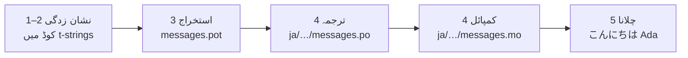

# ٹیوٹوریل

یہ صفحہ ایک خالی ڈائریکٹری سے شروع ہو کر ایسے پروگرام تک پہنچتا ہے جو
جاپانی میں سلام کہتا ہے۔ پانچ مرحلے، gettext کا کوئی تجربہ فرض نہیں کیا
گیا، اور ہر کمانڈ کے ساتھ وہی آؤٹ پٹ دکھایا گیا ہے جو وہ واقعی پیدا کرتی
ہے — تاکہ ہر قدم پر آپ کو معلوم ہو کہ آپ صحیح راستے پر ہیں یا نہیں۔

آپ کو Python 3.14 یا اس سے نیا درکار ہے، کیونکہ t-string 3.14 کی نئی نحو
ہے۔ اس صفحے کی مثال میں ہدف زبان جاپانی ہے، مگر کسی چیز کا انحصار اس انتخاب
پر نہیں — مرحلہ 4 میں اس کی جگہ کوئی بھی زبان رکھ لیجیے، جہاں لوکیل کوڈ
`ja` ہی واحد چیز ہے جو اس کا نام لیتی ہے۔

## 1. تنصیب { #1-install }

```console
python -m pip install "gettext-tstrings[babel]"
```

`[babel]` اضافی جزو [Babel] لے آتا ہے، یعنی وہ اوزار جو مرحلہ 3 میں آپ کے
پیغامات کو کیٹلاگ فائلوں میں جمع کرتا ہے۔ یہ ڈویلپمنٹ کے وقت کا اوزار ہے:
پروڈکشن کا کوڈ صرف معیاری لائبریری سے رینڈر کرتا ہے۔

## 2. اپنے کوڈ میں ایک پیغام نشان زد کیجیے { #2-mark-a-message-in-your-code }

`app.py` بنائیے:

```python
from gettext_tstrings import tr

name = "Ada"
print(tr(t"Hello {name}"))
```

`t"Hello {name}"` دیکھنے میں f-string جیسی لگتی ہے، مگر `t` سابقہ متن اور
قدر کو موقع پر ملانے کے بجائے الگ الگ رکھتا ہے۔ یہی علیحدگی `tr()` کو اس
قابل بناتی ہے کہ وہ پورے جملے `Hello {name}` کا ترجمہ تلاش کرے اور قدر بعد
میں ڈالے۔

اسے ابھی چلا کر دیکھیے:

```console
$ python app.py
Hello Ada
```

ابھی کوئی ترجمہ نصب نہیں ہوا، لہٰذا ماخذ متن جوں کا توں رینڈر ہو جاتا ہے۔
اس لائبریری کو استعمال کرنے والے پروگرام کو چلنے کے لیے کیٹلاگ کبھی
*درکار* نہیں ہوتا — انگریزی (یا جو بھی آپ کی ماخذ زبان ہو) بلٹ اِن متبادل
ہے۔

## 3. پیغامات نکالیے { #3-extract-the-messages }

مترجم آپ کا ماخذ کوڈ نہیں پڑھتے؛ آپ کے اور اُن کے درمیان ایک چھوٹی فائل
سفر کرتی ہے جسے **کیٹلاگ** کہتے ہیں۔ اس کی طرف پہلا قدم یہ ہے کہ کوڈ میں سے
ہر نشان زد پیغام جمع کر لیا جائے۔

`babel.cfg` بنا کر Babel کو بتائیے کہ آپ کے پیغامات کیسے ڈھونڈے:

```ini
[gettext_tstrings: **.py]
encoding = utf-8
```

پھر ایک ٹیمپلیٹ فائل (`.pot`) میں نکالیے:

```console
$ mkdir -p locales
$ pybabel extract -F babel.cfg -c "Translators:" -o locales/messages.pot .
extracting messages from app.py (encoding="utf-8")
writing PO template file to locales/messages.pot
```

اب `locales/messages.pot` میں ہر پیغام کے لیے ایک اندراج موجود ہے:

```po
#. gettext-tstrings
#: app.py:4
#, python-brace-format
msgid "Hello {name}"
msgstr ""
```

`msgid` وہ کلید ہے جسے آپ کا کوڈ تلاش کرے گا۔ خالی `msgstr` وہ جگہ ہے جہاں
ترجمہ آتا ہے — مگر اس فائل میں نہیں: `.pot` ایک *ٹیمپلیٹ* ہے، اور اگلا
مرحلہ اسے ہر زبان کے لیے ایک بار نقل کرتا ہے۔

## 4. ترجمہ اور کمپائل { #4-translate-and-compile }

ٹیمپلیٹ سے جاپانی کیٹلاگ بنائیے:

```console
$ pybabel init -i locales/messages.pot -d locales -l ja
creating catalog locales/ja/LC_MESSAGES/messages.po based on locales/messages.pot
```

`locales/ja/LC_MESSAGES/messages.po` کھول کر `msgstr` بھریے:

```po
msgid "Hello {name}"
msgstr "こんにちは {name}"
```

`{name}` کو بالکل ویسا ہی رہنے دیجیے — پلیس ہولڈر ہی وہ ذریعہ ہے جس سے قدر
ترجمہ شدہ جملے کے اندر اپنی جگہ پاتی ہے، اور ترجمہ اسے وہاں لے جانے میں آزاد
ہے جہاں ہدف زبان کو ضرورت ہو۔ حقیقی پروجیکٹ میں یہی `.po` فائل ہے جو آپ کسی
مترجم کو دیتے ہیں یا کسی ترجمے کے پلیٹ فارم پر اپ لوڈ کرتے ہیں؛ دونوں صورتوں
میں صیغہ ایک ہی ہے۔

کیٹلاگ متن کی صورت میں مرتب کیے جاتے ہیں مگر بائنری شکل (`.mo`) میں لوڈ ہوتے
ہیں، تو کمپائل کیجیے:

```console
$ pybabel compile -d locales
compiling catalog locales/ja/LC_MESSAGES/messages.po to locales/ja/LC_MESSAGES/messages.mo
```

یہ کمانڈ ایک حفاظتی جال بھی ہے۔ اگر ترجمے نے پلیس ہولڈر خراب کر دیا ہوتا —
مثلاً `{name}` کے بجائے `{nome}` — تو یہ گزرنے سے انکار کر دیتی:

```console
$ pybabel compile -d locales
error: locales/ja/LC_MESSAGES/messages.po:24: translation does not match the
source placeholders: {name} is missing; {nome} is not in the source message
1 errors encountered.
```

## 5. اسے چلائیے { #5-run-it }

`app.py` کا رخ کمپائل شدہ کیٹلاگ کی طرف کیجیے۔ ہر سطر کیا کر رہی ہے، یہ
دیکھنے کے لیے نشانات پر کلک کیجیے:

```python
import gettext

from gettext_tstrings import Translator

_ = Translator(gettext.translation("messages", localedir="locales", languages=["ja"]))  # (1)!

name = "Ada"
print(_(t"Hello {name}"))  # (2)!
```

1. معیاری لائبریری کمپائل شدہ `.mo` لوڈ کرتی ہے، اور `Translator` اسے ایک
   قابلِ استدعا شے سے باندھ دیتا ہے۔ `_` gettext میں "اس کا ترجمہ کرو" کے
   لیے روایتی نام ہے — مختصر اس لیے کہ یہ صارف کو نظر آنے والی ہر سٹرنگ پر
   آتا ہے۔ یہ وہی فنکشن ہے جو `tr` ہے، بس ایک کیٹلاگ سے بندھا ہوا۔
2. کال کے وقت: t-string کا متن تلاش کی کلید `Hello {name}` بن جاتا ہے،
   کیٹلاگ جواب میں `こんにちは {name}` دیتا ہے، جواب کو ماخذ کے پلیس ہولڈرز
   کے مقابل جانچا جاتا ہے، اور تب کہیں جا کر قدر ڈالی جاتی ہے۔

```console
$ python app.py
こんにちは Ada
```

یہی پورا چکر ہے، اور اسے ایک ہی تصویر میں دیکھنا فائدہ مند ہے:



**نشان زدگی ← استخراج ← ترجمہ ← کمپائل ← چلانا۔** اس سائٹ پر باقی سب کچھ
انہی پانچ مرحلوں میں سے کسی ایک کی تفصیل ہے۔

## آگے کہاں { #where-next }

- [t-string کیوں](comparison.md) — `%(name)s`، `.format()` اور `$`-سٹرنگز
  کے مقابلے میں یہ ڈیزائن آپ کو کس چیز سے بچاتا ہے۔
- [رہنما](guide.md) — جمع کی صورتیں، فی درخواست زبان، مؤخر سٹرنگز، اور یہ کہ
  کیٹلاگ پھر بھی غلط ہو تو رن ٹائم پر کیا ہوتا ہے۔
- [پروڈکشن میں](workflow.md) — یہی چکر جیسے کوئی ٹیم ہفتہ در ہفتہ چلاتی ہے:
  کیٹلاگ اپ ڈیٹ کرنا، CI گیٹ، اور ترجمے کے پلیٹ فارم۔
- [استخراج](extraction.md) — `pybabel` کا مکمل حوالہ: اپنے فنکشن نام، CI کا
  سخت موڈ، اور وہ جانچیں جو آپ کے کیٹلاگوں کی حفاظت کرتی ہیں۔

  [Babel]: https://babel.pocoo.org/
