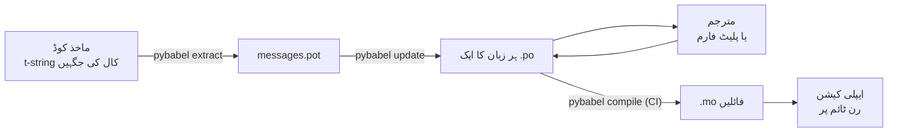

# پروڈکشن میں

[ٹیوٹوریل](tutorial.md) یہ چکر ایک بار، اکیلے، ایک پیغام والے پروگرام پر
چلاتا ہے۔ حقیقی پروجیکٹ میں چکر گھومتا رہتا ہے: پیغام ترجمہ ہو جانے کے بعد
بھی بدلتے ہیں، مترجم کہیں اور اور اپنے وقت پر کام کرتا ہے، اور ہر ریلیز کے
ساتھ ایک کمپائل شدہ کیٹلاگ جاتا ہے۔ یہ صفحہ وہی عمل ہے — کیا ریپازٹری میں
رہتا ہے، کیا سفر کرتا ہے، CI کو کس چیز پر روکنا ہے، اور رن ٹائم زبان کہاں
باندھتا ہے۔

## پروجیکٹ کی شکل { #the-shape-of-a-project }

```text
myapp/
├── babel.cfg
├── pyproject.toml
├── src/
│   └── myapp/
└── locales/
    ├── messages.pot
    ├── ja/LC_MESSAGES/messages.po
    └── de/LC_MESSAGES/messages.po
```

`babel.cfg`، `.pot` ٹیمپلیٹ اور ہر `.po` کمٹ کیجیے — یہی ترجمے کے بلڈ کے
ماخذ ہیں، اور ان کے diff ہی وہ ذریعہ ہیں جن سے آپ ترجمے کی تبدیلیوں کا جائزہ
لیتے ہیں۔ کمپائل شدہ `.mo` فائلیں بلڈ کی پیداوار ہیں: انہیں کمٹ کرنے کے بجائے
CI میں یا پیکجنگ کے وقت بنائیے، تاکہ کوئی `.po` اور اس کی `.mo` اس بات پر
کبھی اختلاف نہ کر سکیں کہ بھیجا کیا جا رہا ہے۔

ایک فائل کا کردار ہر سمت میں ہے: `.pot` آپ کے پیغامات مترجموں کی طرف *باہر*
لے جاتی ہے، اور `.po` فائلیں ترجمے *واپس* لاتی ہیں۔ نیچے کا سب کچھ انہی دو
کے درمیان کی آمدورفت ہے۔



## پہلے ترجمے کے بعد کا چکر { #the-cycle-after-the-first-translation }

ٹیوٹوریل کا `pybabel init` ہر زبان کے لیے زندگی میں ایک بار چلتا ہے۔ اس کے
بعد کام کا چکر ہے **استخراج ← اپ ڈیٹ ← ترجمہ ← کمپائل**، اور اس کا مرکز
`pybabel update` ہے، جو تازہ ٹیمپلیٹ کو موجودہ کیٹلاگوں میں سمو دیتا ہے،
بغیر اُن ترجموں کو ضائع کیے جو ان میں پہلے سے موجود ہیں۔

فرض کیجیے سلام `Hello {name}` — جس کا ترجمہ پہلے ہی `こんにちは {name}` ہو
چکا ہے — کوڈ میں بدل کر `Welcome back, {name}` کر دیا جاتا ہے۔ نکالیے اور
اپ ڈیٹ کیجیے:

```console
$ pybabel extract -F babel.cfg -c "Translators:" -o locales/messages.pot .
extracting messages from app.py (encoding="utf-8")
writing PO template file to locales/messages.pot
$ pybabel update -i locales/messages.pot -d locales
updating catalog locales/ja/LC_MESSAGES/messages.po based on locales/messages.pot
```

اب جاپانی کیٹلاگ میں یہ موجود ہے:

```po
#. gettext-tstrings
#: app.py:4
#, fuzzy, python-brace-format
msgid "Welcome back, {name}"
msgstr "こんにちは {name}"
```

Babel نے دیکھا کہ نیا msgid کسی ہٹائے گئے msgid سے مشابہ ہے اور اسے پرانے
ترجمے کے ساتھ جوڑ دیا — مگر اس جوڑے پر **fuzzy** کا نشان لگا دیا: یعنی مشین
کا اندازہ، جو انسان کا منتظر ہے۔ اس نشان میں دانت ہیں۔ `pybabel compile`
**‏fuzzy اندراجات کو `.mo` سے خارج رکھتا ہے**، چنانچہ جب تک کوئی مترجم اس
جوڑے کی تصدیق نہ کرے، ایپلی کیشن پرانے جاپانی متن کے بجائے نیا انگریزی متن
رینڈر کرتی ہے:

```console
$ pybabel compile -d locales
compiling catalog locales/ja/LC_MESSAGES/messages.po to locales/ja/LC_MESSAGES/messages.mo
$ python app.py
Welcome back, Ada
```

یوں بدلا ہوا پیغام بھی اسی طرح نیچے اترتا ہے جیسے ٹوٹا ہوا پیغام — ماخذ زبان
تک، کبھی کسی فرسودہ ترجمے تک نہیں۔ اس چکر میں مترجم کا حصہ یہ ہے کہ وہ
`msgstr` درست کرے اور `fuzzy` نشان مٹا دے؛ اگلا کمپائل اس اندراج کو اٹھا لے
گا۔

!!! note "پلیس ہولڈر کے نام پیغام کی شناخت کا حصہ ہیں"

    msgid کیٹلاگ کی کلید ہے، اور پلیس ہولڈر کا *نام* اسی کے اندر ہے — لہٰذا
    کوڈ میں کسی متغیر کا نام بدلنا (`name` ← `user_name`) msgid بدل دیتا ہے
    اور ہر زبان کے ترجمے کو دوبارہ fuzzy کے چکر میں بھیج دیتا ہے۔
    انٹرپولیٹ ہونے والے متغیرات کے نام ایسے الفاظ رکھیے جو مترجم سمجھ سکے،
    اور انہیں صرف کسی وجہ سے بدلیے۔

    فارمیٹنگ اس کا الٹ ہے: `!r` اور `:.2f`
    [msgid کا حصہ نہیں](internals.md#from-template-to-msgid)، لہٰذا
    `{amount:,.2f}` کو کس کر `{amount:,.0f}` کر دینا کسی کیٹلاگ میں کچھ نہیں
    بدلتا۔ البتہ *جملے* کے الفاظ بدلنا واقعی ایک تبدیلی ہے — یہی اوپر والا
    چکر ہے۔

## CI کیا روکتی ہے { #what-ci-gates }

تین ناکامیاں سرخ بلڈ کی مستحق ہیں: کیٹلاگ کوڈ سے پیچھے رہ گئے، کسی ترجمے نے
پلیس ہولڈر توڑ دیا، یا کوئی ٹوٹا ہوا اندراج رن ٹائم تک پھسل گیا۔ ہر ناکامی
کے لیے ایک مرحلہ:

```yaml
- run: pybabel extract -F babel.cfg -c "Translators:" -o locales/messages.pot .
- run: pybabel update -i locales/messages.pot -d locales --check
- run: pybabel compile -d locales
- run: pytest
```

`pybabel update --check` کچھ بھی دوبارہ نہیں لکھتا اور اُس وقت غیر صفر پر نکل
جاتا ہے جب کوئی کیٹلاگ تازہ نکالے گئے ٹیمپلیٹ کے مقابلے میں پرانا ہو — یہی
وہ پہرا ہے جو ایسا کوڈ ضم ہونے سے روکتا ہے جس کے پیغامات کسی نے دوبارہ نکالے
ہی نہ ہوں۔ `pybabel compile` Babel اور اس پیکیج کے
[رجسٹر شدہ چیکر](extraction.md#your-existing-toolchain-validates-these-catalogs)
دونوں کی پلیس ہولڈر جانچیں چلاتا ہے۔

!!! bug "`--check` سیاق استعمال کرنے والے کیٹلاگ کو نہیں روک سکتا"

    Babel 2.18.0 پر `pybabel update --check` **ہر** اُس کیٹلاگ کو پرانا
    بتاتا ہے جس میں کوئی `msgctxt` ہو، ہر بار، خواہ وہ کتنا ہی تازہ کیوں نہ
    ہو۔ موازنہ `Catalog.is_identical` سے گزرتا ہے، جو ہر پیغام کو اُس کلید
    سے تلاش کرتا ہے جس کے تحت وہ محفوظ ہے — اور سیاق والے پیغام کے لیے وہ
    کلید `(id, context)` کا جوڑا ہے، جسے `Catalog.get` قبول ہی نہیں کرتا۔
    تلاش کچھ نہیں لوٹاتی، اور کیٹلاگ کبھی برابر ثابت نہیں ہوتے:

    ```pycon
    >>> from babel.messages.catalog import Catalog
    >>> c = Catalog(locale="ja")
    >>> c.add("Guide", "ガイド", context="navigation")
    <Message 'Guide' (flags: [])>
    >>> c.is_identical(c)
    False
    ```

    چنانچہ اگر آپ `pgettext` یا `npgettext` استعمال کرتے ہی ہیں — اور ہم آواز
    الفاظ میں فرق کرنا ہی ان کے وجود کی وجہ ہے — تو یہ مرحلہ بدترین انداز میں
    کھلا ناکام ہوتا ہے: ہمیشہ سرخ، تو ٹیم اسے بند کر دیتی ہے، تو پھر کچھ بھی
    پرانے پن کو نہیں روکتا۔ جب تک یہ اوپر کی طرف ٹھیک نہ ہو، پیغاموں کے
    مجموعوں کا موازنہ خود کیجیے۔ ٹیمپلیٹ اور ہر کیٹلاگ کو
    `babel.messages.pofile.read_po` سے پڑھ کر
    `{(m.context, m.id) for m in catalog if m.id}` کا موازنہ کر لینا ہی پوری
    جانچ ہے، اور [اس سائٹ کا اپنا بلڈ](index.md) یہی کرتا ہے۔

!!! danger "لاگ نہیں، خارجی حالت دیکھیے"

    `pybabel compile` ہر پلیس ہولڈر غلطی کی اطلاع دیتا ہے، غیر صفر پر نکلتا
    ہے — **اور پھر بھی `.mo` لکھ دیتا ہے**۔ جو پائپ لائن کمپائل کر کے
    `locales/` کو کسی امیج میں نقل کر دیتی ہے، وہ ٹوٹا ہوا کیٹلاگ بھیج دے گی
    جب تک وہ غیر صفر خارج اسے واقعی نہ روکے۔ اوپر کی طرح اس مرحلے کو بلڈ
    ناکام کرنے دینا ہی پورا علاج ہے۔

آخری سطر آپ کا عام ٹیسٹ سویٹ ہے، مع ایک عادت کے اضافے کے: اس میں کہیں، ہر
بھیجی جانے والی زبان کا کم از کم ایک پیغام کسی سخت مترجم کے ذریعے رینڈر
کیجیے —

```python
import gettext

from gettext_tstrings import Translator

def test_catalogs_render(language: str) -> None:
    translations = gettext.translation("messages", localedir="locales", languages=[language])
    _ = Translator(translations, strict=True)
    name = "Ada"
    assert _(t"Welcome back, {name}")
```

— کیونکہ `strict=True`
[وہاں استثنا اٹھاتا ہے جہاں پروڈکشن خاموشی سے واپس اتر جاتی](guide.md#what-happens-when-a-catalog-is-wrong)،
اور رن ٹائم کا رینڈر وہ واحد جانچ ہے جو کیٹلاگ کو بالکل ویسے دیکھتی ہے جیسے
ایپلی کیشن دیکھے گی، `.mo` سمیت۔

## مترجموں اور پلیٹ فارموں کے ساتھ کام { #working-with-translators-and-platforms }

`.po` فائل پورے gettext جہان کا تبادلے کا صیغہ ہے، اور یہی وجہ ہے کہ یہ
لائبریری اسے دوبارہ استعمال کرتی ہے: ترجمہ سونپنے کا مطلب ایک فائل سونپنا ہے،
خواہ وصول کرنے والا PO ایڈیٹر رکھنے والا کوئی ساتھی ہو یا Weblate یا Crowdin
جیسا کوئی پلیٹ فارم۔ تین چیزیں اس سپردگی کو کامیاب بناتی ہیں:

**بتائیے کہ پیغام کس لیے ہے۔** کوڈ میں لکھا تبصرہ پیغام کے ساتھ سفر کرتا ہے —
`-c "Translators:"` نشان یہی جمع کرتا ہے:

```python
from gettext_tstrings import tr

name = "Ada"
# Translators: shown on the dashboard right after sign-in
print(tr(t"Welcome back, {name}"))
```

```po
#. Translators: shown on the dashboard right after sign-in
#. gettext-tstrings
#: app.py:5
#, python-brace-format
msgid "Welcome back, {name}"
msgstr ""
```

مترجم کو وہ تبصرہ اپنے ایڈیٹر میں، پیغام کے برابر، دنیا کے دوسرے کنارے پر
نظر آتا ہے۔ یہ پورے ورک فلو میں معیار کا سب سے سستا لیور ہے۔ جو لفظ خود اپنا
ہم آواز ہو — بٹن والا "Open" بمقابلہ حالت والا "Open" — اسے `pgettext` سے
ایک [سیاق](guide.md#binding-a-catalog) دیجیے، جو کیٹلاگ میں نظر آنے والا
`msgctxt` بن جاتا ہے۔

**پلیٹ فارم کو پلیس ہولڈرز کی توثیق کرنے دیجیے۔** t-string سے نکالا گیا ہر
پیغام `python-brace-format` نشان اٹھائے ہوتا ہے، اور وہی ایک سطر اُن اوزاروں
میں پلیس ہولڈر QA چالو کرتی ہے جو آپ کے قابو میں نہیں — Weblate اس جانچ کو
دستاویز کرتا ہے، تجارتی پلیٹ فارم اپنی جانچیں اسی نشان پر بناتے ہیں، اور
`msgfmt --check-format` اسے کسی بھی GNU پائپ لائن میں نافذ کرتا ہے۔ تفصیلات،
اور ساتھ آنے والا چیکر ان سے آگے کیا پکڑتا ہے، یہ
[استخراج کے صفحے](extraction.md#your-existing-toolchain-validates-these-catalogs)
پر ہے۔

**حفاظتی جال پر بالکل اتنا ہی بھروسا کیجیے جتنا وہ جاتا ہے۔** پلیٹ فارم سے جو
کچھ واپس آتا ہے، وہ اب بھی آپ کے بلڈ میں داخل ہوتا ڈیٹا ہے؛ اوپر کے CI گیٹ ہی
وہ چیز ہیں جو "پلیٹ فارم نے شاید یہ جانچ لیا ہو گا" کو "یہ ٹوٹا ہوا جا ہی نہیں
سکتا" میں بدلتے ہیں۔

## رن ٹائم پر زبان باندھنا { #binding-a-language-at-runtime }

اب تک کا سب کچھ کیٹلاگ پیدا کرتا ہے۔ بچا ہوا فیصلہ یہ ہے کہ ایپلی کیشن ان میں
سے ایک کہاں چنے، اور اس کا ایک ہی کھرا جواب ہے: *زبان کے دائرے* کے مطابق ایک
بار باندھیے — CLI کے لیے پروسیس، ویب سروس کے لیے درخواست۔

=== "ایک پروسیس، ایک زبان"

    کمانڈ لائن اوزار یا ڈیسک ٹاپ ایپلی کیشن صارف کا ماحول شروع میں ایک بار
    پڑھتی ہے۔ کوئی `languages=` نہ دینا معیاری لائبریری کو `LANGUAGE`،
    `LC_ALL`، `LC_MESSAGES` اور `LANG` سے مذاکرات کرنے دیتا ہے؛
    `fallback=True` اُس وقت استثنا اٹھانے کے بجائے ایک خالی کیٹلاگ — یعنی
    ماخذ متن — لوٹاتا ہے جب ان میں سے کوئی بھی آپ کے بھیجے ہوئے کسی کیٹلاگ
    سے میل نہ کھائے۔

    ```python
    import gettext

    from gettext_tstrings import Translator

    _ = Translator(gettext.translation("messages", localedir="locales", fallback=True))

    name = "Ada"
    print(_(t"Welcome back, {name}"))
    ```

=== "Flask"

    ویب ایپلی کیشن ہر درخواست پر فیصلہ کرتی ہے۔ ہر کیٹلاگ import کے وقت ایک
    بار لوڈ کیجیے، پھر ویو چلنے سے پہلے طے شدہ کیٹلاگ کو سیاق سے باندھ دیجیے
    — [`set_translations`](guide.md#per-request-language) سیاق کے ساتھ مقامی
    ہے، لہٰذا مختلف زبانوں کی ہم وقت درخواستیں کبھی ایک دوسرے کی بندش نہیں
    دیکھتیں۔

    ```python
    import gettext

    from flask import Flask, request

    from gettext_tstrings import set_translations, tr

    LANGUAGES = ("en", "ja", "de")
    CATALOGS = {
        language: gettext.translation(
            "messages", localedir="locales", languages=[language], fallback=True
        )
        for language in LANGUAGES
    }

    app = Flask(__name__)

    @app.before_request
    def bind_language() -> None:
        language = request.accept_languages.best_match(LANGUAGES) or "en"
        set_translations(CATALOGS[language])

    @app.get("/")
    def home() -> str:
        name = "Ada"
        return tr(t"Welcome back, {name}")
    ```

=== "ASGI مڈل ویئر"

    غیر ہم وقتی فریم ورکس کے تحت — FastAPI، Starlette، اور جو کچھ بھی ASGI ہو
    — درخواست کو [`use_translations`](guide.md#per-request-language) میں لپیٹ
    دیجیے: بندش ایک `ContextVar` میں رہتی ہے، جسے async ٹاسک کی تبدیلی ہر
    درخواست کے لیے محفوظ رکھتی ہے۔

    ```python
    import gettext

    from fastapi import FastAPI, Request

    from gettext_tstrings import tr, use_translations

    LANGUAGES = ("en", "ja", "de")
    CATALOGS = {
        language: gettext.translation(
            "messages", localedir="locales", languages=[language], fallback=True
        )
        for language in LANGUAGES
    }

    app = FastAPI()

    @app.middleware("http")
    async def bind_language(request: Request, call_next):
        language = negotiate_language(request.headers.get("accept-language"), LANGUAGES)
        with use_translations(CATALOGS[language]):
            return await call_next(request)
    ```

    `negotiate_language` آپ کی Accept-Language پارسنگ کی نمائندگی کرتا ہے —
    زیادہ تر فریم ورک یا ان کے ماحولی نظام ایک فراہم کرتے ہیں؛ یہاں اہم بات
    `call_next` کے گرد کی بندش ہے۔

رن ٹائم کی دو عادتیں تصویر مکمل کرتی ہیں۔ import کے وقت بننے والی سٹرنگز —
کوئی فارم لیبل، کسی enum کا نمائشی نام — کو اُس زبان کو نہیں پکڑنا چاہیے جو
import کے دوران فعال تھی؛ انہیں
[`lazy_gettext`](guide.md#deferred-translation) سے متعین کیجیے اور وہ اُس
زبان میں رینڈر ہوں گی جو *استعمال* کے وقت فعال ہو۔ اور `gettext_tstrings`
لاگر کا رخ کسی ایسی جگہ کیجیے جہاں کوئی انسان دیکھتا ہو: اس کی وارننگز نرم
موڈ کی وہ اطلاع ہیں کہ کوئی ترجمہ ہر پہرے سے پھسل نکلا، فی ٹوٹے پیغام ایک
سطر، فی رینڈر نہیں۔

## بھیجنا { #shipping }

پروڈکشن کو پیکیج، `.mo` فائلیں، اور اس کے سوا کچھ نہیں چاہیے۔ Babel ڈویلپمنٹ
اور CI کا انحصار ہے — `gettext-tstrings[babel]` کو پروڈکشن امیج سے باہر رکھیے
اور وہاں سادہ پیکیج نصب کیجیے؛ رینڈرنگ صرف معیاری لائبریری پر چلتی ہے۔
کیٹلاگ اسی بلڈ میں کمپائل کیجیے جو وہ آرٹیفیکٹ بناتا ہے جسے آپ تعینات کرتے
ہیں، تاکہ اس کے اندر کی `.mo` فائلیں بالکل وہی جائزہ شدہ `.po` فائلیں ہوں،
اور کسی کے لیپ ٹاپ پر کمپائل ہوئی کوئی چیز کبھی نہ جائے۔

ریلیز سے پہلے، یہ صفحہ جس چیک لسٹ پر سمٹتا ہے:

- `pybabel update --check` پاس ہو — کوئی پیغام ایسا نہ بدلا ہو جس کی خبر
  کیٹلاگوں کو نہ ہوئی ہو۔
- `pybabel compile` بلڈ کو اپنی خارجی حالت پر روکتا ہو۔
- باقی رہ جانے والے `fuzzy` اندراج جان بوجھ کر ہوں — ہر ایک اُس وقت تک ماخذ
  متن رینڈر کرتا ہے جب تک کوئی مترجم اس کی تصدیق نہ کر دے۔
- ٹیسٹ سویٹ ہر بھیجی جانے والی زبان کو ایک بار `strict=True` کے ساتھ رینڈر
  کرتا ہو۔
- پروڈکشن آرٹیفیکٹ میں `.mo` فائلیں ہوں اور Babel نہ ہو۔
- `gettext_tstrings` لاگر کا رخ نگرانی کی طرف ہو۔

## آگے کہاں { #where-next }

- [استخراج](extraction.md) — اس صفحے کے اوزاری نصف کا حوالہ: نقشے کے
  اختیارات، اپنے فنکشن نام، سخت موڈ، اور ہر چیکر۔
- [رہنما](guide.md) — رن ٹائم والا نصف: جمع، سیاق، مؤخر سٹرنگز، اور ناکامی کی
  صورتیں تفصیل سے۔
- [یہ کیسے کام کرتی ہے](internals.md) — msgid ایسا کیوں دکھتا ہے جیسا دکھتا
  ہے، اور توثیق دراصل کیا جانچتی ہے۔
