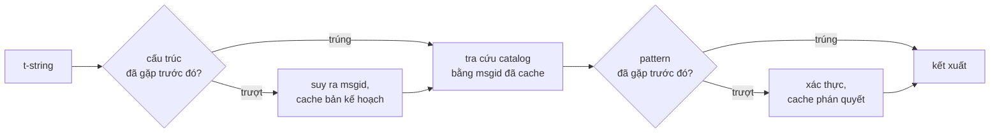

# Cách hoạt động

Không điều gì trên trang này là bắt buộc để dùng thư viện —
[Hướng dẫn nhập môn](tutorial.md) và [Cẩm nang](guide.md) đã bao quát việc
đó. Thay vào đó, trang này dựng lại thư viện từ những nguyên lý đầu tiên: một
t-string thực sự là gì, một msgid rơi ra từ nó như thế nào, điều gì làm cho
một bản dịch hợp lệ, và cách hiện thực khiến toàn bộ việc kiểm tra ấy chỉ tốn
vài phần mười micro giây. Hãy đọc nếu bạn tò mò, nếu bạn muốn đóng góp, hoặc
nếu bạn dự định [tự hiện thực quy ước này](#reimplementing-it).

## Một t-string thực sự là gì { #what-a-t-string-actually-is }

Một f-string tạo ra một `str`, và tạo ra ngay lập tức — đến lúc bất kỳ hàm
nào nhận được nó, giá trị đã được nội suy và câu văn đã bị niêm phong. Một
t-string ([PEP 750]) có cùng cú pháp và cùng cách đánh giá tức thời các biểu
thức của nó, nhưng tạo ra một kiểu khác:

```pycon
>>> name = "Ada"
>>> f"Hello {name}!"
'Hello Ada!'
>>> t"Hello {name}!"
Template(strings=('Hello ', '!'), interpolations=(Interpolation('Ada', 'name', None, ''),))
```

Đối tượng `Template` đó giữ lại các phần mà một pipeline catalog cần, vẫn
còn tách biệt:

```pycon
>>> template = t"Total: {amount:,.2f}"
>>> template.strings
('Total: ', '')
>>> template.interpolations[0].expression
'amount'
>>> template.interpolations[0].value
1234.5
>>> template.interpolations[0].format_spec
',.2f'
```

- `strings` — văn bản nguyên trực bao quanh các phần nội suy, theo thứ tự.
- Với mỗi phần nội suy: **biểu thức** dưới dạng văn bản nguồn (`'amount'`),
  **giá trị** đã được đánh giá của nó (`1234.5`), cùng **phép chuyển đổi**
  (`!r`) và **format spec** (`,.2f`) nếu có — được mang theo riêng rẽ thay vì
  được áp dụng.

Tất cả những gì thư viện này làm là một sự tiêu thụ có kỷ luật cấu trúc đó.
Ngôn ngữ đã tự mình thực hiện phép tách duy nhất mà i18n cần — văn bản tĩnh
tách khỏi các giá trị — nên thư viện không bao giờ phân tích mã nguồn của bạn
và không bao giờ đoán xem một giá trị nằm ở đâu trong câu. Còn lại là ba
quyết định: cấu trúc trở thành một khóa catalog như thế nào, một bản dịch của
khóa đó được phép nói gì, và hai thứ đó kết xuất trở lại với nhau ra sao.

## Từ template đến msgid { #from-template-to-msgid }

Một msgid — khóa mà catalog được lập chỉ mục theo — được suy ra chỉ từ các
phần *tĩnh* của template. Duyệt `strings` và `interpolations` theo thứ tự
trong mã nguồn; thoát dấu ngoặc nhọn cho từng đoạn văn bản nguyên trực (`{`
thành `{{`); với mỗi phần nội suy, phát ra một token `{name}`, trong đó
`name` là văn bản biểu thức đã cắt bỏ khoảng trắng bao quanh. Từ
`t"Total: {amount:,.2f}"`:

```text
strings         ('Total: ', '')
interpolations  expression 'amount'   conversion None   format_spec ',.2f'
msgid           'Total: {amount}'
```

Mỗi phần của quy tắc đó đều có lý do:

- **Biểu thức phải là một tên trơn** — `str.isidentifier()` trả về true và
  nó không phải một từ khóa Python. `t"Hello {user.name}"` bị từ chối ngay
  tại điểm gọi. Một msgid là một *khóa*: nó phải cho ra kết quả y hệt ở mỗi
  lần chạy và mỗi lần trích xuất, và nó được người dịch đọc, nên placeholder
  phải là một từ ổn định, có nghĩa — không phải một mẩu mã mời gọi catalog
  biến thành một ngôn ngữ biểu thức.
- **Phép chuyển đổi và format spec không bao giờ đi vào msgid.** Người dịch
  không nên phải đọc `:,.2f`, và không bản dịch nào được phép thay đổi nó.
  Hệ quả kèm theo đáng để biết: siết `:,.2f` thành `:,.0f` trong mã của bạn
  không làm thay đổi msgid nào, nên nó không làm mất hiệu lực bản dịch nào ở
  bất kỳ ngôn ngữ nào. Khóa catalog theo dõi *câu văn nói gì*, chứ không phải
  giá trị được định dạng ra sao.
- **Một tên lặp lại phải lặp lại phần định dạng của nó một cách chính xác.**
  `t"{x:.2f} vs {x:.3f}"` bị từ chối, vì cả hai lần xuất hiện gộp lại thành
  cùng token `{x}` và msgid không còn cách nào nói được một lần kết xuất nên
  dùng định dạng nào.
- **Msgid rỗng không bao giờ được tra cứu**, vì gettext dành riêng nó cho
  header siêu dữ liệu của chính catalog. `t""` kết xuất thành `""` mà không
  chạm tới catalog.

Bộ quy tắc đầy đủ, gồm cả những trường hợp biên mà trang này bỏ qua, nằm ở
[SPEC §2](https://github.com/yhay81/gettext-tstrings/blob/main/SPEC.md).

## Một bản dịch được phép nói gì { #what-a-translation-may-say }

Một pattern quay về từ catalog được phân tích bằng `string.Formatter` —
chính bộ phân tích mà `str.format` dùng. Ngữ pháp được cố ý vay mượn thay vì
tự sáng chế: một pattern mà thư viện này chấp nhận là một pattern mà hệ sinh
thái rộng hơn đã hiểu sẵn. Sau đó hai phép kiểm được áp dụng.

**Hình dạng:** mọi trường phải là một `{name}` trần. Một phép chuyển đổi hay
format spec — kể cả dạng rỗng tường minh `{name:}` — đều bị từ chối, cũng
như các trường theo vị trí (`{0}`, `{}`) và các tên đệm khoảng trắng
(`{ name }`). Trường hợp cuối quan trọng hơn vẻ ngoài của nó: cả `str.format`
lẫn `msgfmt` của GNU đều từ chối `{ name }`, nên chấp nhận nó ở đây sẽ tạo
ra những catalog mà không công cụ nào khác trong chuỗi có thể xác thực.

**Tên:** tập placeholder của pattern được đối chiếu với tập của nguồn. Với
một thông điệp số ít, mọi tên trong nguồn là *bắt buộc* và không gì khác
được *cho phép*. Với một thông điệp số nhiều, hai nhánh được hợp nhất:

- **được phép** = hợp của các tên ở cả hai nhánh
- **bắt buộc** = giao của chúng

Vậy nên, đối chiếu với `t"One file"` / `t"{n} files"`, tên `n` được phép
trong bản dịch của cả hai dạng nhưng không bắt buộc ở dạng nào. Chính sự bất
đối xứng đó cho phép hệ thống số nhiều của ngôn ngữ đích khác với của ngôn
ngữ nguồn — tiếng Nhật dịch cả hai nhánh bằng một dạng duy nhất mà nhiều khả
năng dùng `{n}`; một ngôn ngữ có nhiều dạng hơn tiếng Anh có thể cần `{n}` ở
một dạng mà tiếng Anh không có.

Tất cả những điều đó không hề là giả thuyết: chính catalog giao diện của trang
này mang thông điệp số nhiều `Built {n} localized page` / `Built {n} localized
pages` — hai nhánh tiếng Anh — và các ấn bản của trang dịch một thông điệp đó
thành từ một cho đến sáu dạng.

??? example "Chín ấn bản trong số đó, theo thứ tự dạng"

    | Catalog | Số dạng | Các bản dịch, theo thứ tự dạng |
    | --- | --- | --- |
    | Tiếng Nhật | 1 | `ローカライズ済みページを{n}件ビルドしました` |
    | Tiếng Thổ Nhĩ Kỳ | 2 | `{n} yerelleştirilmiş sayfa oluşturuldu` — hai lần, giống hệt nhau: danh từ tiếng Thổ Nhĩ Kỳ giữ nguyên số ít sau một số từ |
    | Tiếng Ý | 2 | `Generata {n} pagina localizzata` · `Generate {n} pagine localizzate` — phân từ hòa hợp theo giống và số |
    | Tiếng Latvia | 3 | `Izveidota {n} lokalizēta lapa` · `Izveidotas {n} lokalizētas lapas` · `Izveidots {n} lokalizētu lapu` — dạng thứ ba dành riêng cho **số không** |
    | Tiếng Nga | 3 | `Собрана {n} локализованная страница` · `Собраны {n} локализованные страницы` · `Собрано {n} локализованных страниц` |
    | Tiếng Ba Lan | 3 | `Zbudowano {n} zlokalizowaną stronę` · `Zbudowano {n} zlokalizowane strony` · `Zbudowano {n} zlokalizowanych stron` |
    | Tiếng Slovenia | 4 | `Zgrajena {n} lokalizirana stran` · `Zgrajeni {n} lokalizirani strani` · `Zgrajene {n} lokalizirane strani` · `Zgrajenih {n} lokaliziranih strani` — dạng thứ hai là **số đôi**, dành cho đúng hai |
    | Tiếng Ireland | 5 | `Tógadh {n} leathanach logánaithe` · `Tógadh {n} leathanaigh logánaithe` — một, hai, 3–6, 7–10, và phần còn lại; thân từ có biến đổi nhưng *leathanach* bắt đầu bằng `l`, chữ cái mà không phép biến âm nào của tiếng Ireland thể hiện trên chữ viết, nên vài dạng trùng nhau |
    | Tiếng Ả Rập | 6 | trong đó có `تم إنشاء صفحة مترجمة واحدة ({n})` cho đúng một và `تم إنشاء {n} صفحات مترجمة` cho một vài |

    Mỗi hàng đều là một mục thực sự trong `i18n/*/LC_MESSAGES/site.po` của kho mã
    này, được kết xuất bởi [bản dựng đa ngôn ngữ](index.md) ở mỗi lần phát hành —
    và một bài kiểm thử ghim bảng này vào chính các catalog đó, nên hai bên không
    thể trôi dạt khỏi nhau.

Trong những giới hạn đó, việc đảo thứ tự và lặp lại được cố ý để tự do. Cả
hai đều cần thiết về mặt ngữ pháp trong các ngôn ngữ thực, và hạn chế số lần
xuất hiện sẽ từ chối những bản dịch đúng mà chẳng đem lại lợi ích an ninh
nào: một bản dịch vẫn không thể *đánh giá* bất cứ thứ gì, vì không tồn tại
con đường đánh giá nào — các placeholder được tra cứu theo tên trong các giá
trị đã được tính sẵn của template, không bao giờ được đưa vào `eval`,
`getattr`, hay chính `str.format`.

## Kết xuất { #rendering }

Kết xuất một pattern đã được xác thực là một cuộc duyệt qua các mảnh của nó:
phát ra từng phần văn bản nguyên trực, và với mỗi placeholder, lấy giá trị đã
bắt giữ của phần nội suy rồi áp dụng phép chuyển đổi và format spec *phía
nguồn* — `format(convert(value, conversion), format_spec)`. Hai bảo đảm được
giữ vững trong lúc làm việc đó:

- **Mỗi giá trị phân biệt được định dạng nhiều nhất một lần cho mỗi lần kết
  xuất**, kể cả khi bản dịch lặp lại một placeholder. Sự lặp lại thay đổi số
  lần kết quả được chèn vào, chứ không phải số lần `__format__` của bạn
  chạy.
- **Với số nhiều, một placeholder đọc nhánh đã định nghĩa nó.** Một tên có
  mặt ở cả hai nhánh đọc giá trị được bắt giữ bởi nhánh mà ngôn ngữ *nguồn*
  chọn (`singular` khi `n == 1`, ngược lại `plural`); một tên riêng của một
  nhánh luôn đọc chính nhánh của nó, kể cả khi các quy tắc số nhiều của ngôn
  ngữ đích đã làm nó khả dụng ở một dạng khác.

Khi việc xác thực thất bại lúc kết xuất, phản ứng được phân chia theo ai đã
cung cấp pattern. Một pattern đến từ *catalog* thì xuống cấp: ghi một cảnh
báo và kết xuất văn bản nguồn, giữ đúng cam kết của gettext rằng một catalog
hỏng không bao giờ làm đổ vỡ ứng dụng
([Cẩm nang trình bày cả hai chế độ](guide.md#what-happens-when-a-catalog-is-wrong)).
Một pattern do bên gọi trực tiếp truyền vào — `CompiledTemplate.render` —
luôn ném ngoại lệ, vì chẳng có văn bản nguồn nào để xuống cấp *về*; sự khoan
dung tồn tại cho các phép tra cứu catalog, không phải cho các đối số.

## Chẩn đoán là một phần của thiết kế { #diagnostics-are-part-of-the-design }

Một lỗi placeholder thường rơi vào tay một người dịch, chứ không phải một
lập trình viên, và thường ở trong một tệp nơi vấn đề là vô hình. Nói
`{name} is missing` với người có thể thấy chính những ký tự ấy trong trình
soạn thảo của họ là một ngõ cụt, nên các thông điệp được tính toán theo ba
quy tắc:

- Một tên chứa một **ký tự không thể nhìn thấy** — một dấu cách không ngắt
  do bộ gõ sinh ra, một dấu cách độ rộng bằng không — được in với ký tự đó
  thay bằng code point của nó, ngay tại chỗ: `{<U+00A0>name}`. Người đọc cần
  thấy *ở đâu*.
- Một tên có các chữ cái **pha trộn nhiều hệ chữ viết**, trường hợp
  homoglyph, được hiển thị hai lần — một lần ở dạng dễ đọc, một lần ở dạng
  thoát chuỗi — vì `{nаme}` với một chữ `а` Kirin là không thể phân biệt với
  `{name}` khi in ra, và dạng thoát chuỗi `(nаme)` là cách viết duy nhất phân
  biệt được chúng.
- Mọi thứ còn lại được hiển thị **đúng như đã viết**. `{名前}` và `{café}`
  là những tên bình thường; thoát chuỗi chúng sẽ khiến người đọc không thể
  tìm ra thứ được nói tới.

Trên cùng nguyên tắc đó, một placeholder "bị thiếu" mà *trông như* có mặt sẽ
được giải thích vì sao nó vắng — dấu ngoặc nhọn toàn độ rộng từ một bộ gõ
Đông Á, kiểu nhân đôi `{{name}}` sinh ra từ một vòng thoát chuỗi, cái tên
nằm ngoài mọi cặp ngoặc.
[Bảng đọc thông điệp lỗi](translators.md#reading-a-failure-message) viết cho
người dịch trình bày nguyên văn từng thông điệp này.

## Đường nóng { #the-hot-path }

Tất cả những điều trên xảy ra trên mỗi chuỗi được dịch mà một ứng dụng kết
xuất, nên hiện thực được xây quanh một ý tưởng duy nhất: **việc xác thực
không bao giờ bị bỏ qua, vậy nên chính việc xác thực phải là thứ được
cache.**



Ba cache, mỗi giai đoạn một:

- **Một bản kế hoạch cho mỗi cấu trúc điểm gọi.** Tuple `strings` của
  template — một đối tượng mà trình thông dịch vốn đã dựng sẵn — là khóa
  cache, nên một phép tra cứu không cấp phát gì cả. Khi trúng cache, biểu
  thức, phép chuyển đổi và format spec của từng phần nội suy vẫn được đối
  chiếu với những gì đã ghi lại: hai điểm gọi chung văn bản nguyên trực nhưng
  khác định dạng (`t"{x:.2f}"` so với `t"{x:.3f}"`) không được phép va chạm,
  và phép so sánh đó là cái giá của việc dùng một khóa mà trình thông dịch
  trao cho miễn phí.
- **Một phán quyết cho mỗi pattern.** Lần đầu tiên một catalog trả lời bằng
  một pattern nào đó, pattern được phân tích và xác thực; kết quả — một bản
  kế hoạch kết xuất đã biên dịch, hoặc một bản ghi về sự không hợp lệ — được
  giữ trên bản kế hoạch. Mọi lần kết xuất sau của thông điệp đó chạm tới nó
  chỉ bằng một phép tra cứu dictionary. Các pattern không hợp lệ cũng được
  ghi nhớ, và đó là lý do một mục catalog hỏng chỉ cảnh báo một lần thay vì
  ở mỗi lần kết xuất.
- **Một bản kế hoạch hợp nhất cho mỗi cặp số nhiều**, giữ sẵn các tập
  hợp/giao để phép tính trên các nhánh xảy ra một lần cho mỗi thông điệp,
  chứ không phải một lần cho mỗi lời gọi.

Mọi cache đều có giới hạn, và không cache nào giữ lại các *giá trị* đã nội
suy — chỉ cấu trúc tĩnh và văn bản pattern. Kết quả, đo bằng
[`benchmarks/runtime.py`](https://github.com/yhay81/gettext-tstrings/blob/main/benchmarks/runtime.py)
trên CPython 3.14.6, macOS 26 trên một laptop arm64: xấp xỉ 0.4 µs cho một
thông điệp một trường, tính cả việc dựng chính t-string, khoảng 2.7× một lời
gọi `gettext(...).format(...)` trơn không kiểm tra gì. Đó là những con số của
một cỗ máy — script in ra trình thông dịch và nền tảng của nó ngay ở phần đầu,
nên hãy chạy nó trên chính phần cứng bạn triển khai trước khi coi bất kỳ tỷ lệ
nào là của mình. Phần bình luận ở đầu
[`core.py`](https://github.com/yhay81/gettext-tstrings/blob/main/src/gettext_tstrings/core.py)
ghi lại các phép đo riêng lẻ đứng sau hình dạng đó.

## Tự hiện thực lại { #reimplementing-it }

Không điều gì ở trên là riêng của hiện thực này: quy ước đã được viết thành
[spec v1](spec.md), và [bộ kiểm thử tuân thủ](spec.md#conformance) máy đọc
được của nó cho phép một bộ trích xuất, một plugin IDE, hay một hiện thực
bằng ngôn ngữ khác tự kiểm mình trước từng quy tắc mà trang này đã giải
thích. Hiện thực này chạy bộ kiểm thử đó trong chính các bài kiểm thử của
nó, và đó là thứ giữ cho trang này, đặc tả và mã không lặng lẽ trôi dạt khỏi
nhau.

  [PEP 750]: https://peps.python.org/pep-0750/
