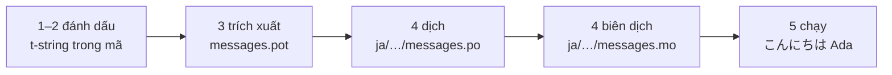

# Hướng dẫn nhập môn

Trang này đưa bạn từ một thư mục trống đến một chương trình chào hỏi bằng
tiếng Nhật. Năm bước, không đòi hỏi kinh nghiệm gettext nào, và mỗi lệnh đều
được trình bày kèm đầu ra mà nó thực sự tạo ra — nhờ vậy ở từng bước bạn biết
mình có đang đi đúng hướng hay không.

Bạn cần Python 3.14 trở lên, vì t-string là cú pháp mới trong 3.14. Tiếng
Nhật là ngôn ngữ đích ví dụ của trang này, nhưng không có gì phụ thuộc vào
lựa chọn đó — hãy thay bằng bất kỳ ngôn ngữ nào ở bước 4, nơi mã locale `ja`
là thứ duy nhất gọi tên nó.

## 1. Cài đặt { #1-install }

```console
python -m pip install "gettext-tstrings[babel]"
```

Phần mở rộng `[babel]` kéo theo [Babel], công cụ thu thập các thông điệp của
bạn vào các tệp catalog ở bước 3. Đây là công cụ dùng lúc phát triển: mã chạy
production kết xuất chỉ với thư viện chuẩn.

## 2. Đánh dấu một thông điệp trong mã { #2-mark-a-message-in-your-code }

Tạo `app.py`:

```python
from gettext_tstrings import tr

name = "Ada"
print(tr(t"Hello {name}"))
```

`t"Hello {name}"` trông giống một f-string, nhưng tiền tố `t` giữ phần văn
bản và giá trị tách rời nhau thay vì gộp chúng lại ngay tại chỗ. Chính sự
tách rời đó là điều cho phép `tr()` tra cứu bản dịch cho trọn vẹn câu
`Hello {name}` rồi mới chèn giá trị vào sau.

Chạy thử ngay:

```console
$ python app.py
Hello Ada
```

Chưa có bản dịch nào được cài đặt, nên văn bản nguồn được kết xuất nguyên
trạng. Một chương trình dùng thư viện này không bao giờ *bắt buộc* phải có
catalog mới chạy được — tiếng Anh (hoặc bất kỳ ngôn ngữ nguồn nào của bạn) là
phương án dự phòng có sẵn.

## 3. Trích xuất các thông điệp { #3-extract-the-messages }

Người dịch không đọc mã nguồn của bạn; một tệp nhỏ gọi là **catalog** sẽ qua
lại giữa bạn và họ. Bước đầu tiên để có được nó là gom mọi thông điệp đã đánh
dấu ra khỏi mã.

Cho Babel biết cách tìm các thông điệp của bạn bằng cách tạo `babel.cfg`:

```ini
[gettext_tstrings: **.py]
encoding = utf-8
```

Rồi trích xuất vào một tệp mẫu (`.pot`):

```console
$ mkdir -p locales
$ pybabel extract -F babel.cfg -c "Translators:" -o locales/messages.pot .
extracting messages from app.py (encoding="utf-8")
writing PO template file to locales/messages.pot
```

`locales/messages.pot` giờ chứa một mục cho mỗi thông điệp:

```po
#. gettext-tstrings
#: app.py:4
#, python-brace-format
msgid "Hello {name}"
msgstr ""
```

`msgid` là khóa mà mã của bạn sẽ tra cứu. `msgstr` trống là chỗ điền bản
dịch — nhưng không phải trong tệp này: `.pot` là một *tệp mẫu*, và bước tiếp
theo sẽ sao chép nó, mỗi ngôn ngữ một bản.

## 4. Dịch và biên dịch { #4-translate-and-compile }

Tạo catalog tiếng Nhật từ tệp mẫu:

```console
$ pybabel init -i locales/messages.pot -d locales -l ja
creating catalog locales/ja/LC_MESSAGES/messages.po based on locales/messages.pot
```

Mở `locales/ja/LC_MESSAGES/messages.po` và điền vào `msgstr`:

```po
msgid "Hello {name}"
msgstr "こんにちは {name}"
```

Hãy giữ `{name}` nguyên xi — placeholder là cách giá trị tìm được chỗ đứng
của mình trong câu đã dịch, và bản dịch hoàn toàn tự do di chuyển nó đến bất
cứ đâu ngôn ngữ đích cần. Trên một dự án thực tế, tệp `.po` này chính là thứ
bạn giao cho người dịch hoặc tải lên một nền tảng dịch thuật; định dạng đều
như nhau trong cả hai trường hợp.

Catalog được chỉnh sửa ở dạng văn bản nhưng được nạp ở dạng nhị phân
(`.mo`), nên hãy biên dịch:

```console
$ pybabel compile -d locales
compiling catalog locales/ja/LC_MESSAGES/messages.po to locales/ja/LC_MESSAGES/messages.mo
```

Lệnh này đồng thời là một lưới an toàn. Giả sử bản dịch làm hỏng
placeholder — chẳng hạn `{nome}` thay vì `{name}` — nó sẽ từ chối cho qua:

```console
$ pybabel compile -d locales
error: locales/ja/LC_MESSAGES/messages.po:24: translation does not match the
source placeholders: {name} is missing; {nome} is not in the source message
1 errors encountered.
```

## 5. Chạy chương trình { #5-run-it }

Trỏ `app.py` vào catalog đã biên dịch. Nhấp vào các dấu chú thích để xem từng
dòng đang làm gì:

```python
import gettext

from gettext_tstrings import Translator

_ = Translator(gettext.translation("messages", localedir="locales", languages=["ja"]))  # (1)!

name = "Ada"
print(_(t"Hello {name}"))  # (2)!
```

1. Thư viện chuẩn nạp tệp `.mo` đã biên dịch, và `Translator` gắn nó vào một
   đối tượng gọi được. `_` là tên quy ước của gettext cho "hãy dịch cái
   này" — ngắn gọn vì nó xuất hiện trên mọi chuỗi hướng tới người dùng. Nó
   chính là hàm `tr`, được gắn với một catalog.
2. Tại lời gọi: phần văn bản của t-string trở thành khóa tra cứu
   `Hello {name}`, catalog trả lời `こんにちは {name}`, câu trả lời được kiểm
   tra so với các placeholder nguồn, và chỉ sau đó giá trị mới được đưa vào.

```console
$ python app.py
こんにちは Ada
```

Đó là toàn bộ vòng lặp, và nó đáng được nhìn như một bức tranh duy nhất:



**Đánh dấu → trích xuất → dịch → biên dịch → chạy.** Mọi thứ còn lại trên
trang web này đều là sự tinh chỉnh của một trong năm bước đó.

## Tiếp theo đi đâu { #where-next }

- [Vì sao chọn t-string](comparison.md) — thiết kế này bảo vệ bạn khỏi điều
  gì, so với `%(name)s`, `.format()` và chuỗi `$`.
- [Cẩm nang](guide.md) — số nhiều, ngôn ngữ theo từng request, chuỗi trì
  hoãn, và điều gì xảy ra lúc chạy khi catalog dù sao cũng bị sai.
- [Vận hành thực tế](workflow.md) — chính vòng lặp này khi một đội ngũ vận
  hành nó, tuần này qua tuần khác: cập nhật catalog, cổng chặn CI và các nền
  tảng dịch thuật.
- [Trích xuất](extraction.md) — tài liệu tham khảo `pybabel` đầy đủ: tên hàm
  tùy chỉnh, chế độ CI nghiêm ngặt, và các bước kiểm tra bảo vệ catalog của
  bạn.

  [Babel]: https://babel.pocoo.org/
